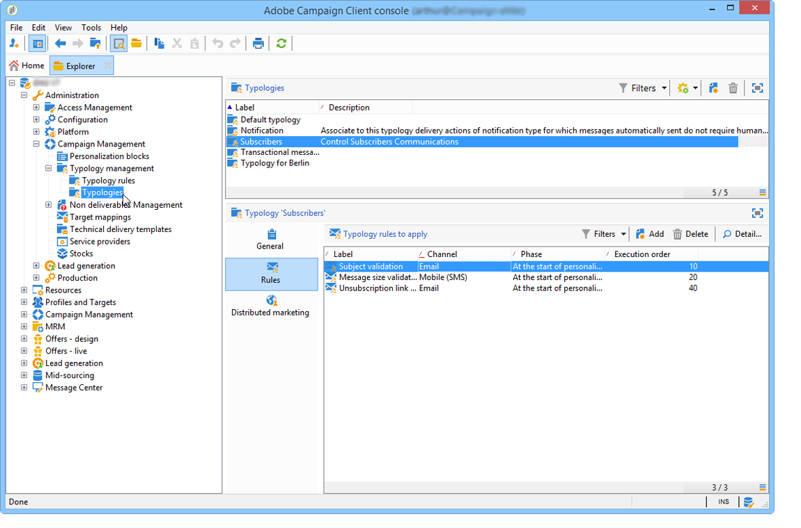

# 關於行銷活動態樣{#about-campaign-typologies}

Campaign Optimization是Adobe Campaign模組，可讓您控制、篩選及監控傳送的傳送。 為了避免行銷活動之間發生衝突，Adobe Campaign 可以套用特定限制規則來測試各種組合。 這樣可確保傳送的訊息符合客戶和公司通訊政策的需求及期望。

 [在影片中探索此功能](#typologies-video)

根據您的產品，可包含Campaign Optimization或附加元件。 請檢查您的授權合約。

>[!NOTE]
>
>若要進一步瞭解Adobe Campaign的Campaign Optimization以及如何使用，請參閱[Campaign v8檔案](https://experienceleague.adobe.com/docs/campaign/automation/campaign-optimization/campaign-typologies.html?lang=zh-Hant){target=_blank}。

<!--

## Typology rules {#typology-rules}

With Adobe Campaign you can design and apply four types of typology rules:

* **Filtering** rules which let you exclude part of the target based on criteria. For more on this, refer to [Filtering rules](filtering-rules.md).
* **Pressure** rules which let you control marketing fatigue. For more on this, refer to [Pressure rules](pressure-rules.md).
* **Capacity** rules which let you limit loads to guarantee optimal processing conditions. For more on this, refer to [Controlling capacity](consistency-rules.md#controlling-capacity).
* **Control** rules which let you check the validity of messages before they are sent. For more on this, refer to [Control rules](control-rules.md).

Once they have been created, typology rules are grouped in campaign typologies which are referenced in deliveries. See [Applying typologies](#applying-typologies).

## Typologies {#typologies}

A campaign typology can contain several [typology rules](#typology-rules), but a delivery can only reference one typology.

The **[!UICONTROL Rules]** tab lets you add, delete or view the typology rules to apply.

## Applying typologies {#applying-typologies}

Steps to create and apply a typology to your deliveries are listed below:

1. Create typology rules.

   Typology rules are found in the **[!UICONTROL Administration > Campaign management > Typology management > Typology rules]** node.

   Different rules available in Campaign are described in the following sections: [sales pressure rules](pressure-rules.md), [capacity rules](consistency-rules.md#controlling-capacity), [control rules](control-rules.md) and [filtering rules](filtering-rules.md).

1. Create a typology and reference the rules you created into it.

   Typologies are accessed via the **[!UICONTROL Administration > Campaign Management > Typology management]** > **[!UICONTROL Typologies]** node. 

1. Configure your delivery to use the typology you created. For more on this, refer to [this section](applying-rules.md#applying-a-typology-to-a-delivery).
1. Test and control the behavior through campaign simulations. For more on campaign simulations, refer to [this section](campaign-simulations.md).

During delivery preparation, recipients are excluded when criterion is met. You can check logs to monitor exclusions. Sample use cases on pressure typology rules are available in [this page](pressure-rules.md#use-cases-on-pressure-rules).

## Tutorial videos {#typologies-video}

### How to set up fatigue management using typology rules

This video explains how to implement fatigue management in Adobe Campaign by leveraging typology rules.

>[!VIDEO](https://video.tv.adobe.com/v/25090?quality=12)

### How to set up fatigue management using predefined filters

Fatigue management controls frequency and quantity of messaging to avoid over-solicitation of recipients. If you do not have the campaign optimization module in your campaign instance, you may configure a predefined filter that will filter the target population by the number of messages received
This video explains how to implement fatigue management in Adobe Campaign Classic by using filters.

>[!VIDEO](https://video.tv.adobe.com/v/25091?quality=12)

Additional Campaign how-to videos are available [here](https://experienceleague.adobe.com/docs/campaign-classic-learn/tutorials/overview.html?lang=zh-Hant).

**Related topic**

* [Get started with typologies and fatigue management](pressure-rules.md)

-->

