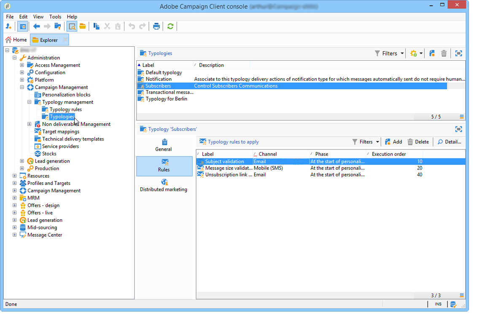

# 關於行銷活動態樣{#about-campaign-typologies}

市場活動優化是Adobe Campaign模組，它允許您控制、過濾和監控交貨的發送。 為了避免行銷活動之間發生衝突，Adobe Campaign 可以套用特定限制規則來測試各種組合。這樣可確保傳送的訊息符合客戶和公司通訊政策的需求及期望。

 [在影片中探索此功能](#typologies-video)

>[!NOTE]
>
>根據您的產品，市場活動優化可以包括或附加項。 請檢查您的授權合約。

## 類型規則 {#typology-rules}

通過Adobe Campaign，您可以設計和應用四種類型的類型規則：

* **篩選** 規則，您可以根據條件排除部分目標。 有關此內容的詳細資訊，請參閱 [篩選規則](filtering-rules.md)。
* **壓力** 可以控制市場疲勞的規則。 有關此內容的詳細資訊，請參閱 [壓力規則](pressure-rules.md)。
* **容量** 規則，允許您限制載荷以確保最佳處理條件。 有關此內容的詳細資訊，請參閱 [控制容量](consistency-rules.md#controlling-capacity)。
* **控制項** 規則，允許您在發送消息之前檢查其有效性。 有關此內容的詳細資訊，請參閱 [控制規則](control-rules.md)。

一旦建立了這些規則，就會在市場活動類型中分組，這些市場活動類型在交付中引用。 請參閱 [應用類型](#applying-typologies)。

## 類型 {#typologies}

市場活動類型可包含 [類型規則](#typology-rules)，但交貨只能引用一種類型。

的 **[!UICONTROL Rules]** 頁籤中，您可以添加、刪除或查看要應用的類型規則。

## 應用類型 {#applying-typologies}

下面列出了建立交貨並將分類應用於交貨的步驟：

1. 建立類型規則。

   在 **[!UICONTROL Administration > Campaign management > Typology management > Typology rules]** 的下界。

   「市場活動」中提供的不同規則在以下各節中介紹： [銷售壓力規則](pressure-rules.md)。 [容量規則](consistency-rules.md#controlling-capacity)。 [控制規則](control-rules.md) 和 [過濾規則](filtering-rules.md)。

1. 建立類型並引用在其中建立的規則。

   通過 **[!UICONTROL Administration > Campaign Management > Typology management]** > **[!UICONTROL Typologies]** 的下界。

1. 將交貨配置為使用您建立的類型。 如需詳細資訊，請參閱[本章節](applying-rules.md#applying-a-typology-to-a-delivery)。
1. Test並通過戰役模擬控制行為。 有關市場活動模擬的詳細資訊，請參閱 [此部分](campaign-simulations.md)。

在交付準備期間，當滿足標準時，接收者被排除。 您可以檢查日誌以監控排除。有關壓力類型規則的示例使用案例，請參見 [此頁](pressure-rules.md#use-cases-on-pressure-rules)。

## 教學課程影片 {#typologies-video}

### 如何利用類型規則建立疲勞管理

此視頻說明了如何利用分類規則在Adobe Campaign實施疲勞管理。

>[!VIDEO](https://video.tv.adobe.com/v/25090?quality=12)

### 如何使用預定義篩選器設定疲勞管理

疲勞管理控制傳訊的頻率和數量，以避免過度向收件者發送請求。 如果您的市場活動實例中沒有市場活動優化模組，則可以配置一個預定義的篩選器，該篩選器將按接收的消息數篩選目標群體。此視頻說明如何使用篩選器在Adobe Campaign Classic實施疲勞管理。

>[!VIDEO](https://video.tv.adobe.com/v/25091?quality=12)

還提供了其他市場活動操作視頻 [這裡](https://experienceleague.adobe.com/docs/campaign-classic-learn/tutorials/overview.html?lang=zh-Hant)。

**相關主題**

* [將自動業務規則應用於任何渠道上的交貨](https://helpx.adobe.com/campaign/kb/simplifying-campaign-management-acc.html#Applyautomaticbusinessrulestodeliveriesonanychannel)

* [開始分類和疲勞管理](pressure-rules.md)

