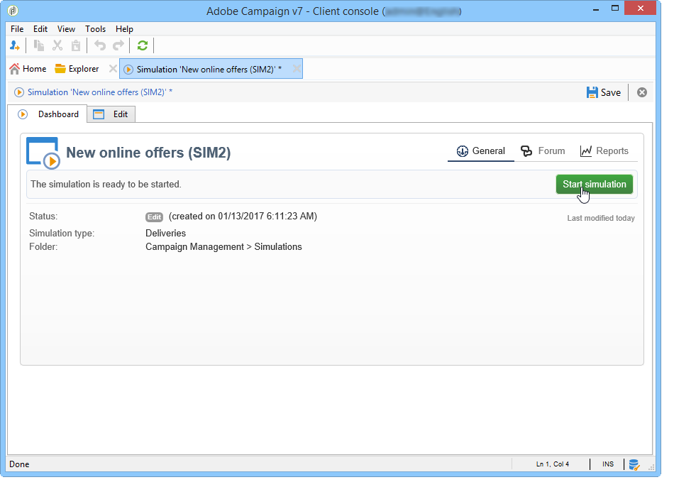
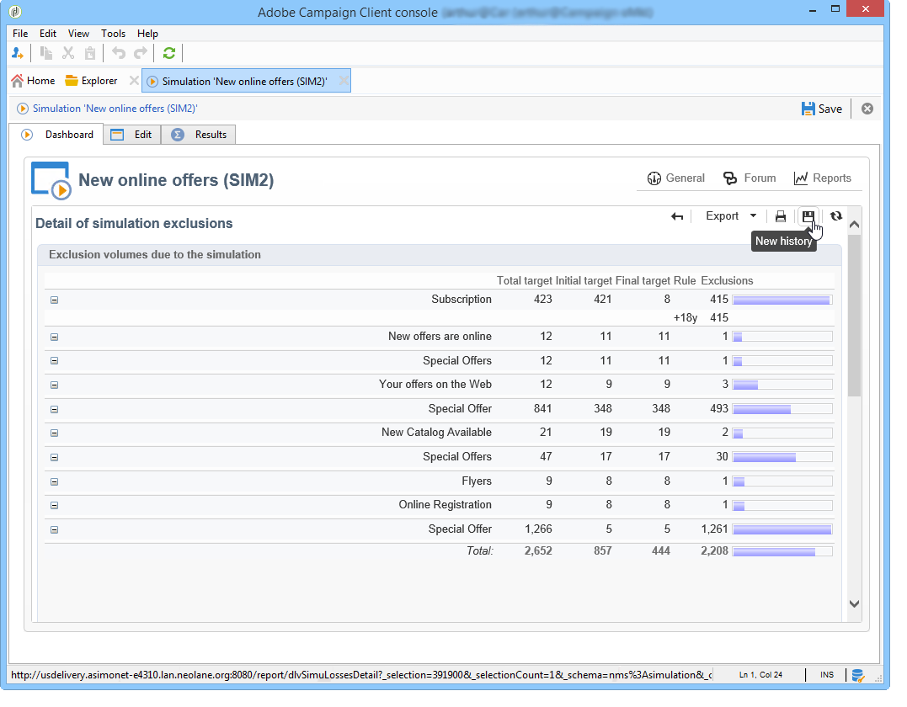

# Campaign 模擬{#campaign-simulations}

## 關於模擬 {#about-simulations}

促銷活動最佳化可讓您使用模擬來測試促銷活動計畫的效率。 這可讓您測量促銷活動的潛在成功：產生的收入、根據套用的類型規則設定目標量等。

模擬可讓您監控和比較傳送的影響。

>[!NOTE]
>
>以「測試」模式準備的傳送彼此沒有影響，例如在分佈式行銷中評估促銷活動時，或只要傳送未排程在臨時日曆中。\
>這表示壓力和容量規則僅套用至&#x200B;**[!UICONTROL Target estimation and message personalization]**&#x200B;模式中的傳送。 在&#x200B;**[!UICONTROL Estimation and approval of the provisional target]**&#x200B;和&#x200B;**[!UICONTROL Target evaluation]**&#x200B;模式下的傳送不會納入考量。\
>在傳送屬性的&#x200B;**[!UICONTROL Typology]**&#x200B;子索引標籤中選擇傳送模式。

## 設定模擬 {#setting-up-a-simulation}

### 建立模擬 {#creating-a-simulation}

要建立模擬，請應用以下步驟：

1. 開啟&#x200B;**[!UICONTROL Campaigns]**&#x200B;標籤，按一下&#x200B;**[!UICONTROL Create]**&#x200B;區段內的&#x200B;**[!UICONTROL More]**&#x200B;連結，然後選取&#x200B;**[!UICONTROL Simulation]**&#x200B;選項。

   

1. 輸入模板和模擬的名稱。 按一下&#x200B;**[!UICONTROL Save]**&#x200B;建立模擬。

   

1. 按一下&#x200B;**[!UICONTROL Edit]**&#x200B;標籤進行設定。

   

1. 在&#x200B;**[!UICONTROL Scope]**&#x200B;標籤中，指定您要為此模擬考慮的傳送。 若要這麼做，請按一下&#x200B;**[!UICONTROL Add]**&#x200B;按鈕，並指定要考慮的傳送選擇模式。

   

   您可以逐一選取每個傳送，或依促銷活動、方案或計畫排序。

   >[!NOTE]
   >
   >如果您透過計畫、方案或行銷活動選取傳送，Adobe Campaign可以在模擬開始時自動重新整理傳送清單，以納入考量。 要執行此操作，請核取&#x200B;**[!UICONTROL Refresh the selection of deliveries each time the simulation is started]**&#x200B;選項。
   >  
   >如果您未這麼做，系統將不會考慮建立模擬時計畫、方案或促銷活動中無法使用的任何傳送：稍後新增的傳送將會遭忽略。

   

1. 選擇要包括在模擬範圍中的元素。 如有必要，請使用SHIFT和CTRL鍵選取多個元素。

   

   按一下&#x200B;**[!UICONTROL Finish]**&#x200B;以核准選取。

   您可以手動結合屬於計畫、方案或促銷活動的選取傳送和傳送。

   

   如有必要，您可以透過&#x200B;**[!UICONTROL Edit the dynamic condition...]**&#x200B;連結使用動態條件。

   按一下&#x200B;**[!UICONTROL Save]**&#x200B;以批准此配置。

   >[!NOTE]
   >
   >計算模擬時，只會考慮已計算目標的傳送(狀態：**Target ready**&#x200B;或&#x200B;**Ready to deliver**)。

1. 在&#x200B;**[!UICONTROL Calculations]**&#x200B;標籤中，選取分析維度，例如收件者結構。

   

1. 然後，您可以新增運算式。

   

### 執行設定 {#execution-settings}

模擬的&#x200B;**[!UICONTROL General]**&#x200B;標籤可讓您輸入執行設定：

* **[!UICONTROL Schedule execution for down-time]**&#x200B;選項會根據所選的優先順序，將模擬啟動預設為較不繁忙的時段。 模擬使用大量資料庫資源，因此，例如，非緊急模擬應安排在夜間運行。
* **[!UICONTROL Priority]**&#x200B;是應用於模擬以延遲其觸發的級別。
* **[!UICONTROL Save SQL queries in the log]**.SQL日誌可讓您診斷模擬（如果模擬以錯誤結尾）。 它們也可協助您找出模擬為何太慢。 在模擬後，這些訊息會顯示在&#x200B;**[!UICONTROL Audit]**&#x200B;標籤的&#x200B;**[!UICONTROL SQL logs]**&#x200B;子標籤中。

## 執行模擬 {#executing-a-simulation}

### 啟動模擬 {#starting-a-simulation}

定義模擬範圍後，即可執行它。

要執行此操作，請開啟模擬儀表板並按一下&#x200B;**[!UICONTROL Start simulation]**。

執行完成後，開啟模擬並按一下&#x200B;**[!UICONTROL Results]**&#x200B;標籤以檢視針對每次傳送計算的目標。

1. **[!UICONTROL Deliveries]**&#x200B;子索引標籤會列出模擬考慮的所有傳送。 它顯示兩個計數：

   * **[!UICONTROL Initial count]**&#x200B;是目標，在傳送期間進行估計時計算。
   * **[!UICONTROL Final count]**&#x200B;是模擬後計算的收件者人數。

      初始計數和最終計數之間的差異反映了在模擬之前配置的各種規則或篩選器的應用。

      若要深入了解此計算，請編輯&#x200B;**[!UICONTROL Exclusions]**&#x200B;子標籤。

1. **[!UICONTROL Exclusions]**&#x200B;子標籤可讓您檢視排除劃分。

   

1. **[!UICONTROL Alerts]**&#x200B;子頁簽將模擬期間生成的所有警報消息分組。 如果容量超載（例如，如果目標收件者數量超過設定的容量），則可以傳送警報訊息。
1. **[!UICONTROL Exploration of the exclusions]**&#x200B;子標籤可讓您建立結果分析表。 使用者需要在橫坐標/縱坐標軸中指定變數。

   有關建立分析表的示例，請參閱[Exploring results](#exploring-results)的結尾。

### 查看結果 {#viewing-results}

#### 稽核 {#audit}

**[!UICONTROL Audit]**&#x200B;標籤可讓您監視模擬執行。 **[!UICONTROL SQL Logs]**&#x200B;子索引標籤對專家使用者很實用。 它以SQL格式列出執行日誌。 只有在模擬執行之前已在&#x200B;**[!UICONTROL General]**&#x200B;標籤中選取&#x200B;**[!UICONTROL Save SQL queries in the log]**&#x200B;選項時，才會顯示這些日誌。

#### 探索結果 {#exploring-results}

**[!UICONTROL Exploration of the exclusions]**&#x200B;子標籤可讓您分析模擬產生的資料。

在[本節](../../reporting/using/about-adobe-campaign-reporting-tools.md)中詳細說明描述性分析。

## 模擬結果 {#results-of-a-simulation}

**[!UICONTROL Log]**&#x200B;和&#x200B;**[!UICONTROL Results]**&#x200B;標籤中的指標提供模擬結果的第一個概覽。 如需結果的更詳細檢視，請開啟&#x200B;**[!UICONTROL Reports]**&#x200B;標籤。

### 報告 {#reports}

若要分析模擬結果，請編輯其報表：它們會顯示排除項目和原因。

預設會提供下列報表：

* **[!UICONTROL Detail of simulation exclusions]** :此報表提供所有相關傳送的排除原因詳細圖表。
* **[!UICONTROL Simulation summary]** :此報表顯示各個傳送期間從模擬中排除的母體。
* **[!UICONTROL Summary of exclusions linked to the simulation]** :此報表會顯示模擬所導致的排除圖表，以及套用的類型規則，並顯示每個規則的排除率圖表。

>[!NOTE]
>
>您可以建立新報表，並將其新增至提供的報表。 如需詳細資訊，請參閱[本章節](../../reporting/using/about-adobe-campaign-reporting-tools.md)。

若要存取報表，請透過其控制面板，按一下目標模擬的&#x200B;**[!UICONTROL Reports]**&#x200B;連結。

您也可以使用可從模擬控制面板存取的&#x200B;**[!UICONTROL Reports]**&#x200B;連結來編輯報表。

### 比較模擬 {#comparing-simulations-}

每次執行模擬時，結果會取代任何先前的結果：您無法顯示和比較執行之間的結果。

若要比較結果，您必須使用報表。 事實上，Adobe Campaign可讓您儲存報表歷史記錄，以便稍後再次檢視。 該歷史記錄在模擬的整個生命週期中保存。

**範例:**

1. 針對套用類型&#x200B;**A**&#x200B;的傳送建立模擬。
1. 在&#x200B;**[!UICONTROL Reports]**&#x200B;標籤中，編輯其中一個可用報表，例如&#x200B;**[!UICONTROL Detail of simulation exclusions]**。
1. 在報表的右上角，按一下圖示以建立新的歷史記錄。

   

1. 關閉模擬並變更類型&#x200B;**A**&#x200B;的設定。
1. 再次執行模擬，並將結果與報表中顯示的結果進行比較，該報表已建立歷史記錄。

   

   您可以視需要儲存任意數量的報表記錄。

### 報表軸 {#reporting-axes}

**[!UICONTROL Calculations]**&#x200B;標籤可讓您定義目標上的報表軸。 在結果分析期間將使用這些軸（請參閱[探索結果](#exploring-results)）。

>[!NOTE]
>
>我們建議在模擬範本中定義計算軸，而非針對每個模擬個別定義。\
>模擬模板保存在Adobe Campaign樹的&#x200B;**[!UICONTROL Resources > Templates > Simulation templates]**&#x200B;節點中。

**範例:**

在以下範例中，我們想根據收件者的狀態（「客戶」、「潛在客戶」或無）建立其他報表軸。

1. 要定義報告軸，請在&#x200B;**[!UICONTROL Analysis dimension]**&#x200B;欄位中選擇要處理的資訊的表。 此資訊是強制性的。
1. 在此，我們要選取收件者表格的「區段」欄位。

   

1. 可以使用以下選項：

   * **[!UICONTROL Generate target overlap statistics]** 可讓您復原模擬報表中的所有重疊統計資料。重疊是在一個模擬內至少兩個傳遞中鎖定的收件者。

      >[!IMPORTANT]
      >
      >選擇此選項將顯著增加模擬執行時間。

   * **[!UICONTROL Keep the simulation work table]** 讓您保留模擬追蹤。

      >[!IMPORTANT]
      >
      >自動保存這些表需要大量的儲存容量：確保資料庫足夠大。

顯示模擬結果時，所選表達式的資訊將顯示在&#x200B;**[!UICONTROL Overlaps]**&#x200B;子頁簽中。

傳遞目標重疊表示模擬至少兩個傳遞中的目標收件者。

>[!NOTE]
>
>只有啟用&#x200B;**[!UICONTROL Generate target recovery statistics]**&#x200B;選項時，才會顯示此子頁簽。

在&#x200B;**[!UICONTROL Exploring exclusions]**&#x200B;子索引標籤中建立的排除分析報表中，可處理關於報表軸的資訊。 有關詳細資訊，請參閱[探索結果](#exploring-results)。
