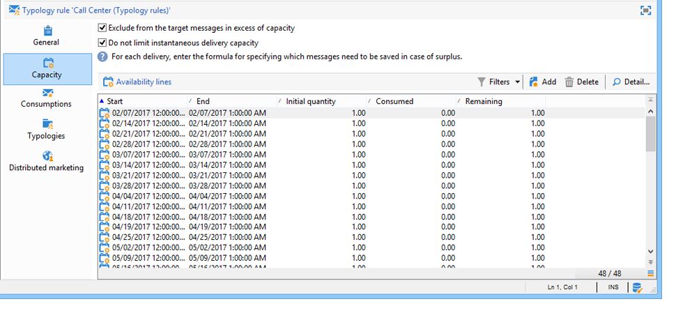

# 一致性規則{#consistency-rules}

## 關於一致性規則 {#about-consistency-rules}

Adobe Campaign藉由行銷活動型別中所包含的一組規則，確保通訊的一致性。 其目的是控制傳送給收件者的傳送內容，例如傳送量、性質、相關性等。

**容量** 例如，規則可避免讓平台因訊息的傳送而過載。 例如，包含下載連結的特殊優惠方案不得一次傳送給太多人，以免伺服器耗盡；電話促銷活動不得超出客服中心的處理能力等。 有關詳細資訊，請參閱 [控制容量](#controlling-capacity).

## 控制容量 {#controlling-capacity}

在傳遞訊息之前，您必須確定您的組織具備處理傳送（實體基礎結構）的能力、傳送可能產生的回應（傳入訊息），以及要聯絡訂閱者的通話次數（呼叫中心處理能力），舉例來說。

若要這麼做，您需要建立 **[!UICONTROL Capacity]** 型別規則。

在以下範例中，我們會為電話忠誠度行銷活動建立型別規則。 我們限制每天的訊息數量為20條，即客服中心的每日處理能力。 將規則套用至兩個傳遞後，我們就能透過記錄檔監控耗用量。

若要設計新的容量規則，請遵循下列步驟：

1. 在 **[!UICONTROL Administration > Campaign management > Typology management > Typology rules]** 節點，按一下 **[!UICONTROL New]**.
1. 選取 **[!UICONTROL Capacity]** 規則型別。

   

1. 在 **[!UICONTROL Capacity]** 標籤，建立可用性明細行：在我們的範例中，這些是可進行呼叫的時間期間。 選取24小時期間，並在初始數量中輸入150，這表示客服中心每天可以處理150個電話。

   

   >[!NOTE]
   >
   >可用性行僅供參考。 如果達到容量限制時您需要排除訊息，請參閱 [本節](#exclude-messages-when-capacity-limit-reached).

1. 將此規則與型別建立關聯，然後將型別參照至您的傳遞，以套用此容量規則。 如需詳細資訊，請參閱[本章節](applying-rules.md#applying-a-typology-to-a-delivery)。
1. 您可以透過規則監控耗用量 **[!UICONTROL Consumptions]** 和 **[!UICONTROL Capacity]** 索引標籤。

   在傳送中使用規則時， **[!UICONTROL Consumed]** 和 **[!UICONTROL Remaining]** 欄會提供負載的相關資訊，如下所示：

   

   如需詳細資訊，請參閱[本章節](#monitoring-consumption)。

## 定義最大負載 {#defining-the-maximum-load}

若要定義最大負載，您必須定義可用性明細行。 要執行此操作，有兩個可用選項：您可以手動建立一或多個可用性行(請參閱 [逐一新增可用性行](#adding-availability-lines-one-by-one))或建立可用性範圍。 這些時段的頻率可以自動化(請參閱 [新增一組可用性行](#add-a-set-of-availability-lines))。

### 逐一新增可用性行 {#adding-availability-lines-one-by-one}

若要建立可用性行，請按一下 **[!UICONTROL Add]** 按鈕並選取 **[!UICONTROL Add an availability line]**. 輸入可用性期間與可用載入。

視需要新增多行，以符合您的處理容量。

### 新增一組可用性行 {#add-a-set-of-availability-lines}

若要定義指定時間的使用期間，請按一下 **[!UICONTROL Add]** 按鈕並選取 **[!UICONTROL Add a set of availability lines]** 選項。 指示每個時段的持續時間以及要建立的期間數。

若要自動建立頁面的頻率，請按一下 **[!UICONTROL Change]** 按鈕並定義期間排程。

例如，我們定義一個排程，以在上午9點至下午5點之間，以每小時10次呼叫的速率為所有工作日建立可用性期間。 若要這麼做，請套用下列步驟：

1. 選取週期型別以及有效天數與時數：

   

1. 指示有效日期：

   

1. 核准排程前，請先檢查該排程：

   

此 **[!UICONTROL Forecasting]** 工作流程會自動建立所有相符行。

>[!NOTE]
>
>我們建議您透過檔案匯入來建立可用性行。 此標籤可讓您檢視及檢查沖銷明細行。

## 達到容量限制時排除訊息 {#exclude-messages-when-capacity-limit-reached}

可用性明細行僅供參考。 若要排除超出的訊息，請檢查 **[!UICONTROL Exclude from the target messages in excess of capacity]** 選項。 這可防止超出容量。 對於與先前範例相同的母體，沖銷與剩餘產能不可超過初始數量：

可處理的最大訊息數會在定義的可用性範圍內平均劃分。 這尤其適用於客服中心，因為其每天的通話次數上限是有限的。 若是電子郵件傳遞，請 **[!UICONTROL Do not limit instantaneous delivery capacity]** 選項可讓您忽略此可用性範圍，並同時傳送您的電子郵件。

>[!NOTE]
>
>萬一超載，系統會根據傳送屬性中定義的公式來選取已儲存的訊息。

## 監視耗用量 {#monitoring-consumption}

依預設，容量規則僅供指示之用。 選取 **[!UICONTROL Exclude messages in excess of capacity from the target]** 選項以防止超過定義的負載。 在此情況下，過多訊息將會使用此型別規則從傳送中自動排除。

若要監視消耗，請檢視 **[!UICONTROL Consumed]** 的欄 **[!UICONTROL Capacity]** 型別規則中的Tab鍵。

若要檢視沖銷明細行，請按一下 **[!UICONTROL Consumptions]** 索引標籤中選取的字元。
