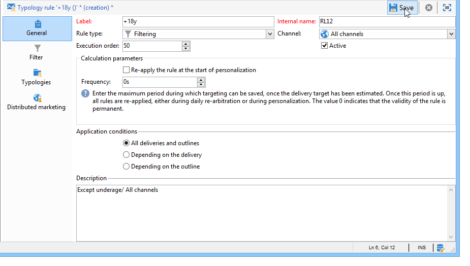
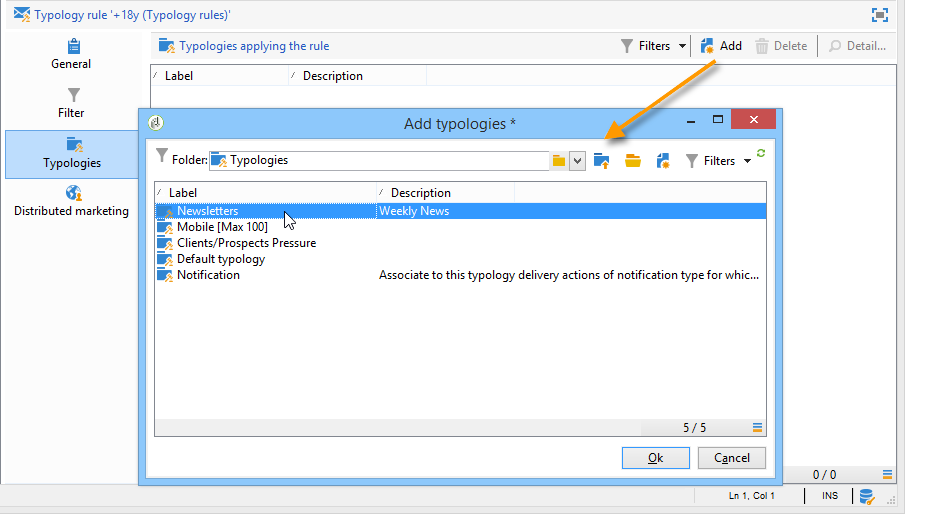
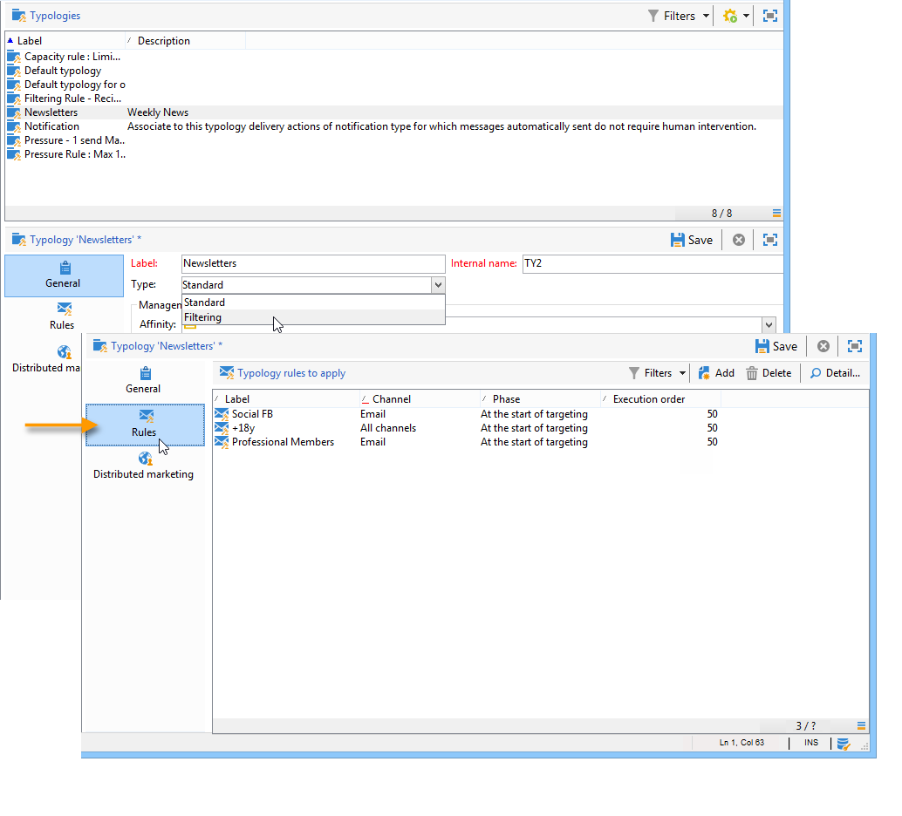

# 篩選規則{#filtering-rules}

過濾規則允許您根據查詢中定義的條件定義要排除的消息。 這些規則連結到目標維。

過濾規則可以連結到其他類型的規則（控制、壓力等） 或按專用 **篩選** 類型學。 有關此內容的詳細資訊，請參閱 [建立和使用篩選類型](#creating-and-using-a-filtering-typology)。

## 建立篩選規則 {#creating-a-filtering-rule}

例如，您可以過濾新聞稿訂閱者，以防止將通信發送給未達到法定年齡的收件人。

要定義此篩選器，請應用以下步驟：

1. 建立 **[!UICONTROL Filtering]** 適用於所有通信通道的類型規則。

   

1. 更改預設目標維並選擇預訂(**nms：訂閱**)。

   

1. 使用 **[!UICONTROL Edit the query from the targeting dimension...]** 的子菜單。

   

1. 將此規則連結到市場活動類型並保存。

   

當此規則在交貨中使用時，未達到要求的訂戶將自動排除。 特定消息指示規則應用程式：

## 條件篩選規則 {#conditioning-a-filtering-rule}

您可以基於連結的交貨或交貨大綱來限制篩選規則的應用程式欄位。

要執行此操作，請轉到 **[!UICONTROL General]** 頁籤，選擇要應用和建立篩選器的限制類型，如下所示：

在這種情況下，即使規則連結到所有交貨，它也將只應用於那些與定義的篩選器的標準相匹配的交貨。

>[!NOTE]
>
>類型和篩選規則可用於工作流， **[!UICONTROL Delivery outline]** 的子菜單。 如需詳細資訊，請參閱[本章節](../../workflow/using/delivery-outline.md)。

## 建立和使用篩選類型 {#creating-and-using-a-filtering-typology}

您可以建立 **[!UICONTROL Filtering]** 類型：它們只包含過濾規則。

選擇目標後，這些特定類型可以連結到傳遞：在交付嚮導中，按一下 **[!UICONTROL To]** 連結，然後按一下 **[!UICONTROL Exclusions]** 頁籤。

然後選擇要應用於遞送的過濾類型。 要執行此操作，請按一下 **[!UICONTROL Add]** 按鈕並選擇要應用的類型。

您也可以通過此頁籤直接連結過濾規則，而不將其按類型分組。 為此，請使用窗口的下部。

>[!NOTE]
>
>選擇窗口中只有類型和篩選規則可用。
>
>這些配置可以在交貨模板中定義，以便自動應用於使用該模板建立的所有新交貨。

## 預設可交付性排除規則 {#default-deliverability-exclusion-rules}

預設情況下，有兩個篩選規則可用： **[!UICONTROL Exclude addresses]** ( **[!UICONTROL addressExclusions]** ) **[!UICONTROL Exclude domains]** ( **[!UICONTROL domainExclusions]** )。 在電子郵件分析期間，這些規則將收件人電子郵件地址與包含在可傳送性實例中管理的加密全局禁止清單中的禁止地址或域名進行比較。 如果存在匹配項，則不會將消息發送到該收件人。

這是為了避免由於惡意活動而被添加到密鑰清單，特別是使用垃圾郵件陷阱。 例如，如果使用Spamtrap通過您的一個Web表單訂閱，則會自動向該Spamtrap發送確認電子郵件，這將導致您的地址被自動添加到密鑰清單中。

>[!NOTE]
>
>全局隱藏清單中包含的地址和域名將被隱藏。 在傳遞分析日誌中只指示排除的收件人數。
