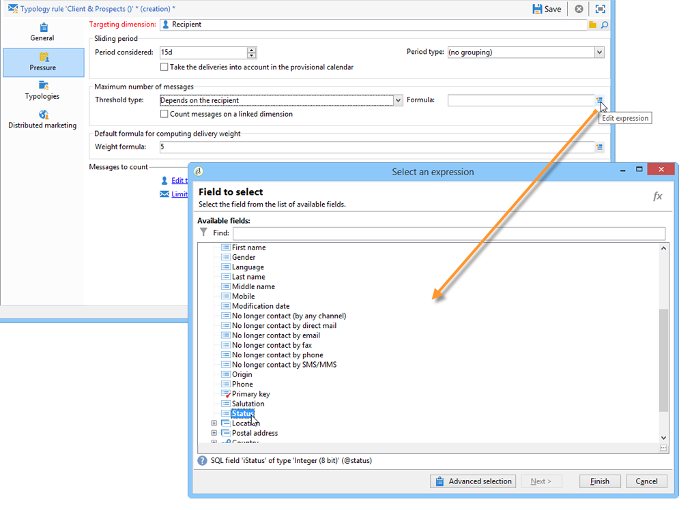

# 壓力規則{#pressure-rules}

## 關於行銷疲勞 {#about-marketing-fatigue}

實施銷售壓力管理可讓您避免在資料庫中過度索取人口，也稱為行銷疲勞。 若要這麼做，您可以定義每個收件者的訊息數量上限。 它也可讓您在促銷活動之間實作仲裁規則，以便傳送最佳訊息給目標對象。

**** 壓力規則，以管理行銷疲勞，例如將要傳送給母體的信函式量限制為兩個、選取最符合一組訂閱者利益的通訊、避免傳送簡訊給不滿意的客戶等。

促銷活動是根據定義的臨界值和訊息權重而選取。

* 臨界值是指定收件者在指定期間內所授權的最高傳送數量。 可設定或變數。 可在類型規則設定中設定或計算。 請參閱[最大消息數](#maximum-number-of-messages)。
* 傳遞權重可讓您識別壓力管理框架內的最優先傳送。 權重最高的報文具有優先順序。 請參閱[訊息權重](#message-weight)。

仲裁的目的在於確保其權重大於進行中促銷活動的已排程促銷活動不會導致過度的設定檔請求：若是如此，則會從傳送中排除設定檔。

仲裁標準（消息權重和/或閾值）可能因兩種資訊而有所不同：

* 收件者偏好，即聲明資訊：電子報訂閱、收件者狀態（客戶或潛在客戶）、
* 收件者行為：購買、已瀏覽的連結等。

在分析階段應用用於定義合格消息的仲裁規則。 對於每個收件者及相關期間，如果下列公式為true，則會傳送訊息：**（已發送的消息數）+（權重較大的消息數）&lt;閾值**。

否則，收件者將為&#x200B;**[!UICONTROL Excluded by arbitration]**。 有關詳細資訊，請參閱[仲裁後排除](#exclusion-after-arbitration)。

## 建立壓力規則 {#creating-a-pressure-rule}

若要使用Adobe Campaign在促銷活動之間設定仲裁，請從建立促銷活動類型和定義連結的類型規則（**Pressure**&#x200B;規則）開始。

若要建立與設定 **[!UICONTROL Pressure]** 類型規則，請套用下列步驟：

1. 在促銷活動類型規則清單中，按一下清單上方的&#x200B;**[!UICONTROL New]**&#x200B;圖示。

   

1. 在新規則的&#x200B;**[!UICONTROL General]**&#x200B;標籤中，選擇&#x200B;**壓力**&#x200B;類型規則並輸入其名稱和說明。

   

1. 視需要變更執行順序。 以&#x200B;**[!UICONTROL Typology]**&#x200B;集套用多個類型規則時，會先套用順序較低的規則。 有關詳細資訊，請參閱[執行順序](applying-rules.md#execution-order)。
1. 在&#x200B;**[!UICONTROL Calculation parameters]**&#x200B;區段中，如果您想要在下次每日重新仲裁執行以外儲存定位，請定義頻率。 有關詳細資訊，請參閱[調整計算頻率](applying-rules.md#adjusting-calculation-frequency)。
1. 按一下&#x200B;**[!UICONTROL Pressure]**&#x200B;標籤，然後選擇套用類型規則的日曆期間。

   

   該規則將應用於聯繫日期包含在有關期間內的交付。

   >[!NOTE]
   >
   >只有在選取&#x200B;**[!UICONTROL Take the deliveries into account in the provisional calendar]**&#x200B;選項時，才會考量已排程的傳送。 有關詳細資訊，請參閱[設定句點](#setting-the-period)。

1. 定義計算最大訊息數的方法。

   該閾值表示在相關期間可發送到接收方的最大消息數。

   依照預設，臨界值為常數，您必須指出該規則授權的訊息數量上限。

   

   若要定義變數臨界值，請在&#x200B;**[!UICONTROL Type of threshold]**&#x200B;欄位中選取&#x200B;**[!UICONTROL Depends on the recipient]**&#x200B;值，然後使用右側的圖示開啟運算式編輯器。

   

   有關詳細資訊，請參閱[最大消息數](#maximum-number-of-messages)。

1. 指定計算傳送重量的方法。

   每個傳送都有權重，即代表其優先順序的值：這可以在促銷活動之間進行仲裁。 加權是使用類型規則和/或其屬性中定義的公式計算。 有關詳細資訊，請參閱[消息權重](#message-weight)。

1. 預設情況下，所有訊息都將考慮到臨界值計算。**[!UICONTROL Restriction]**&#x200B;標籤可讓您篩選類型規則所關注的訊息：

   * 此索引標籤的上方區段可讓您限制相關的收件者。
   * 此索引標籤的下方部分可讓您篩選要計算的訊息。

      在以下示例中，只考慮保存在&#x200B;**NewContacts**&#x200B;資料夾中的收件者，並關注以&#x200B;**Newsletter**&#x200B;開頭的傳送。
   

1. **[!UICONTROL Typologies]**&#x200B;標籤可讓您檢視套用此規則或將規則連結至一或多個現有類型的促銷活動類型。 如需詳細資訊，請參閱[套用類型](about-campaign-typologies.md#applying-typologies)。

## 定義臨界值和加權 {#defining-thresholds-and-weights}

### 最大消息數 {#maximum-number-of-messages}

每個壓力規則定義一個閾值，即在給定時間段內可以發送到一個接收者的最大消息數。 一旦達到此臨界值時，在考慮到該期間結束之前，將不再進行傳送。此程式可讓您在訊息超過設定的臨界值時，自動將收件者排除在傳送之外，以避免過度請求。

臨界值可以是常數，或由含變數的公式計算。 這表示在指定期間，臨界值可能會因收件者而異，甚至因相同收件者而有所不同。

>[!CAUTION]
>
>將&#x200B;**0**&#x200B;輸入為臨界值，會在考慮的期間內阻止所有傳送至目標母體。

**範例:**

您可以根據收件者所屬的區段來索引授權訊息的數量。 這表示屬於網頁區段的收件者可能會收到比其他收件者更多的訊息。 **[!UICONTROL Iif (@origin='Web', 5, 3)]**&#x200B;類型公式可授權傳送5則訊息給收件者，其他區段則授權傳送3則訊息。 設定如下：

若要定義臨界值，您可以使用連結至目標維度的維度：例如，要包括傳送至儲存在訪客表格中的收件者設定檔的訊息（如需訪客表格的詳細資訊，請參閱[此區段](../../surveys/using/use-case--creating-a-refer-a-friend-form.md)），或避免每週傳送多則訊息至同一家庭（可能指數個電子郵件地址），此訊息是連結至收件者表格的維度中識別的。

若要這麼做，請選取&#x200B;**[!UICONTROL Count messages on a linked dimension]**&#x200B;選項，然後選取訪客或聯絡人表格。

### 訊息權重 {#message-weight}

每個傳送都有一個權重，代表其優先順序等級。 依預設，傳送的權重會設為5。 壓力規則可讓您定義要套用傳送的重量。

您可以透過公式來設定或計算加權，以適合收件者。 例如，您可以根據收件者興趣定義傳送的權重。

>[!CAUTION]
>
>在&#x200B;**[!UICONTROL Properties]**&#x200B;索引標籤中，類型規則中定義的權重可針對每個傳送個別多載。 按一下&#x200B;**[!UICONTROL Typology]**&#x200B;標籤以選取促銷活動類型，並視需要指定要套用的權數。\
>不過，計算B類型規則時不會使用A類型規則中宣告的加權：此重量僅與使用A規則的傳送有關。

**範例:**

在下列範例中，我們想要將電子報對音樂的權重連結至其收件者的傾向分數。 操作步驟：

1. 建立新欄位以儲存收件者傾向分數。 在此案例中，欄位&#x200B;**@Music**&#x200B;將豐富調查和線上投票、收集的追蹤資料等的答案。
1. 建立類型規則，以根據此欄位計算訊息加權。

   

1. 將此規則套用至具有下列主題的訊息：電子報、特別優惠等。 這些傳送的權重，以及其優先順序等級，將取決於每個收件者的傾向分數。

## 設定期間 {#setting-the-period}

壓力規則定義於&#x200B;**n**&#x200B;日滾動週期中。

該句點在規則的&#x200B;**[!UICONTROL Pressure]**&#x200B;標籤中配置。 您可以指定天數，並視需要選取要套用的分組類型（日、周、月、季等）。

分組類型可讓您將&#x200B;**[!UICONTROL Period considered]**&#x200B;欄位擴展到該期間日期的整日、日曆周、日曆月或日曆年。

例如，壓力規則定義每週2則訊息的臨界值，並將分組至每個日曆月，將防止在同一週內傳送超過2則訊息，而且在同一日曆月內傳送超過2則訊息。 警告：如果期間與兩個月重疊，則計算臨界值將考慮這兩個日曆月的傳送，因此可能會阻止第二個月內的所有新傳送。

>[!NOTE]
>
>依預設，計算臨界值時只會考慮已傳送的傳送。 如果您也想要考慮為相關期間排程的傳送，請核取&#x200B;**[!UICONTROL Take the deliveries into account in the provisional calendar]**&#x200B;選項。 在此情況下，考慮的期間會加倍，以便將未來傳送與先前傳送整合。\
>若要將已考慮的傳送限制在2週期間，您可以：
>
>* 在&#x200B;**[!UICONTROL Concerned period]**&#x200B;欄位中輸入&#x200B;**15d**:在計算時，會考慮在套用規則的傳送日期前最多兩週傳送的傳送。
>
>  或
>
>* 在&#x200B;**[!UICONTROL Period considered]**&#x200B;欄位中輸入&#x200B;**7d**&#x200B;並檢查&#x200B;**[!UICONTROL Take the deliveries into account in the provisional calendar]**\
   >選項：在計算時會考量在傳送日期前7天傳送，以及在套用規則的傳送日期後7天排程的傳送。
>
>期間開始日期取決於資料庫的配置方式。

例如，如果您套用15天壓力規則，但未分組至日期12/11的傳送，則會將11/27至12/12之間的傳送納入考量。 如果壓力規則考慮臨時日曆中的傳送，則11/27至12/27之間排程的所有傳送都將納入考量。 最後，如果您在規則中依每個日曆月設定分組，則在計算臨界值時(從11/1到12/31)會考量11月和12月的所有傳送。

>[!CAUTION]
>
>**常見案例**
>若要確保未考慮目前日曆周的傳送，也不要冒險考慮計算臨界值的前一週傳送，請在「0」處指定&#x200B;**[!UICONTROL Period considered]**，並選取「每日曆周分組」作為&#x200B;**[!UICONTROL Period type]**。
> 
>當期間大於0（例如1）時，計算臨界值可能會將前一天的傳送納入考量。 因此，如果前一天與前一個日曆周相對應，且所選期間類型為「按每日曆周分組」，則計算臨界值將考慮前一週的所有時間。

**範例:**

我們想建立壓力規則，將請求限制為每2週期間3條報文，並將分組限制為日曆月。

讓我們參加6份同樣重量的電子報，訂於05/30、06/3、06/8、06/12、06/22和06/30。

排程於6月12日和30日的傳送將不會傳送：06/12傳送將超過每2週期間3條報文的閾值，第30次傳送將超過每個日曆月授權通信的閾值。

分析階段中，仲裁會排除這些傳送的所有收件者：

對於相同規則，如果您每季分組傳送，**電子報第5**&#x200B;號的收件者也將遭到排除，且不會傳送。

最後，如果未選擇分組，則只會發送&#x200B;**新聞第4**&#x200B;號，因為該新聞稿與前三個新聞稿安排在相同的2週期間。

>[!NOTE]
>
>當您變更類型規則的定義時，可以建立&#x200B;**Simulation**&#x200B;以控制其對套用的傳送的影響，並監控傳送對彼此的影響。 如需詳細資訊，請參閱[促銷活動模擬](campaign-simulations.md)。

## 仲裁後排除 {#exclusion-after-arbitration}

每晚都會透過&#x200B;**[!UICONTROL Forecasting]**&#x200B;技術工作流程和&#x200B;**[!UICONTROL Campaign jobs]**&#x200B;工作流程重新套用仲裁。

**[!UICONTROL Forecasting]**&#x200B;工作流程會預先計算進行中期間（從開始日期到目前日期）的資料，以便在分析期間套用類型規則。 它還會重新計算每晚仲裁的排除計數器。

因此，對於每個收件者，Adobe Campaign會考慮到在相關期間已傳送的訊息數量，檢查要傳送的訊息數量是否未超過臨界值。 此資訊是&#x200B;**indicator**，因為所有計算都會在傳送時更新。

如果此數字超過臨界值，則會套用行銷活動類型中定義的仲裁規則，並將收件者排除在具有較低權重的行銷活動之外。

>[!NOTE]
>
>如果數個傳送的分數相等，則會傳送排程為最早日期的促銷活動。

## 壓力規則的使用案例 {#use-cases-on-pressure-rules}

### 根據標準調整閾值 {#adapting-the-threshold-based-on-criterion}

我們想要建立類型規則，以防止每週傳送超過4則訊息給客戶，以及每週傳送2則訊息給潛在客戶。

要識別客戶和潛在客戶，請使用&#x200B;**[!UICONTROL Status]**&#x200B;欄位，其中潛在客戶為0，客戶為1。

若要建立規則，請套用以下步驟：

1. 建立新的&#x200B;**壓力**&#x200B;類型規則。
1. 編輯&#x200B;**[!UICONTROL Pressure]**&#x200B;標籤：在&#x200B;**[!UICONTROL Maximum number of messages]**&#x200B;區段中，我們要建立公式以根據每個收件者計算臨界值。 在&#x200B;**[!UICONTROL Threshold type]**&#x200B;欄位中選取&#x200B;**[!UICONTROL Depends on the recipient]**&#x200B;值，然後按一下&#x200B;**[!UICONTROL Formula]**&#x200B;欄位右側的&#x200B;**[!UICONTROL Edit expression]**。

   按一下&#x200B;**[!UICONTROL Advanced parameters]**&#x200B;按鈕以定義計算公式。

   

1. 選擇&#x200B;**[!UICONTROL Edit the formula using an expression]**&#x200B;選項，然後按一下&#x200B;**[!UICONTROL Next]**。

   

1. 在函式清單中，按兩下&#x200B;**[!UICONTROL Others]**&#x200B;節點中的&#x200B;**Iif**&#x200B;函式。

   然後在&#x200B;**[!UICONTROL Available fields]**&#x200B;區段中選取收件者的&#x200B;**狀態**。

   

   輸入以下公式：**Iif(@status=0,2,4)**

   

   此公式可讓您在狀態等於 0 時指派值為 2，而所有其他狀態的值為 4。

   按一下 **[!UICONTROL Finish]** 以核准公式。

1. 指定將套用規則的期間：在此情況下，請計算每週的訊息數量。

   

1. 儲存規則以核准建立。

現在將您剛建立的規則連結至類型，以便套用至傳送。 操作步驟：

1. 建立行銷活動類型。
1. 前往&#x200B;**[!UICONTROL Rules]**&#x200B;標籤，按一下&#x200B;**[!UICONTROL Add]**&#x200B;按鈕並選取您剛建立的規則。

   

1. 儲存類型：會新增至現有類型清單中。

若要在您的傳送中使用此類型，請在傳送屬性中選取該類型，位於&#x200B;**[!UICONTROL Typology]**&#x200B;標籤中，如下所示：

>[!NOTE]
>
>可以在傳遞範本中定義類型，以便自動套用至使用此範本建立的所有傳送。

在傳送分析期間，傳送收件者會視情況從傳送中排除，具體取決於已傳送給他們的傳送數量。 若要檢視此資訊，您可以：

* 查看分析結果：

   

* 編輯傳送，然後按一下&#x200B;**[!UICONTROL Delivery]**&#x200B;標籤和&#x200B;**[!UICONTROL Exclusions]**&#x200B;子標籤：

   

* 按一下&#x200B;**[!UICONTROL Audit]**&#x200B;標籤，然後按一下&#x200B;**[!UICONTROL Causes of exclusions]**&#x200B;子標籤以顯示排除數目和套用的類型規則：

   

### 根據行為計算傳送權重 {#calculating-the-delivery-weight-based-on-behavior}

您可以根據收件者行為定義壓力規則：因此，傳遞的重量可以適應從一個接收者到另一個接收者的不同的標準。 例如，您可以根據收件者是否造訪您的網際網路網站、按一下上次電子報的特定區段、訂閱資訊服務，或甚至根據調查的答案、線上遊戲等，決定傳送訊息。

在下列範例中，我們想要建立權重為5的傳送。 此加權會根據收件者行為以傾向分數加以豐富：已從此網站訂購的客戶的分數為5，而從未線上訂購的客戶的分數為4。

若要執行此類型的設定，您需要使用公式來定義訊息權重。 必須可在資料模型中存取傾向分數和調查答案的相關資訊。 在範例中，已新增&#x200B;**傾向**&#x200B;欄位。

套用下列設定步驟：

1. 建立新的&#x200B;**壓力**&#x200B;類型規則。
1. 編輯&#x200B;**[!UICONTROL Pressure]**&#x200B;標籤。 我們想要建立以每個個別收件者為基礎的臨界值公式：按一下&#x200B;**[!UICONTROL Weight formula]**&#x200B;欄位右側的&#x200B;**[!UICONTROL Edit expression]**&#x200B;圖示。

   

1. 依預設，值&#x200B;**5**&#x200B;會顯示在運算式編輯器的上方區段。 我們想要將每個收件者的傾向分數新增至此加權：將游標放在5的右側，輸入&#x200B;**+**&#x200B;字元並選擇&#x200B;**傾向**&#x200B;欄位。

   

1. 然後，為已購買的收件者新增較高的值。 對他們而言，交貨的重量必須增加5，而對其他人而言，交貨的重量僅增加4。

   

1. 按一下&#x200B;**[!UICONTROL Finish]**&#x200B;以儲存此規則。
1. 將規則連結至促銷活動類型，並在傳送中參考此類型以核准。

### 僅傳送加權最高的訊息 {#sending-only-the-highest-weighted-messages}

您想要在同一週內傳送不超過2則訊息，每天最多傳送2則訊息，且每個收件者最多只能傳送2則訊息，而且您只想要傳送權重較高的訊息。

若要這麼做，您必須為相同的收件者排程多個具有不同權重的傳送，並套用壓力規則以排除權重較低的傳送。

首先，設定壓力規則。

1. 建立壓力規則。 有關詳細資訊，請參閱[建立壓力規則](#creating-a-pressure-rule)。
1. 在&#x200B;**[!UICONTROL General]**&#x200B;標籤中，選取&#x200B;**[!UICONTROL Re-apply the rule at the start of personalization]**&#x200B;選項。

   

   此選項會覆寫&#x200B;**[!UICONTROL Frequency]**&#x200B;欄位中定義的值，並在個人化階段期間自動套用規則。 有關詳細資訊，請參閱[調整計算頻率](applying-rules.md#adjusting-calculation-frequency)。

1. 在&#x200B;**[!UICONTROL Pressure]**&#x200B;標籤中，選擇&#x200B;**[!UICONTROL 7d]**&#x200B;作為&#x200B;**[!UICONTROL Period considered]**，選擇&#x200B;**[!UICONTROL Grouping per day]**&#x200B;作為&#x200B;**[!UICONTROL Period type]**。
1. 選取&#x200B;**[!UICONTROL Take the deliveries into account in the provisional calendar]**&#x200B;選項以包含已排程的傳送。

   

   在計算時會考量在傳送日期前7天傳送，以及在傳送日期後7天排程的傳送。 有關詳細資訊，請參閱[設定句點](#setting-the-period)。

1. 在&#x200B;**[!UICONTROL Typologies]**&#x200B;標籤中，將規則連結至促銷活動類型。
1. 儲存您的變更。

現在，為每個要套用壓力規則的傳送建立並設定工作流程。

1. 建立促銷活動. 如需詳細資訊，請參閱[本章節](../../campaign/using/setting-up-marketing-campaigns.md#creating-a-campaign)。
1. 在促銷活動的&#x200B;**[!UICONTROL Targeting and workflows]**&#x200B;標籤中，將&#x200B;**Query**&#x200B;活動新增至工作流程。 有關使用此活動的詳細資訊，請參閱[此部分](../../workflow/using/query.md)。
1. 將&#x200B;**[!UICONTROL Email delivery]**&#x200B;活動新增至工作流程並開啟它。 有關使用此活動的詳細資訊，請參閱[此部分](../../workflow/using/delivery.md)。
1. 前往&#x200B;**[!UICONTROL Delivery properties]**&#x200B;的&#x200B;**[!UICONTROL Approvals]**&#x200B;標籤，並停用所有核准。

   

1. 在&#x200B;**[!UICONTROL Delivery properties]**&#x200B;的&#x200B;**[!UICONTROL Typology]**&#x200B;標籤中，參考要套用規則的促銷活動類型。 定義傳送的權重。

   

1. 在傳送中，按一下&#x200B;**[!UICONTROL Scheduling]**&#x200B;並選取&#x200B;**[!UICONTROL Schedule delivery (automatic execution when the scheduled date is reached)]**。 在此範例中，選取&#x200B;**[!UICONTROL Use a calculation formula]**&#x200B;選項。
1. 將提取日期設為10分鐘（目前日期+ 10分鐘）。
1. 將聯絡日期設為隔天（目前日期+ 1天）。

   

   為了成功實施壓力規則排除，請務必在聯絡日期和時間之前以及重新套用夜間仲裁之前設定提取日期和時間。 有關詳細資訊，請參閱[仲裁後排除](#exclusion-after-arbitration)。

1. 取消選取&#x200B;**[!UICONTROL Confirm the delivery before sending]**&#x200B;選項並儲存變更。
1. 以類似方式繼續處理您要傳送的每個傳送。 請務必為每個傳送設定所需的重量。
1. 執行相關工作流程以準備和傳送傳遞。

套用夜間仲裁時，將排除相同收件者權重較低的傳送。 傳送時只會考慮權重最高的傳送。 有關詳細資訊，請參閱[消息權重](#message-weight)。

考慮到本週早些時候已傳送電子郵件給相關收件者，下表顯示可套用至另外兩個傳送的設定範例。

<table> 
 <thead> 
  <tr> 
   <th> 傳遞  </th> 
   <th> 批准  </th> 
   <th> 權重  </th> 
   <th> 提取日期/時間  </th> 
   <th> 聯繫日期  </th> 
   <th> 傳送開始日期/時間  </th> 
   <th> 仲裁工作流執行日期/時間  </th> 
   <th> 傳送狀態  </th> 
   <th> 傳送（日期/時間）  </th> 
  </tr> 
 </thead> 
 <tbody> 
  <tr> 
   <td> 傳遞1  </td> 
   <td> 已禁用  </td> 
   <td> 5  </td> 
   <td> 3pm  </td> 
   <td> 上午8:00（次日）  </td> 
   <td> 2pm  </td> 
   <td> 夜間  </td> 
   <td> 已排除  </td> 
   <td> 已排除  </td> 
  </tr> 
  <tr> 
   <td> 傳送2  </td> 
   <td> 已禁用  </td> 
   <td> 10  </td> 
   <td> 4pm  </td> 
   <td> 上午9:00（隔天）  </td> 
   <td> 2pm  </td> 
   <td> 夜間  </td> 
   <td> 已發送  </td> 
   <td> 上午9:00（隔天）  </td> 
  </tr> 
 </tbody> 
</table>

在兩個傳送的提取日期過後，會在兩個傳送的聯絡日期之前重新套用夜間仲裁。 這可以尋找已傳送的所有傳送（已處理傳送、透過廣泛記錄記錄的收件者）或排程傳送（符合接收傳送資格的收件者，透過預測記錄記錄）。

在壓力規則中定義的期間內，列出所有已傳送和潛在傳送後，Adobe Campaign會依權重排序，加權最高優先。 當達到壓力規則中設定的臨界值時（同周內此處不超過2封電子郵件），收件者會從傳送中排除。
