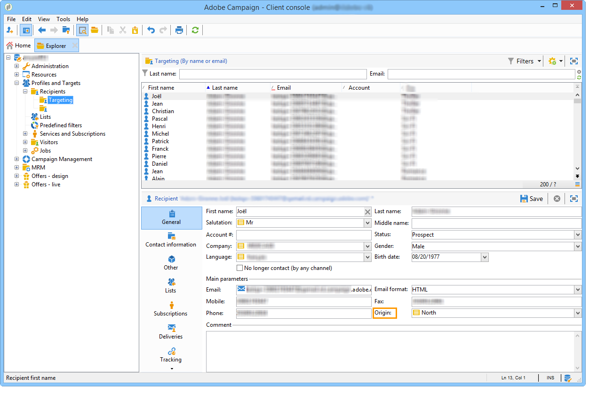

# 開始使用分散式行銷{#about-distributed-marketing}

<!--
>[!AVAILABILITY]
>
>:warning: This capability is not available in Campaign v8. [Learn more](https://experienceleague.adobe.com/docs/campaign/campaign-v8/campaign-home.html)
-->

Adobe Campaign提供&#x200B;**分佈式營銷**&#x200B;申請，用於在中央實體（總部、營銷部等）之間實施合作宣傳 及當地實體（銷售點、地區代理等）。 此合作是以共用工作區&#x200B;**[!UICONTROL list of campaign packages]**&#x200B;為基礎，其中集中建立的促銷活動範本和例項提供給本機實體。

中央實體提供本機實體可能使用的促銷活動。 促銷活動是由代表本機或協作促銷活動的套件來實作。 若要使用促銷活動，本機實體必須對其進行訂購，且訂單必須獲得核准。

>[!CAUTION]
>
>「分佈式行銷」模組是&#x200B;**Campaign**&#x200B;選項。 請檢查您的授權合約。

## 術語 {#terminology}

* **中央實體**

   中央實體由負責指定通信和協助當地實體執行其營銷活動的營銷經營者組成。

   分散式行銷模組可讓中央實體：

   * 為本機實體設定行銷促銷活動套件，
   * 提高當地實體在客戶／潛在客戶通訊、目標鎖定、內容等方面的自主度。
   * 管理和控製成本，
   * 處理機構網路。

* **本地實體**

   當地實體可以是特定當地營運商（國家或地區經理、品牌經理等）的代理商、商店或群組。

   Distributed Marketing可讓本地實體擁有更多的自主權，同時最佳化執行成本。

* **本地化**

   本地化是本地實體修改促銷活動目標和內容的能力。 本地化的可能程度取決於促銷活動的類型及其實施。

* **促銷活動套件清單**

   促銷活動套件清單包含可供本機實體使用的促銷活動。

* **促銷活動套件**

   範本（或促銷活動例項）由中央實體建立，並可供一組本機實體使用。

* **本機促銷活動**

   本機促銷活動是從&#x200B;**[!UICONTROL campaign packages]**&#x200B;清單中引用的範本，以&#x200B;**特定執行排程**&#x200B;建立的例項。 其目標是使用由中央實體設定和設定的促銷活動範本，來滿足本端通訊需求。

   地方實體的自治程度取決於所使用的實施。

   請參閱[建立本機促銷活動](../../campaign/using/creating-a-local-campaign.md)。

* **協作宣傳**

   協作促銷活動是由本機實體可使用的中央實體定義&#x200B;**執行排程的促銷活動。**&#x200B;每個本機實體的內容都維持不變，但會分擔成本。 若要參與，本機實體會訂閱協作促銷活動。

   * **[!UICONTROL Collaborative campaign (by form)]**:建議用於最多300個本機實體的促銷活動。本機實體可輸入預先定義的參數，以在網頁表單中進行定位和內容個人化。 表單可以是Adobe Campaign表單或外部表單（外部客戶端）。 功能管理員可以根據由整合器定義的表單範本來定義和設定表單。 若要訂購促銷活動，本機實體只需要Web存取權。
   * **[!UICONTROL Collaborative campaign (by campaign)]**:針對數十個地方實體的促銷活動建議。此類型的促銷活動會為每個本機實體建立子促銷活動。 當&#x200B;**[!UICONTROL collaborative campaign (by campaign)]**&#x200B;獲得中央實體核准後，促銷活動便可供本機實體使用，由本機實體加以修改。 執行會在父促銷活動和子促銷活動之間自動同步。 本機實體必須擁有例項的存取權，才能訂購促銷活動並參與其中。
   * **[!UICONTROL Collaborative campaign (by target approval)]**:針對數千個本地實體的促銷活動建議。本地實體接收由中央實體預先定義的聯繫人清單。 本機實體會根據促銷活動內容，透過Web表單決定是否保留特定的連絡人。 從選定接觸清單中推導出局部圖元。 若要參與促銷活動，本機實體只需要Web存取權。
   * **[!UICONTROL Collaborative campaign (simple)]**:此模式可確保與舊版的特定執行程式相容。

   請參閱[建立協作促銷活動](../../campaign/using/creating-a-collaborative-campaign.md)。

**訂購促銷活動套件**

如果本機實體註冊促銷活動，則會將此訂單轉換為重新群組所有與促銷活動本地化相關資訊的順序。

## 工作區 {#workspace}

可從&#x200B;**促銷活動**&#x200B;標籤存取促銷活動套件清單：按一下&#x200B;**[!UICONTROL Campaign packages]**&#x200B;連結。

此視窗可讓所有本機營運商檢視其本機代理的可用促銷活動。

對於中央機構，此視窗會顯示促銷活動套件清單中所有可用的套件，並提供其他連結以編輯清單。

## 運算子和實體{#operators-and-entities}

首先，透過&#x200B;**[!UICONTROL Access management]**&#x200B;資料夾指定中央和本機實體運算子。

### 運算子 {#operators}

您需要建立中央和本機運算子。

Central運算子必須屬於&#x200B;**[!UICONTROL Central management]**&#x200B;運算子群組，或具有&#x200B;**[!UICONTROL CENTRAL]**&#x200B;的命名權限。

本機運算子必須屬於&#x200B;**[!UICONTROL Local management]**&#x200B;運算子群組，或具有&#x200B;**[!UICONTROL LOCAL]**&#x200B;的命名權限。 它們還必須與本地實體連結。

### 組織實體{#organizational-entities}

要建立組織實體，請按一下&#x200B;**[!UICONTROL Administration > Access management > Organizational entities]**&#x200B;節點，然後按一下實體清單上方的&#x200B;**[!UICONTROL New]**&#x200B;表徵圖。

每個組織實體都包含識別資訊（標籤、內部名稱、聯絡資訊等） 和訂單核准程式中的群組。 這些定義在&#x200B;**[!UICONTROL General]**&#x200B;標籤中的&#x200B;**[!UICONTROL Notifications and approvals]**&#x200B;部分中。

* 定義包通知組：此群組中的運算子會在每次新增新套件至促銷活動套件清單時，以及每次促銷活動可用時收到通知。
* 選取負責核准訂單的審核者群組，即負責核准由當地實體所訂購之促銷活動的審核者。
* 最後，選擇負責核准本機促銷活動（目標、內容、預算等）的審核者群組。 依範本而定，在排序促銷活動時，可以新增此群組。

>[!NOTE]
>
>批准流程顯示在[批准流程](../../campaign/using/creating-a-local-campaign.md#approval-process)部分。

## 實作 {#implementation}

分散式行銷促銷活動是由中央實體建立和發佈。 可視需要由地方和中央實體使用。

實施程式取決於所使用的促銷活動套件類型和本地實體委派層級。

### Integrator任務{#integrator-side}

1. 建立本地實體。
1. 將收件者與管理本機實體的運算子連結。

   

1. 指定本機實體的權限和瀏覽規則
1. 指定促銷活動本地化所需的欄位集：

   * 目標定義和最大尺寸，
   * 內容定義，
   * 執行計畫（聯繫日期和提取日期）、**（僅針對本地操作員）、**、
   * 擴展的順序模式，並包含所有必要的附加欄位。

1. 建立Web表單(Adobe或外部網站)，讓您顯示本地化參數、評估目標和預算，以及預覽內容並核准訂單。

   對於&#x200B;**協作促銷活動（依目標核准）**，請建立表格，儲存每個本機實體的核准。

### 功能管理員任務{#functional-administrator-side}

建立每個促銷活動時，必須執行這些步驟。

1. 使用促銷活動當地語系化的欄位更新表單。
1. 從適當的促銷活動範本（協作促銷活動）建立例項，或複製促銷活動範本（本機促銷活動）。
1. 使用本地化欄位和表單參考來設定促銷活動。
1. 發佈促銷活動。

### 本機運算子任務{#local-operator-side}

每個促銷活動都必須執行這些步驟。

1. 在您收到促銷活動套件可用性的通知後，請指定促銷活動的位置（選用）。
1. 評估目標、預算等。
1. 預覽促銷活動內容。
1. 訂購促銷活動。
