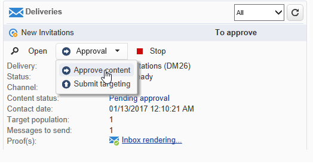

# 存取行銷活動{#accessing-marketing-campaigns}

Adobe Campaign可讓您建立、設定、執行和分析行銷活動。 所有行銷活動都可從統一的控制中心進行管理。 

## 工作區基本介紹 {#workspace-basics}

### 首頁 {#home-page}

連線至Adobe Campaign後，您就會看到首頁。

按一下導覽列中的連結以存取各種功能。

在&#x200B;**[!UICONTROL Campaigns]**&#x200B;標籤中找到促銷活動元素：您可以在此查看行銷方案和行銷活動的概覽及其子集。 行銷方案由行銷活動組成，行銷活動由傳遞、工作、連結資源等組成。 在使用Campaign進行行銷活動管理的情境中，有關傳送、預算、審閱者和連結檔案的資訊可在行銷活動中找到。

**[!UICONTROL Campaigns]**&#x200B;標籤的&#x200B;**[!UICONTROL Browsing]**&#x200B;區塊會根據執行個體上安裝的模組提供各種項目。 例如，您可以存取：

* **促銷活動日曆**:計畫、行銷方案、傳遞和行銷活動行事歷。請參閱[促銷活動日曆](#campaign-calendar)。
* **促銷活動**:存取所有行銷方案中包含的行銷活動。
* **傳遞**:存取連結至促銷活動的傳送。
* **Web應用程式**:存取網頁應用程式（表單、登錄頁面等）。

>[!NOTE]
>
>有關整體Adobe Campaign人機工程學、權限和設定檔管理功能的詳細資訊，請參閱[本區段](../../platform/using/adobe-campaign-workspace.md)。
>
>與頻道和傳送相關的所有功能在[本節](../../delivery/using/steps-about-delivery-creation-steps.md)中詳細說明。

### 行銷活動日曆 {#campaign-calendar}

每個促銷活動都屬於一個方案，而該方案又屬於一個計畫。 可透過&#x200B;**促銷活動**&#x200B;標籤中的&#x200B;**[!UICONTROL Campaign calendar]**&#x200B;功能表存取計畫、方案和促銷活動。

若要編輯計畫、方案、促銷活動或傳送，請在日曆中按一下其名稱，然後按一下&#x200B;**[!UICONTROL Open...]**。 接著會顯示在新標籤中，如下所示：

您可以篩選行銷活動日曆中顯示的資訊。 要執行此操作，請按一下&#x200B;**[!UICONTROL Filter]**&#x200B;連結並選取篩選條件。

>[!NOTE]
>
>當您依日期篩選時，會顯示所有開始日期晚於指定日期和/或結束日期早於指定日期的促銷活動。 需要使用每個欄位右側的日曆來選取日期。

您也可以使用&#x200B;**[!UICONTROL Search]**&#x200B;欄位來篩選顯示的項目。

連結至每個項目的圖示可讓您檢視其狀態：已完成、進行中、正在編輯等。

### 在行銷方案中瀏覽 {#browsing-in-a-marketing-program}

Campaign可讓您管理由各種行銷活動組成的一組方案。 每個促銷活動都包含傳遞以及相關的程式和資源。

#### 瀏覽程式 {#browsing-a-program}

編輯程式時，請使用下面描述的頁簽來瀏覽和配置它。

* **Schedule**&#x200B;頁簽顯示月、周或日的程式日曆，具體取決於您在日曆標題中按一下的頁簽。

   如有必要，您可以透過此頁面建立促銷活動、方案或任務。

   

* **Edit**&#x200B;標籤可讓您個人化程式：名稱、開始和結束日期、預算、連結的檔案等。

   

#### 瀏覽促銷活動 {#browsing-campaigns}

您可透過促銷活動日曆、方案的&#x200B;**[!UICONTROL Schedule]**&#x200B;標籤或促銷活動清單來存取促銷活動。

1. 透過促銷活動日曆，選取您要顯示的促銷活動，然後按一下&#x200B;**[!UICONTROL Open]**&#x200B;連結。

   

   促銷活動會在新索引標籤中編輯，如下所示：

   

1. 透過方案的&#x200B;**[!UICONTROL Schedule]**&#x200B;標籤，編輯模式與透過促銷活動日曆的模式相同。
1. 透過&#x200B;**[!UICONTROL Campaigns]**&#x200B;標籤的&#x200B;**[!UICONTROL Campaigns]**&#x200B;連結，按一下您要編輯的促銷活動名稱。

   

### 控制行銷活動 {#controlling-a-campaign}

#### 控制面板 {#dashboard}

對於每個促銷活動，工作、資源和傳送會集中在單一畫面（即控制面板）中，讓您與其他人共同管理行銷動作。

促銷活動的控制面板是作為控制介面使用。 它直接存取主要促銷活動建立和管理階段：傳遞、擷取檔案、通知、預算等。

透過Adobe Campaign，您可以設定協作流程，以建立和核准行銷和通訊行銷活動的各個階段：預算、目標、內容等的核准。

>[!NOTE]
>
>促銷活動範本的設定顯示在[促銷活動範本](../../campaign/using/marketing-campaign-templates.md#campaign-templates)中。

#### 排程 {#schedule}

促銷活動會集中一組傳送。 對於每個促銷活動，排程會提供所有元件的全域檢視：這可讓您顯示工作和傳送，並輕鬆存取。

#### 論壇 {#forum}

對於每個促銷活動，操作者可透過專用論壇交換訊息。

有關詳細資訊，請參閱[討論論壇](../../mrm/using/discussion-forums.md)。

#### 報告 {#reports}

**[!UICONTROL Reports]**&#x200B;連結可讓您存取促銷活動報表。

>[!NOTE]
>
>在[此區段](../../reporting/using/about-adobe-campaign-reporting-tools.md)中詳細說明報告。

#### 設定 {#configuration}

行銷活動是透過行銷活動範本建立。 您可以配置可重複使用的模板，其中已為其選擇了某些選項，並且已保存了其他設定。 對於每個促銷活動，提供下列功能：

* 參考文檔和資源：您可以將檔案與促銷活動（簡報、報表、影像等）建立關聯。 支援所有文檔格式。 請參閱[管理關聯文檔](../../campaign/using/marketing-campaign-deliveries.md#managing-associated-documents)。
* 定義成本：對於每個促銷活動，Adobe Campaign可讓您定義建立行銷活動時可使用的成本項目和成本計算結構。 例如：印刷成本、使用外部代理、房間租賃等。 請參閱[定義成本類別](../../campaign/using/providers--stocks-and-budgets.md#defining-cost-categories)。
* 定義目標：您可以為促銷活動定義可量化的目標，例如訂閱者數量、業務量等。 此資訊稍後會用於行銷活動報表。
* 管理種子地址（有關詳細資訊，請參閱[此部分](../../delivery/using/about-seed-addresses.md)）和控制組（請參閱[定義控制組](../../campaign/using/marketing-campaign-deliveries.md#defining-a-control-group)）。
* 管理核准：您可以選取要核准的處理，並視需要選取檢閱運算子或運算子群組。 請參閱[檢查並核准傳送](../../campaign/using/marketing-campaign-approval.md#checking-and-approving-deliveries)。

>[!NOTE]
>
>若要存取促銷活動設定並進行變更，請按一下&#x200B;**[!UICONTROL Edit]**&#x200B;標籤中的&#x200B;**[!UICONTROL Advanced campaign parameters...]**&#x200B;連結。 如需在促銷活動層級設定參數以讓傳遞自動繼承值的詳細資訊，請參閱[我們的Technote](https://helpx.adobe.com/campaign/kb/simplifying-campaign-management-acc.html#Setparametersatthecampaignlevelsodeliveriesinheritvaluesautomatically)。

## 使用Web介面 {#using-the-web-interface-}

您可以透過網際網路瀏覽器存取Adobe Campaign主控台畫面，以檢視所有促銷活動和傳送，以及資料庫中設定檔的報表和資訊。 此訪問不啟用記錄建立。 根據操作員權限，您可以查看和/或對資料庫中的資料執行操作。 例如，您可以核准促銷活動內容及鎖定目標、重新啟動或停止傳送等。

1. 照常透過https://`<your instance>:<port>/view/home`登入。
1. 使用功能表存取概述。

   

核准（例如目標或傳送內容）可透過Web存取執行。

您也可以使用通知訊息中包含的連結。 如需詳細資訊，請參閱[檢查並核准傳送](../../campaign/using/marketing-campaign-approval.md#checking-and-approving-deliveries)。
