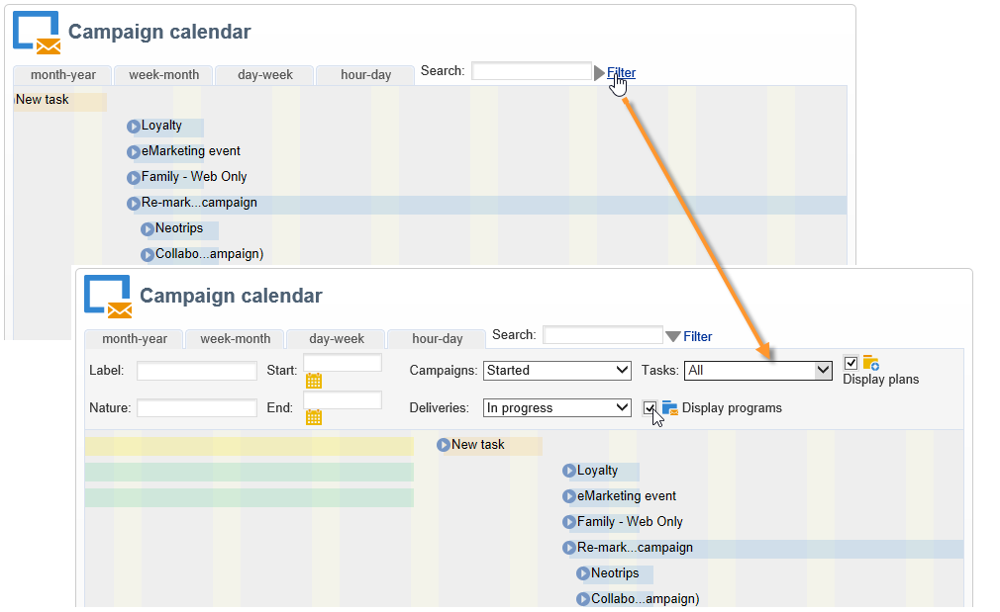

# 存取行銷活動{#accessing-marketing-campaigns}

Adobe Campaign可讓您建立、設定、執行及分析行銷宣傳。 所有行銷活動都可從統一的控制中心進行管理。

## 工作區基本資訊{#workspace-basics}

### 首頁 {#home-page}

一旦您連線到Adobe Campaign，您就會看到首頁。

按一下導覽列中的連結，以存取各種功能。

促銷活動元素位於&#x200B;**[!UICONTROL Campaigns]**&#x200B;標籤中：您可在此處檢視行銷方案和促銷活動及其子集的概述。 行銷方案由促銷活動組成，促銷活動由傳遞、任務、連結資源等組成。 在使用Campaign進行行銷活動管理的環境中，促銷活動中會找到有關傳送、預算、審閱者和連結檔案的資訊。

**[!UICONTROL Campaigns]**&#x200B;頁籤的&#x200B;**[!UICONTROL Browsing]**&#x200B;塊提供了各種條目，具體取決於實例上安裝的模組。 例如，您可以存取：

* **促銷活動日曆**:計畫、行銷方案、遞送和促銷活動的日曆。請參閱[促銷活動日曆](#campaign-calendar)。
* **促銷活動**:存取所有行銷方案中所包含的促銷活動。
* **傳送**:存取連結至促銷活動的傳送。
* **Web應用程式**:存取網路應用程式（表單、調查等）。

>[!NOTE]
>
>有關Adobe Campaign總體人機工程學、權限和概要檔案管理功能的詳細資訊，請參閱[本節](../../platform/using/adobe-campaign-workspace.md)。
>
>與頻道和傳送有關的所有功能詳見本節[。](../../delivery/using/steps-about-delivery-creation-steps.md)

### 促銷活動日曆{#campaign-calendar}

每個促銷活動都屬於一個方案，而該方案又屬於一個方案。 計畫、程式和促銷活動可通過&#x200B;**促銷活動**&#x200B;標籤中的&#x200B;**[!UICONTROL Campaign calendar]**&#x200B;功能表存取。

若要編輯計畫、方案、促銷活動或傳送，請在日曆中按一下其名稱，然後按一下&#x200B;**[!UICONTROL Open...]**。 然後，它會顯示在新標籤中，如下所示：

您可以篩選顯示在促銷活動日曆中的資訊。 若要這麼做，請按一下&#x200B;**[!UICONTROL Filter]**&#x200B;連結並選取篩選條件。

>[!NOTE]
>
>當您篩選日期時，所有開始日期晚於指定日期和／或結束日期早於指定日期的促銷活動都會顯示。 必須使用每個欄位右側的日曆來選取日期。

您也可以使用&#x200B;**[!UICONTROL Search]**&#x200B;欄位來篩選顯示的項目。

連結至每個項目的圖示可讓您檢視其狀態：完成、進行中、正在編輯等。

### 在行銷程式中瀏覽{#browsing-in-a-marketing-program}

Campaign可讓您管理由各種行銷促銷活動組成的一組方案。 每個促銷活動都包含傳送以及相關的流程和資源。

#### 瀏覽程式{#browsing-a-program}

編輯程式時，請使用下面介紹的頁籤瀏覽並配置它。

* **Schedule**&#x200B;標籤顯示月、周或日的程式日曆，具體取決於您在日曆標題中按一下的標籤。

   如有必要，您可以透過此頁面建立促銷活動、方案或工作。

   

* **Edit**&#x200B;標籤可讓您個人化程式：名稱、開始和結束日期、預算、連結檔案等。

   

#### 瀏覽促銷活動{#browsing-campaigns}

您可透過促銷活動日曆、方案的&#x200B;**[!UICONTROL Schedule]**&#x200B;標籤或促銷活動清單來存取促銷活動。

1. 透過促銷活動日曆，選取您要顯示的促銷活動，然後按一下&#x200B;**[!UICONTROL Open]**&#x200B;連結。

   

   促銷活動會在新標籤中編輯，如下所示：

   

1. 透過程式的&#x200B;**[!UICONTROL Schedule]**&#x200B;標籤，編輯模式與透過促銷活動日曆的模式相同。
1. 透過&#x200B;**[!UICONTROL Campaigns]**&#x200B;標籤的&#x200B;**[!UICONTROL Campaigns]**&#x200B;連結，按一下您要編輯的促銷活動名稱。

   

### 控制促銷活動{#controlling-a-campaign}

#### 控制面板{#dashboard}

對於每個促銷活動，工作、資源和傳送都集中在單一畫面（控制面板）中，可讓您與他人共同管理行銷動作。

促銷活動的控制面板會用作控制介面。 它可直接存取主要促銷活動建立與管理階段：傳送、擷取檔案、通知、預算等。

有了Adobe Campaign，您可以設定協作流程，以建立和核准行銷和通訊宣傳活動的各個階段：預算、目標、內容等的核准。

>[!NOTE]
>
>促銷活動範本的設定會顯示在[促銷活動範本](../../campaign/using/marketing-campaign-templates.md#campaign-templates)中。

#### 計畫{#schedule}

促銷活動會集中傳送一組。 對於每個促銷活動，排程會提供所有元件的全域檢視：這可讓您顯示工作和傳送，並輕鬆存取。

#### 論壇 {#forum}

對於每個促銷活動，營運商都可透過專用論壇交換訊息。

有關詳細資訊，請參閱[論壇](../../campaign/using/discussion-forums.md)。

#### 報表 {#reports}

**[!UICONTROL Reports]**&#x200B;連結可讓您存取促銷活動報表。

>[!NOTE]
>
>報表詳見[本節](../../reporting/using/about-adobe-campaign-reporting-tools.md)。

#### 設定 {#configuration}

促銷活動是透過促銷活動範本建立。 您可以設定可重複使用的範本，其中已選取部分選項，並儲存其他設定。 對於每個促銷活動，都提供下列功能：

* 參考檔案和資源：您可以將檔案與促銷活動（簡介、報表、影像等）建立關聯。 支援所有檔案格式。 請參閱[管理相關文檔](../../campaign/using/marketing-campaign-deliveries.md#managing-associated-documents)。
* 定義成本：對於每個促銷活動，Adobe Campaign可讓您定義成本分錄和成本計算結構，以便在建立行銷活動時使用。 例如：列印成本、使用外部代理、租房等。 請參閱[定義成本類別](../../campaign/using/providers--stocks-and-budgets.md#defining-cost-categories)。
* 定義目標：您可以定義促銷活動的可量化目標，例如訂閱者人數、業務量等。 這些資訊稍後會用於促銷活動報表。
* 管理種子地址（有關詳細資訊，請參閱[本節](../../delivery/using/about-seed-addresses.md)）和控制組（請參閱[定義控制組](../../campaign/using/marketing-campaign-deliveries.md#defining-a-control-group)）。
* 管理批准：您可以選取要核准的處理，並視需要選取檢閱運算元或運算元群組。 請參閱[檢查和批准傳送](../../campaign/using/marketing-campaign-approval.md#checking-and-approving-deliveries)。

>[!NOTE]
>
>若要存取促銷活動設定並進行變更，請按一下&#x200B;**[!UICONTROL Edit]**&#x200B;標籤中的&#x200B;**[!UICONTROL Advanced campaign parameters...]**&#x200B;連結。 如需在促銷活動層級設定參數以自動繼承值的詳細資訊，請參閱[我們的Technote](https://helpx.adobe.com/campaign/kb/simplifying-campaign-management-acc.html#Setparametersatthecampaignlevelsodeliveriesinheritvaluesautomatically)。

## 使用Web介面{#using-the-web-interface-}

您可以透過網際網路瀏覽器存取Adobe Campaign主控台畫面，以檢視所有促銷活動和傳送，以及資料庫中描述檔的報表和資訊。 此存取無法啟用記錄建立。 根據操作員權限，您可以查看和／或對資料庫中的資料執行操作。 例如，您可以核准促銷活動內容和定位、重新啟動或停止傳送等。

1. 照常透過https://`<your instance>:<port>/view/home`登入。
1. 使用功能表存取概觀。

   

批准（例如，目標或傳送內容）可以通過Web訪問執行。

您也可以使用通知訊息中包含的連結。 有關詳細資訊，請參閱[檢查和批准交付](../../campaign/using/marketing-campaign-approval.md#checking-and-approving-deliveries)。
