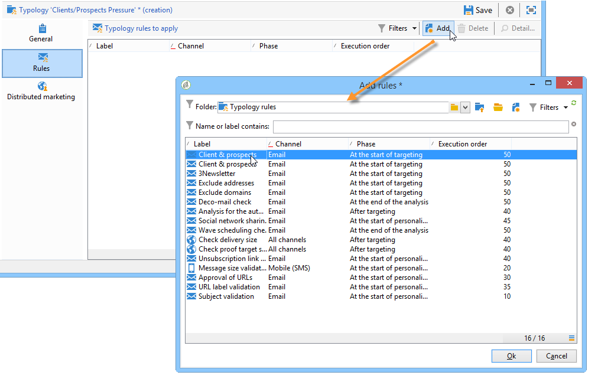

# 套用規則{#applying-rules}

## 套用類型至傳送{#applying-a-typology-to-a-delivery}

若要套用您建立的類型規則，您必須將其與類型建立關聯，然後在您的傳送中參考此類型。 操作步驟：

1. 建立行銷活動類型。

   可透過&#x200B;**[!UICONTROL Administration > Campaign Management > Typology management]** > **[!UICONTROL Typologies]**&#x200B;節點存取類型。

1. 前往&#x200B;**[!UICONTROL Rules]**&#x200B;標籤，按一下&#x200B;**[!UICONTROL Add]**&#x200B;按鈕並選取要與此類型套用的規則。

   

1. 儲存類型：會新增至現有類型清單中。
1. 開啟您要套用規則的傳送。
1. 開啟傳送屬性並存取&#x200B;**[!UICONTROL Typology]**&#x200B;標籤。
1. 在下拉式清單中選取類型。

   

   >[!NOTE]
   >
   >可以在傳遞範本中定義類型，以便自動套用至使用此範本建立的所有傳送。

## 定義應用程式條件{#defining-application-conditions}

您可以根據需求限制規則的應用程式欄位（控制規則除外）。

您可以設定類型規則，使其僅關注其連結的特定傳送，或關注傳送目標中的特定收件者。

要定義規則的應用條件，請按一下&#x200B;**[!UICONTROL General]**&#x200B;頁簽中的&#x200B;**[!UICONTROL Edit the rule application conditions...]**&#x200B;連結。

然後使用查詢編輯器定義篩選條件。 在下列範例中，容量規則僅關注在2013年4月1日之前建立之標籤或傳送中加上&#39;offer&#39;字的傳送。

>[!NOTE]
>
>若是篩選規則，您可以選取篩選條件的應用程式條件：它們取決於傳送或傳送大綱。 有關詳細資訊，請參閱[調整篩選規則](../../campaign/using/filtering-rules.md#conditioning-a-filtering-rule)。

## 調整計算頻率{#adjusting-calculation-frequency}

每晚都會透過資料庫清除工作流程自動重新執行仲裁。 不過，值可儲存在此期間之後。

事實上，有些計算使用的值並未每天改變。 因此，每天重新計算資料並無償超載資料庫將無關緊要。 例如，如果程式以每週的客戶傾向分數和購買資訊豐富行銷資料庫，則基於這些值的資料不需要每天重新計算。

要執行此操作， **[!UICONTROL General]**&#x200B;標籤的&#x200B;**[!UICONTROL Frequency]**&#x200B;欄位可讓您定義儲存定位的最大期間。 預設情況下，值&#x200B;**0**&#x200B;指示計算在下次執行每日重新仲裁之前仍然有效。

要保存超過此期間的結果，請在&#x200B;**[!UICONTROL Frequency]**&#x200B;欄位中輸入大於12的值：此期間過期後，會重新套用所有規則。

**[!UICONTROL Re-apply the rule at the start of personalization]**&#x200B;選項可讓您在個人化階段期間自動套用規則，包括&#x200B;**[!UICONTROL Frequency]**&#x200B;欄位中指出的期間仍有效時。

## 選擇規則應用程式階段{#selecting-the-rule-application-phase}

在相關傳送的鎖定目標、分析和個人化階段期間，會以特定順序套用類型規則。

### 執行順序{#execution-order}

在標準操作模式下，會依下列順序套用規則：

1. 控制規則（如果這些規則是在定位開始時套用）。
1. 篩選規則：

   * 地址限定的本機應用規則：封鎖清單/隔離位址/位址品質上已定義的位址/未驗證的位址/位址。
   * 篩選由使用者定義的規則。
   * 位址或識別碼上的重複資料刪除規則（如有需要則套用）。

1. 壓力規則.
1. 容量規則。
1. 控制規則（如果這些規則是在定位結束時套用）。
1. 控制規則（如果這些規則是在個人化開始時套用）。如果使用者規則（篩選/壓力/容性）已過期，需要重新計算，則會在此步驟中套用。
1. 控制規則（如果這些規則在個人化結束時套用）。

>[!NOTE]
>
>如果您使用「促銷活動互動」模組，則會在呼叫優惠方案引擎期間，與篩選規則（適用於在傳送大綱中找到的優惠方案）或在個人化階段期間，同時套用優惠方案適用性規則。

您可以使用規則的&#x200B;**[!UICONTROL General]**&#x200B;標籤中的適當欄位，調整具有相同類型的規則的執行順序。 在相同的訊息處理階段期間執行數個規則時，您可以在&#x200B;**[!UICONTROL Execution sequence]**&#x200B;欄位中設定其執行順序。

例如，執行順序為20的壓力規則將在執行順序為30的壓力規則之前執行。

### 控制規則 {#control-rules}

對於&#x200B;**[!UICONTROL Control]**&#x200B;規則，您可以決定要套用規則的傳送生命週期的哪個時間點（在鎖定目標之前或之後、在個人化開始時、在分析結束時）。 在類型規則的&#x200B;**[!UICONTROL General]**&#x200B;標籤的&#x200B;**[!UICONTROL Phase]**&#x200B;欄位下拉式清單中，選取要套用的值。

可能的值包括：

* **[!UICONTROL At the start of targeting]**

   若要防止在發生錯誤時執行個人化步驟，您可以在此處套用控制規則。

* **[!UICONTROL After targeting]**

   如果需要知道目標的體積以應用控制規則，請選擇此階段。

   例如， **[!UICONTROL Check proof size]**&#x200B;控制規則會套用至每個定位階段之後：如果校樣收件者太多，此規則會防止訊息個人化。

* **[!UICONTROL At the start of personalization]**

   如果控制涉及訊息個人化的核准，則必須選取此階段。 在分析階段期間會執行訊息個人化。

* **[!UICONTROL At the end of the analysis]**

   當檢查需要完成訊息個人化時，請選取此階段。

## 其他配置 {#additional-configurations}

### 控制傳出的SMTP流量{#control-outgoing-smtp-traffic}

作為選項，您可以使用&#x200B;**[!UICONTROL Managing affinities with IP addresses]**&#x200B;欄位將傳送連結至此相關性的傳送伺服器(MTA)。 這可讓您將特定傳送的電子郵件數量限制在電腦或輸出地址。

>[!NOTE]
>
>相關性管理不適用於&#x200B;**[!UICONTROL Filtering]**&#x200B;類型。\
>相關性是在Adobe Campaign伺服器的執行個體設定檔案中定義。 如需詳細資訊，請參閱[本章節](../../installation/using/about-initial-configuration.md)。

### 促銷活動最佳化和分佈式行銷{#campaign-optimization-and-distributed-marketing}

**[!UICONTROL Distributed Marketing]**&#x200B;索引標籤可讓您定義重新對應當排序和/或保留共用促銷活動時套用的類型和/或規則。 為本地實體定義的類型/規則（連結至為中央實體定義的類型）會取代連結至中央實體的規則/類型。 重新對應可讓您調整中央實體規則，使其與排序促銷活動的本機實體一致。

>[!NOTE]
>
>在類型與類型規則中，如果您的授權包含此選項，則會新增&#x200B;**[!UICONTROL Distributed Marketing]**&#x200B;標籤：請檢查您的授權合約。\
>如需分佈式行銷的詳細資訊，請參閱[關於分佈式行銷](../../campaign/using/about-distributed-marketing.md)。
