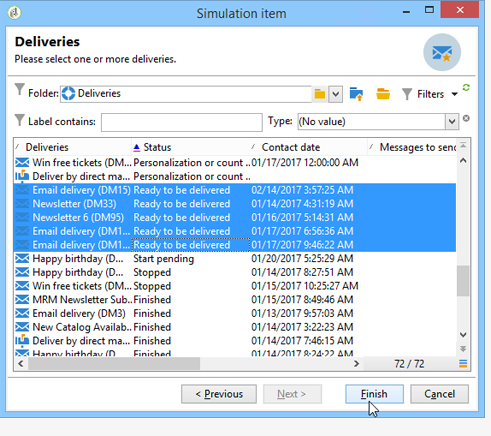
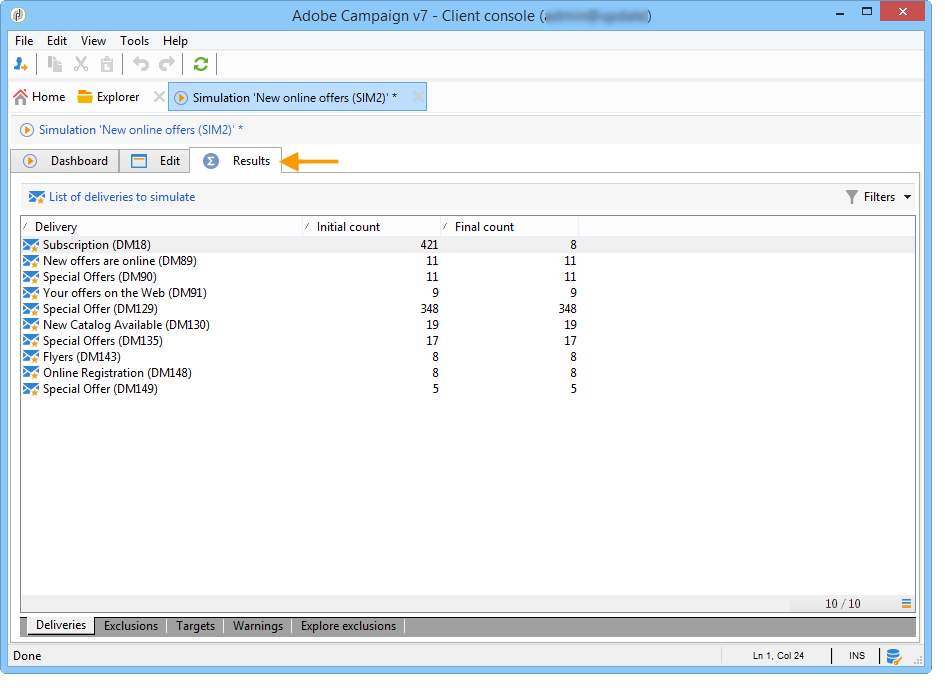

# 行銷活動模擬{#campaign-simulations}

## 關於模擬{#about-simulations}

促銷活動最佳化可讓您使用模擬來測試促銷活動計畫的效率。 這可讓您測量促銷活動的潛在成功：產生的收入、根據套用的類型學規則設定的目標量等。

模擬可讓您監控和比較傳送的影響。

>[!NOTE]
>
>在「測試」模式下準備的傳送不會彼此影響，例如，在分佈式行銷中評估促銷活動時，或只要傳送未排程在臨時日曆中。\
>這表示壓力和容量規則僅適用於&#x200B;**[!UICONTROL Target estimation and message personalization]**&#x200B;模式的交貨。 **[!UICONTROL Estimation and approval of the provisional target]**&#x200B;和&#x200B;**[!UICONTROL Target evaluation]**&#x200B;模式中的遞送不會被考慮在內。\
>傳送模式是在傳送屬性的&#x200B;**[!UICONTROL Typology]**&#x200B;子標籤中選擇。

## 設定模擬{#setting-up-a-simulation}

### 建立模擬{#creating-a-simulation}

要建立模擬，請應用以下步驟：

1. 開啟&#x200B;**[!UICONTROL Campaigns]**&#x200B;標籤，按一下&#x200B;**[!UICONTROL Create]**&#x200B;區段中的&#x200B;**[!UICONTROL More]**&#x200B;連結，並選取&#x200B;**[!UICONTROL Simulation]**&#x200B;選項。

   

1. 輸入模板和模擬的名稱。 按一下&#x200B;**[!UICONTROL Save]**&#x200B;建立模擬。

   

1. 按一下&#x200B;**[!UICONTROL Edit]**&#x200B;頁籤進行配置。

   

1. 在&#x200B;**[!UICONTROL Scope]**&#x200B;標籤中，指定您要為此模擬考慮的傳送。 若要這麼做，請按一下&#x200B;**[!UICONTROL Add]**&#x200B;按鈕，並指定要考量的傳送選擇模式。

   

   您可以逐一選擇每個傳送，或依促銷活動、方案或計畫排序。

   >[!NOTE]
   >
   >如果您透過計畫、方案或促銷活動選擇傳送，Adobe Campaign可以自動重新整理傳送清單，以便在模擬啟動時考慮。 若要這麼做，請勾選&#x200B;**[!UICONTROL Refresh the selection of deliveries each time the simulation is started]**&#x200B;選項。
   >  
   >如果您不這樣做，在建立模擬時，計畫、方案或促銷活動中不提供的任何傳送都不會納入考量：稍後新增的傳送將會被忽略。

   

1. 選擇要包括在模擬範圍中的元素。 如有必要，請使用SHIFT和CTRL鍵選取多個元素。

   

   按一下&#x200B;**[!UICONTROL Finish]**&#x200B;以核准選擇。

   您可以人工合併屬於計畫、方案或促銷活動的選定交貨和交貨。

   

   如有必要，您可以透過&#x200B;**[!UICONTROL Edit the dynamic condition...]**&#x200B;連結使用動態條件。

   按一下&#x200B;**[!UICONTROL Save]**&#x200B;批准此配置。

   >[!NOTE]
   >
   >計算模擬時，只會考慮已計算目標的傳送(狀態：**Target ready**&#x200B;或&#x200B;**Ready to deliver**)。

1. 在&#x200B;**[!UICONTROL Calculations]**&#x200B;標籤中，選擇分析維，例如收件者方案。

   

1. 然後，您可以新增運算式。

   

### 執行設定 {#execution-settings}

模擬的&#x200B;**[!UICONTROL General]**&#x200B;頁籤可讓您輸入執行設定：

* **[!UICONTROL Schedule execution for down-time]**&#x200B;選項會根據選擇的優先順序，將模擬啟動定義為較不繁忙的時段。 例如，模擬使用大量資料庫資源，因此非緊急模擬應排程在夜間執行。
* **[!UICONTROL Priority]**&#x200B;是套用至模擬以延遲觸發的層級。
* **[!UICONTROL Save SQL queries in the log]**.SQL日誌可讓您診斷模擬是否以錯誤結束。 它們也可協助您瞭解模擬為何太慢。 這些消息在模擬後將顯示在&#x200B;**[!UICONTROL Audit]**&#x200B;頁籤的&#x200B;**[!UICONTROL SQL logs]**&#x200B;子頁籤中。

## 執行模擬{#executing-a-simulation}

### 啟動模擬{#starting-a-simulation}

一旦定義了模擬範圍，就可以執行它。

若要這麼做，請開啟模擬控制面板，然後按一下&#x200B;**[!UICONTROL Start simulation]**。

執行完成後，請開啟模擬並按一下&#x200B;**[!UICONTROL Results]**&#x200B;標籤，以檢視針對每個傳送計算的目標。

1. **[!UICONTROL Deliveries]**&#x200B;子標籤列出模擬所考慮的所有傳送。 它顯示了兩個計數：

   * **[!UICONTROL Initial count]**&#x200B;是目標，如同在傳送中估計其時計算的目標。
   * **[!UICONTROL Final count]**&#x200B;是經過模擬計算的收件者數。

      初始計數和最終計數之間的差異反映了在模擬之前配置的各種規則或過濾器的應用。

      若要進一步瞭解此計算，請編輯&#x200B;**[!UICONTROL Exclusions]**&#x200B;子標籤。

1. **[!UICONTROL Exclusions]**&#x200B;子標籤可讓您檢視排除劃分。

   

1. **[!UICONTROL Alerts]**&#x200B;子頁籤將模擬期間生成的所有警報消息分組。 在容量超負荷時（例如，如果目標接收者數量超過設定容量），可以發送警報消息。
1. **[!UICONTROL Exploration of the exclusions]**&#x200B;子標籤可讓您建立結果分析表格。 使用者需要在橫坐標／縱坐標軸中指定變數。

   有關建立分析表的示例，請參閱[瀏覽結果](#exploring-results)的結尾。

### 查看結果{#viewing-results}

#### 審核{#audit}

**[!UICONTROL Audit]**&#x200B;標籤可讓您監控模擬執行。 **[!UICONTROL SQL Logs]**&#x200B;子標籤對於專家用戶非常有用。 它以SQL格式列出執行日誌。 僅當在模擬執行之前在&#x200B;**[!UICONTROL General]**&#x200B;頁籤中選擇了&#x200B;**[!UICONTROL Save SQL queries in the log]**&#x200B;選項時，才顯示這些日誌。

#### 探索結果{#exploring-results}

**[!UICONTROL Exploration of the exclusions]**&#x200B;子標籤可讓您分析模擬產生的資料。

[本節](../../reporting/using/about-adobe-campaign-reporting-tools.md)將詳述描述性分析。

## 模擬{#results-of-a-simulation}的結果

**[!UICONTROL Log]**&#x200B;和&#x200B;**[!UICONTROL Results]**&#x200B;標籤中的指示器提供模擬結果的第一個概述。 有關結果的詳細視圖，請開啟&#x200B;**[!UICONTROL Reports]**&#x200B;頁籤。

### 報表 {#reports}

若要分析模擬結果，請編輯其報表：它們顯示排除和原因。

預設會提供下列報表：

* **[!UICONTROL Detail of simulation exclusions]** :此報告提供所有相關傳送之排除原因的詳細圖表。
* **[!UICONTROL Simulation summary]** :此報表顯示不同傳送期間，從模擬中排除的人口族群。
* **[!UICONTROL Summary of exclusions linked to the simulation]** :此報表顯示模擬造成的排除圖表，以及套用的排除類型規則，以及每個規則的排除率圖表。

>[!NOTE]
>
>您可以建立新報表，並將其新增至提供的報表。 如需詳細資訊，請參閱[本章節](../../reporting/using/about-adobe-campaign-reporting-tools.md)。

若要存取報表，請按一下目標模擬的&#x200B;**[!UICONTROL Reports]**&#x200B;連結（透過其控制面板）。

您也可以使用可從模擬控制面板存取的&#x200B;**[!UICONTROL Reports]**&#x200B;連結來編輯報表。

### 比較模擬{#comparing-simulations-}

每次執行模擬時，結果會取代任何先前的結果：您無法顯示和比較執行之間的結果。

若要比較結果，您必須使用報表。 事實上，Adobe Campaign可讓您儲存報表歷史記錄，以便稍後再檢視。 在模擬的整個生命週期中都會儲存此歷史記錄。

**範例:**

1. 建立套用類型學&#x200B;**A**&#x200B;的遞送模擬。
1. 在&#x200B;**[!UICONTROL Reports]**&#x200B;標籤中，編輯其中一個可用報表，例如&#x200B;**[!UICONTROL Detail of simulation exclusions]**。
1. 在報表的右上方區段中，按一下圖示以建立新的歷史記錄。

   

1. 關閉模擬並更改類型學&#x200B;**A**&#x200B;的配置。
1. 再次執行模擬，並將結果與報告中顯示的結果進行比較，該報告中已為其建立歷史記錄。

   

   您可以視需要儲存多份報表記錄。

### 報告軸{#reporting-axes}

**[!UICONTROL Calculations]**&#x200B;標籤可讓您定義目標上的報告軸。 這些軸將在結果分析期間使用（請參閱[Exploring results](#exploring-results)）。

>[!NOTE]
>
>我們建議在模擬範本中定義計算軸，而不是針對每個模擬分別定義。\
>模擬模板保存在Adobe Campaign樹的&#x200B;**[!UICONTROL Resources > Templates > Simulation templates]**&#x200B;節點中。

**範例:**

在以下範例中，我們想根據收件者的狀態（「客戶」、「潛在客戶」或無）來建立其他報表軸。

1. 要定義報表軸，請選擇包含要在&#x200B;**[!UICONTROL Analysis dimension]**&#x200B;欄位中處理的資訊的表。 此資訊是強制性的。
1. 在此，我們要選取收件者表格的「區段」欄位。

   

1. 可以使用以下選項：

   * **[!UICONTROL Generate target overlap statistics]** 可讓您復原模擬報表中的所有重疊統計資料。重疊是在一個模擬中定位至少兩個傳送的接收者。

      >[!IMPORTANT]
      >
      >選取此選項可大幅增加模擬執行時間。

   * **[!UICONTROL Keep the simulation work table]** 讓你保留模擬痕跡。

      >[!IMPORTANT]
      >
      >自動保存這些表需要大量儲存容量：確保資料庫足夠大。

顯示模擬結果時，有關所選表達式的資訊將顯示在&#x200B;**[!UICONTROL Overlaps]**&#x200B;子頁籤中。

傳送目標重疊在模擬的至少兩個傳送中指明目標接收者。

>[!NOTE]
>
>僅當&#x200B;**[!UICONTROL Generate target recovery statistics]**&#x200B;選項已啟用時，才會顯示此子頁籤。

在&#x200B;**[!UICONTROL Exploring exclusions]**&#x200B;子標籤中建立的排除分析報表中，可處理有關報表軸的資訊。 有關詳細資訊，請參閱[ Exploring results](#exploring-results)。
