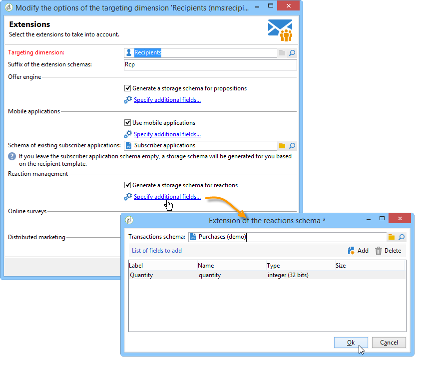

# 配置{#configuration}

本節內容適用於負責設定回應管理的人員。 它假定您對於擴展方案、定義工作流和SQL寫程式有一定的知識。

這可讓您瞭解如何將標準資料模型與Adobe Campaign外部交易表與個人表格的特定性調整。 此人員表格可與Adobe Campaign中可用人員表格或不同表格相符

測量假設由操作流程工作流啟動( **[!UICONTROL operationMgt]** )。 每個假設代表一個單獨的進程，以非同步方式與執行狀態（正在編輯、待定、完成、失敗等）執行並由調度器控制，調度器管理優先順序約束、同時處理的數量限制、低活動頁面和頻率自動執行。

## 配置結構 {#configuring-schemas}

>[!CAUTION]
>
>請勿修改應用程式的標準架構，而是使用架構擴充機制。 否則，修改的架構將不會在應用程式日後升級時更新。 這可能會在使用Adobe Campaign時導致錯誤。

在使用反應模組之前，需要應用程式整合，以定義要測量的各種表（事務、事務詳細資訊）及其與交付、選件和個人的關係。

### 標準結構 {#standard-schemas}

現成模式包含反 **[!UICONTROL nms:remaMatch]** 應日誌表，即個體、假設和事務表之間的關係。 此模式將用作反應日誌最終目標表的繼承模式。

此 **[!UICONTROL nms:remaMatchRcp]** 架構也是標準，它包含Adobe Campaign收件者()的反應記錄 **[!UICONTROL nms:recipient]** 檔儲存。 為了使用，需要將其擴展以映射到事務表（包含購買等）。

### 事務表和事務詳細資訊 {#transaction-tables-and-transaction-details}

事務表必須包括指向個人的直接連結。

您也可以新增包含交易詳細資料的表格。 這並非直接與個人連結。

以收款為例，事務處理表與聯繫人（收款表）連結，收款行表僅與收款表（明細表）連結。 然後，您可以直接在收款行表連結至收款表的層配置假設。

>[!NOTE]
>
>如果您想要保留描述假設中預期行為的接收識別碼，可以擴充nms:remaMatchRcp表範本，將識別碼新增至它（在此例中，沒有將ROI計算連結至這些欄位）。

強烈建議新增事件日期。

完成配置後，以下模式將顯示不同表之間的連接：


### 與Adobe Campaign收件者進行回應管理 {#response-management-with-adobe-campaign-recipients}

在此範例中，我們將使用Adobe Campaign收件者表格( **[!UICONTROL nms:recipient]** )，將購買表整合在回應管理模組中。

擴展收件者上的響應 **[!UICONTROL nms:remaMatchRcp]** 日誌表以添加到購買表模式的連結。 在下列範例中，購買表格稱為 **demo:purchase**。

1. 透過Adobe Campaign瀏覽器，選取 **[!UICONTROL Administration]** > **[!UICONTROL Campaign management]** > **[!UICONTROL Target mappings]**。
1. 以滑鼠右鍵按一 **下「收件者** 」，然後選 **[!UICONTROL Actions]** 取並執行 **[!UICONTROL Modify the options of the targeting dimensions]**。

   

1. 您可以在下一個 **[!UICONTROL Extension namespace]** 視窗中個人化，然後按一下 **[!UICONTROL Next]**。

   

1. 在類 **[!UICONTROL Response management]** 別中，請確定已選 **[!UICONTROL Generate a storage schema for reactions]** 中該框。

   然後單 **[!UICONTROL Define additional fields...]** 擊選擇相關事務表，並將所需欄位添加到nms:remaMatchRcp模式的擴展中。

   

建立的架構如下所示：

```
<srcSchema _cs="Reactions (Recipients) (cus)" entitySchema="xtk:srcSchema" extendedSchema="nms:remaMatchRcp" 
img="nms:remaMatch.png" implements="xtk:persist" label="Reactions (Recipients)" mappingType="sql"
name="remaMatchRcp" namespace="cus">  
 <element label="Reactions (Recipients)" name="remaMatchRcp">    
  <key internal="true" name="match">      
   <keyfield xlink="hypothesis"/>      
   <keyfield xlink="broadLog"/>      
   <keyfield xlink="proposition"/>    
  </key>    
  <attribute label="Quantity" name="quantity" type="long"/>    
  <element name="purchase" target="demo:purchase" type="link"/>    
  <element name="hypothesis" revLabel="Reactions (Recipients)" revLink="remaMatchRcp"/>    
  <element applicableIf="HasPackage('nms:coreInteraction')" label="Proposition" name="proposition" target="nms:propositionRcp" type="link"/>   
  <element desc="Message (Delivery log)" label="Message" name="broadLog" target="nms:broadLogRcp" type="link"/>    
  <element label="Respondent" name="responder" target="nms:recipient" type="link"/>  
 </element>  
 <createdBy _cs="Administrator (admin)"/>  
 <modifiedBy _cs="Administrator (admin)"/>
</srcSchema>
```

### 具有個性化接收表的響應管理 {#response-management-with-a-personalized-recipient-table}

在此範例中，我們將使用Adobe Campaign中可用之收件者表格以外的個人表格，將購買表格整合在回應管理模組中。

* 建立從架構派生的新響應日誌 **[!UICONTROL nms:remaMatch]** 架構。

   由於個人表格與Adobe Campaign收件者的表格不同，因此必鬚根據結構建立回應記錄檔的新結 **[!UICONTROL nms:remaMatch]** 構。 然後填入傳送記錄和購買表格的連結。

   在下列範例中，我們將使用 **demo:broadLogPers** 架構和 **** demo:purchase交易表：

   ```
   <srcSchema desc="Linking of a recipient transaction to a hypothesis"    
   img="nms:remaMatch.png" label="Responses on persons" labelSingular="Responses on a person" name="remaMatchPers" namespace="nms">
     <element name="remaMatchPers" template="nms:remaMatch">
       <key internal="true" name="match">
         <keyfield xlink="hypothesis"/>
        <keyfield xlink="purchase"/>
       </key>
   
       <element name="hypothesis" revLabel="Response logs for persons" revLink="remaMatchPers"/>
       <element applicableIf="HasPackage('nms:interaction')" label="Proposition" name="proposition"
                target="demo:propositionPers" type="link"/>
       <element label="Delivery log" name="broadLog" target="demo:broadLogPers" type="link"/>
     </element>
   </srcSchema>
   ```

* 修改方案中的假設 **[!UICONTROL nms:remaHypothesis]** 表單。

   依預設，回應記錄清單會顯示在收件者記錄檔中。 因此，您必須修改假設表單，才能檢視在上一步驟中建立的新回應記錄。

   例如：

   ```
    <container type="visibleGroup" visibleIf="[context/@remaMatchStorage]= 'demo:remaMatchPers'">
                 <input hideEditButtons="true" img="nms:remaMatch.png" nolabel="true" refresh="true"
                  toolbarCaption="Responses generated by the hypothesis" type="linklist"
                  xpath="remaMatchPers">
             <input xpath="[.]"/>
             <input xpath="@controlGroup"/>
           </input>
      </container> 
   ```

## 管理指標 {#managing-indicators}

「響應管理器」模組提供了預定義指示器的清單。 不過，您可以新增其他個人化測量指標。

為此，必須為每個新指示符插入兩個欄位來擴展假設表：

* 第一個是目標人群，
* 第二個是控制組。

例如：

```
<srcSchema entitySchema="xtk:srcSchema" extendedSchema="nms:remaHypothesis" label="Measurement hypothesis" 
md5="1D4DED54FF8EC2432AED6736EDE6F547" name="remaHypothesis" namespace="demo" xtkschema="xtk:srcSchema">  
    <element name="remaHypothesis">    
        <element name="indicators">      
            <!-- Quantity -->      
            <attribute label="Total contacted" name="contactReactedTotalQuantity" type="long"/>
            <attribute label="Total number of people in the control group" name="proofReactedTotalquantity" type="long"/> 
        </element> 
    </element>
</srcSchema>
```

