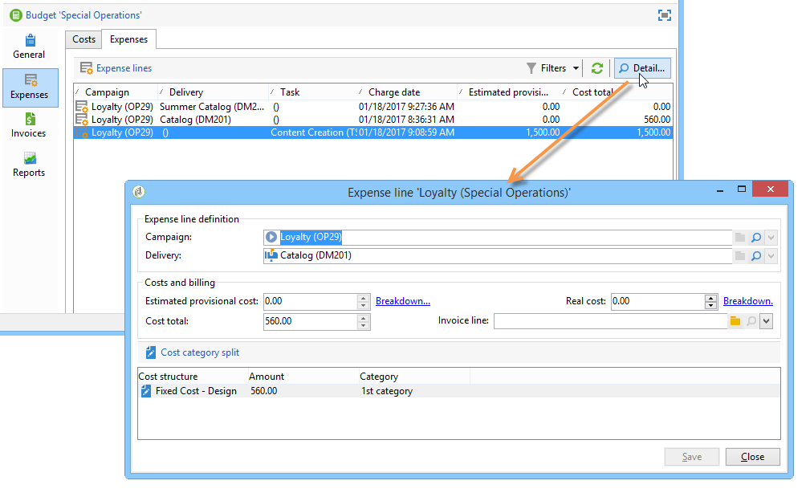
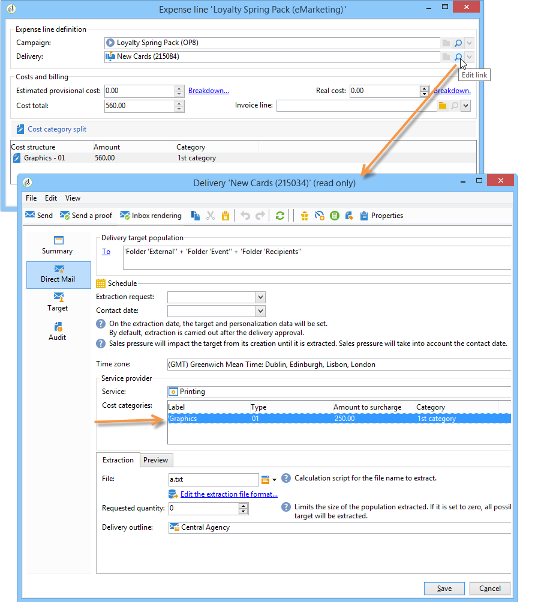
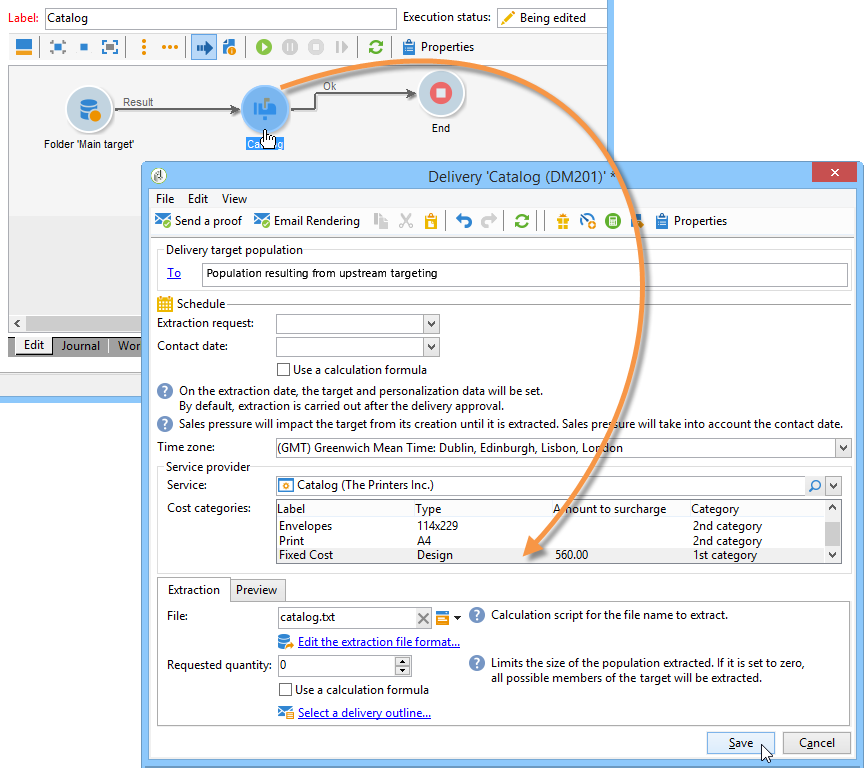

# 控制成本{#controlling-costs}

## 關於成本控制{#about-cost-control}

Adobe Campaign可讓您控制已排程、已承諾和已開票的行銷成本，並使用「行銷資源管理」模組依類別加以劃分。

促銷活動各個程式的承諾成本會計入行銷部門預先定義的預算。 這些金額可細分為幾個類別，讓資訊更易閱讀，並提供更詳細的行銷投資報告。

預算的管理與追蹤會集中在Adobe Campaign樹狀結構的專用節點中。 這可讓您從相同檢視和所有預算監控已分配、保留、已承諾和支出的金額。

使用MRM實施預算管理時，必須應用以下步驟：

1. 定義預算

   有關詳細資訊，請參閱[建立預算](#creating-a-budget)。

1. 定義成本計算方法

   為服務提供商定義成本結構。 請參閱[建立服務提供商及其成本類別](../../campaign/using/providers--stocks-and-budgets.md#creating-a-service-provider-and-its-cost-categories)。

1. 定義促銷活動成本（傳送／任務）

   傳送和任務所產生的成本會個別或全域輸入促銷活動範本。 請參閱[成本和庫存計算](../../campaign/using/marketing-campaign-deliveries.md#calculation-of-costs-and-stocks)。

1. 整合

   根據任務、交貨和促銷活動的進度狀態，將計算成本並傳遞至相應的預算。

   當建立促銷活動足夠進階時，促銷活動預算的進度狀態可變更為&#x200B;**[!UICONTROL Specified]**。 然後，系統會自動輸入程式的計算成本，並使用促銷活動上計算的成本。 請參閱[成本承諾、計算和計費](#cost-commitment--calculation-and-charging)。

## 建立預算{#creating-a-budget}

預算是通過&#x200B;**[!UICONTROL Campaign management > Budgets]**&#x200B;節點在映射中建立的。 工具列中的&#x200B;**[!UICONTROL New]**&#x200B;按鈕可讓您建立預算。

* 新增預算

   按一下&#x200B;**[!UICONTROL New]**&#x200B;圖示，命名並儲存預算。

* 輸入初始金額

   在相關欄位中指明分配金額。 系統會自動輸入其他金額。 請參閱[計算金額](#calculating-amounts)。

* 定義有效期

   指定開始和結束日期。 這項資訊僅能說明問題。

* 費用

   為促銷活動、任務等建立分配給此預算的成本類別。 可連結。 請參閱[費用類別](#expense-categories)。

   

>[!NOTE]
>
>您可以選擇相關預算。
>
>有關詳細資訊，請參閱[將預算連結到另一個](#linking-a-budget-to-another)。

### 計算金額{#calculating-amounts}

每個預算都由初始金額定義，在計畫或執行各種促銷活動、傳送或與之相關的任務後，這些金額將從其相關的成本中減少。 金額的狀態（已計畫、已保留、已承諾、已用或已開票）取決於成本類型和促銷活動、交付或任務中定義的承付款級別。

>[!NOTE]
>
>為類別輸入的金額必須與&#x200B;**[!UICONTROL Allocated]**&#x200B;欄位中定義的預算封套相符。

對於促銷活動，可根據承諾程度來規劃、承諾或預留成本，以供未來行動使用。

>[!CAUTION]
>
>在建立促銷活動時，**[!UICONTROL Budget]**&#x200B;中的進度狀態必須設定為&#x200B;**[!UICONTROL Defined]**，以便在執行時考慮成本。 如果狀態為&#x200B;**[!UICONTROL Being edited]**，則不合併成本。
>   
>選項&#x200B;**[!UICONTROL Commitment level]**&#x200B;代表在將費用列入預算之前對未來費用的預測。 根據促銷活動、任務或傳送的進度，您可以決定指派較高或較低的承諾層級(1)。 計畫，2. 保留，3。 已提交)。

例如，Web促銷活動的預計計畫成本為45,000歐元。

對於促銷活動，當預算建立狀態設為&#x200B;**[!UICONTROL Defined]**&#x200B;時，促銷活動的實際成本（若無，則計算成本）將轉入預算總計。

根據促銷活動預算的承付金額，金額將輸入到&#x200B;**[!UICONTROL Planned]**、**[!UICONTROL Reserved]**&#x200B;或&#x200B;**[!UICONTROL Committed]**&#x200B;欄位中。

承諾級別可以修改：

* 在&#x200B;**campaign**&#x200B;層級中，在&#x200B;**[!UICONTROL Edit]**&#x200B;標籤中的&#x200B;**[!UICONTROL Budget]**&#x200B;視窗中。 在此設定預算、成本和費用。
* 在&#x200B;**tasks**&#x200B;級別中，在&#x200B;**[!UICONTROL Expenses and revenues]**&#x200B;窗口中。

當預算為&#x200B;**[!UICONTROL Reserved]**&#x200B;時，系統會自動為已收費的預算執行更新。

在任務級別上，過程是相同的。

當支出產生髮票並支付發票時，其金額隨後將輸入到&#x200B;**[!UICONTROL Invoiced]**&#x200B;欄位中。

### 費用類別{#expense-categories}

這些金額可以分發到數種費用類別，以便更容易辨識資料，並更詳細地報告行銷投資。 費用類別是在預算建立期間通過樹的&#x200B;**[!UICONTROL Budgets]**&#x200B;節點定義的。

若要新增類別，請按一下視窗下方區段中的&#x200B;**[!UICONTROL Add]**&#x200B;按鈕。

您可以從現有類別中選擇類別，或直接在欄位中輸入新類別以定義新類別。 當您確認輸入時，會出現確認訊息，讓您將此類別新增至現有類別清單，並視需要將其與「性質」建立關聯。 此資訊將用於預算報表。

### 將預算連結到另一個{#linking-a-budget-to-another}

您可以將預算連結至主要預算。 要執行此操作，請在輔助預算的&#x200B;**[!UICONTROL related budget]**&#x200B;欄位中選擇主預算。

主預算中將添加一個附加標籤以顯示相關預算清單。

這些資訊會轉存至預算報表。

## 添加費用行{#adding-expense-lines}

費用行會自動添加到預算中。 它們是在交付分析期間和任務完成時建立的。

對於每個促銷活動、交貨或任務，生成的成本將分組到預算的費用行中，這些費用將計入預算的費用行中。 這些費用行是根據相關服務提供商的成本行建立的，並通過相關的成本結構計算。

因此，每個費用行包含以下資訊：

* 促銷活動及其相關的傳送或任務
* 根據成本結構或估計臨時成本計算之金額
* 交付或相關任務的實際成本
* 對應的發票行（僅限MRM）
* 按成本類別計算的成本清單（如果存在成本結構）

在上述範例中，編輯的費用行包含&#x200B;**Loyalty Spring Pack**&#x200B;促銷活動的&lt;a0/>New cards **傳送所計算的成本。**&#x200B;編輯傳送時，**[!UICONTROL Direct Mail]**&#x200B;標籤可讓您查看費用行的計算方式。

此交付的成本計算基於為有關服務提供商選擇的成本類別：

根據選擇的成本類別，應用相應的成本結構以計算成本行。 在此示例中，對於相關服務提供商，成本結構如下：

>[!NOTE]
>
>成本類別和結構在[建立服務提供商及其成本類別](../../campaign/using/providers--stocks-and-budgets.md#creating-a-service-provider-and-its-cost-categories)中顯示。

## 成本承諾、計算和收費{#cost-commitment--calculation-and-charging}

可以提交交貨和任務的成本。 根據與其相關的過程的進度，更新成本的狀態。

### 成本計算過程{#cost-calculation-process}

成本分為三類：

1. 估計臨時費用

   估計臨時費用是宣傳活動過程費用的估計。 只要正在編輯，輸入的金額就不會合併。 它必須具有&#x200B;**[!UICONTROL Specified]**&#x200B;狀態，才能在計算中考慮輸入的金額。

   此金額是人工輸入的，可以細分為幾個費用類別。 要降低成本，請按一下&#x200B;**[!UICONTROL Breakdown...]**&#x200B;連結，然後按一下&#x200B;**[!UICONTROL Add]**&#x200B;按鈕以定義新金額。

   

   您可以將每個成本與某個類別關聯，以便以後在相關預算和預算報表中查看按費用類別列出的成本細分。

1. 計算成本

   計算的成本取決於相關元素（促銷活動、傳送、任務等） 及其狀態（正在編輯、進行中、完成）。 無論如何，如果指定了實際成本，計算成本將使用此金額。

   如果未提供實際成本，則適用下列規則：

   * 對於正在編輯的促銷活動，計算成本是促銷活動的估計臨時成本，如果未定義此成本，則計算成本將是促銷活動傳送和任務的所有臨時成本的總和。 如果促銷活動完成，促銷活動的計算成本將是所有計算成本的總和。
   * 對於尚未分析的交付，計算成本為估計臨時成本。 如果已執行分析，則計算的成本將是從服務中計算的所有成本的總和，這些成本將提供成本結構和目標接收者的數量。
   * 對於進行中的任務，計算成本使用估計臨時成本。 如果任務完成，計算的成本將是從服務提供商成本結構計算的所有成本和完成天數的總和。
   * 對於行銷計畫，對於方案，計算的成本是為促銷活動計算的成本總和。 若未指定該等成本，則計算成本將使用估計臨時成本。

   >[!NOTE]
   >
   >**[!UICONTROL Breakdown]**&#x200B;連結可讓您檢視計算的詳細資料和最後的成本計算日期。

1. 實際成本

   實際成本是人工輸入，並視需要細分為不同的費用類別。

### 計算和計費{#calculation-and-charging}

成本是透過成本結構計算，並計入相關促銷活動、傳送或任務中選取的預算。

您可以透過預算核准，對提交至促銷活動的金額執行檢查。 您可以在促銷活動中建立其他查核點樣式的工作，以設定其他核准。 請參閱[任務類型](../../campaign/using/creating-and-managing-tasks.md#types-of-task)。

### 範例 {#example}

我們將建立促銷活動，其中包含：

* 使用服務提供商的成本結構的直接郵件發送
* 具有固定成本的任務
* 具有每日成本的任務

#### 步驟1 —— 建立預算{#step-1---creating-the-budget}

1. 通過&#x200B;**[!UICONTROL Campaign management > Budgets]**&#x200B;節點建立新預算。

1. 在&#x200B;**[!UICONTROL Amounts]**&#x200B;節的&#x200B;**[!UICONTROL Allocated]**&#x200B;欄位中定義10,000歐元的預算。 在窗口的下部添加兩個費用類別：

#### 步驟2 —— 配置服務提供商並定義成本結構{#step-2---configuring-the-service-provider-and-defining-the-cost-structures}

1. 從&#x200B;**[!UICONTROL Administration > Campaigns]**&#x200B;節點建立具有其成本結構的服務提供商和服務模板。 有關詳細資訊，請參閱[建立服務提供商及其成本類別](../../campaign/using/providers--stocks-and-budgets.md#creating-a-service-provider-and-its-cost-categories)。

   對於直接郵件遞送，請建立成本類別&#x200B;**[!UICONTROL Envelopes]**（類型114x229和162x229）、**[!UICONTROL Postage]**&#x200B;和&#x200B;**[!UICONTROL Print]**（類型A3和A4）。 然後建立以下成本結構：

   

1. 添加固定成本（在成本類別中），其計算是固定的，其金額為空（在相應的成本結構中），並且將為每個交貨單獨指定。

   

   對於任務，請建立以下兩個成本類別：

   * **[!UICONTROL Room reservation]** （小房間和大房間），固定 **** 成本結構為300和500歐元：

   

   * **[!UICONTROL Creation]** (內&#x200B;**容** 範本類型)，日 **** 費結構為300歐元：

   

#### 步驟3 —— 在促銷活動中計算預算{#step-3---charging-the-budget-in-the-campaign}

1. 建立促銷活動並選取在步驟1中建立的預算。

   >[!NOTE]
   >
   >預設情況下，為方案選擇的預算將應用於方案中的所有促銷活動。

   

1. 指定估計的臨時成本，並細分：

   

1. 按一下&#x200B;**[!UICONTROL Ok]** ，然後按一下&#x200B;**[!UICONTROL Save]**&#x200B;確認此資訊。 然後，促銷活動的計算成本會更新為估計的臨時成本。

#### 步驟4 —— 建立直接郵件發送{#step-4---creating-the-direct-mail-delivery}

1. 為促銷活動建立工作流程，並定位查詢活動以選取目標（警告，必須指定收件者的郵遞區號）。

1. 建立直接郵件發送，並選擇在步驟2中建立的服務提供商：成本類別會自動顯示。

1. 改寫封套的成本並添加固定成本。 另外，還要選擇與這些成本有關的類別。

   

   >[!NOTE]
   >
   >如果未使用任何成本類別，則不會產生任何費用。

1. 啟動您剛建立的工作流程，以啟動分析並計算成本。

   

1. 如果此促銷活動已啟用預算核准，請從控制面板核准預算。 您可以檢查成本類別的批准。

   

有關傳送的費用行會新增至促銷活動的&#x200B;**[!UICONTROL Edit > Budget]**&#x200B;標籤。 編輯它以查看計算的詳細資訊。

傳送的計算成本會以下列資訊更新：

在編輯計算成本時，您可以檢查成本細分以及成本計算的狀態和日期。

#### 步驟5 —— 建立任務{#step-5---creating-tasks}

在此促銷活動中，我們將添加以前建立成本結構的兩個任務（請參閱[步驟2 —— 配置服務提供商和定義成本結構](#step-2---configuring-the-service-provider-and-defining-the-cost-structures)）。 若要這麼做，請在促銷活動控制面板中按一下&#x200B;**[!UICONTROL Add a task]**&#x200B;按鈕。 命名任務並按一下&#x200B;**[!UICONTROL Save]**。

1. 然後，任務將添加到任務清單中。 您必須編輯它才能進行設定。

1. 在&#x200B;**[!UICONTROL Properties]**&#x200B;標籤中，選擇服務和相應的成本類別：

   

1. 接著，按一下工作的&#x200B;**[!UICONTROL Expenses and revenue]**&#x200B;圖示，並指定預估的臨時成本。

   

   在保存任務後，將指定計算成本，並輸入估計臨時成本的值。

   當任務完成（狀態&#x200B;**[!UICONTROL Finished]**）時，計算的成本將自動更新為在其成本結構中輸入的大房間成本。 此成本也會出現在劃分的此類別中。

1. 其次，按照相同的程式建立第二個任務；排程超過5天，且與先前建立的成本結構有關。

   

   完成任務後，計算成本將使用相關成本結構中的值指定，即在我們的示例中為1500歐元（5天x 300歐元）:

   

#### 步驟6 —— 更新促銷活動預算狀態{#step-6---update-the-campaign-budget-status}

設定促銷活動後，可將其狀態設為&#x200B;**[!UICONTROL Specified]**&#x200B;即可更新。 然後，促銷活動的計算成本會指出傳送的計算成本與促銷活動任務的總和：

#### 預算核准{#budget-approval}

在啟用核準時，特殊連結可讓您從促銷活動控制面板核准預算。 此連結會在啟動定位工作流程且需要核准直接郵件傳送時顯示。

然後，您可以按一下連結以授與或拒絕核准，或是在此促銷活動已啟動通知時，使用通知電子郵件中的連結。

當預算獲得核准並交付完成時，成本會透過特殊的技術工作流程自動上傳。

## 訂單和發票{#orders-and-invoices}

在MRM中，您可以向服務提供商保存訂單並開具發票。 這些訂單和發票的整個生命週期都可透過Adobe Campaign介面進行管理。

### 訂單建立{#order-creation}

要向服務提供商保存新訂單，請按一下樹的&#x200B;**[!UICONTROL MRM > Orders]**&#x200B;節點，然後按一下&#x200B;**[!UICONTROL New]**&#x200B;按鈕。

指定訂單編號、相關服務提供者，以及訂單的總金額。

### 簽發和跟蹤發票{#issuing-and-tracking-invoices}

對於每個服務提供商，您可以保存發票並定義其狀態和所收取的預算。

發票會建立並儲存在Adobe Campaign樹狀結構的&#x200B;**[!UICONTROL MRM > Invoices]**&#x200B;節點中。

發票由發票行組成，發票行的總額允許自動計算金額。 這些行是從&#x200B;**[!UICONTROL Invoice lines]**&#x200B;頁籤手動建立的。 它們可與訂單關聯，以便將資訊上傳至訂單。

每個服務提供商的發票顯示在配置檔案的&#x200B;**[!UICONTROL Invoices]**&#x200B;標籤中：

**[!UICONTROL Details]**&#x200B;標籤可讓您顯示發票的內容。

按一下&#x200B;**[!UICONTROL Add]**&#x200B;以建立新發票。
