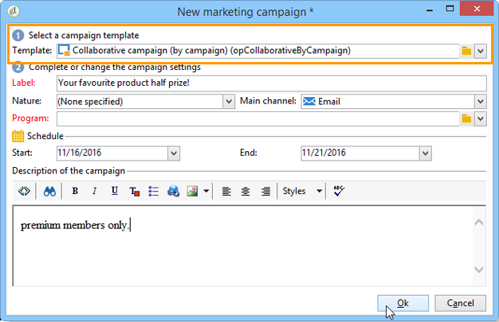

# 建立協作行銷活動{#creating-a-collaborative-campaign-intro}

中央實體從&#x200B;**Distributed Marketing**&#x200B;促銷活動範本建立協作促銷活動。 請參見[此頁面](../../campaign/using/about-distributed-marketing.md#collaborative-campaign)。

## 建立協作行銷活動 {#creating-a-collaborative-campaign}

若要設定協作促銷活動，請按一下&#x200B;**[!UICONTROL Campaign management > Campaigns]**&#x200B;節點，然後按一下&#x200B;**[!UICONTROL New]**&#x200B;圖示。

>[!NOTE]
>
>除了&#x200B;**[!UICONTROL collaborative campaigns (by campaign)]**，這些促銷活動可透過Web介面進行設定和執行。

協作促銷活動資料庫的設定程式與本機促銷活動範本的設定程式類似。 以下詳述不同類型的協作促銷活動的規格。

### 按格式{#by-form}

若要建立協作促銷活動（依表單），必須選取&#x200B;**[!UICONTROL Collaborative campaign (by form)]**&#x200B;範本。

在&#x200B;**[!UICONTROL Edit]**&#x200B;標籤中，按一下&#x200B;**[!UICONTROL Advanced campaign settings...]**&#x200B;連結以存取&#x200B;**Distributed Marketing**&#x200B;標籤。

選擇&#x200B;**By form** web interface。 此類型的介面可讓您建立個人化欄位，供本機實體在訂購促銷活動時使用。 請參閱[建立本機促銷活動（依表單）](../../campaign/using/examples.md#creating-a-local-campaign--by-form-)。

儲存促銷活動。 您現在可以從&#x200B;**促銷活動**&#x200B;標籤中的&#x200B;**促銷活動套件**&#x200B;檢視，按一下&#x200B;**[!UICONTROL Create]**&#x200B;按鈕來使用它。

**[!UICONTROL Campaign Package]**&#x200B;檢視可讓您使用本機促銷活動範本（現成或複製），以及參考協作促銷活動的促銷活動，以建立不同組織實體的促銷活動。

### 依促銷活動{#by-campaign}

若要建立協作促銷活動（依促銷活動），必須選取&#x200B;**[!UICONTROL Collaborative campaign (by campaign) (opCollaborativeByCampaign)]**&#x200B;範本。

在排序促銷活動時，本機實體可以完成由中央實體預先定義的條件，並在排序前先評估促銷活動。

當&#x200B;**協作促銷活動（依促銷活動）**&#x200B;的訂單獲得中央實體核准後，就會為本機實體建立子促銷活動。 當本機實體可供使用後，便可修改：

* 促銷活動工作流程，
* 排版規則，
* 個人化領域。

本機實體會執行子促銷活動。 中央實體會執行父促銷活動。

中央實體可從此控制面板（透過&#x200B;**[!UICONTROL List of associated campaigns]**&#x200B;連結）檢視與&#x200B;**協作促銷活動（依促銷活動）**&#x200B;連結的所有子促銷活動。

### 按目標批准{#by-target-approval}

若要建立協作促銷活動（透過目標核准），必須選取&#x200B;**[!UICONTROL Collaborative campaign (by target approval)]**&#x200B;範本。

>[!NOTE]
>
>在此模式中，中央實體不需要指定本地實體。

促銷活動工作流程必須整合&#x200B;**本機核准**&#x200B;類型活動。 活動參數如下：

* **[!UICONTROL Action to perform]** :定位核准通知。
* **[!UICONTROL Distribution context]** :明確。
* **[!UICONTROL Data distribution]** :本機實體散發。

**必須建立** 本地實體分發類型資料分發。資料分發範本可讓您限制群組值清單中的記錄數。 在&#x200B;**[!UICONTROL Resources > Campaign management > Data distribution]**&#x200B;中，按一下&#x200B;**[!UICONTROL New]**&#x200B;表徵圖以建立新的&#x200B;**[!UICONTROL Data distribution]**。 有關資料分發的詳細資訊，請參閱[ Workflows](../../workflow/using/using-the-local-approval-activity.md#step-1--creating-the-data-distribution-template-)指南。

選擇&#x200B;**定位維**&#x200B;和&#x200B;**[!UICONTROL Distribution field]**。 對於&#x200B;**[!UICONTROL Assignment type]**，選擇&#x200B;**本地實體**。

在&#x200B;**[!UICONTROL Distribution]**&#x200B;標籤中，為每個本機實體新增欄位並指定值。

您可以在&#x200B;**Delivery**&#x200B;類型活動之後新增第二個&#x200B;**Target approval**，以設定報表。

在促銷活動建立通知訊息中，本機實體接收由中央實體參數預先定義的連絡人清單。

本機實體可以根據促銷活動內容刪除某些連絡人。

### 簡單{#simple}

若要建立簡單的協作促銷活動，必須選取&#x200B;**[!UICONTROL Collaborative campaign (simple)]**&#x200B;範本。

## 建立協作促銷活動套件{#creating-a-collaborative-campaign-package}

若要讓促銷活動可供本機實體使用，中央實體必須建立促銷活動套件。

應用以下步驟：

1. 在&#x200B;**促銷活動**&#x200B;頁面的&#x200B;**[!UICONTROL Navigation]**&#x200B;區段中，按一下&#x200B;**[!UICONTROL Campaign packages]**&#x200B;連結。
1. 按一下 **[!UICONTROL Create]** 按鈕。
1. 窗口頂部的部分允許您選擇&#x200B;**[!UICONTROL New collaborative package (mutualizedEmpty)]**&#x200B;模板。
1. 選取參考促銷活動。
1. 指定促銷活動套件的標籤、資料夾和執行排程。

### 日期 {#dates}

開始和結束日期會定義促銷活動套件清單中促銷活動的可見性時段。

對於&#x200B;**協作促銷活動**，中央實體必須指定註冊和個人化期限。

>[!NOTE]
>
>**[!UICONTROL Personalization deadline]**&#x200B;可讓中央實體選擇當地實體必須交付檔案（試算表、影像）以用於設定促銷活動的截止日期。 這不是強制性選項。 側移此日期不會影響促銷活動實作。

### 閱聽眾 {#audience}

當建立協作促銷活動時，中央實體必須指定每個促銷活動涉及的本地實體。

>[!CAUTION]
>
>**[!UICONTROL Simple, by form and by campaign collaborative campaign kits]** 須當地相關單位指定後方可核准。

### 批准模式{#approval-modes}

對於&#x200B;**協作促銷活動**，您可以指定訂單核准模式。

在手動模式中，本機實體需要訂閱促銷活動才能參與。

在自動模式中，本機實體會預先訂閱促銷活動。 它可以取消促銷活動訂閱或修改其參數，而不需要中央實體的核准。

### 通知{#notifications}

通知的設定與本機實體的通知相同。 請參閱[本區段](../../campaign/using/creating-a-local-campaign.md#notifications)。

## 排序促銷活動{#ordering-a-campaign}

當將協作促銷活動新增至促銷活動套件清單時，通知屬於由中央實體定義的對象的本機實體(**協作促銷活動（透過目標核准）**&#x200B;沒有預先定義的對象)。 傳送的訊息包含可讓您註冊促銷活動的連結，如下所示：

此訊息也可讓本機實體檢視建立套件的中央運算子所輸入的說明，以及連結至促銷活動的檔案。 這些項目不屬於促銷活動本身，不過它們會提供其他相關資訊。

當本機營運商透過網頁介面登入後，就可以輸入個人化資訊給他們想要訂購的協作促銷活動：

當地實體完成註冊後，會以電子郵件通知中央實體核准其訂單。

有關詳細資訊，請參閱[批准進程](../../campaign/using/creating-a-local-campaign.md#approval-process)部分。

## 批准訂單{#approving-an-order}

核准協作促銷活動套件訂單的程式與核准本機促銷活動的程式相同。 請參閱[本區段](../../campaign/using/creating-a-local-campaign.md#approving-an-order)。
