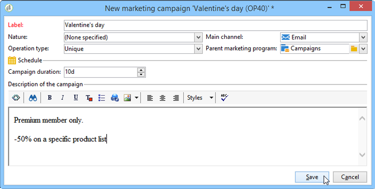

# 建立本機行銷活動{#creating-a-local-campaign}

本機促銷活動是從&#x200B;**[!UICONTROL campaign packages]**&#x200B;清單中引用的範本，以&#x200B;**特定執行排程**&#x200B;建立的例項。 其目標是使用由中央實體設定和設定的促銷活動範本，來滿足本端通訊需求。 實施本地操作的主要步驟如下：

**對於中央實體**

1. 建立本機促銷活動範本。
1. 從範本建立促銷活動套件。
1. 發佈促銷活動套件。
1. 批准訂單。

**對於本地實體**

1. 排序促銷活動。
1. 執行促銷活動。

## 建立本機促銷活動範本{#creating-a-local-campaign-template}

若要建立促銷活動套件，您必須先透過&#x200B;**[!UICONTROL Resources > Templates]**&#x200B;節點建立&#x200B;**促銷活動範本**。

要建立新的本地模板，請複製預設的&#x200B;**[!UICONTROL Local campaign (opLocal)]**&#x200B;模板。

為促銷活動範本命名並填寫可用欄位。

在促銷活動視窗中，按一下&#x200B;**[!UICONTROL Edit]**&#x200B;標籤，然後按一下&#x200B;**[!UICONTROL Advanced campaign settings...]**&#x200B;連結。

### Web介面{#web-interface}

在&#x200B;**Distributed Marketing**&#x200B;標籤中，您可以選擇Web介面類型，並指定當本機實體下訂單時要輸入的預設值和參數。

Web介面對應於當排序促銷活動時，由本機實體填入的表單。

選取要套用至從範本建立之促銷活動的網頁介面類型：

可用的Web介面有四種類型：

* **[!UICONTROL By brief]** :本機實體必須提供描述促銷活動設定的說明。訂單核准後，中央實體會整體設定並執行促銷活動。

   

* **[!UICONTROL By form]** :本機實體可存取Web表格，可依使用的範本，編輯內容、目標、最大大小，以及使用個人化欄位建立和擷取日期。本機實體可評估目標，並從此Web表單預覽內容。

   

   提供的表單是在Web應用程式中指定的，必須從範本&#x200B;**[!UICONTROL Advanced campaign settings...]**&#x200B;連結的&#x200B;**[!UICONTROL web Interface]**&#x200B;欄位的下拉式清單中選取。 請參閱[建立本機促銷活動（依表單）](../../campaign/using/examples.md#creating-a-local-campaign--by-form-)。

   >[!NOTE]
   >
   >此範例中使用的Web應用程式為範例。 您必須建立特定的網頁應用程式才能使用表單。 請參閱[API](../../configuration/using/about-web-services.md)。

   

* **[!UICONTROL By external form]** :本地實體可以訪問其外聯網(非Adobe Campaign)中的促銷活動參數。這些參數與&#x200B;**本機促銷活動（依形式）**&#x200B;的參數相同。
* **[!UICONTROL Pre-set]** :本機實體使用預設表單來訂購促銷活動，而不進行本地化。

   

### 預設值{#default-values}

選擇要由本地實體完成的&#x200B;**[!UICONTROL Default values]**。 例如：

* 聯絡和提取日期，
* 目標特徵（年齡段等）。

填寫&#x200B;**[!UICONTROL Parent marketing program]**&#x200B;和&#x200B;**[!UICONTROL Charge]**&#x200B;欄位。

### 批准{#approvals}

在&#x200B;**[!UICONTROL Advanced parameters for campaign entry]**&#x200B;連結中，您可以指定審核者人數上限。

訂購促銷活動時，本機實體會輸入審核者。

如果您不想為促銷活動的審核者命名，請輸入0。

### 檔案{#documents}

您可以允許本機實體運算子連結檔案（文字檔案、試算表、影像、促銷活動說明等） 至本機促銷活動。 **[!UICONTROL Advanced parameters for campaign entry...]**&#x200B;連結可讓您限制檔案數量。 若要這麼做，只需在&#x200B;**[!UICONTROL Number of documents]**&#x200B;欄位中輸入允許的最大數目。

在訂購促銷活動套件時，表單建議連結的檔案數量與範本中對應欄位中所指出的相同。

如果不希望顯示文檔上載欄位，請在&#x200B;**[!UICONTROL Number of documents]**&#x200B;欄位中輸入&#x200B;**[!UICONTROL 0]**。

>[!NOTE]
>
>可通過選中&#x200B;**[!UICONTROL Do not display the page used to enter the campaign parameters]**&#x200B;來禁用&#x200B;**[!UICONTROL Advanced parameters for campaign entry]**。

### 工作流程{#workflow}

在&#x200B;**[!UICONTROL Targeting and workflows]**&#x200B;標籤中，建立收集&#x200B;**[!UICONTROL Advanced campaign settings...]**&#x200B;中指定之&#x200B;**[!UICONTROL Default values]**&#x200B;的促銷活動工作流程，並建立傳送。

連按兩下&#x200B;**[!UICONTROL Query]**&#x200B;活動，根據指定的&#x200B;**[!UICONTROL Default values]**&#x200B;進行設定。

### 傳送 {#delivery}

在&#x200B;**[!UICONTROL Audit]**&#x200B;標籤中，按一下&#x200B;**[!UICONTROL Detail...]**&#x200B;圖示以檢視所選傳送的&#x200B;**[!UICONTROL Scheduling]**。

**[!UICONTROL Scheduling]**&#x200B;圖示可讓您設定傳送的連絡與執行日期。

如有必要，請設定傳送的最大大小：

找出您傳送的HTML。 例如，在&#x200B;**[!UICONTROL Delivery > Current order > Additional fields]**&#x200B;中，使用&#x200B;**[!UICONTROL Age segment]**&#x200B;欄位根據目標年齡來定位傳送。

儲存促銷活動範本。 您現在可以從&#x200B;**[!UICONTROL Campaigns]**&#x200B;標籤中的&#x200B;**[!UICONTROL Campaign packages]**&#x200B;檢視，按一下&#x200B;**[!UICONTROL Create]**&#x200B;按鈕來使用它。

>[!NOTE]
>
>[促銷活動範本](../../campaign/using/marketing-campaign-templates.md#campaign-templates)會詳細說明促銷活動範本及其一般設定。

## 建立促銷活動套件{#creating-the-campaign-package}

若要讓促銷活動範本可供本機實體使用，它必須新增至清單。 為此，中央機構需要建立新套件。

應用以下步驟：

1. 在&#x200B;**促銷活動**&#x200B;頁面的&#x200B;**[!UICONTROL Navigation]**&#x200B;區段中，按一下&#x200B;**[!UICONTROL Campaign packages]**&#x200B;連結。
1. 按一下 **[!UICONTROL Create]** 按鈕。

   

1. 視窗上方的區段可讓您選取[先前](#creating-a-local-campaign-template)指定的促銷活動套件範本。

   依預設，**[!UICONTROL New local campaign package (localEmpty)]**&#x200B;範本會用於本機促銷活動。

1. 指定促銷活動套件的標籤、資料夾和執行排程。

### 日期 {#dates}

開始和結束日期會定義促銷活動套件清單中促銷活動的可見性時段。

可用日期是促銷活動可供本機實體（依訂單）使用的日期。

>[!CAUTION]
>
>如果本機實體未在截止日期之前保留促銷活動，將無法使用。

這些資訊會在傳送給本機代理商的通知訊息中找到，如下所示：

### 閱聽眾 {#audience}

對於本機促銷活動，中央實體可以勾選&#x200B;**[!UICONTROL Limit the package to a set of local entities]**&#x200B;來指定所涉及的本機實體。

### 其他設定{#additional-settings}

保存包後，中央實體可以從&#x200B;**[!UICONTROL Edit]**&#x200B;頁籤中編輯它。

在&#x200B;**[!UICONTROL General]**&#x200B;標籤中，中央實體可以：

* 從&#x200B;**[!UICONTROL Approval parameters...]**&#x200B;連結設定促銷活動套件審核者，
* 查看執行計畫，
* 添加或刪除本地實體。

>[!NOTE]
>
>依預設，每個實體只能訂購一次&#x200B;**本機促銷活動**。
>   
>勾選&#x200B;**[!UICONTROL Enable multiple creation]**&#x200B;選項，允許從促銷活動套件建立數個本機促銷活動。

### 通知{#notifications}

當促銷活動可供使用或達到註冊截止日期時，會傳送訊息給本機通知群組的運算子。 有關詳細資訊，請參閱[組織實體](../../campaign/using/about-distributed-marketing.md#organizational-entities)。

## 排序促銷活動{#ordering-a-campaign}

促銷活動套件一旦獲得核准並開始實施，便可供本機實體存取。 本機實體會收到電子郵件，告知他們有新的促銷活動套件可供使用（一旦到達其可用日期）。

>[!NOTE]
>
>如果在建立促銷活動套件時已指定某些本機實體，則只有這些實體會收到通知。 如果未指定本機實體，所有本機實體都會收到通知。

若要使用中央實體提供的促銷活動，本機實體必須對其進行訂購。

要訂購促銷活動，請執行以下操作：

1. 在通知訊息中按一下&#x200B;**[!UICONTROL Order campaign]**，或在Adobe Campaign按一下對應的按鈕。

   輸入您的ID和密碼以訂購促銷活動。 介面由Web應用程式中定義的一組頁面組成。

   >[!NOTE]
   >
   >Web應用程式在[本節](../../web/using/about-web-applications.md)中有詳細說明。

1. 在第一頁（訂單標籤和注釋）中輸入必要的資訊，然後按一下&#x200B;**[!UICONTROL Next]**。

   

1. 完成可用參數並核准訂單。

1. 系統會傳送通知給當地實體所屬的組織實體經理，以核准此訂單。

   

1. 資訊會傳回給當地和中央實體。 雖然本地實體只能查看自己的訂單，但中央實體可以按任何本地實體查看所有訂單，如下所示：

   

   營運商可以顯示訂單詳細資訊：

   

   **[!UICONTROL Edit]**&#x200B;標籤包含本機實體在排序促銷活動時輸入的資訊。

   

1. 訂單必須經中央實體核准才能完成。

   

   有關詳細資訊，請參閱[批准進程](#approval-process)部分。

1. 接著會通知本機運算子促銷活動可用：促銷活動可用性可在&#x200B;**促銷活動**&#x200B;標籤中的促銷活動套件清單中找到。 然後可使用促銷活動。 如需詳細資訊，請參閱[存取促銷活動](../../campaign/using/accessing-campaigns.md)。

   **[!UICONTROL Start targeting with order approval]**&#x200B;選項可讓本機實體在訂單核准後立即執行促銷活動。

   

## 批准訂單{#approving-an-order}

若要確認促銷活動訂單，中央實體必須核准該訂單。

透過&#x200B;**促銷活動**&#x200B;標籤存取的&#x200B;**[!UICONTROL Campaign orders]**&#x200B;概觀可讓您檢視促銷活動訂單的狀態並加以核准。

>[!NOTE]
>
>本地實體可以更改訂單，直到其獲得批准。

### 核准程式{#approval-process}

#### 電子郵件通知{#email-notification}

當促銷活動由本機實體排序時，其審核者會以電子郵件通知，如下所示：

>[!NOTE]
>
>在[Reviewers](#reviewers)區段中會顯示選擇審核者的內容。 他們可以接受或拒絕訂單。

#### 通過Adobe Campaign控制台{#approving-via-the-adobe-campaign-console}批准

訂單也可透過主控台核准，位於促銷活動訂單總覽中。 要批准訂單，請選擇該訂單並按一下&#x200B;**[!UICONTROL Approve the order]**。

>[!NOTE]
>
>在促銷活動可用日期之前，仍可編輯和重新設定促銷活動。 本機實體也可以按一下&#x200B;**[!UICONTROL Cancel]**&#x200B;按鈕來拒絕促銷活動。

#### 建立行銷活動 {#creating-a-campaign}

一旦核准促銷活動訂單後，可由本機實體設定並執行。

如需詳細資訊，請參閱[存取促銷活動](../../campaign/using/accessing-campaigns.md)。

### 拒絕批准{#rejecting-an-approval}

負責核准的營運商可以拒絕訂單或促銷活動套件。

如果審核者拒絕訂單，則相關通知會自動發送給相關的本地實體：它顯示由操作員輸入的拒絕批准的注釋。

資訊會顯示在促銷活動套件的清單頁面或促銷活動順序頁面上。 如果他們可以訪問Adobe Campaign控制台，當地實體將收到此拒絕通知。

他們可以在促銷活動套件的&#x200B;**[!UICONTROL Edit]**&#x200B;標籤中檢視相關的註解。

### 審核者{#reviewers}

每次需要核準時，審閱者都會收到電子郵件通知。

對於每個本機實體，會選取審核者以進行促銷活動訂單核准和促銷活動核准。 有關選擇本地審核者的詳細資訊，請參閱[組織實體](../../campaign/using/about-distributed-marketing.md#organizational-entities)。

>[!NOTE]
>
>為了能夠進行此選擇，訂單核准必須尚未生效。

### 取消訂單{#canceling-an-order}

中央機構可以使用訂單儀表板上的&#x200B;**[!UICONTROL Delete]**&#x200B;按鈕取消訂單。

如此會取消&#x200B;**[!UICONTROL Campaign orders]**&#x200B;檢視中的促銷活動。
