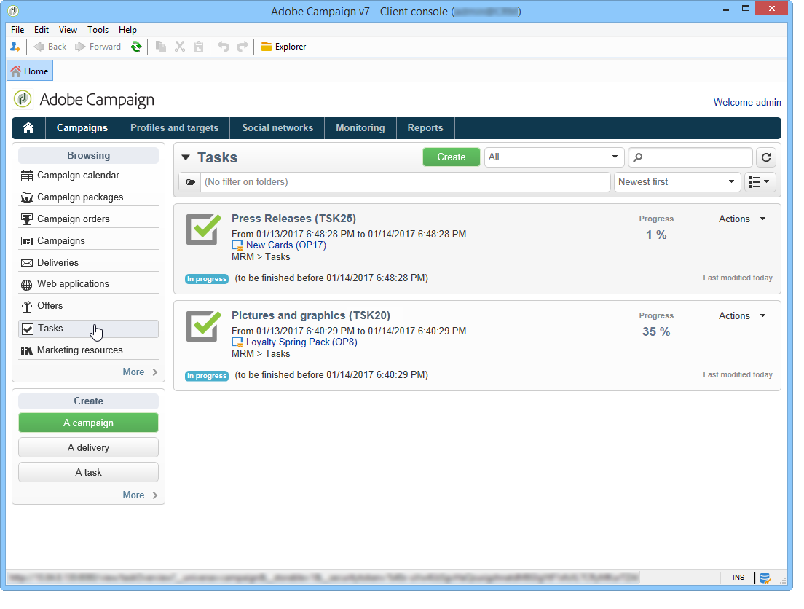
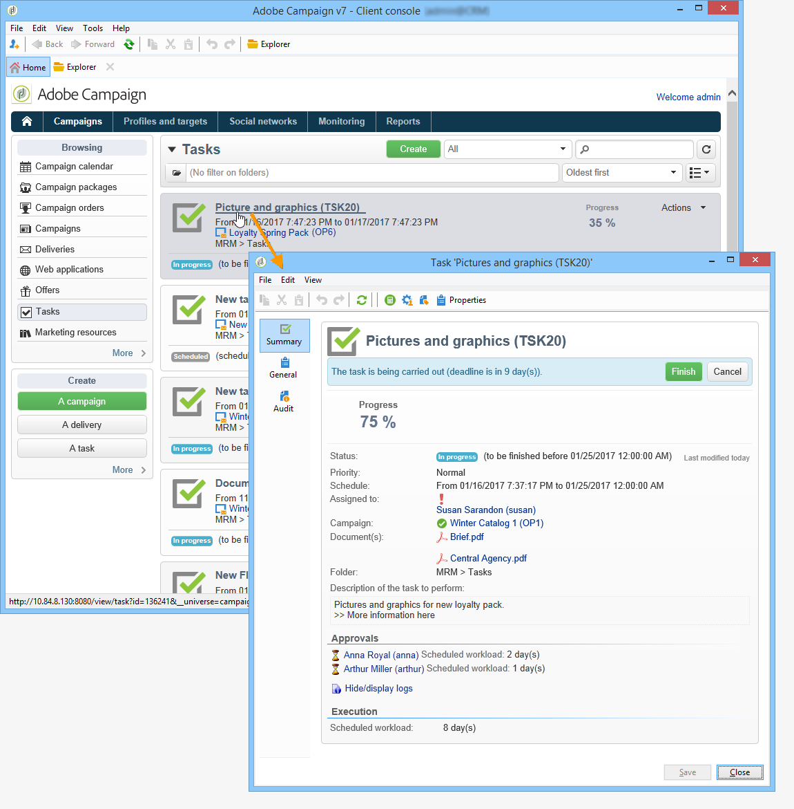
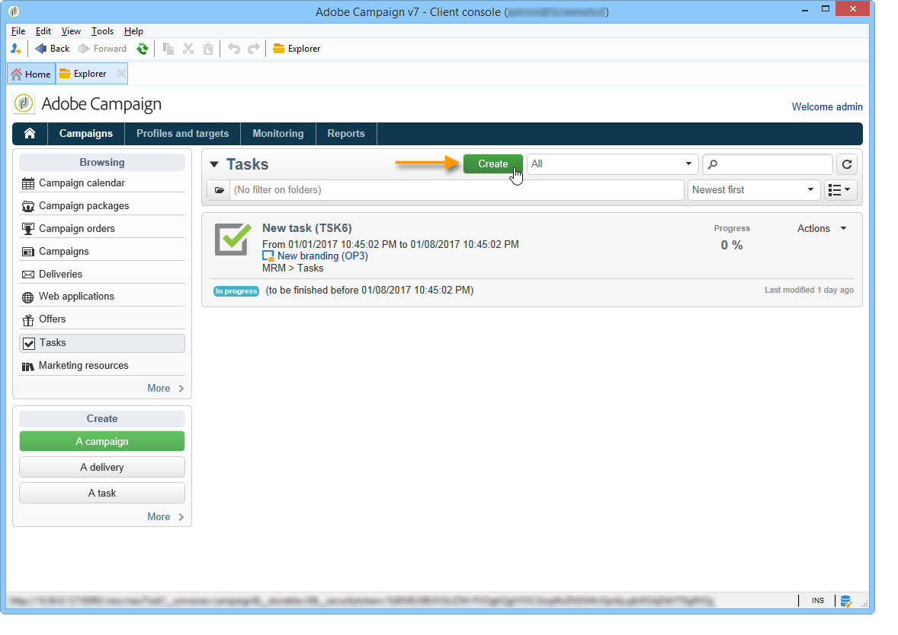
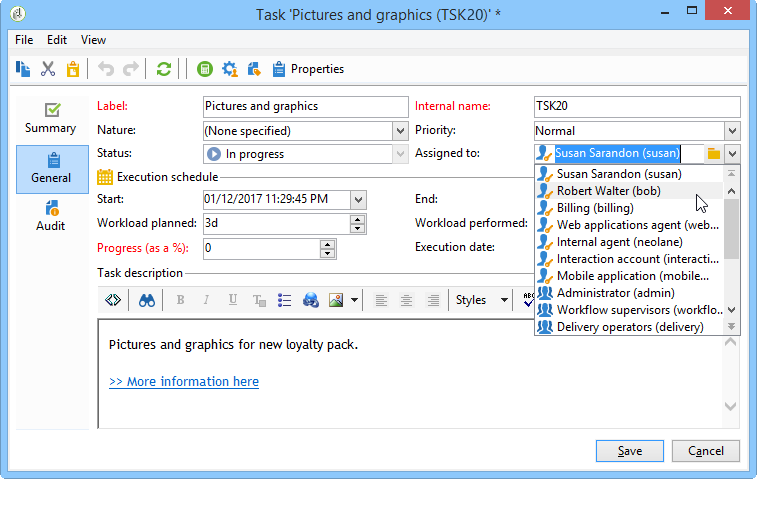
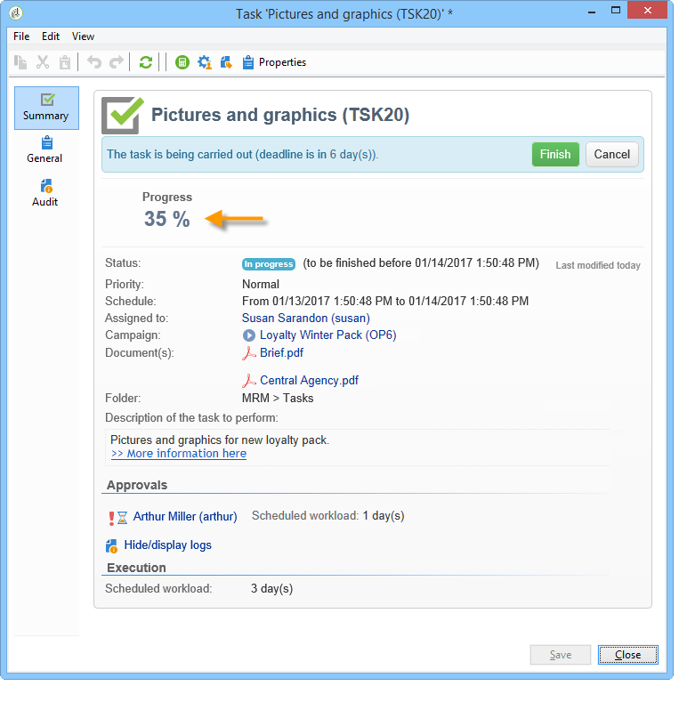
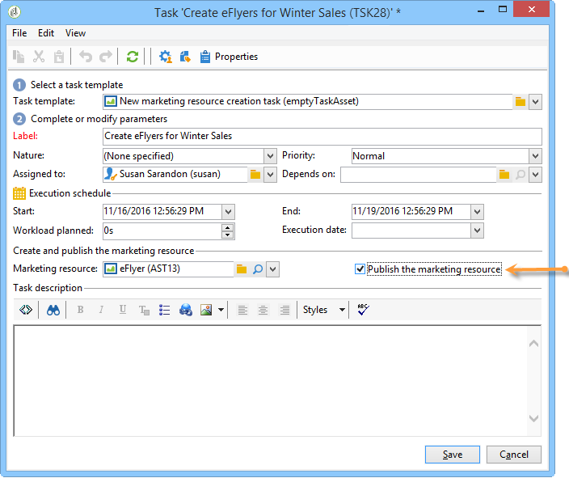
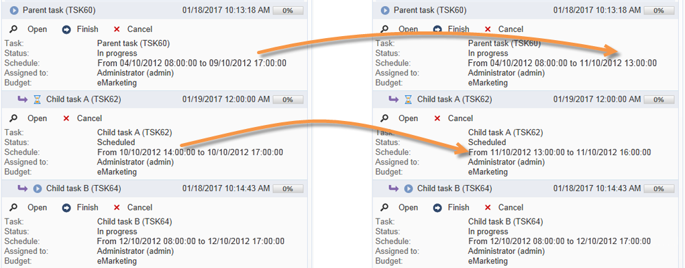

# 建立及管理任務{#creating-and-managing-tasks}

## 關於任務{#about-tasks}

Adobe Campaign可讓您直接在應用程式中建立工作並管理其完整生命週期。 方案和宣傳實施可分為指派給Adobe Campaign營運商或外部服務供應商的任務。 此操作模式可讓您建立開放的協作環境，其中包括所有方案參與者和外部參與者。

可從工作清單或促銷活動控制面板建立、檢視和監控工作。 您也可以在行銷計畫、方案和促銷活動的排程中檢視和追蹤這些項目。

任務會附加至促銷活動，並且可以具有相依性，即相關任務。 每個任務都有狀態、優先順序、估計負載和相關成本。

所有任務都分組在可通過&#x200B;**Campaigns**&#x200B;頁籤訪問的清單中。 有關詳細資訊，請參閱[訪問任務](#accessing-tasks)。

它們可以顯示在它們所屬的程式的計畫表中。

## 訪問任務{#accessing-tasks}

### 顯示任務{#displaying-tasks}

這些任務將顯示在可通過&#x200B;**[!UICONTROL Campaigns]**&#x200B;頁籤訪問的任務清單中。

您可以在此處查看連接的操作員的所有任務。

有關詳細資訊，請參閱[任務的執行狀態](#execution-status-of-a-task)和[任務的進度狀態](#progress-status-of-a-task)。

### 篩選任務{#filtering-tasks}

當您顯示此檢視時，會自動篩選該檢視，以便僅顯示&#x200B;**[!UICONTROL operator tasks]**。 您也可以使用視窗上方區段的欄位來篩選工作。

### 編輯任務{#editing-tasks}

按一下工作即可加以編輯。

## 建立新任務{#creating-a-new-task}

要建立任務，請按一下&#x200B;**[!UICONTROL Campaigns]**&#x200B;頁籤中的&#x200B;**[!UICONTROL Tasks]**&#x200B;連結，然後選擇&#x200B;**[!UICONTROL Create]**。

至少輸入任務的名稱，並選擇它所連結的促銷活動。 您也必須指定開始和結束日期。 這三條資訊是強制性的。

按一下&#x200B;**[!UICONTROL Save]**&#x200B;以建立任務。

您也可以透過促銷活動的控制面板來建立工作：在這種情況下，它會自動連結至從中建立的促銷活動。

建立工作後，它會新增至促銷活動排程和工作清單。 要編輯任務，請從計畫中選擇該任務，或在任務概述中按一下其名稱，然後按一下&#x200B;**[!UICONTROL Open]**&#x200B;連結。

若要設定，您必須指出：

* 經理和參與者：請參閱[Manager和參與者](#manager-and-participants)。
* 建立計畫：請參閱[執行計畫](#execution-schedule)。
* 承諾成本：請參閱[費用和收入](#expenses-and-revenues)。

廣告審閱者（請參閱[Reviewers](#reviewers)）和參考檔案（請參閱[Documents referenced](#documents-referenced)）也可以。

任務生命週期顯示在[生命週期](#life-cycle)中。

### 經理和參與者{#manager-and-participants}

只有負責任務的操作員才有權關閉任務。

預設情況下，當Adobe Campaign運算子建立任務時，系統會自動為其分配任務。 要選擇不同的運算子，請使用&#x200B;**[!UICONTROL Assigned to]**&#x200B;欄位。

>[!NOTE]
>
>運算子管理顯示在[本節](../../platform/using/access-management.md)中。

您可以指定執行任務時涉及的運算子。 這些營運商無權關閉工作。 他們只能批准指派給他們的任務。

使用任務工具欄中的&#x200B;**[!UICONTROL Resources]**&#x200B;表徵圖來選擇它們。 按一下&#x200B;**[!UICONTROL Add]**&#x200B;並選擇相關運算子。

按一下&#x200B;**[!UICONTROL Ok]**，然後輸入使用率：這表示在任務執行期間分配給運算子的負載。 此比率僅為指示，以百分比表示。

例如，對於將執行計畫設定為10天的任務，在10天內，此任務的一半工作時間內將移動其使用率為50%的操作員。

對於每個操作員，您可以輸入計畫工作量和實際工作量。 這些期間也僅供參考。

您可以設定提醒，提醒會在任務結束日期前自動傳送給參與該任務的所有運算子。

您可以透過&#x200B;**[!UICONTROL Edit link]**&#x200B;圖示來檢視Adobe Campaign運算子描述檔。

運算子控制面板可讓您檢查其工作量（其他進行中的工作）。

### 審核者{#reviewers}

除了參與者外，您還可以定義操作員，操作員在任務由負責人關閉後將複查任務。 若要這麼做，請按一下&#x200B;**[!UICONTROL Resources]**&#x200B;視窗左下方區段中的&#x200B;**[!UICONTROL Enable task approval]**&#x200B;選項。 這可以是個別運算子、運算子群組或運算子清單。

要指定運算子清單，請按一下第一個審閱者右側的&#x200B;**[!UICONTROL Edit...]**&#x200B;連結，然後根據需要添加任意數量的運算子，如下所示：

您可以在審核者配置窗口的下部定義任務的批准計畫。 依預設，審核者自提交日期起有三天時間可核准工作。 您可以設定提醒，提醒會在核准截止日期之前自動傳送給相關的營運商。

即使已指派其他營運商來核准，負責該工作的人員仍可自行指派核准工作。 如果尚未定義審核者，則通知將發送給任務負責人。 所有具有&#x200B;**[!UICONTROL Administrator]**&#x200B;權限的其他Adobe Campaign操作員也可以批准該任務。 不過，他們不會收到通知。

### 參考的檔案{#documents-referenced}

您可以將檔案和行銷資源新增至工作（如需詳細資訊，請參閱[管理行銷資源](../../campaign/using/managing-marketing-resources.md)）。 要執行此操作，請開啟任務並按一下任務工具欄中的&#x200B;**[!UICONTROL Documents]**&#x200B;表徵圖。

按一下&#x200B;**[!UICONTROL Add]**&#x200B;並選擇要添加到任務中的文檔。 對行銷資源套用相同的程式。

參考的文檔將出現在發送給任務中涉及的操作員的通知中，以及任務控制面板中。

### 執行計畫{#execution-schedule}

任務的有效期在&#x200B;**[!UICONTROL Start]**&#x200B;和&#x200B;**[!UICONTROL End]**&#x200B;欄位中指示。 調度的負載表示在該期間要執行的工作量。 以日或小時表示。

>[!NOTE]
>
>任務的生命週期在[生命週期](#life-cycle)中顯示。

**[!UICONTROL Workload performed]**&#x200B;欄位也以天和小時表示，可讓您手動更新與計畫工作量相關的任務進度。

任務的&#x200B;**[!UICONTROL Progress status]**（以百分比表示）會根據相關操作員執行的任務自動更新。 可手動輸入。

此資訊可在任務控制面板中檢視。

它也會顯示在促銷活動標籤中。

如果任務執行計畫結束日期已到達但任務未完成，則任務將為&#x200B;**[!UICONTROL Late]**。 警告訊息也會顯示給警報運算子。

有關詳細資訊，請參閱[任務進度狀態](#progress-status-of-a-task)。

### 費用和收入{#expenses-and-revenues}

您可以定義每個任務的相關費用和預測收入。 這些值將計算，然後合併至任務所附加的促銷活動。

要指定此資訊，請按一下任務工具欄中的&#x200B;**[!UICONTROL Expenses and revenue]**&#x200B;表徵圖。

依預設，已支付的預算是附加任務之促銷活動的預算。 它顯示在任務詳細資訊中。

>[!NOTE]
>
>有關費用和預算的詳細資訊，請參閱[成本承諾、計算和費用](../../campaign/using/controlling-costs.md#cost-commitment--calculation-and-charging)。

在此窗口中，您也可以定義要達到的目標。 目標以任務的預測收入表示。

### 服務提供商{#service-providers}

外部服務提供商可以參與任務的管理。

要執行此操作，請編輯任務屬性並選擇相關的服務提供商。 與服務提供商關聯的成本類別會自動列在窗口的中央部分。

有關詳細資訊，請參閱[建立服務提供商及其成本類別](../../campaign/using/providers--stocks-and-budgets.md#creating-a-service-provider-and-its-cost-categories)。

選擇與任務執行相關的成本類別。 要執行此操作，請選擇成本類型，並根據需要添加附加費金額。

>[!NOTE]
>
>用於管理預算和成本的方法在控製成本中列於[。](../../campaign/using/controlling-costs.md)

選擇服務提供者後，它將顯示在任務儀表板中：

### 延遲任務{#late-tasks}

如果任務已到達其結束日期，但狀態未變更為&#x200B;**[!UICONTROL Finished]**，則任務會延遲。 根據預設，當任務延遲時，不會警告任何運算子。 您可以設定通知電子郵件的傳送方式：即使所有運算子不參與任務，也會收到通知。

轉到&#x200B;**[!UICONTROL Resources]**&#x200B;框，並將運算子添加到&#x200B;**[!UICONTROL Assignation]**&#x200B;欄位。 要通知多個人，請選擇一組操作員。

### 初始通知{#initial-notifications}

當您在將來建立或修改具有開始日期的任務時，Adobe Campaign會向負責該任務的人員發送電子郵件，以告知他們何時開始。

不過，如果您正在建立的任務遠未完成，則最好在任務開始之前安排要發送的通知。 例如，如果任務在一個月內開始，您可以在任務開始前一週通知負責人。

若要排程通知，請移至&#x200B;**[!UICONTROL Resources]**&#x200B;方塊，然後使用&#x200B;**[!UICONTROL Initial notification]**&#x200B;欄位。

* 對於促銷活動中的任務，請選取特定的日期和時間。
* 對於促銷活動範本中的任務，通知時間表示為任務開始前的剩餘時間（例如，如果您在&#x200B;**[!UICONTROL Initial notification]**&#x200B;欄位中輸入2d，則電子郵件會在任務開始日期前2天傳送）。

如果您已排程通知，在儲存工作時，Adobe Campaign仍會提供立即傳送通知的選件。 您可以決定傳送它，但不會取代排程的通知。

### 連結到程式{#task-linked-to-a-program}的任務

您可以直接在方案中建立工作，以管理與其整體組織相關的動作，而非與特定促銷活動相關的動作（例如，討論方案中即將推出之促銷活動主題的會議）。 任務將出現在程式計畫中。

要建立直接連結至程式的任務，請執行以下操作：

1. 開啟程式計畫：在首頁上，轉至&#x200B;**[!UICONTROL Campaigns > Browse > Other choices > Programs]**。 整個方案排程會在視窗的右側區段中開啟。
1. 在排程中，按一下所需的程式：窗戶上會顯示該程式。
1. 在此窗口中，按一下&#x200B;**[!UICONTROL Open]**。 程式排程隨即開啟。
1. 按一下右側計畫上方的&#x200B;**[!UICONTROL Add]**&#x200B;按鈕，然後按一下&#x200B;**[!UICONTROL Add a task]**。

### 操作員可用性{#operator-availability}

在任務儀表板中，操作員名稱旁邊的表徵圖表示他們已在任務涵蓋的期間內處理另一個任務或事件。 (操作員負責或參與的任務：他出現在&#x200B;**[!UICONTROL Assigned to]**&#x200B;欄位或任務&#x200B;**[!UICONTROL Resources]**&#x200B;框中。

### 工作流{#task-in-a-workflow}中的任務

在促銷活動工作流程中使用&#x200B;**[!UICONTROL Task]**&#x200B;元素，可讓您根據是否核准工作來定義兩個藍本。

在促銷活動工作流程中，**[!UICONTROL Task]**&#x200B;活動位於&#x200B;**[!UICONTROL Flow control]**&#x200B;標籤中。

## 任務類型{#types-of-task}

當您透過促銷活動建立工作時，可以建立特定的工作。 任務類型在選定模板中定義。

可排程下列工作：

* [控制任務](#control-tasks),
* [分組任務](#grouping-task),
* [分組任務](#grouping-task),
* [通知任務](#notification-task)。

>[!NOTE]
>
>**[!UICONTROL Control task]** 而且 **[!UICONTROL Grouping]** 只能透過促銷 **** 活動控制面板建立工作。\
>它們顯示在為其分配的操作員的任務映射中。 請參閱[訪問任務](#accessing-tasks)。

### 控制任務{#control-tasks}

**[!UICONTROL Control task]**&#x200B;連結至傳送核准：核准目標、內容、擷取檔案、預算或證明。

建立工作後，該工作即會新增至促銷活動控制面板。

然後可以編輯它並指定其參數。

### 行銷資源建立任務{#marketing-resource-creation-task}

行銷資源建立工作可用來管理行銷資源的建立和發佈。 如果您通過任務管理資源，而不是通過資源本身管理資源，則可以：

* 透過促銷活動控制資源建立程式。
* 在計畫中查看資源建立流程。
* 管理資源建立程式（提醒、通知）。
* 計算和控制與建立資源連結的成本。
* 通過任務批准和發佈資源（如果啟用了相關選項）。

#### 任務與其連結資源{#interaction-between-the-task-and-its-linked-resource}之間的交互

行銷資源建立工作會與連結至其的資源互動。 這表示：

* 資源建立時間表及其連結的成本通過任務進行管理。
* 營運商可以像一般（下載或上傳、鎖定和解除鎖定）一樣處理資源：這不會影響任務。
* 資源審批和發佈可通過任務執行：如果&#x200B;**[!UICONTROL Publish the marketing resource]**&#x200B;選項處於啟用狀態，則資源將在任務完成後自動獲得批准並發佈。 如果未啟用此選項，則任務和資源不進行交互：對一個不會影響另一個。

   您可以使用一系列連結的工作來定義完整的核准週期。 僅檢查最後一個任務的&#x200B;**[!UICONTROL Publish the marketing resource]**&#x200B;選項：所有任務都需要完成，才能發佈資源。 此外，建立子行銷資源任務時，將在子任務中自動選擇該資源。

   * **透過資源**:如果提交資源進行審批或審批，這些操作將不影響任務。
   * **通過任務**:如果選 **[!UICONTROL Publish the marketing resource]** 項已在任務中選中，則資源將在任務完成後自動獲得批准並發佈（請參閱上面）。如果未勾選此選項，則任務和資源將不進行交互：對一個不會影響另一個。

#### 配置行銷資源建立任務{#configuring-a-marketing-resource-creation-task}

審閱任務的人員不必是審閱資源中定義的內容的同一人。 但是，如果選中&#x200B;**[!UICONTROL Publish the marketing resource]**&#x200B;選項（請參見下面），則任務審核者將獲得批准資源內容的授權，完成任務後將自動批准資源（如果未定義審核者，則授權任務管理員）。

在&#x200B;**[!UICONTROL Marketing resource]**&#x200B;欄位中，定義要通過此任務管理的資源。 您可以：

* 選擇現有資源：下拉式清單會提供狀態為&#x200B;**[!UICONTROL Being edited]**&#x200B;的所有資源。
* 建立資源：按一下&#x200B;**[!UICONTROL Select the link]**&#x200B;表徵圖，然後按一下&#x200B;**[!UICONTROL Create]**&#x200B;表徵圖。

**[!UICONTROL Publish the marketing resource]**&#x200B;選項可讓您自動發佈資源：一旦任務為&#x200B;**[!UICONTROL Finished]**，資源的狀態即會自動切換到&#x200B;**[!UICONTROL Published]**，即使它既未提交批准，也未獲得批准，包括完成任務的審核者不是資源中定義的內容審核者。

**[!UICONTROL Publish the resource]**&#x200B;按鈕已可供使用，資源發佈審閱者會收到通知電子郵件，通知他已準備好發佈。 在&#x200B;**[!UICONTROL Edit > Tracking]**&#x200B;標籤中，任務審閱者的審閱和發佈將變為可見。 如果已定義資源後處理工作流，則立即執行。

### 分組任務{#grouping-task}

**[!UICONTROL Grouping task]**&#x200B;類型任務可讓您對多個任務進行分組，並同步其進度和批准的管理。

分組任務沒有連結的費用或資源。

所有分組到分組任務的任務都可以在其自己的儀表板上查看。 這可讓您篩選工作清單，只顯示您感興趣的工作。

分組任務有一個連結，可讓您輕鬆建立分組任務。

若要根據分組任務建立分組任務，請轉至促銷活動儀表板，然後按一下分組任務的名稱以顯示其說明，然後按一下&#x200B;**[!UICONTROL Add a task]**。

但是，如果已建立要連結到分組任務的任務，則可以通過&#x200B;**[!UICONTROL Properties]**&#x200B;框的&#x200B;**[!UICONTROL Linked to]**&#x200B;欄位執行該任務。

### 通知任務{#notification-task}

通知任務可讓您排程電子郵件傳送（傳送給營運商、營運商群組、服務供應商等）。 這可讓您排程提醒，例如通知某人促銷活動即將結束，或在促銷活動開始前傳送檔案，讓營運商可以準備。 這表示您可以追蹤促銷活動或方案中的通訊內容，並更密切地關注所執行的動作。

#### 生命週期{#life-cycle}

通知工作不需要核准。 這意味著它們的生命週期比標準任務更簡單：

通知任務可以具有以下狀態：

* **[!UICONTROL Scheduled]** 直到電子郵件傳送
* **[!UICONTROL In progress]** 一旦傳送電子郵件，直到到達結束日期
* **[!UICONTROL Finished]** 到達結束日期後。

#### 設定 {#configuration}

在建立過程中，必須在任務中輸入以下元素：

* **[!UICONTROL Assigned to]** :接收電子郵件的營運商或營運商群組。如果您在傳送電子郵件後重新指派工作，則不會將電子郵件傳送給新的運算元（若要這麼做，您必須重新初始化工作並變更其開始日期）。
* **任務開始日期**:通知電子郵件的傳送日期。此日期必須在記錄任務時在將來發生。
* **任務結束日期**:任務狀態更改為的日期 **[!UICONTROL Finished]**。根據預設，結束日期與開始日期相同。 不過，為任務指定持續時間可讓您象徵操作員在計畫中必須執行的時間長度（如果需要）。
* **[!UICONTROL Description]** :此處輸入的文本將出現在通知電子郵件的正文中。

   

您可以將附件添加到任務和通知電子郵件中。 若要這麼做，請按一下右上角工具列中的&#x200B;**[!UICONTROL Documents]**&#x200B;圖示。

## 生命週期{#life-cycle-1}

### 任務{#links-between-tasks}之間的連結

每個任務中的&#x200B;**[!UICONTROL Properties]**&#x200B;按鈕可讓您定義促銷活動中各任務之間的連結。 您可以使用分組任務將任務拆分為子任務（請參閱[連結任務](#linked-tasks)），或定義任務之間的相關性（請參閱[分組任務](#grouping-tasks)）。

#### 連結任務{#linked-tasks}

使用&#x200B;**[!UICONTROL Linked task]**&#x200B;欄位將任務與分組任務關聯。 請參閱[任務類型](#types-of-task)。

在下列範例中，定位的核准會細分為四個子任務。

每個子任務都是連結到主任務的標準任務。

#### 將任務分組{#grouping-tasks}

使用&#x200B;**[!UICONTROL Grouped to]**&#x200B;欄位可使任務的執行取決於另一個任務的執行。

任務之間的相依性由促銷活動控制面板中的箭頭表示。

對於分組任務，Adobe Campaign會自動將父任務的終止日期作為起始日期分配給子任務。 例如，如果&#x200B;**建立邀請**&#x200B;工作於10月15日下午3:30結束，**傳送邀請電子郵件**&#x200B;子工作將於10月15日下午3:30開始。

此外，如果您推遲父項任務的結束，其某些子項任務可能會受到影響：這些是狀態為&#x200B;**[!UICONTROL Scheduled]**&#x200B;且開始日期早於父任務的新結束日期的子任務。 任務的持續時間保持不變。 如果子任務的開始日期晚於父任務的新結束日期，則子任務不受影響。

**範例**

預定於10月9日下午5點結束的父任務有兩個子任務，任務A和任務B。任務A定於10月10日下午2點開始，任務B定於10月12日上午8點開始。

讓我們推遲父任務：現在10月11日下午1點結束。 只有任務A被推遲，將於10月11日下午1點開始。

### 任務{#execution-status-of-a-task}的執行狀態

任務狀態可以在任務圖中查看。 根據操作員操作自動更新任務的執行狀態。

任務可以是：**[!UICONTROL Scheduled]**、**[!UICONTROL In progress]**、**[!UICONTROL Finished]**、**[!UICONTROL Canceled]**、**[!UICONTROL Pending approval]**&#x200B;或&#x200B;**[!UICONTROL Rejected]**。

* 建立任務時，如果其開始日期是將來，則為&#x200B;**[!UICONTROL Scheduled]**。 它會保留此狀態，直到達到其開始日期為止。
* 啟動後，任務為&#x200B;**[!UICONTROL In progress]**。 當負責任務的人員關閉任務時，它將更改為&#x200B;**[!UICONTROL Finished]**。
* 如果已定義了審核者，則在負責該審核者關閉該審核者後，直到審核者批准該任務為&#x200B;**[!UICONTROL Pending approval]**。 如果審核者拒絕，則任務為&#x200B;**[!UICONTROL Rejected]**。
* 負責任務的人員可通過控制面板或&#x200B;**[!UICONTROL Task map]**&#x200B;按一下&#x200B;**[!UICONTROL Cancel]**&#x200B;按鈕來取消任務。
* 要計畫任務，請輸入將來的開始日期。 然後，您可以傳送第一個通知給執行該任務的Adobe Campaign操作員。 請參閱[完成任務生命週期](#complete-task-life-cycle)。

>[!NOTE]
>
>* 任務狀態會自動更新。
>* 即使有效期已結束，未關閉的任務仍會顯示在進行中的任務清單中。 警告會通知運算子任務已延遲。

>

### 任務{#progress-status-of-a-task}的進度狀態

除了執行狀態外，任務還可以與進度狀態關聯：**[!UICONTROL Late]**、**[!UICONTROL To approve]**、**[!UICONTROL To do today]**&#x200B;或&#x200B;**[!UICONTROL To do this week]**。 系統會根據任務計畫自動輸入此資訊。

您可以按進程或進度狀態篩選任務清單。

有關詳細資訊，請參閱[訪問任務](#accessing-tasks)。

### 完成任務生命週期{#complete-task-life-cycle}

以下是整個任務生命週期的階段，負責人已為其定義參與者和審閱者。

1. 負責人建立任務並輸入各個欄位。 有關詳細資訊，請參閱[建立新任務](#creating-a-new-task)。

   在建立和編輯在將來計畫的任務&#x200B;**時（只要未到達任務開始日期），可以向參與者和經理發送通知，讓他們知道已計畫了新任務。**

   

   若要傳送此第一個通知，請按一下&#x200B;**[!UICONTROL Yes]**。 此通知會告知他們下一項工作，並包含內容的詳細資訊以及截止日期前的剩餘天數。

   當建立任務並排程以後，其狀態為&#x200B;**[!UICONTROL Scheduled]**。

1. 在任務開始日期，負責人和參與者會收到通知，通知他們任務已開始。 其狀態變更為&#x200B;**[!UICONTROL In progress]**。
1. 完成分配給他們的部分後，參與者可以批准該任務：

   * 透過通知電子郵件傳送。
   * 透過主控台或Web介面，在工作控制面板中。

      

1. 每次參與者批准作業時，任務的進度狀態都會更新。

   

1. 審核者會收到通知電子郵件，通知他營運商已完成指派給他們的區段。

   他們可以遵循任務控制面板上的進度。

   

1. 當負責任務的人員決定任務完成後，他們可以使用任務啟動時發送的通知電子郵件中的連結、控制台或介面來關閉該任務。

   

   >[!NOTE]
   >
   >負責任務的人員可以隨時關閉該任務，即使缺少批准。 進度狀態會自動變更為100%。

1. 任務狀態將更改為&#x200B;**[!UICONTROL To approve]** ，並向審核者發送通知。

   他們會透過通知電子郵件、主控台或網頁介面核准工作。

   他們可透過促銷活動控制面板採取行動：

   

   他們還可以使用任務批准按鈕：

   

   >[!NOTE]
   >
   >如果已在任務的&#x200B;**[!UICONTROL Resources]**&#x200B;窗口中啟用&#x200B;**[!UICONTROL Enable task validation]**&#x200B;選項，則任務狀態將更改為&#x200B;**[!UICONTROL To approve]**。\
   >如果審核者拒絕任務，其狀態將更改為&#x200B;**[!UICONTROL Rejected]**，任務生命週期將自動重新啟動。

1. 任務狀態將更改為&#x200B;**[!UICONTROL Finished]**。 系統會傳送通知給所有相關人員。

   >[!NOTE]
   >
   >任務完成後，其生命週期由負責人重新初始化。 若要這麼做，請開啟工作，然後按一下控制面板底部的&#x200B;**[!UICONTROL Reset task to execute it again...]**&#x200B;連結。

