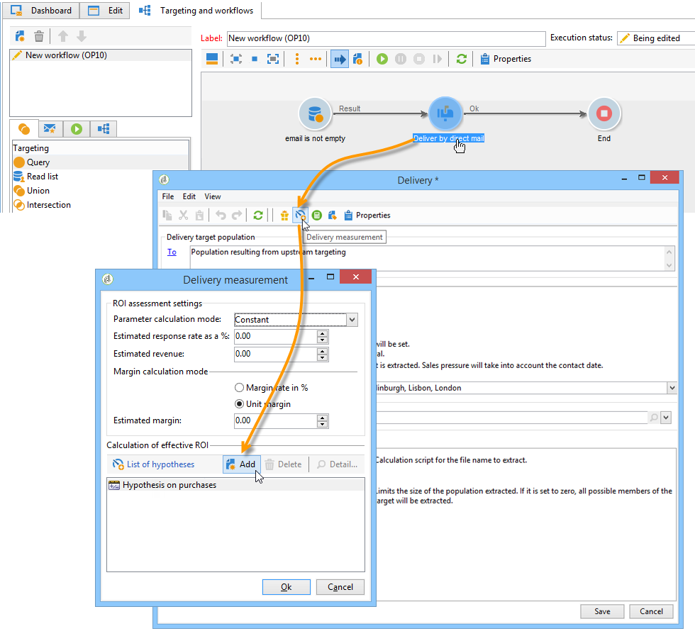

# 建立假設{#creating-hypotheses}

建立/連結行銷活動選件或傳送的假設有多種可能：

* 透過&#x200B;**[!UICONTROL Measurement hypotheses]**&#x200B;資料夾，根據現有範本建立新假設並將其連結至現有傳送。
* 透過促銷活動中的&#x200B;**[!UICONTROL Edit]** > **[!UICONTROL Measurement]**&#x200B;標籤。
* 透過從促銷活動建立之傳送的&#x200B;**[!UICONTROL Measurement]**&#x200B;選項。

只有在啟動行銷活動且收件者收到傳遞後，才能計算假設。 如果假設是以優惠方案主張為基礎，則後者至少需要呈現，且仍然有效。 選件和傳送假設是透過&#x200B;**[!UICONTROL Measurement hypotheses]**&#x200B;資料夾建立，並以假設範本為基礎。 不過，您可以在行銷活動開始之前直接在傳送或行銷活動中參考假設。 在此情況下，假設會在行銷活動啟動後根據執行設定自動計算（如需詳細資訊，請參閱[假設範本執行設定](../../campaign/using/hypothesis-templates.md#hypothesis-template-execution-settings)）。

## 在傳送{#creating-a-hypothesis-on-the-fly-on-a-delivery}時即時建立假設

若要對現有傳送建立假設，請套用下列程式：

>[!NOTE]
>
>此操作僅可用於待定傳送。

1. 在Adobe Campaign樹中，轉至&#x200B;**[!UICONTROL Campaign management > Measurement hypotheses]**。
1. 按一下&#x200B;**[!UICONTROL New]**&#x200B;按鈕或按一下右鍵假設清單，然後在下拉清單中選擇&#x200B;**[!UICONTROL New]**。

   

1. 在假設視窗中，選取先前建立的範本（請參閱[假設範本](../../campaign/using/hypothesis-templates.md)）。

   

   在所選模型中定義的假設上下文將顯示在窗口中。

   >[!NOTE]
   >
   >在範本中定義且在此步驟中不可見的設定也會保留在記憶體中，並重新指派至進行中的假設。

   

1. 選取您要建立假設的傳送。

   

1. 您可以編輯&#x200B;**[!UICONTROL General]**、**[!UICONTROL Transactions]**&#x200B;和&#x200B;**[!UICONTROL Scope]**&#x200B;標籤，以個人化您的假設。 有關詳細資訊，請參閱[建立假設模型](../../campaign/using/hypothesis-templates.md#creating-a-hypothesis-model)。
1. 按一下&#x200B;**[!UICONTROL Start]**&#x200B;啟動假設。

   系統會自動建立工作流程以執行測量。 系統會根據假設設定自動定義名稱。

   >[!CAUTION]
   >
   >如果您已勾選&#x200B;**[!UICONTROL Keep execution workflow]**&#x200B;方塊，則可以存取此選項。\
   >如果執行假設時發生錯誤，則只能針對偵錯目的啟動此選項。 自動產生的工作流程會儲存在Adobe Campaign檔案總管的&#x200B;**[!UICONTROL Administration]** > **[!UICONTROL Production]** > **[!UICONTROL Objects created automatically]** > **[!UICONTROL Campaign workflows]**&#x200B;資料夾中。
   > 
   >此外，自動產生的工作流程不得修改。 在以後的計算中，不會考慮任何最終修改。
   >
   >如果您已核取此選項，請在執行工作流程後將其刪除。

   

   計算完成後，測量指標會自動更新。

   

1. 如有必要，請變更設定並重新啟動假設。

## 參考促銷活動傳送{#referencing-a-hypothesis-in-a-campaign-delivery}中的假設

您可以在行銷活動開始之前參考假設。 在此情況下，假設會根據假設範本中定義的執行設定，在傳送後自動啟動。 若要在傳送中建立假設，請套用下列程式：

1. 根據您的需要，可以建立一個或多個&#x200B;**[!UICONTROL Delivery]**&#x200B;類型模板，如[此部分](../../campaign/using/hypothesis-templates.md#creating-a-hypothesis-model)中所述
1. 建立行銷活動和目標工作流程。
1. 在傳送視窗中，按一下&#x200B;**[!UICONTROL Delivery measurement]**&#x200B;圖示。
1. 選取假設範本（在模型中設定的查詢會顯示在假設視窗中）。

   促銷活動完成後，會根據模型中設定的日期自動計算假設（請參閱[假設範本執行設定](../../campaign/using/hypothesis-templates.md#hypothesis-template-execution-settings)）。

   

## 將預設假設新增至促銷活動{#adding-a-default-hypothesis-to-deliveries-for-a-campaign}的傳送

您可以直接在促銷活動層級參考假設。 在此情況下，假設會自動連結至促銷活動中建立的所有傳送。 操作步驟：

1. 前往促銷活動的&#x200B;**[!UICONTROL Edit]**&#x200B;標籤。
1. 在測量區段中，按一下&#x200B;**[!UICONTROL Default hypotheses]**&#x200B;標籤。

   

1. 按一下&#x200B;**[!UICONTROL Add]**&#x200B;並選取假設範本。

   

   根據此範本的假設，現在預設會在促銷活動的每個新傳送中參考。

   

假設結果可在假設的&#x200B;**[!UICONTROL General]**&#x200B;和&#x200B;**[!UICONTROL Reactions]**&#x200B;標籤中檢視（請參閱[假設追蹤](../../campaign/using/hypothesis-tracking.md)）

如需詳細資訊，您也可以參閱[此範例](#example--creating-a-hypothesis-linked-to-a-delivery)。

## 在選件{#creating-a-hypothesis-on-an-offer}上建立假設

對優惠方案主張建立假設類似於建立即時傳送假設。 只要選件處於作用中狀態，就可以執行假設。 計算期間以優惠方案主張日期為基礎。 當假設可讓您將收件者連結至購買時，可能會被接受的優惠方案主張的狀態會自動變更（如需詳細資訊，請參閱[交易](../../campaign/using/hypothesis-templates.md#transactions)）。

1. 按照[本部分](../../campaign/using/hypothesis-templates.md#creating-a-hypothesis-model)中所述，建立一個或多個&#x200B;**[!UICONTROL Offer]**&#x200B;類型模型。
1. 轉至&#x200B;**[!UICONTROL Campaign management > Measurement hypotheses]**&#x200B;節點。
1. 選取先前建立的模型，以建立&#x200B;**[!UICONTROL Offers]**&#x200B;類型假設。

   

   在模型中建立的查詢將顯示在窗口中。

   

1. 選擇要建立假設的選件。

   

1. 視需要調整查詢。
1. 按一下&#x200B;**[!UICONTROL Start]**&#x200B;以執行假設。
1. 假設結果可在其&#x200B;**[!UICONTROL General]**&#x200B;和&#x200B;**[!UICONTROL Reactions]**&#x200B;標籤中檢視（請參閱[假設追蹤](../../campaign/using/hypothesis-tracking.md)）。

   在選件上提出的假設會在&#x200B;**[!UICONTROL Measurement]**&#x200B;標籤中參考。

   

   如果在假設範本中啟用了&#x200B;**[!UICONTROL Update offer proposition status]**&#x200B;選項，則會自動變更選件主張的狀態，從而就促銷活動的影響提供意見（如需詳細資訊，請參閱[交易](../../campaign/using/hypothesis-templates.md#transactions)）。

## 範例：建立連結至傳送{#example--creating-a-hypothesis-linked-to-a-delivery}的假設

在此範例中，我們想要建立連結至傳送的假設。 此假設將以先前建立的模型為基礎（請參閱[此範例](../../campaign/using/hypothesis-templates.md#example--creating-a-hypothesis-template-on-a-delivery)）。 然後，我們將調整從模型繼承的查詢，以對購買表格的特定項目進行假設。

1. 建立促銷活動和傳送（如需詳細資訊，請參閱[建立行銷活動](../../campaign/using/setting-up-marketing-campaigns.md#creating-a-campaign)）。

   在我們的範例中，我們將使用直接郵件類型傳送。

1. 配置種子地址：先前建立的假設範本已設定為在反應結果中考慮控制組。

   

   >[!NOTE]
   >
   >有關詳細資訊，請參閱[定義控制組](../../campaign/using/marketing-campaign-deliveries.md#defining-a-control-group)。

1. 開啟&#x200B;**[!UICONTROL Direct mail delivery]**，按一下&#x200B;**[!UICONTROL Delivery measurement]**&#x200B;圖示，然後按一下&#x200B;**[!UICONTROL Add]**。

   

1. 從下拉式清單中選擇先前建立的假設範本。

   

   將顯示在模型中建立的查詢。

   

1. 按一下&#x200B;**[!UICONTROL Edit query...]**&#x200B;並輸入假設將關聯的產品以縮小查詢範圍。

   

   您可以在促銷活動的&#x200B;**[!UICONTROL Edit]** > **[!UICONTROL Measurement]**&#x200B;標籤中檢查假設已連結至傳送。

   

1. 啟動您的目標工作流程並執行必要的檢查，直到促銷活動完成為止（如需詳細資訊，請參閱[此區段](../../campaign/using/marketing-campaign-deliveries.md#starting-a-delivery)）。

   

1. 在Adobe Campaign樹中，前往&#x200B;**[!UICONTROL Campaign management > Measurement hypotheses]**&#x200B;節點以檢查由假設計算的指標。

   
