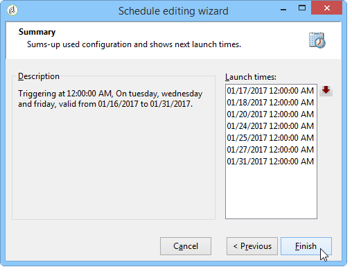
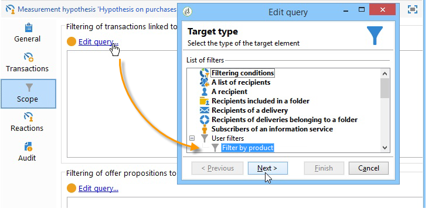

# 假設範本{#hypothesis-templates}

## 建立假設模型{#creating-a-hypothesis-model}

設定假設範本可讓您定義用於測量反應的內容，無論是針對傳送或選件。 這是引用各種測量表的地方，包括用於定義個人、假設和交易表之間關係的表。

若要建立假設範本，請套用下列步驟：

1. 在Adobe Campaign檔案總管中，按一下&#x200B;**[!UICONTROL Resources>Templates>Hypothesis templates]**。

   

1. 按一下&#x200B;**[!UICONTROL New]**&#x200B;或在範本清單中按一下滑鼠右鍵，然後在下拉式清單中選擇&#x200B;**[!UICONTROL New]**。
1. 輸入假設標籤。
1. 指定範本是否會透過&#x200B;**[!UICONTROL Hypothesis type]**&#x200B;傳送，用於選件或傳送的假設。
1. 對於&#x200B;**[!UICONTROL Delivery]**&#x200B;類型模板，指定是否應使用或不使用控制組執行測量（有關詳細資訊，請參閱假設模板的[屬性](#properties-of-a-hypothesis-template)）。
1. 對於&#x200B;**[!UICONTROL Delivery]**&#x200B;類型範本，您可以選擇特定通道，或決定使用&#x200B;**[!UICONTROL Channel]**&#x200B;下拉式清單將範本套用至Adobe Campaign中的所有可用通道（如需詳細資訊，請參閱假設範本的[屬性](#properties-of-a-hypothesis-template)）。
1. 選取您要在其中建立的&#x200B;**[!UICONTROL Execution folder]**，並自動執行將從此模板建立的假設。
1. 選擇執行設定（如需詳細資訊，請參閱[假設範本執行設定](#hypothesis-template-execution-settings)）。
1. 指定假設計算期間（如需詳細資訊，請參閱[假設範本執行設定](#hypothesis-template-execution-settings)）。

   >[!CAUTION]
   >
   >此期間由聯絡日期決定。

1. 在&#x200B;**[!UICONTROL Transactions]**&#x200B;索引標籤中，指定假設計算所需的表格和欄位（如需詳細資訊，請參閱[交易](#transactions)）。
1. 如果為&#x200B;**[!UICONTROL Offer]**&#x200B;類型假設配置了模板，則可以啟用&#x200B;**[!UICONTROL Update offer proposition status]**&#x200B;選項：在此情況下，請選取您要變更的優惠方案主張的狀態。
1. 指定假設應用程式的範圍（如需詳細資訊，請參閱[假設周長](#hypothesis-perimeter)）。
1. 如有必要，請使用指令碼完成篩選（如需詳細資訊，請參閱[假設周長](#hypothesis-perimeter)）。

### 假設模板{#properties-of-a-hypothesis-template}的屬性

範本的&#x200B;**[!UICONTROL General]**&#x200B;標籤可讓您指定一般範本選項。 可用欄位包括：

* **[!UICONTROL Hypothesis type]**:可讓您判斷範本是否應以傳送或選件的假設為目標。

   您也可以選擇建立將同時套用至傳送和選件的假設。

   >[!NOTE]
   >
   >如果範本套用至選件， **[!UICONTROL Update offer proposition status]**&#x200B;選項可在&#x200B;**[!UICONTROL Transactions]**&#x200B;標籤中使用。

* **[!UICONTROL Measurement with control group]**:可讓您指出是否已為傳送或促銷活動定義控制組，並將其納入測量指標中。未接收傳送的控制組可讓您透過將促銷活動與已接收傳送的目標母體比較，來評估傳送後促銷活動的影響。

   >[!NOTE]
   >
   >如果將範本設定為考慮控制組，但在假設所關注的傳送中未定義任何組，則結果將僅基於目標收件者。

   有關定義和配置控制組的詳細資訊，請參閱[定義控制組](../../campaign/using/marketing-campaign-deliveries.md#defining-a-control-group)。

* **[!UICONTROL Channel]**:您可以選取下拉式清單中的「 」，以選擇特定管道或讓「假設」範本可供Adobe Campaign主 **[!UICONTROL All channels]** 控台中的所有管道使用。如果您設定特定管道的範本，這可讓您在建立假設時自動篩選每個管道的傳送（請參閱[建立假設](../../campaign/using/creating-hypotheses.md)）。

   

* **[!UICONTROL Execution folder]**:可讓您指定假設的執行資料夾。
* **[!UICONTROL Taken into account in campaign ROI calculation]**:在計算相關促銷活動的ROI時，會考量假設結果。

### 假設範本執行設定{#hypothesis-template-execution-settings}

範本的&#x200B;**[!UICONTROL General]**&#x200B;標籤也可讓您指定假設執行參數。 可用選項如下：

* **[!UICONTROL Schedule execution for a time of low activity]**:可讓您排程假設啟動，以最佳化Adobe Campaign效能。核取此選項後，促銷活動的處理工作流程會在停機期間執行假設計算。

   

* **[!UICONTROL Priority]**:套用至假設的層級，以在有同時執行時省下假設計算順序。

   

* **[!UICONTROL Automatic execution]**:如有必要，可讓您排程假設重新計算（例如，如果您想要定期更新指標，直到傳送結束）。

   

   要指定計畫，請應用以下流程：

   1. 按一下&#x200B;**[!UICONTROL Frequency of execution...]**&#x200B;連結，然後按一下&#x200B;**[!UICONTROL Change...]**&#x200B;按鈕。

      

   1. 設定頻率、相關事件和有效期。

      

   1. 按一下&#x200B;**[!UICONTROL Finish]**&#x200B;以儲存排程。

      

* **[!UICONTROL Log SQL queries in journal]**:此函式保留給專家用戶。它可讓您將索引標籤新增至測量假設稽核，以顯示SQL查詢。 這樣，當模擬完成錯誤時，就能夠檢測可能的故障。
* **[!UICONTROL Keep execution workflow]**:可讓您保留在假設計算開始時自動產生的工作流程。在從已勾選此選項的範本建立的假設中，產生的工作流程可用於遵循此程式。

   >[!CAUTION]
   >
   >如果執行假設時發生錯誤，則只能針對偵錯目的啟動此選項。\
   >此外，自動產生的工作流程不得修改。 在以後的計算中，不會考慮任何最終修改。\
   >如果您已核取此選項，請在執行工作流程後將其刪除。

### 交易 {#transactions}

此索引標籤包含各種欄位和表格，可讓您以交易方式儲存收件者反應的歷史記錄。 有關專用於響應管理的表的詳細資訊，請參閱[配置](../../configuration/using/about-schema-reference.md)指南。

* **[!UICONTROL Schema (reaction log storage)]**:選擇收件人反應表。Adobe Campaign中的現成可用表格為&#x200B;**NmsRemaMatchRcp**。
* **[!UICONTROL Transaction schema]**:選擇假設將涉及的表，即交易或購買表。
* **[!UICONTROL Querying schema]**:選擇篩選假設的准則。
* **[!UICONTROL Link to individuals]**:選擇個人和用作事務架構的表之間的連結。
* **[!UICONTROL Link to the household]**:如果要將家庭的所有成員納入假設，請在交易結構中選擇指向家庭的連結。此欄位為選填欄位。
* **[!UICONTROL Transaction date]**:此欄位為選用欄位，但建議使用，因為它可讓您定義假設計算的範圍。
* **[!UICONTROL Measurement period]**:可讓您設定開始和結束日期，在此期間執行假設並復原購買行。

   當假設連結至傳送時，測量會在直接郵件傳送的聯絡日期後數天，或在電子郵件或簡訊傳送的傳送日期後自動觸發。

   

   如果假設是即時啟動的，如果想要立即觸發，就可以強制進行。 否則，會根據設定的計算結束自動觸發，該結束基於假設建立日期（請參閱[在傳送時即時建立假設](../../campaign/using/creating-hypotheses.md#creating-a-hypothesis-on-the-fly-on-a-delivery)）。

* **[!UICONTROL Transaction/Margin amount]**:這些欄位是可選欄位，可讓您自動計算週轉指標(請參閱 [指標](../../campaign/using/hypothesis-tracking.md#indicators))。
* **[!UICONTROL Unit amount]**:可讓您設定計算收入的金額(請參閱 [指標](../../campaign/using/hypothesis-tracking.md#indicators))。

   

* **[!UICONTROL Additional measures and data]**:可讓您指定其他報表測量或不同表格中欄位的軸。
* **[!UICONTROL Update offer proposition status]**:可讓您在以假設識別優惠方案收件者時，變更優惠方案主張的狀態。

   

### 假設周長{#hypothesis-perimeter}

一旦定義了交易表以及假設將涉及的欄位後，您就可以使用篩選器指定目標交易和傳送，以縮小假設的範圍。 您也可以使用JavaScript指令碼，明確指向交易表中引用的產品。

* **篩選交易**:在索 **[!UICONTROL Scope]** 引標籤中，您可以設定假設的篩選。操作步驟：

   1. 按一下&#x200B;**[!UICONTROL Edit query]**&#x200B;連結。

      

   1. 指定您的篩選條件。

      

   1. 選擇假設要涉及的交易。

      

* **篩選收件者**:在索 **[!UICONTROL Scope]** 引標籤中，您可以將假設限制在連結至訊息（傳遞、收件者、電子郵件地址、服務等）的任何資訊上：

   1. 按一下&#x200B;**[!UICONTROL Add a filter]**&#x200B;連結，然後按一下&#x200B;**[!UICONTROL Edit query]**。

      

   1. 指定您的篩選條件。

      

   1. 按一下&#x200B;**[!UICONTROL Finish]**&#x200B;以儲存查詢。

      

* **指令碼**:您可以使用JavaScript指令碼，在假設設定執行期間以動態方式過載。

   要執行此操作，請按一下&#x200B;**[!UICONTROL Advanced settings]**&#x200B;連結，然後輸入所需的指令碼。

   >[!NOTE]
   >
   >此選項適用於專家使用者。

   

## 範例：在傳送{#example--creating-a-hypothesis-template-on-a-delivery}上建立假設範本

在此範例中，我們將建立直接郵件類型傳送的假設範本。 假設將基於的交易表（本例中為&#x200B;**購買**）包含連結到文章或產品的購買行。 我們想要設定模型，以在購買表格中建立有關文章或產品的假設。

1. 在Adobe Campaign檔案總管中，前往&#x200B;**[!UICONTROL Resources > Templates > Hypothesis templates]**&#x200B;節點。
1. 按一下&#x200B;**[!UICONTROL New]**&#x200B;建立模板。

   

1. 變更範本標籤。

   

1. 選擇&#x200B;**[!UICONTROL Deliveries]**&#x200B;作為假設類型。
1. 核取相關方塊，以指定傳送可包含控制組。
1. 選擇&#x200B;**[!UICONTROL Direct mail]**&#x200B;通道。

   >[!NOTE]
   >
   >由於範本是直接郵件傳送的專屬範本，使用此模型建立的假設可能不會連結至任何其他傳送類型。

1. 在&#x200B;**[!UICONTROL Transactions]**&#x200B;標籤中，選取收件者反應表格。

   

1. 在&#x200B;**[!UICONTROL Transactions schema]**&#x200B;欄位中，選擇購買表格。

   

1. 在&#x200B;**[!UICONTROL Querying schema]**&#x200B;欄位中選取購買行。

   

1. 選擇連結至購買表格的收件者。

   

1. 選取連結至購買日期的欄位。

   這可讓您定義假設的時間範圍。 此階段不是強制性的，但建議使用。

   

1. 設定5至25天的計算期間。

   

1. 在&#x200B;**[!UICONTROL Scope]**&#x200B;標籤中，按一下&#x200B;**[!UICONTROL Edit query]**&#x200B;以建立假設的篩選器。

   

   因此建立的模板使您能夠對購買表中的產品或文章運行假設。

1. 按一下&#x200B;**[!UICONTROL Save]**&#x200B;以記錄您的範本。
