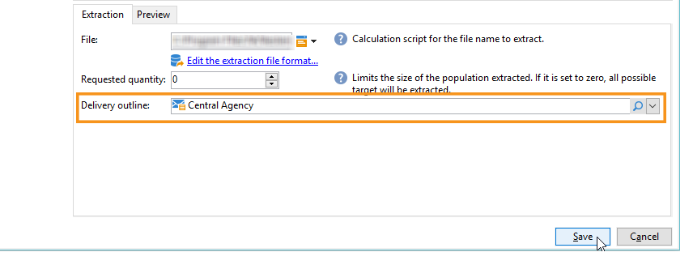

# 管理相關檔案 {#managing-associated-documents}

您可以將各種檔案與行銷活動建立關聯：報表、像片、網頁、圖表等。 這些檔案可以是任何格式(Microsoft Word、PowerPoint、PNG、JPG、Acrobat PDF等)。

>[!IMPORTANT]
>
>此功能僅適用於小型資產和檔案。

在行銷活動中，您也可以參考其他專案，例如促銷優惠券、與特定品牌或商店相關的特殊優惠等。 當這些元素包含在大綱中時，它們可以與直接郵件傳遞相關聯。 請參閱透過傳遞大網](#associating-and-structuring-resources-linked-via-a-delivery-outline)連結的[關聯和結構資源。

>[!NOTE]
>
>如果您使用「行銷活動行銷資源管理」模組，您也可以管理行銷資源資料庫，以供多位使用者共同作業。 [了解更多](../../mrm/using/managing-marketing-resources.md)。

## 新增檔案 {#adding-documents}

檔案可以在行銷活動層級（內容檔案）或方案層級（一般檔案）相關聯。

**[!UICONTROL Documents]**&#x200B;索引標籤包含：

* 內容所需的所有檔案清單（範本、影像等），可由Adobe Campaign運運算元透過適當的許可權從本機下載。
* 包含路由器資訊的檔案（如果有的話）。

檔案透過&#x200B;**[!UICONTROL Edit > Documents]**&#x200B;索引標籤連結至方案或行銷活動。

您也可以透過行銷活動控制面板中提供的連結，將檔案新增至行銷活動。

按一下&#x200B;**[!UICONTROL Details]**&#x200B;圖示以檢視檔案內容並新增資訊：

在控制面板中，與行銷活動相關聯的檔案會分組到&#x200B;**[!UICONTROL Document(s)]**&#x200B;區段，如下列範例所示：

您也可以從此檢視編輯及修改它們。

## 關聯並建構透過傳遞大網連結的資源 {#associating-and-structuring-resources-linked-via-a-delivery-outline}

>[!NOTE]
>
>傳遞大綱僅用於直接郵件行銷活動的內容。

傳遞大網代表公司為特定行銷活動建立的一組結構化元素（檔案、商店、促銷優惠券等）。

這些元素會分組在傳遞大網中，而每個傳遞大網都會與一個傳遞相關聯；在傳送至&#x200B;**服務提供者**&#x200B;的擷取檔案中會參考該專案，以便附加至該傳遞。 例如，您可以建立參考分支及其使用之行銷手冊的傳遞大網。

對於行銷活動，傳遞概要可讓您根據特定條件來建構要與傳遞關聯的外部元素：相關分支、已授與的促銷優惠、本機活動邀請等。

### 建立大綱 {#creating-an-outline}

若要建立大綱，請按一下相關行銷活動之&#x200B;**[!UICONTROL Edit > Documents]**&#x200B;索引標籤中的&#x200B;**[!UICONTROL Delivery outlines]**&#x200B;子索引標籤。

>[!NOTE]
>
>如果此索引標籤不存在，則此功能不適用於此行銷活動。 請參閱行銷活動範本設定。
>   
>如需範本的詳細資訊，請參閱[本節](../../campaign/using/marketing-campaign-templates.md#campaign-templates)。

接著，按一下&#x200B;**[!UICONTROL Add a delivery outline]**&#x200B;並建立行銷活動的大綱階層：

1. 以滑鼠右鍵按一下樹狀結構的根並選取&#x200B;**[!UICONTROL New > Delivery outlines]**。
1. 用滑鼠右鍵按一下您剛建立的大綱，然後選取&#x200B;**[!UICONTROL New > Item]**&#x200B;或&#x200B;**[!UICONTROL New > Personalization fields]**。

大綱可包含專案和個人化欄位、資源和選件：

* 專案可以是實體檔案，例如，此處會參照和說明，且會附加至傳遞。
* 個人化欄位可讓您建立與傳送相關的個人化元素，而非收件者。 因此，您可以建立用於特定目標之傳送的值（歡迎優惠、折扣等） 它們是在Adobe Campaign中建立並透過&#x200B;**[!UICONTROL Import personalization fields...]**&#x200B;連結匯入大綱。

  

  也可以按一下清單區域右邊的&#x200B;**[!UICONTROL Add]**&#x200B;圖示，直接在大綱中建立它們。

  

* 資源是在行銷資源儀表板中產生的行銷資源，透過&#x200B;**[!UICONTROL Campaigns]**&#x200B;標籤的&#x200B;**[!UICONTROL Resources]**&#x200B;連結存取。

  

  >[!NOTE]
  >
  >如需行銷資源的詳細資訊，請參閱[本區段](../../mrm/using/managing-marketing-resources.md)。

### 選取大綱 {#selecting-an-outline}

對於每次傳遞，您可以從保留給擷取大綱的區段中選取要關聯的大綱，如下列範例所示：

然後所選輪廓會顯示在視窗的下半部。 您可以使用欄位右側的圖示加以編輯，或使用下拉式清單加以變更：

傳遞的&#x200B;**[!UICONTROL Summary]**&#x200B;標籤也會顯示這項資訊：

### 擷取結果 {#extraction-result}

在擷取並傳送給服務提供者的檔案中，大綱的名稱以及適當時其特性（成本、說明等）會根據與服務提供者相關的匯出範本中的資訊新增到內容中。

在下列範例中，與傳遞相關的大綱的標籤、預估成本和說明將新增至摘取檔案。

匯出模型必須與為相關傳遞選取的服務提供者相關聯。 請參閱[此節](../../campaign/using/providers-stocks-and-budgets.md#creating-service-providers-and-their-cost-structures)。

>[!NOTE]
>
>如需匯出的詳細資訊，請參閱[本節](../../platform/using/get-started-data-import-export.md)部分。
