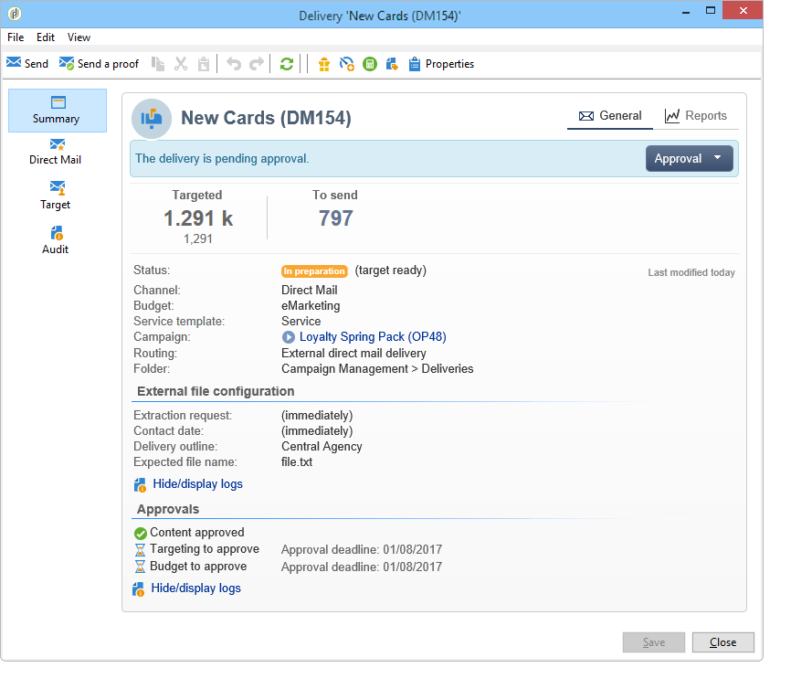

# 行銷活動傳遞 {#marketing-campaign-deliveries}

您可以透過行銷活動控制面板、行銷活動工作流程，或直接透過傳送概述來建立傳送。

從行銷活動建立傳遞時，會連結至此行銷活動，並在行銷活動層級合併。

[在影片中探索此功能](#create-email-video)

## 建立傳遞 {#creating-deliveries}

若要建立連結至行銷活動的傳遞，請按一下行銷活動控制面板中的&#x200B;**[!UICONTROL Add a delivery]**&#x200B;連結。

建議的設定適用於不同型別的傳遞：直接郵件、電子郵件、行動裝置頻道。 [了解更多](../../delivery/using/steps-about-delivery-creation-steps.md)。

## 開始傳遞 {#starting-a-delivery}

在授予所有核准後，即可開始傳遞。 然後，傳遞程式取決於傳遞型別。 如需電子郵件或行動裝置頻道傳遞，請參閱[開始線上傳遞](#starting-an-online-delivery)；如需直接郵件傳遞，請參閱[開始離線傳遞](#starting-an-offline-delivery)。

### 開始線上傳遞 {#starting-an-online-delivery}

在授與所有核准要求之後，傳遞狀態會變更為&#x200B;**[!UICONTROL Pending confirmation]**，而且操作員可以啟動。 適當時，Adobe Campaign操作者（或操作者群組）若被指派為開始傳送的稽核者，將會收到傳送已準備開始的通知。

>[!NOTE]
>
>如果指定的特定操作者或操作者群組要在傳送的屬性中開始傳送，您也可以允許負責傳送的操作者確認傳送。 若要這麼做，請輸入&#x200B;**1**&#x200B;作為值，以啟動&#x200B;**NMS_ActivateOwnerConfirmation**&#x200B;選項。 這些選項是從Adobe Campaign總管中的&#x200B;**[!UICONTROL Administration]** > **[!UICONTROL Platform]** > **[!UICONTROL Options]**&#x200B;節點管理的。
>  
>若要停用此選項，請輸入&#x200B;**0**&#x200B;作為值。 然後，傳送確認程式將依預設運作：只有傳送屬性中針對傳送指定的操作員或操作員群組（或管理員）才能確認並執行傳送。

此資訊也會顯示在行銷活動控制面板上。 **[!UICONTROL Confirm delivery]**&#x200B;連結可讓您開始傳遞。

確認訊息可讓您確保此動作的安全。

### 開始離線傳遞 {#starting-an-offline-delivery}

在授予所有核准後，傳遞狀態會變更為&#x200B;**[!UICONTROL Pending extraction]**。 解壓縮檔案是透過特殊工作流程建立的，在預設設定中，當直接郵件傳遞擱置解壓縮時，會自動啟動解壓縮。 處理進行中時，會顯示於控制面板中，並可透過其連結進行編輯。

>[!NOTE]
>
>與行銷活動套件相關的技術工作流程出現在[技術工作流程清單](../../workflow/using/about-technical-workflows.md)中。

**步驟1 — 檔案核准**

成功執行擷取工作流程後，必須核准擷取檔案（前提是已在傳送設定中選取擷取檔案核准）。

如需詳細資訊，請參閱[核准擷取檔案](../../campaign/using/marketing-campaign-approval.md#approving-an-extraction-file)。

**步驟2 — 核准給服務提供者的訊息**

* 擷取檔案一經核准，即可產生路由器通知電子郵件的校樣。 此電子郵件訊息是根據傳遞範本所建構。 必須經過核准。

  >[!NOTE]
  >
  >只有在核准視窗中啟用了證明的傳送和核準時，此步驟才可用。

* 按一下&#x200B;**[!UICONTROL Send a proof]**&#x200B;按鈕以建立校樣。

  必須預先定義校樣目標。

  您可以視需要建立儘可能多的校樣。 這些可透過傳遞詳細資料的&#x200B;**[!UICONTROL Direct mail...]**&#x200B;連結存取。

  

* 傳遞狀態變更為&#x200B;**[!UICONTROL To submit]**。 按一下&#x200B;**[!UICONTROL Submit proofs]**&#x200B;按鈕以開始核准程式。

  

* 傳遞狀態變更為&#x200B;**[!UICONTROL Proof to validate]**，而且按鈕可讓您接受或拒絕核准。

  

  您可以接受或拒絕此核准，或返回擷取步驟。

  

* 解壓縮檔案會傳送至路由器，而且傳遞作業已完成。

### 成本與庫存的計算 {#calculation-of-costs-and-stocks}

檔案擷取會啟動兩項作業：預算計算和庫存計算。 預算專案會更新。

* **[!UICONTROL Budget]**&#x200B;索引標籤可讓您管理行銷活動的預算。 總成本專案會顯示在行銷活動主要標籤及其所屬方案的&#x200B;**[!UICONTROL Calculates cost]**&#x200B;欄位中。 這些金額也會反映在行銷活動預算中。

  實際成本最終將依據路由器提供的資訊計算。 只有實際傳送的訊息才會開立發票。

* 庫存定義於樹狀結構的&#x200B;**[!UICONTROL Administration > Campaign management > Stocks]**&#x200B;節點中，成本結構定義於&#x200B;**[!UICONTROL Administration > Campaign management > Service providers]**&#x200B;節點中。

  坯件線會顯示在坯件區段中。 若要定義初始坯件，請開啟坯件線。 每次進行交貨時，庫存都會減少。 您可以定義警示等級與通知。

>[!NOTE]
>
>如需有關成本計算和庫存管理的進一步資訊，請參閱[供應商、庫存和預算](../../campaign/using/providers-stocks-and-budgets.md)。

## 管理相關檔案 {#managing-associated-documents}

您可以為行銷活動跟各種檔案建立關聯：報告、照片、網頁、圖表等。這些檔案可以是任何格式(Microsoft Word、PowerPoint、PNG、JPG、Acrobat PDF等)。 在本節](../../campaign/using/marketing-campaign-assets.md)中瞭解如何將檔案與行銷活動[連結。

>[!IMPORTANT]
>
>此模式為小型檔案保留。

在行銷活動中，您也可以參考其他專案，例如促銷優惠券、與特定分公司或商店相關的特殊優惠方案等。 當這些元素包含在大綱中時，它們可以與直接郵件傳遞相關聯。 [了解更多](#associating-and-structuring-resources-linked-via-a-delivery-outline)。

>[!NOTE]
>
>如果您使用MRM，您也可以管理行銷資源庫，供多位參與者用於合作工作。 請參閱[管理行銷資源](../../mrm/using/managing-marketing-resources.md)。

### 新增檔案 {#adding-documents}

檔案可以在行銷活動層級（內容檔案）或方案層級（一般檔案）相關聯。

**[!UICONTROL Documents]**&#x200B;索引標籤包含：

* 內容所需的所有檔案清單（範本、影像等），可由Adobe Campaign運運算元透過適當的許可權從本機下載。
* 包含路由器資訊的檔案（如果有的話）。

檔案透過&#x200B;**[!UICONTROL Edit > Documents]**&#x200B;索引標籤連結至方案或行銷活動。

您也可以透過行銷活動控制面板中提供的連結，將檔案新增至行銷活動。

按一下&#x200B;**[!UICONTROL Details]**&#x200B;圖示以檢視檔案內容並新增資訊：

在控制面板中，與行銷活動相關聯的檔案會分組到&#x200B;**[!UICONTROL Document(s)]**&#x200B;區段，如下列範例所示：

您也可以從此檢視編輯及修改它們。

### 關聯並建構透過傳遞大網連結的資源 {#associating-and-structuring-resources-linked-via-a-delivery-outline}

>[!NOTE]
>
>傳遞大綱僅用於直接郵件行銷活動的內容。

傳遞大網表示在公司中為特定行銷活動建立的結構化元素集（檔案、分支/商店、促銷優惠券等）。

這些元素會分組在傳遞大網中，而特定傳遞大網將與傳遞相關聯；它將在傳送至&#x200B;**服務提供者**&#x200B;的擷取檔案中參考，以便附加至傳遞。 例如，您可以建立參考分支及其使用之行銷手冊的傳遞大網。

對於行銷活動，傳遞概要可讓您根據特定條件來建構要與傳遞關聯的外部元素：相關分支、已授與的促銷優惠、本機活動邀請等。

#### 建立大綱 {#creating-an-outline}

若要建立大綱，請按一下相關行銷活動之&#x200B;**[!UICONTROL Edit > Documents]**&#x200B;索引標籤中的&#x200B;**[!UICONTROL Delivery outlines]**&#x200B;子索引標籤。

>[!NOTE]
>
>如果此索引標籤不存在，則此功能不適用於此行銷活動。 請參閱行銷活動範本設定。
>   
>如需詳細資訊，請參閱[行銷活動範本](../../campaign/using/marketing-campaign-templates.md#campaign-templates)。

接著，按一下&#x200B;**[!UICONTROL Add a delivery outline]**&#x200B;並建立行銷活動的大綱階層：

1. 以滑鼠右鍵按一下樹狀結構的根並選取&#x200B;**[!UICONTROL New > Delivery outlines]**。
1. 用滑鼠右鍵按一下您剛建立的大綱，然後選取&#x200B;**[!UICONTROL New > Item]**&#x200B;或&#x200B;**[!UICONTROL New > Personalization fields]**。

大綱可包含專案和個人化欄位、資源和選件：

* 專案可以是實體檔案，例如，此處會參照和說明，且會附加至傳遞。
* 個人化欄位可讓您建立與傳送相關的個人化元素，而非收件者。 因此，您可以建立用於特定目標之傳送的值（歡迎優惠、折扣等） 它們是在Adobe Campaign中建立並透過&#x200B;**[!UICONTROL Import personalization fields...]**&#x200B;連結匯入大綱。

  

  也可以按一下清單區域右邊的&#x200B;**[!UICONTROL Add]**&#x200B;圖示，直接在大綱中建立它們。

  

* 資源是在行銷資源儀表板中產生的行銷資源，透過&#x200B;**[!UICONTROL Campaigns]**&#x200B;標籤的&#x200B;**[!UICONTROL Resources]**&#x200B;連結存取。

  

  >[!NOTE]
  >
  >如需行銷資源的詳細資訊，請參閱[管理行銷資源](../../mrm/using/managing-marketing-resources.md)。

#### 選取大綱 {#selecting-an-outline}

對於每次傳遞，您可以從保留給擷取大綱的區段中選取要關聯的大綱，如下列範例所示：

然後所選輪廓會顯示在視窗的下半部。 您可以使用欄位右側的圖示加以編輯，或使用下拉式清單加以變更：

傳遞的&#x200B;**[!UICONTROL Summary]**&#x200B;標籤也會顯示這項資訊：

#### 擷取結果 {#extraction-result}

在擷取並傳送給服務提供者的檔案中，大綱的名稱以及適當時其特性（成本、說明等）會根據與服務提供者相關的匯出範本中的資訊新增到內容中。

在下列範例中，與傳遞相關的大綱的標籤、預估成本和說明將新增至摘取檔案。

匯出模型必須與為相關傳遞選取的服務提供者相關聯。 請參閱[建立服務提供者及其成本結構](../../campaign/using/providers-stocks-and-budgets.md#creating-service-providers-and-their-cost-structures)。

>[!NOTE]
>
>如需匯出的詳細資訊，請參閱[快速入門](../../platform/using/get-started-data-import-export.md)區段。

#### 教學課程影片 {#create-email-video}

此影片說明如何在Adobe Campaign中建立行銷活動和電子郵件。

>[!VIDEO](https://video.tv.adobe.com/v/25604?quality=12)

[此處](https://experienceleague.adobe.com/docs/campaign-classic-learn/tutorials/overview.html?lang=zh-Hant)提供其他Campaign操作說明影片。
