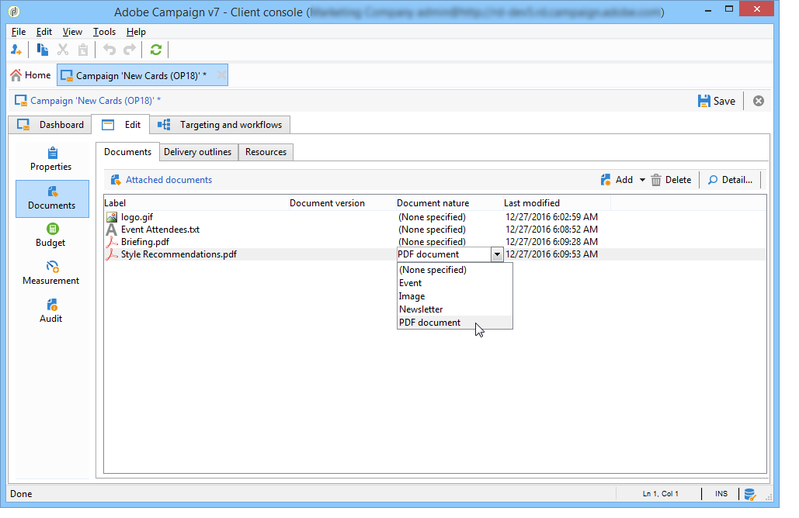

# 行銷促銷活動傳送 {#marketing-campaign-deliveries}

傳送可透過促銷活動控制面板、促銷活動工作流程或直接透過傳送概述來建立。

## 建立傳送 {#creating-deliveries}

若要建立連結至促銷活動的傳送，請按一下促銷 **[!UICONTROL Add a delivery]** 活動控制面板中的連結。

建議的配置適用於不同類型的交付： 直效郵件、電子郵件、行動通道。

>[!NOTE]
>
>如需建立和設定傳送的詳細資訊，請參閱「傳送 [訊息](../../delivery/using/communication-channels.md) 」一節。

## 選擇目標人口 {#selecting-the-target-population}

對於每個傳送，促銷活動管理員將定義：

* 主要目標。 有關詳細資訊，請參 [閱在工作流中構建主目標](#building-the-main-target-in-a-workflow)[和選擇目標人口](#selecting-the-target-population)。
* 控制組。 有關詳細資訊，請參閱定 [義控制組](#defining-a-control-group)。
* 種子地址。 如需詳細資訊，請參閱[本章節](../../delivery/using/about-seed-addresses.md)。

其中有些資訊會繼承自範本。

>[!NOTE]
>
>促銷活動範本會顯示在促銷 [活動範本中](../../campaign/using/marketing-campaign-templates.md#campaign-templates)。

若要建立傳送目標，您可以為資料庫中的收件者定義篩選條件。 此收件者選擇模式顯示在「發送消 [息」部分](../../delivery/using/steps-defining-the-target-population.md) 。

### 範例： 傳送給一組收件者 {#example--delivering-to-a-group-of-recipients}

您可以將人口匯入清單，然後在傳送中定位此清單。

1. 若要這麼做，請編輯相關的傳送，然後按一 **[!UICONTROL To]** 下連結以變更目標人口。

1. 在標籤 **[!UICONTROL Main target]** 中，選取選 **[!UICONTROL Defined via the database]** 項並按一 **[!UICONTROL Add]** 下以選取收件者。

1. 選擇 **[!UICONTROL A list of recipients]** 並按一下 **[!UICONTROL Next]** 以選擇它。

### 在工作流程中建立主要目標 {#building-the-main-target-in-a-workflow}

傳送的主要目標也可以在定位工作流程中定義： 此圖形環境可讓您使用查詢、測試和運算子來建立目標： 聯合、重複資料消除、共用等。

「使 [用工作流自動化](../../workflow/using/architecture.md) 」指南包含工作流模組操作的詳細說明。

>[!IMPORTANT]
>
>在相同的促銷活動中，您無法設定超過28個工作流程。 超過此限制後，介面中將無法顯示其他工作流程，並可能產生錯誤。

#### 建立定位工作流程 {#creating-a-targeting-workflow}

您可以透過工作流程中圖形順序的篩選條件組合來建立定位。 您可以建立人口和子人口，並根據您的需求進行定位。 若要顯示工作流程編輯器，請按一下促銷 **[!UICONTROL Targeting and workflows]** 活動控制面板中的標籤。

目標人口族群是透過工作流程中放置的一或多個查詢，從Adobe Campaign資料庫擷取。 要瞭解如何構建查詢，請參 [閱本節](../../workflow/using/query.md)。

您可以透過「聯合」、「交叉點」、「共用」、「排除」等方塊來啟動查詢並共用人口族群。

從工作區左側的清單中選擇對象，並將其連結以構建目標。

在圖中，在圖中連結目標構建所需的定位和調度查詢。 在進行建設時，您可以執行定位，以檢查從資料庫擷取的人口。

>[!NOTE]
>
>本節介紹了用於定義查詢的示例 [和過程](../../workflow/using/query.md)。

編輯器的左側部分包含表示活動的圖形對象庫。 第一個標籤包含定位活動，第二個標籤包含流量控制活動，這些活動偶爾會用來協調定位活動。

您可透過圖編輯器工具列存取定位工作流程執行和格式設定功能。

>[!NOTE]
>
>「使用工作流程自動化」指南中詳細介紹了用於構建圖以及所有顯示和佈局功能 [的活動](../../workflow/using/architecture.md) 。

您可以為單一促銷活動建立數個定位工作流程。 要添加工作流，請執行以下操作：

1. 移至工作流程建立區域的左上方區段，按一下滑鼠右鍵，然後選取 **[!UICONTROL Add]**。 您也可以使用位 **[!UICONTROL New]** 於此區域上方的按鈕。

   

1. 選取範本 **[!UICONTROL New workflow]** 並命名此工作流程。
1. 按一 **[!UICONTROL OK]** 下以確認建立工作流程，然後建立此工作流程的圖表。

#### 執行工作流程 {#executing-a-workflow}

定位工作流程可透過工具列中的 **[!UICONTROL Start]** 按鈕手動啟動，但您必須擁有適當的權限。

可以根據調度（調度器）或事件（外部信號、檔案導入等）對目標進行寫程式以用於自動執行。

與執行定位工作流程（啟動、停止、暫停等）相關的動作 是非 **同步進程** : 命令將保存，當伺服器可用來應用該命令時，該命令將立即生效。

工具列圖示可讓您針對定位工作流程的執行採取相關動作。

* 啟動或重新啟動

   * 此圖 **[!UICONTROL Start]** 示可讓您啟動定位工作流程。 當您按一下此圖示時，所有沒有輸入轉場的活動都會啟動（端點跳轉除外）。

      

      伺服器會將請求納入考量，如其狀態所示：

      

      流程狀態將更改為 **[!UICONTROL Started]**。

   * 您可以透過適當的工具列圖示，重新啟動定位工作流程。 如果表徵圖不可用，例如當 **[!UICONTROL Start]** 正在停止定位工作流時，此命令可能很有用。 在這種情況下，請按一下 **[!UICONTROL Restart]** 圖示來預測重新啟動。 伺服器會將請求納入考量，其狀態如下：

      

      然後，該進程進入 **[!UICONTROL Started]** 狀態。

* 停止或暫停

   * 工具列圖示可讓您停止或暫停進行中的定位工作流程。

      按一下時， **[!UICONTROL Pause]**&#x200B;正在進行的操作會暫 **[!UICONTROL are not]** 停，但直到下次重新啟動後才啟動其他活動。

      

      伺服器會考慮到該命令，其狀態如下：

      

      您也可以在定位工作流程執行到達特定活動時自動暫停。 若要這麼做，請以滑鼠右鍵按一下要暫停定位工作流程的活動，然後選取 **[!UICONTROL Enable but do not execute]**。

      

      此配置由特殊表徵圖顯示。

      

      >[!NOTE]
      >
      >此選項在進階定位促銷活動設計和測試階段中很實用。

      按一 **[!UICONTROL Start]** 下以繼續執行。

   * 按一下圖 **[!UICONTROL Stop]** 標可停止執行。

      

      伺服器會考慮到該命令，其狀態如下：

      
   您也可以在執行到達活動時自動停止定位工作流程。 若要這麼做，請以滑鼠右鍵按一下將停止定位工作流程的活動，然後選取 **[!UICONTROL Do not activate]**。

   

   

   此配置由特殊表徵圖顯示。

   >[!NOTE]
   >
   >此選項在進階定位促銷活動設計和測試階段中很實用。

* 無條件停止

   在「檔案總管」中，選 **[!UICONTROL Administration > Production > Object created automatically > Campaign workflows]** 取以存取每個促銷活動工作流程並採取行動。

   您可以按一下圖示並選取「停止」，以無條件 **[!UICONTROL Actions]** 地停止您的 **[!UICONTROL Unconditional]** 工作流程。 此動作會終止您的促銷活動工作流程。

   

### 定義控制組 {#defining-a-control-group}

控制組是不接收交貨的人口； 它可用來透過與已收到傳送的目標人口的行為比較，來追蹤傳送後的行為和促銷活動影響。

控制組可從主目標提取和／或來自特定組或查詢。

#### 啟用促銷活動的控制群組 {#activating-the-control-group-for-a-campaign}

您可以在促銷活動層級定義控制群組，在此情況下，控制群組將套用至相關促銷活動的每個傳送。

1. 編輯相關促銷活動，然後按一下標 **[!UICONTROL Edit]** 簽。
1. 按一下「**[!UICONTROL Advanced campaign settings]**」。

   

1. 選擇選 **[!UICONTROL Enable and edit control group configuration]** 項。
1. 按一下 **[!UICONTROL Edit...]** 以配置控制組。

   

配置過程顯示在 [從主目標中提取控制組](#extracting-the-control-group-from-the-main-target)[和添加種群中](#adding-a-population)。

#### 啟用傳送的控制群組 {#activating-the-control-group-for-a-delivery}

您可以在傳送層定義控制群組，在此情況下，控制群組將套用至相關促銷活動的每個傳送。

依預設，在促銷活動層級定義的控制群組設定會套用至該促銷活動的每個傳送。 不過，您可以針對個別傳送調整控制群組。

>[!NOTE]
>
>如果您已為促銷活動定義控制群組，而且您也將其設定為連結至此促銷活動的傳送，則只會套用為傳送定義的控制群組。

1. 編輯相關的傳送，然後按一 **[!UICONTROL To]** 下區段中的連 **[!UICONTROL Email parameters]** 結。

   

1. 按一下標 **[!UICONTROL Control group]** 簽，然後選取 **[!UICONTROL Enable and edit control group configuration]**。
1. 按一下 **[!UICONTROL Edit...]** 以配置控制組。

配置過程顯示在 [從主目標中提取控制組](#extracting-the-control-group-from-the-main-target)[和添加種群中](#adding-a-population)。

#### 從主目標中提取控制組 {#extracting-the-control-group-from-the-main-target}

您可以從傳送的主要目標擷取收件者。 在這種情況下，收件人將從受此配置影響的傳送動作目標中取用。 此提取可以是隨機的，也可以是排序收件者的結果。

若要擷取控制群組，請啟用促銷活動或傳送的控制群組，並選取下列其中一個選項： **[!UICONTROL Activate random sampling]** 或 **[!UICONTROL Keep only the first records after sorting]**&#x200B;者。

* **[!UICONTROL Activate random sampling]** : 此選項會將隨機抽樣套用至目標人口中的收件者。 如果您接著將臨界值設為100，則控制群組將由100個從目標人口中隨機選取的收件者組成。 隨機抽樣取決於資料庫引擎。
* **[!UICONTROL Keep only the first records after sorting]** : 此選項可讓您根據一或多個排序順序定義限制。 如果您選取欄 **[!UICONTROL Age]** 位作為排序標準，然後將100定義為臨界值，則控制群組將由100個最年輕的收件者組成。 例如，定義一個控制群組，其中包含購物次數較少的收件者或經常購物的收件者，並比較其行為與已聯絡的收件者的行為。

按一下 **[!UICONTROL Next]** 可定義排序順序（如果需要）並選擇收件人限制模式。

此設定等同於工作流程中的共用活動，可讓您將目標分割為子集。 控制組是這些子集之一。 Refer to the [this section](../../workflow/using/architecture.md) for more information.

### 新增人口 {#adding-a-population}

您可以定義要用作控制組的新人口。 此人口族群可來自一組收件者，或您可透過特定查詢建立。

>[!NOTE]
>
>Adobe Campaign查詢編輯器會顯示在 [此區段中](../../workflow/using/query.md)。

## 開始傳送 {#starting-a-delivery}

一旦所有許可都已獲得批准，交貨即可開始。 然後，傳送程式會視傳送類型而定。 如需電子郵件或行動通路傳送，請參閱「啟 [動線上傳送」](#starting-an-online-delivery)，如需直接郵件傳送 [，請參閱「](#starting-an-offline-delivery)啟動離線傳送」。

### 開始線上傳送 {#starting-an-online-delivery}

在授與所有核准請求後，傳送狀態會變更為， **[!UICONTROL Pending confirmation]** 可由營運商開始。 視情況，指定為審核者以開始傳送的Adobe Campaign運算子（或運算子群組）會通知傳送已準備好開始。

>[!NOTE]
>
>如果指定特定運算元或運算元群組以在傳送的屬性中開始傳送，您也可以允許負責傳送的運算元確認傳送。 要執行此操作，請輸 **入1作為值來激活NMS_ActivateOwnerConfirmation****選項** 。 這些選項是從Adobe Campaign檔案總 **[!UICONTROL Administration]** 管的 **[!UICONTROL Platform]** > **[!UICONTROL Options]** >節點進行管理。
>  
>要停用此選項，請輸 **入** 0作為值。 然後，傳送確認程式會依預設運作： 只有為傳送屬性（或管理員）中指定的運算元或運算元群組才能確認並執行傳送。

資訊也會顯示在促銷活動控制面板上。 連結 **[!UICONTROL Confirm delivery]** 可讓您開始傳送。

確認訊息可讓您保護此動作。

### 開始離線傳送 {#starting-an-offline-delivery}

一旦所有核准都獲得授權，傳送狀態會變更為 **[!UICONTROL Pending extraction]**。 抽取檔案通過特殊的工作流建立，在預設配置中，當直接郵件發送暫掛抽取時，該工作流自動啟動。 當進程進行中時，該進程會顯示在控制面板中，並可透過其連結進行編輯。

>[!NOTE]
>
>促銷活動流程的技術工作流程會顯示在促 [銷活動流程的清單中](../../workflow/using/campaign.md)。

**步驟1 —— 檔案批准**

擷取工作流程成功執行後，必須核准擷取檔案（前提是在傳送設定中選取擷取檔案核准）。

有關詳細資訊，請參閱 [批准抽取檔案](../../campaign/using/marketing-campaign-approval.md#approving-an-extraction-file)。

**步驟2 —— 批准向服務提供商發送的消息**

* 抽取檔案獲得批准後，您就可以生成路由器通知電子郵件的證明。 該電子郵件消息基於傳送模板構建。 必須獲得批准。

   >[!NOTE]
   >
   >只有在批准窗口中啟用了校樣的發送和批准時，才可使用此步驟。

* Click the **[!UICONTROL Send a proof]** button to create the proofs.

   證明目標必須事先確定。

   您可以視需要建立任意數量的校樣。 這些資訊可透過傳 **[!UICONTROL Direct mail...]** 送詳細資料的連結存取。

   

* 傳送狀態會變更為 **[!UICONTROL To submit]**。 按一下 **[!UICONTROL Submit proofs]** 按鈕以開始核准程式。

   

* 傳送狀態變更為 **[!UICONTROL Proof to validate]** ，而按鈕可讓您接受或拒絕核准。

   

   您可以接受或拒絕此批准，或返回抽取步驟。

   

* 抽取檔案將發送到路由器，並完成傳送。

### 計算費用和庫存 {#calculation-of-costs-and-stocks}

檔案擷取會啟動兩項作業： 預算計算和庫存計算。 預算條目將更新。

* 標籤 **[!UICONTROL Budget]** 可讓您管理促銷活動的預算。 成本分錄的合計顯示在促銷活 **[!UICONTROL Calculates cost]** 動的主標籤及其所屬程式的欄位中。 金額也會反映在促銷活動預算中。

   實際成本最終將根據路由器提供的資訊計算。 只有實際傳送的訊息會開具發票。

* 庫存在樹的節 **[!UICONTROL Administration > Campaign management > Stocks]** 點中定義，並在節點中定義成 **[!UICONTROL Administration > Campaign management > Service providers]** 本結構。

   庫存行在庫存區中可見。 要定義初始庫存，請開啟一個庫存行。 每次發生交貨時，庫存都會減少。 您可以定義警報級別和通知。

>[!NOTE]
>
>有關成本計算和庫存管理的詳細資訊，請參 [閱供應商、庫存和預算](../../campaign/using/providers--stocks-and-budgets.md)。

## 管理相關檔案 {#managing-associated-documents}

您可以將各種檔案與促銷活動建立關聯： 報表、像片、網頁、圖表等。 這些檔案可以是任何格式（Microsoft Word、PowerPoint、PNG、JPG、Acrobat PDF等）。 若要將檔案連結至促銷活動，請參 [閱新增檔案](#adding-documents)。

>[!IMPORTANT]
>
>此模式保留給小型文檔。

在促銷活動中，您也可以參考其他項目，例如促銷優惠券、與特定分支或商店相關的特殊優惠等。 當這些元素包含在大綱中時，它們可以與直接郵件發送相關聯。 請參 [閱關聯和構建通過交付大綱連結的資源](#associating-and-structuring-resources-linked-via-a-delivery-outline)。

>[!NOTE]
>
>如果您使用MRM，您也可以管理行銷資源庫，供數位參與者共同作業。 請參閱 [管理行銷資源](../../campaign/using/managing-marketing-resources.md)。

### 添加文檔 {#adding-documents}

檔案可在促銷活動層級（內容相關檔案）或方案層級（一般檔案）建立關聯。

此標 **[!UICONTROL Documents]** 簽包含：

* 內容（範本、影像等）所需的所有檔案清單 Adobe Campaign營運商可在本機下載，且具有適當權限，
* 包含路由器資訊的文檔（如果有）。

檔案會透過標籤連結至方案或促銷 **[!UICONTROL Edit > Documents]** 活動。

您也可以透過其控制面板中提供的連結，將檔案新增至促銷活動。

按一 **[!UICONTROL Details]** 下圖示以檢視檔案內容並新增資訊：

在控制面板中，與促銷活動相關的檔案會分組在 **[!UICONTROL Document(s)]** 區段中，如下列範例所示：

您也可以從此檢視中編輯和修改這些檢視。

### 通過交付大綱關聯和構建連結的資源 {#associating-and-structuring-resources-linked-via-a-delivery-outline}

>[!NOTE]
>
>傳送大綱只用於直接郵件促銷活動的內容中。

傳送大綱表示一組結構化元素（檔案、分支／商店、促銷優惠券等） 在公司中建立，並用於特定促銷活動。

這些元素被分組在交付大綱中，特定的交付大綱將與交付相關聯； 它將被引用到發送給服務提供 **商的抽取** ，以便附加到傳送中。 例如，您可以建立參考分支及其使用的行銷手冊的傳送大綱。

對於促銷活動，傳送大綱可讓您根據特定條件建構要與傳送關聯的外部元素： 相關分支、已授予的促銷優惠、邀請參加當地活動等。

#### 建立大綱 {#creating-an-outline}

若要建立大綱，請按一 **[!UICONTROL Delivery outlines]** 下相關促銷活動標 **[!UICONTROL Edit > Documents]** 簽中的子標籤。

>[!NOTE]
>
>如果此標籤不存在，則此功能不適用於此促銷活動。 請參閱促銷活動範本設定。
>   
>For more on this, refer to [Campaign templates](../../campaign/using/marketing-campaign-templates.md#campaign-templates).

接著，按一 **[!UICONTROL Add a delivery outline]** 下並建立促銷活動的大綱階層：

1. 按一下右鍵樹的根並選擇 **[!UICONTROL New > Delivery outlines]**。
1. 按一下右鍵剛建立的大綱，然後選擇 **[!UICONTROL New > Item]** 或 **[!UICONTROL New > Personalization fields]**。

大綱可包含項目和個人化欄位、資源和選件：

* 項目可以是實體檔案，例如，此處引用和說明的項目將附加至傳送。
* 個人化欄位可讓您建立與傳送相關的個人化元素，而非收件者。 因此，您可以建立值，以便用於特定目標（歡迎選件、折扣等）的傳送 它們是在Adobe Campaign中建立，並透過連結匯入大 **[!UICONTROL Import personalization fields...]** 綱。

   

   您也可以按一下清單區域右側的圖示，直接 **[!UICONTROL Add]** 在大綱中建立這些項目。

   

* 這些資源是行銷資源儀表板中產生的行銷資源，這些資源可透過 **[!UICONTROL Resources]** 宇宙的連結 **[!UICONTROL Campaigns]** 存取。

   

   >[!NOTE]
   >
   >如需行銷資源的詳細資訊，請參閱「管 [理行銷資源」](../../campaign/using/managing-marketing-resources.md)。

#### 選擇大綱 {#selecting-an-outline}

對於每個傳送，可以從為提取大綱保留的節中選擇要關聯的大綱，如以下示例所示：

然後，所選輪廓將顯示在窗口的下部區域。 您可使用欄位右側的圖示加以編輯，或使用下拉式清單進行變更：

傳送 **[!UICONTROL Summary]** 的標籤也會顯示下列資訊：

#### 提取結果 {#extraction-result}

在提取併發送給服務提供商的檔案中，大綱的名稱以及其特性（成本、說明等）（如果適用） 根據與服務提供商相關聯的導出模板中的資訊添加到內容中。

在以下示例中，與傳送相關聯的大綱的標籤、估計成本和說明將添加到提取檔案中。

導出模型必須與為相關交付選擇的服務提供商相關聯。 請參 [閱建立服務提供商及其成本結構](../../campaign/using/providers--stocks-and-budgets.md#creating-service-providers-and-their-cost-structures)。

>[!NOTE]
>
>有關導出的詳細資訊，請參閱「 [Getting Started](../../platform/using/generic-imports-and-exports.md) （快速入門）」部分。
