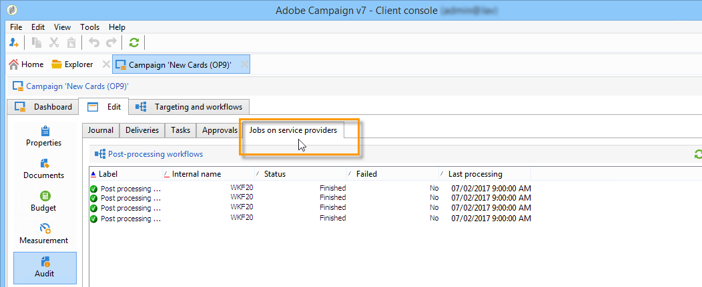

# 監控行銷活動 {#monitoring-marketing-campaigns}

## 追蹤行銷活動 {#tracking-a-campaign}

對於每個促銷活動， **[!UICONTROL Tracking]** 索引標籤可讓您檢視所有作業及其狀態。 可透過此子標籤存取下列資訊：

* 活動日記帳一般會顯示在促銷活動上執行的工作：工作流程建立或啟動、核准、提取等。

   

* 此 **[!UICONTROL Deliveries]** 子索引標籤包含可從此檢視編輯的促銷活動的所有傳送。 若要這麼做，請選取傳送，然後按一下 **[!UICONTROL Detail]** 表徵圖。

   

* 此 **[!UICONTROL Tasks]** 子索引標籤會將連結至促銷活動的所有工作分組。 此檢視可讓您編輯或刪除它們。 MRM應用程式可以使用任務。 詳細資訊於 [本節](../../mrm/using/creating-and-managing-tasks.md).

   

* 為產生服務提供者訊息而建立的工作流程顯示在 **[!UICONTROL Jobs on service providers]** 頁簽。 按一下 **[!UICONTROL Detail]** 圖示來顯示選取的工作流程。

   

## 傳遞追蹤 {#delivery-tracking}

傳遞清單可透過 **[!UICONTROL Deliveries]** 行銷活動節點的連結。

對於每個傳送，此清單可讓您存取關鍵指標：狀態、已鎖定的收件者數目、已連結的行銷活動等。

若要檢查傳送狀態，請編輯傳送並檢視其控制面板和標籤。

>[!NOTE]
>
>有關傳送詳細資料的資訊，請參閱 [本節](../../delivery/using/about-message-tracking.md) 區段。

## 執行追蹤 {#execution-tracking}

您可以按一下 **[!UICONTROL Deliveries]**，可透過Adobe Campaign首頁存取。 請參閱 [傳遞追蹤](#delivery-tracking).

行銷活動中執行之程式的相關資訊，會收集在 **[!UICONTROL Edit > Audit]** 標籤。 您可以在此檢視促銷活動中的傳送清單。 [了解更多](#tracking-a-campaign)。
