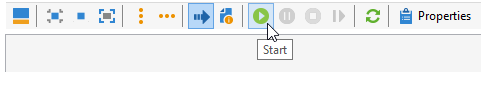
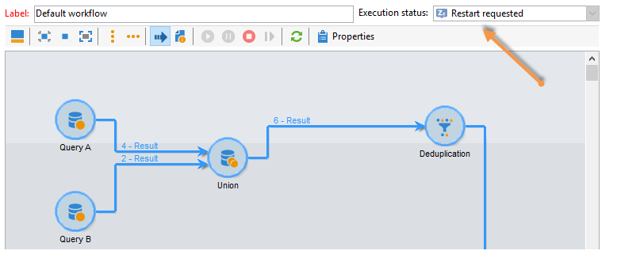
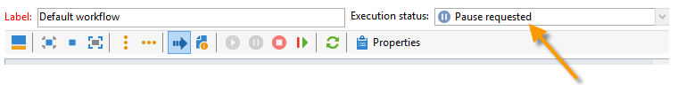
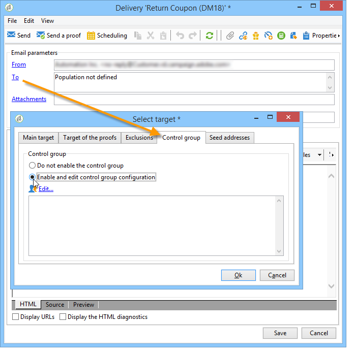
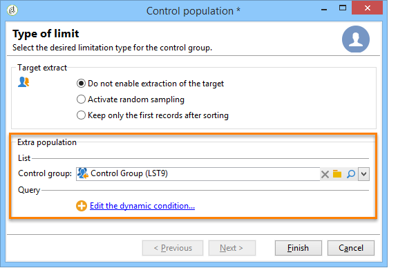

# 選取行銷活動的對象 {#marketing-campaign-deliveries}

在市場營銷市場活動中，對於每個交貨，您可以定義：

* 受眾 — 瞭解更多資訊 [在工作流中構建受眾](#building-the-main-target-in-a-workflow) 和 [選擇目標人口](#selecting-the-target-population)。
* 控制組 — 瞭解詳細資訊 [此部分](#defining-a-control-group)。
* 種子地址 — 瞭解詳情 [此部分](../../delivery/using/about-seed-addresses.md)。

某些資訊可以從 [活動模板](../../campaign/using/marketing-campaign-templates.md#campaign-templates)。

要構建傳遞目標，您可以為資料庫中的收件人定義篩選條件。 此收件人選擇模式顯示在 [此部分](../../delivery/using/steps-defining-the-target-population.md)。

## 發送到組

您可以將人口導入清單，然後在交貨中瞄準此清單。 要執行此操作，請遵循下列步驟：

1. 編輯有關的交貨，然後按一下 **[!UICONTROL To]** 連結以更改目標人口。

1. 在 **[!UICONTROL Main target]** 頁籤 **[!UICONTROL Defined via the database]** 選項 **[!UICONTROL Add]** 來修改選定線條的屬性。

1. 選擇 **[!UICONTROL A list of recipients]** 按一下 **[!UICONTROL Next]** 來修改標籤元素的屬性。

## 在市場活動工作流中構建受眾 {#building-the-main-target-in-a-workflow}

也可以在市場活動工作流中定義交貨的主要目標：此圖形環境允許您使用查詢、test和運算子構建目標：聯合、重複資料消除、共用等。

>[!IMPORTANT]
>
>在市場活動中添加的工作流不能超過28個。 超過此限制後，介面中將看不到其他工作流，並可能生成錯誤。

### 建立工作流 {#creating-a-targeting-workflow}

目標可以通過工作流中圖形序列中的過濾條件的組合來建立。 您可以建立人口和子人口，這些人口和子人口將根據您的要求成為目標。 要顯示工作流編輯器，請按一下 **[!UICONTROL Targeting and workflows]** 頁籤

通過置於工作流中的一個或多個查詢從Adobe Campaign資料庫提取目標群體。 要瞭解如何生成查詢，請參閱 [此部分](../../workflow/using/query.md)。

您可以通過Union、Intersection、Sharing、Exclusion等框啟動查詢和共用群。

從工作區左側的清單中選擇對象並連結它們以構建目標。

在圖中，將圖中目標構建所需的目標查詢和計畫查詢連結起來。 您可以在進行建設時執行目標，以檢查從資料庫提取的人口。

>[!NOTE]
>
>有關定義查詢的示例和過程，請參見 [此部分](../../workflow/using/query.md)。

編輯器的左側部分包含表示活動的圖形對象庫。 第一個頁籤包含目標活動，第二個頁籤包含流控制活動，這些活動偶爾用於協調目標活動。

目標工作流執行和格式設定功能可通過圖編輯器工具欄訪問。

>[!NOTE]
>
>有關可用於構建圖以及所有顯示和佈局功能的活動，請參見 [使用工作流自動化](../../workflow/using/architecture.md) 的子菜單。

您可以為單個市場活動建立多個目標工作流。 要添加工作流，請執行以下操作：

1. 轉到工作流建立區域的左上部分，按一下右鍵，然後選擇 **[!UICONTROL Add]**。 您還可以使用 **[!UICONTROL New]** 按鈕。

   

1. 選擇 **[!UICONTROL New workflow]** 模板並命名此工作流。
1. 按一下 **[!UICONTROL OK]** 確認工作流的建立，然後建立此工作流的圖。

### 執行工作流 {#executing-a-workflow}

目標工作流可通過 **[!UICONTROL Start]** 的子菜單。

可根據調度（調度器）或事件（外部信號、檔案導入等）對目標進行寫程式以自動執行。

與執行目標工作流（啟動、停止、暫停等）相關的操作 是 **非同步** 進程：該命令已保存，一旦伺服器可用以應用該命令，該命令即會生效。

工具欄表徵圖允許您對目標工作流的執行採取操作。

* 啟動或重新啟動

   * 的 **[!UICONTROL Start]** 表徵圖，您可以啟動目標工作流。 按一下此表徵圖時，將激活所有沒有輸入轉換的活動（端點跳轉除外）。

      

      伺服器將請求考慮在內，如其狀態所示：

      

      流程狀態更改為 **[!UICONTROL Started]**。

   * 您可以通過相應的工具欄表徵圖重新啟動目標工作流。 如果 **[!UICONTROL Start]** 表徵圖不可用，例如，當正在停止目標工作流時。 在這種情況下，按一下 **[!UICONTROL Restart]** 表徵圖以預測重新啟動。 伺服器考慮請求，其狀態顯示：

      

      然後，該流程將進入 **[!UICONTROL Started]** 狀態。

* 停止或暫停

   * 工具欄表徵圖允許您停止或暫停正在進行的目標工作流。

      按一下 **[!UICONTROL Pause]**，操作正在進行 **[!UICONTROL are not]** 已暫停，但在下次重新啟動之前不會啟動其他活動。

      

      伺服器會考慮該命令，因為其狀態顯示：

      

      您還可以在目標工作流執行到特定活動時自動暫停。 為此，按一下右鍵要暫停目標工作流的活動，然後選擇 **[!UICONTROL Enable but do not execute]**。

      

      此配置由特殊表徵圖顯示。

      

      >[!NOTE]
      >
      >此選項在高級目標市場活動設計和test階段非常有用。

      按一下 **[!UICONTROL Start]** 恢復執行。

   * 按一下 **[!UICONTROL Stop]** 表徵圖以停止正在執行的操作。

      

      伺服器會考慮該命令，因為其狀態顯示：

      
   您還可以在執行到達活動時自動停止目標工作流。 為此，按一下右鍵要停止目標工作流的活動，然後選擇 **[!UICONTROL Do not activate]**。

   

   

   此配置由特殊表徵圖顯示。

   >[!NOTE]
   >
   >此選項在高級目標市場活動設計和test階段非常有用。

* 無條件停止

   在瀏覽器中，選擇 **[!UICONTROL Administration > Production > Object created automatically > Campaign workflows]** 訪問並處理每個市場活動工作流。

   通過按一下 **[!UICONTROL Actions]** 表徵圖和選擇 **[!UICONTROL Unconditional]** 停。 此操作將終止您的市場活動工作流。

   

## 添加控制組 {#defining-a-control-group}

控制組是不能接收交貨的群體；它用於通過與收到交貨的目標群體的行為進行比較來跟蹤交貨後行為和促銷活動影響。

控制組可以從主目標中提取和/或來自特定組或查詢。

### 激活市場活動的控制組 {#activating-the-control-group-for-a-campaign}

您可以在市場活動層定義控制組，在這種情況下，控制組將應用於有關市場活動的每個交貨。

1. 編輯相關市場活動，然後按一下 **[!UICONTROL Edit]** 頁籤。
1. 按一下&#x200B;**[!UICONTROL Advanced campaign settings]**。

   

1. 選擇 **[!UICONTROL Enable and edit control group configuration]** 的雙曲餘切值。
1. 按一下 **[!UICONTROL Edit...]** 以配置控制組。

   

在中介紹了配置過程 [從主目標提取控制組](#extracting-the-control-group-from-the-main-target) 和 [添加控制組](#adding-a-population)。

### 為交貨激活控制組 {#activating-the-control-group-for-a-delivery}

您可以在交貨層定義控制組，在這種情況下，控制組將應用於有關市場活動的每個交貨。

預設情況下，在市場活動層定義的控制組配置適用於該市場活動的每個交貨。 但是，您可以為單個交貨調整控制組。

>[!NOTE]
>
>如果您為市場活動定義了控制組，並且還為連結到此市場活動的交貨配置了控制組，則只應用為交貨定義的控制組。

1. 編輯有關的交貨，然後按一下 **[!UICONTROL To]** 連結 **[!UICONTROL Email parameters]** 的子菜單。

   

1. 按一下 **[!UICONTROL Control group]** 頁籤 **[!UICONTROL Enable and edit control group configuration]**。
1. 按一下 **[!UICONTROL Edit...]** 以配置控制組。

在中介紹了配置過程 [從主目標提取控制組](#extracting-the-control-group-from-the-main-target) 和 [添加控制組](#adding-a-population)。

### 從主目標中提取控制組 {#extracting-the-control-group-from-the-main-target}

您可以從傳遞的主要目標中提取收件人。 在這種情況下，收件人將從受此配置影響的傳遞操作的目標接收。 此提取可以是隨機的，也可以是對接收者進行排序的結果。

要提取控制組，請啟用市場活動或交貨的控制組，然後選擇以下選項之一： **[!UICONTROL Activate random sampling]** 或 **[!UICONTROL Keep only the first records after sorting]**。

* **[!UICONTROL Activate random sampling]** :此選項將隨機抽樣應用於目標群體中的收件人。 如果隨後將閾值設定為100，則控制組將由從目標群體中隨機選擇的100個收件人組成。 隨機採樣取決於資料庫引擎。
* **[!UICONTROL Keep only the first records after sorting]**：此選項可讓您根據一或多個排序順序定義限制。如果選擇 **[!UICONTROL Age]** 欄位作為分類標準，然後定義100作為閾值，控制組由100個最年輕的接收者組成。 例如，定義一個控制組可能非常有意思，該控制組包括很少購買的收件人或頻繁購買的收件人，並將他們的行為與聯繫的收件人的行為進行比較。

按一下 **[!UICONTROL Next]** 定義排序順序（如有必要）並選擇收件人限制模式。

此配置等效於工作流中的共用活動，該活動允許您將目標分解為子集。 控制組是這些子集之一。 請參閱 [此部分](../../workflow/using/architecture.md) 的子菜單。

### 將新人口用作控制組 {#adding-a-population}

您可以定義要用作控制組的新填充。 此填充可以來自一組收件人，也可以通過特定查詢建立。

>[!NOTE]
>
>Adobe Campaign查詢編輯器在 [此部分](../../workflow/using/query.md)。

#### 教程視頻 {#create-email-video}

這段視頻說明了如何在Adobe Campaign建立活動和電子郵件。

>[!VIDEO](https://video.tv.adobe.com/v/25604?quality=12)

還提供了其他市場活動操作視頻 [這裡](https://experienceleague.adobe.com/docs/campaign-classic-learn/tutorials/overview.html?lang=zh-Hant)。
