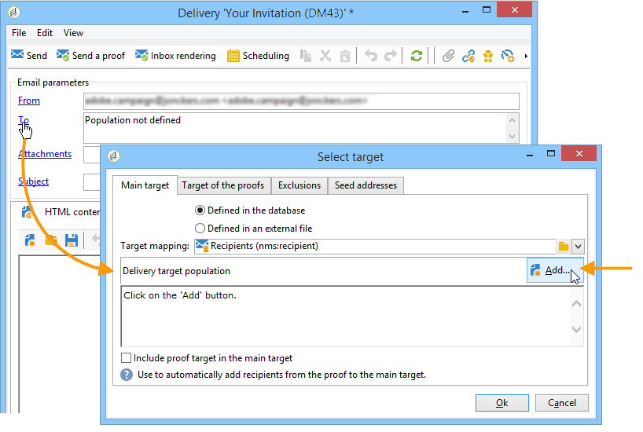
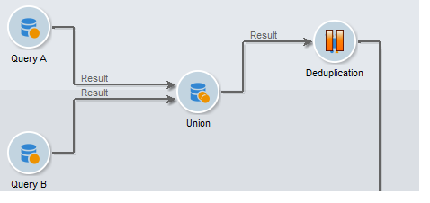

# 選取行銷活動的對象 {#marketing-campaign-deliveries}

在行銷活動中，您可以針對每個傳送定義：

* 閱聽眾 — 深入了解 [在工作流程中建立對象](#building-the-main-target-in-a-workflow) 和 [選取目標母體](#selecting-the-target-population).
* 控制組 — 深入了解 [本節](#defining-a-control-group).
* 種子地址 — 深入了解 [本節](../../delivery/using/about-seed-addresses.md).

部分此資訊可從 [行銷活動範本](../../campaign/using/marketing-campaign-templates.md#campaign-templates).

若要建立傳送目標，您可以為資料庫中的收件者定義篩選條件。 此收件者選擇模式顯示於 [本節](../../delivery/using/steps-defining-the-target-population.md).

## 傳送至群組

您可以將母體匯入清單，然後在傳送中定位此清單。 要執行此操作，請遵循下列步驟：

1. 編輯相關的傳送，然後按一下 **[!UICONTROL To]** 連結以變更目標母體。

1. 在 **[!UICONTROL Main target]** 頁簽，選擇 **[!UICONTROL Defined via the database]** 選項，然後按一下 **[!UICONTROL Add]** 來選擇收件者。

1. 選擇 **[!UICONTROL A list of recipients]** 按一下 **[!UICONTROL Next]** 來選取。

## 在行銷活動工作流程中建立對象 {#building-the-main-target-in-a-workflow}

傳遞的主要目標也可以在促銷活動工作流程中定義：此圖形環境可讓您使用查詢、測試和運算子來建立目標：聯合、重複資料刪除、共用等。

>[!IMPORTANT]
>
>行銷活動中不得新增超過28個工作流程。 若超過此限制，介面中將不會顯示其他工作流程，且可能會產生錯誤。

### 建立工作流程 {#creating-a-targeting-workflow}

您可以透過工作流程中圖形順序的篩選條件組合來建立定位。 您可以建立人口和子人口，並根據您的需求進行定位。 若要顯示工作流程編輯器，請按一下 **[!UICONTROL Targeting and workflows]** 標籤。

目標母體是透過置於工作流程中的一或多個查詢從Adobe Campaign資料庫中擷取。 若要了解如何建立查詢，請參閱 [本節](../../workflow/using/query.md).

您可以透過「聯合」、「交集」、「共用」、「排除」等方塊來啟動查詢並共用母體。

從工作區左側的清單中選取物件，並連結這些物件以建立目標。

在圖表中，在圖中連結目標建構所需的定位和排程查詢。 您可以在進行建置時執行定位，以檢查從資料庫擷取的母體。

>[!NOTE]
>
>定義查詢的範例和程式如下： [本節](../../workflow/using/query.md).

編輯器的左側區段包含代表活動的圖形物件資料庫。 第一個標籤包含定位活動，第二個標籤包含流量控制活動，這些活動偶爾用於協調定位活動。

可透過圖表編輯器工具列存取目標工作流程執行和格式功能。

>[!NOTE]
>
>在 [使用工作流程自動化](../../workflow/using/architecture.md) 指南。

您可以為單一促銷活動建立數個目標工作流程。 若要新增工作流程：

1. 前往工作流程建立區域的左上角區段，按一下右鍵，然後選取 **[!UICONTROL Add]**. 您也可以使用 **[!UICONTROL New]** 按鈕。

   

1. 選取 **[!UICONTROL New workflow]** 範本，並為此工作流程命名。
1. 按一下 **[!UICONTROL OK]** 確認建立工作流，然後建立此工作流的圖表。

### 執行工作流程 {#executing-a-workflow}

目標工作流程可透過 **[!UICONTROL Start]** 按鈕（條件是您具有相應權限）。

可以根據調度（調度器）或事件（外部信號、檔案導入等）對目標進行寫程式以自動執行。

與執行目標工作流程（啟動、停止、暫停等）相關的動作 為 **非同步** 流程：命令會儲存，當伺服器可用來套用時，該命令即會生效。

工具列圖示可讓您執行關於目標工作流程的動作。

* 啟動或重新啟動

   * 此 **[!UICONTROL Start]** 圖示可讓您啟動目標工作流程。 按一下此圖示時，所有沒有輸入轉變的活動都會啟動（端點跳轉除外）。

      

      伺服器會將請求納入考量，如其狀態所示：

      

      處理狀態變更為 **[!UICONTROL Started]**.

   * 您可以透過適當的工具列圖示，重新啟動目標工作流程。 如果 **[!UICONTROL Start]** 表徵圖不可用，例如當正在停止目標工作流時。 在此情況下，按一下 **[!UICONTROL Restart]** 表徵圖，以預測重新啟動。 伺服器會將請求納入考量，其狀態會顯示：

      

      接著，程式會進入 **[!UICONTROL Started]** 狀態。

* 停止或暫停

   * 工具列圖示可讓您停止或暫停進行中的目標工作流程。

      當您按一下 **[!UICONTROL Pause]**，操作進行中 **[!UICONTROL are not]** 已暫停，但在下次重新啟動前不會啟動其他活動。

      

      伺服器會將命令納入考量，如其狀態所示：

      

      您也可以在目標工作流程執行到達特定活動時自動暫停目標工作流程。 若要這麼做，請以滑鼠右鍵按一下要暫停目標工作流程的活動，然後選取 **[!UICONTROL Enable but do not execute]**.

      

      此設定會以特殊圖示顯示。

      

      >[!NOTE]
      >
      >在進階定位促銷活動設計和測試階段，此選項很實用。

      按一下 **[!UICONTROL Start]** 繼續執行。

   * 按一下 **[!UICONTROL Stop]** 表徵圖以停止執行。

      

      伺服器會將命令納入考量，如其狀態所示：

      
   當執行到達活動時，您也可以自動停止目標工作流程。 若要這麼做，請以滑鼠右鍵按一下將停止目標工作流程的活動，然後選取 **[!UICONTROL Do not activate]**.

   

   

   此設定會以特殊圖示顯示。

   >[!NOTE]
   >
   >在進階定位促銷活動設計和測試階段，此選項很實用。

* 無條件停止

   在瀏覽器中，選取 **[!UICONTROL Administration > Production > Object created automatically > Campaign workflows]** 存取並執行每個行銷活動工作流程。

   您可以按一下 **[!UICONTROL Actions]** 圖示並選取 **[!UICONTROL Unconditional]** 停。 此動作會終止您的促銷活動工作流程。

   

## 新增控制組 {#defining-a-control-group}

控制組是不會收到傳遞的母體；它可用來透過與已接收傳送的目標母體行為比較，來追蹤傳送後行為和促銷活動影響。

可從主目標中提取控制組和/或來自特定組或查詢。

### 為促銷活動啟動控制組 {#activating-the-control-group-for-a-campaign}

您可以在促銷活動層級定義控制組，在這種情況下，控制組將套用至相關促銷活動的每個傳送。

1. 編輯相關促銷活動，然後按一下 **[!UICONTROL Edit]** 標籤。
1. 按一下&#x200B;**[!UICONTROL Advanced campaign settings]**。

   

1. 選取 **[!UICONTROL Enable and edit control group configuration]** 選項。
1. 按一下 **[!UICONTROL Edit...]** 設定控制組。

   

配置程式如下所示： [從主目標中提取控制組](#extracting-the-control-group-from-the-main-target) 和 [新增控制組](#adding-a-population).

### 啟動傳送的控制組 {#activating-the-control-group-for-a-delivery}

您可以在傳送層級定義控制組，在此情況下，控制組將套用至相關促銷活動的每個傳送。

依預設，在促銷活動層級定義的控制組設定會套用至該促銷活動的每個傳送。 不過，您可以針對個別傳送調整控制組。

>[!NOTE]
>
>如果您已為促銷活動定義了控制組，並且也將其設定為連結至此促銷活動的傳送，則只會套用為傳送定義的控制組。

1. 編輯相關的傳送，然後按一下 **[!UICONTROL To]** 連結 **[!UICONTROL Email parameters]** 區段。

   

1. 按一下 **[!UICONTROL Control group]** ，然後選取 **[!UICONTROL Enable and edit control group configuration]**.
1. 按一下 **[!UICONTROL Edit...]** 設定控制組。

配置程式如下所示： [從主目標中提取控制組](#extracting-the-control-group-from-the-main-target) 和 [新增控制組](#adding-a-population).

### 從主目標中提取控制組 {#extracting-the-control-group-from-the-main-target}

您可以從傳送的主要目標擷取收件者。 在此情況下，收件者將從受此設定影響之傳送動作的目標中取得。 此提取可以是隨機的，也可以是排序收件者的結果。

若要擷取控制組，請啟用促銷活動或傳送的控制組，並選取下列其中一個選項： **[!UICONTROL Activate random sampling]** 或 **[!UICONTROL Keep only the first records after sorting]**.

* **[!UICONTROL Activate random sampling]** :此選項會將隨機取樣套用至目標母體中的收件者。 如果您接著將臨界值設為100，控制組將由從目標人口中隨機選取的100個收件者組成。 隨機抽樣取決於資料庫引擎。
* **[!UICONTROL Keep only the first records after sorting]**：此選項可讓您根據一或多個排序順序定義限制。如果您選取 **[!UICONTROL Age]** 欄位作為排序標準，然後將100定義為臨界值，控制組將由100個最年輕的收件者組成。 例如，定義一個控制組（包括購買次數很少的收件者或頻繁購買的收件者），並將他們的行為與已聯絡的收件者的行為進行比較，可能會很有趣。

按一下 **[!UICONTROL Next]** 定義排序順序（如有必要）並選取收件者限制模式。

此設定等同於工作流程中的共用活動，可讓您將目標細分為子集。 控制組是這些子集之一。 請參閱 [本節](../../workflow/using/architecture.md) 以取得更多資訊。

### 使用新母體作為控制組 {#adding-a-population}

您可以定義新母體以用作控制組。 此母體可以來自一組收件者，或者您可以透過特定查詢建立。

>[!NOTE]
>
>Adobe Campaign查詢編輯器顯示於 [本節](../../workflow/using/query.md).

#### 教學課程影片 {#create-email-video}

此影片說明如何在Adobe Campaign中建立行銷活動和電子郵件。

>[!VIDEO](https://video.tv.adobe.com/v/25604?quality=12)

提供其他Campaign作法影片 [此處](https://experienceleague.adobe.com/docs/campaign-classic-learn/tutorials/overview.html?lang=zh-Hant).
