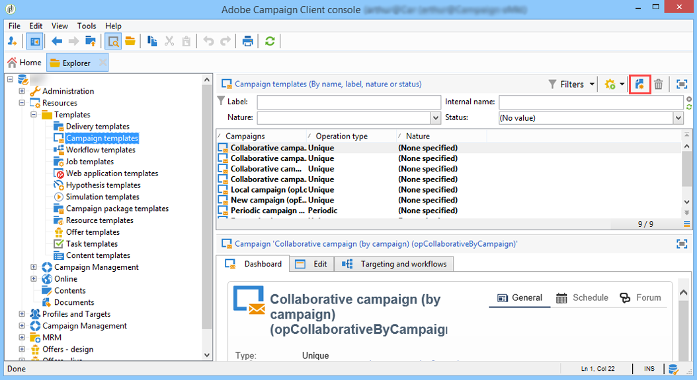
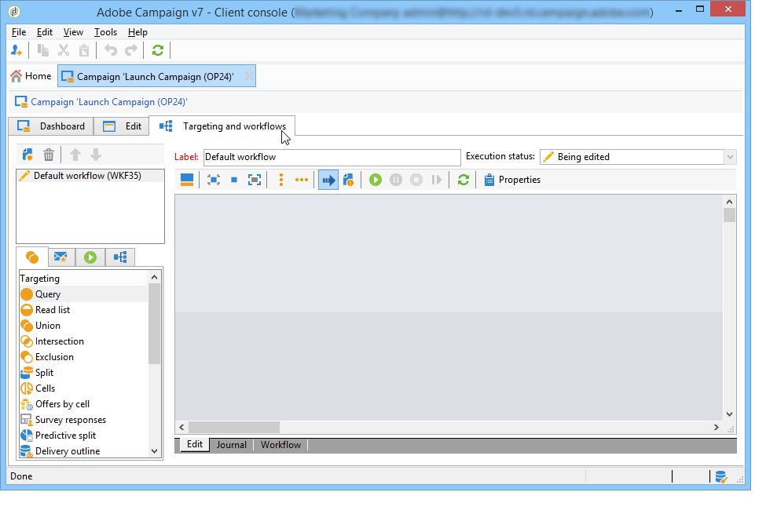

# 建立及設定行銷活動範本 {#campaign-templates}

所有行銷活動都以範本為基礎，範本會儲存主要特徵和功能。 促銷活動範本集中在&#x200B;**[!UICONTROL Resources > Templates > Campaign templates]**&#x200B;節點中。 預設範本為標準範本。 它可讓您使用所有可用模組（檔案、工作、種子地址等）建立新促銷活動，但提供的模組取決於您的權限和Adobe Campaign平台的設定。

>[!NOTE]
>
>按一下首頁上的&#x200B;**[!UICONTROL Explorer]**&#x200B;表徵圖時，將顯示樹。

提供內建範本，以建立尚未定義特定設定的行銷活動。 您可以建立和設定行銷活動範本，然後從這些範本建立行銷活動。

 如需建立促銷活動的詳細資訊，請參 [閱此影片](../../campaign/using/marketing-campaign-deliveries.md#create-email-video)。

## 建立行銷活動範本 {#creating-or-duplicating-a-campaign-template}

若要建立促銷活動範本，請遵循下列步驟：

1. 開啟促銷活動&#x200B;**瀏覽器**。
1. 在&#x200B;**資源>範本>促銷活動範本**&#x200B;中，按一下範本清單上方工具列中的&#x200B;**新增**。

   

1. 輸入新促銷活動範本的標籤。
1. 按一下&#x200B;**儲存**&#x200B;並重新開啟您的範本。
1. 在&#x200B;**Edit**&#x200B;標籤中，視需要輸入&#x200B;**內部名稱**&#x200B;和其他值。
1. 選取&#x200B;**進階促銷活動設定** ，將工作流程新增至促銷活動範本。

   

1. 將&#x200B;**目標定位和工作流程**&#x200B;值變更為&#x200B;**Yes**。

   

1. 在&#x200B;**目標定位和工作流程**&#x200B;標籤中，按一下&#x200B;**新增工作流程……**。

   

1. 填寫&#x200B;**Label**&#x200B;欄位，然後按一下&#x200B;**Ok**。
1. 根據您的需求建立工作流程。
1. 按一下「**儲存**」。 您的範本現在已可用於行銷活動。

您也可以&#x200B;**複製**&#x200B;預設範本，以重複使用和調整其設定。

促銷活動範本的各種標籤和子標籤可讓您存取其設定，如[一般設定](#general-configuration)中所述。

## 選擇模組 {#select-modules}

**[!UICONTROL Advanced campaign settings...]**&#x200B;連結可讓您根據此範本啟用和停用促銷活動的工作。 在根據此範本建立的促銷活動中，選取您要啟用的功能。

如果未選擇功能，則與流程相關的元素（菜單、表徵圖、選項、頁簽、子頁簽等） 不會顯示在範本的介面中，或根據此範本的促銷活動中。 行銷活動詳細資料左側的標籤通常與範本中選取的程式一致。 例如，如果未選取&#x200B;**費用和目標**，則根據此範本的促銷活動中將不會顯示對應的&#x200B;**[!UICONTROL Budget]**&#x200B;標籤。

此外，設定視窗的捷徑會新增至促銷活動控制面板。 啟用功能後，直接連結即可從促銷活動控制面板提供存取權。

例如，使用下列設定：

下列連結會顯示在促銷活動控制面板中（缺少&#x200B;**[!UICONTROL Add a task]**&#x200B;連結）:

只會顯示下列標籤：

但是，若使用此類型的設定：

將顯示以下連結和標籤：

## 模組的類型 {#typology-of-enabled-modules}

* **控制組**

   選取此模組時，會在範本的進階設定以及根據此範本的促銷活動中，新增另一個索引標籤。 設定可透過範本定義，或針對每個促銷活動個別定義。 進一步了解[此小節](../../campaign/using/marketing-campaign-deliveries.md#defining-a-control-group)中的控制組。

   

* **種子地址**

   選取此模組時，會在範本的進階設定以及根據此範本的促銷活動中，新增另一個索引標籤。 設定可透過範本定義，或針對每個促銷活動個別定義。 在[此小節](../../delivery/using/about-seed-addresses.md)中了解有關種子地址的詳細資訊。

   

* **檔案**

   選取此模組時，會在範本的&#x200B;**[!UICONTROL Edition]**&#x200B;標籤和根據此範本的促銷活動中新增另一個標籤。 可從範本新增附加的檔案，或針對每個促銷活動個別新增附加的檔案。 進一步了解[本節](../../campaign/using/marketing-campaign-deliveries.md#managing-associated-documents)中的文檔。

   

* **大綱**

   選取此模組時， **[!UICONTROL Delivery outlines]**&#x200B;子索引標籤會新增至&#x200B;**[!UICONTROL Documents]**&#x200B;索引標籤，以定義促銷活動的傳送大綱。 在[此小節](../../campaign/using/marketing-campaign-deliveries.md#associating-and-structuring-resources-linked-via-a-delivery-outline)中深入了解傳遞大綱。

   

* **目標定位與工作流程**

   當您選取&#x200B;**[!UICONTROL Targeting and workflows]**&#x200B;模組時，會新增一個索引標籤，讓您根據此範本為促銷活動建立一或多個工作流程。 您也可以根據此範本為每個促銷活動個別設定工作流程。請在[此區段](../../campaign/using/marketing-campaign-deliveries.md#building-the-main-target-in-a-workflow)了解更多促銷活動工作流程。

   

   啟用此模組時，會在促銷活動的進階設定中新增索引標籤，以定義程式執行順序。

   

* **核准**

   如果選擇&#x200B;**[!UICONTROL Approval]**，則可以選擇要批准的流程以及負責批准的運算子。 進一步了解[本節](../../campaign/using/marketing-campaign-approval.md#selecting-reviewers)中的核准。

   

   您可以通過模板高級設定部分的&#x200B;**[!UICONTROL Approvals]**&#x200B;頁簽選擇是否啟用進程批准。 必須批准為其選擇批准的作業才能授權郵件傳送。

   必須將審核者運算子或運算子組與每個啟用的批准相關聯。

* **費用和目標**

   選取此模組時，會在範本和促銷活動的詳細資訊中新增&#x200B;**[!UICONTROL Budget]**&#x200B;索引標籤，以便選取相關的預算。

   

## 屬性和執行 {#general-configuration}

### 範本屬性 {#template-properties}

建立促銷活動範本時，您需要輸入下列資訊：

* 輸入模板的&#x200B;**label**:依預設，會將此標籤指派給透過此範本建立的所有促銷活動。
* 從下拉式清單中選取促銷活動&#x200B;**nature**。 此清單中可用的值是儲存在&#x200B;**[!UICONTROL natureOp]**&#x200B;枚舉中的值。

   >[!NOTE]
   >
   >有關枚舉的詳細資訊，請參閱[Getting Started](../../platform/using/managing-enumerations.md)部分。

* 選取促銷活動&#x200B;**類型**:唯一、循環或週期。 依預設，促銷活動範本會套用至不重複的促銷活動。 在[此區段](../../campaign/using/setting-up-marketing-campaigns.md#recurring-and-periodic-campaigns)中會詳細說明週期性和定期的促銷活動。
* 指定促銷活動的持續時間，即促銷活動將發生的天數。 根據此範本建立促銷活動時，促銷活動開始和結束日期將自動填入。

   如果促銷活動是重複的，您必須直接在範本中指定促銷活動的開始和結束日期。

* 指定模板的&#x200B;**相關程式**:根據此範本的促銷活動將連結至選取的方案。

### 範本執行參數 {#template-execution-parameters}

**[!UICONTROL Advanced campaign settings...]**&#x200B;連結可讓您設定範本的進階選項，以處理傳送目標（控制組、種子地址等） 以及行銷活動測量和工作流程執行的設定。

## 追蹤促銷活動執行{#campaign-reverse-scheduling}

您可以建立促銷活動的排程並追蹤成績，例如為特定日期準備事件排程。 現在，行銷活動範本可讓您根據行銷活動的結束日期計算任務的開始日期。

在任務配置框中，轉到&#x200B;**[!UICONTROL Implementation schedule]**&#x200B;區域並選中&#x200B;**[!UICONTROL The start date is calculated based on the campaign end date]**&#x200B;框。 （在此，「開始日期」是任務開始日期）。 前往&#x200B;**[!UICONTROL Start]**&#x200B;欄位並輸入間隔：任務會在促銷活動結束日期之前很久開始。 如果您輸入的期間長於促銷活動設為最後的期間，則任務將在促銷活動之前開始。

使用此範本建立促銷活動時，系統會自動計算任務開始日期。 不過，您隨時可以稍後變更。
