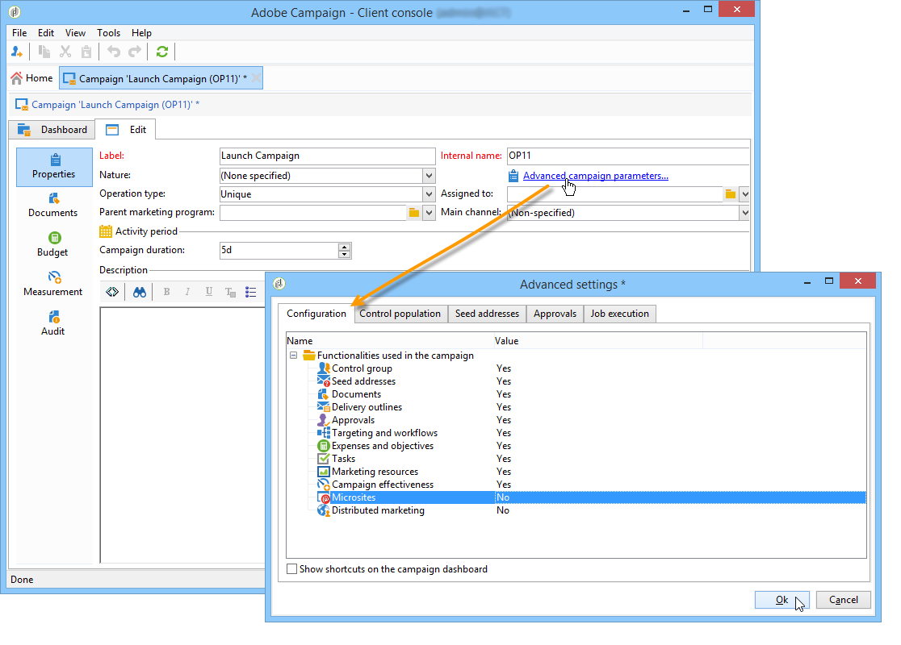

# 建立及設定行銷活動範本 {#campaign-templates}

所有行銷活動都以範本為基礎，範本會儲存主要特徵和功能。 行銷活動範本集中於 **[!UICONTROL Resources > Templates > Campaign templates]** 節點。 預設範本為標準範本。 它可讓您使用所有可用模組（檔案、工作、種子地址等）建立新促銷活動，但提供的模組取決於您的權限和Adobe Campaign平台的設定。

>[!NOTE]
>
>當您按一下 **[!UICONTROL Explorer]** 表徵圖。

提供內建範本，以建立尚未定義特定設定的行銷活動。 您可以建立和設定行銷活動範本，然後從這些範本建立行銷活動。

 如需建立促銷活動的詳細資訊，請參閱 [此影片](../../campaign/using/marketing-campaign-deliveries.md#create-email-video).

## 建立行銷活動範本 {#creating-or-duplicating-a-campaign-template}

若要建立促銷活動範本，請遵循下列步驟：

1. 開啟促銷活動 **瀏覽器**.
1. 在 **資源>範本>行銷活動範本**，按一下 **新增** 在模板清單上方的工具欄中。

   

1. 輸入新促銷活動範本的標籤。
1. 按一下 **儲存** 並重新開啟您的範本。
1. 在 **編輯** ，輸入 **內部名稱** 和其他值。
1. 選擇 **進階促銷活動設定** 將工作流程新增至行銷活動範本。

   

1. 變更 **目標定位與工作流程** 值 **是**.

   

1. 在 **目標定位與工作流程** 按一下 **添加工作流……**.

   

1. 完成 **標籤** 欄位，按一下 **確定**.
1. 根據您的需求建立工作流程。
1. 按一下「**儲存**」。您的範本現在已可用於行銷活動。

您也可以 **重複** 重複使用和調整其配置的預設模板。

促銷活動範本的各種標籤和子標籤可讓您存取其設定，如 [一般配置](#general-configuration).

## 選擇模組 {#select-modules}

此 **[!UICONTROL Advanced campaign settings...]** 連結可讓您根據此範本來啟用和停用促銷活動的工作。 在根據此範本建立的促銷活動中，選取您要啟用的功能。

如果未選擇功能，則與流程相關的元素（菜單、表徵圖、選項、頁簽、子頁簽等） 不會顯示在範本的介面中，或根據此範本的促銷活動中。 行銷活動詳細資料左側的標籤通常與範本中選取的程式一致。 例如，若 **費用和目標** 未選取，則對應 **[!UICONTROL Budget]** 標籤不會顯示在以此範本為基礎的促銷活動中。

此外，設定視窗的捷徑會新增至促銷活動控制面板。 啟用功能後，直接連結即可從促銷活動控制面板提供存取權。

例如，使用下列設定：

下列連結會顯示在促銷活動控制面板( **[!UICONTROL Add a task]** 連結遺失):

只會顯示下列標籤：

但是，若使用此類型的設定：

將顯示以下連結和標籤：

## 模組的類型 {#typology-of-enabled-modules}

* **控制組**

   選取此模組時，會在範本的進階設定以及根據此範本的促銷活動中，新增另一個索引標籤。 設定可透過範本定義，或針對每個促銷活動個別定義。 進一步了解中的控制群組 [本節](../../campaign/using/marketing-campaign-deliveries.md#defining-a-control-group).

   

* **種子地址**

   選取此模組時，會在範本的進階設定以及根據此範本的促銷活動中，新增另一個索引標籤。 設定可透過範本定義，或針對每個促銷活動個別定義。 進一步了解種子地址，位於 [本節](../../delivery/using/about-seed-addresses.md).

   

* **文件**

   選取此模組時，會將其他索引標籤新增至 **[!UICONTROL Edition]** 範本的標籤，以及根據此範本的促銷活動。 可從範本新增附加的檔案，或針對每個促銷活動個別新增附加的檔案。 深入了解 [本節](../../campaign/using/marketing-campaign-deliveries.md#managing-associated-documents).

   

* **大綱**

   選取此模組時， **[!UICONTROL Delivery outlines]** 子標籤 **[!UICONTROL Documents]** 標籤，以定義促銷活動的傳送大綱。 進一步了解傳遞大綱，請參閱 [本節](../../campaign/using/marketing-campaign-deliveries.md#associating-and-structuring-resources-linked-via-a-delivery-outline).

   

* **目標定位和工作流程**

   選取 **[!UICONTROL Targeting and workflows]** 模組中，系統會新增標籤，讓您根據此範本為促銷活動建立一或多個工作流程。 您也可以根據此範本為每個行銷活動個別設定工作流程。進一步了解行銷活動工作流程，請參閱 [本節](../../campaign/using/marketing-campaign-deliveries.md#building-the-main-target-in-a-workflow).

   

   啟用此模組時，會在促銷活動的進階設定中新增索引標籤，以定義程式執行順序。

   

* **核准**

   如果您選取 **[!UICONTROL Approval]**，您可以選取要核准的程式，以及負責核准的運算子。 進一步了解核准 [本節](../../campaign/using/marketing-campaign-approval.md#selecting-reviewers).

   

   您可以選擇是否通過 **[!UICONTROL Approvals]** 頁簽。 必須批准為其選擇批准的作業才能授權郵件傳送。

   必須將審核者運算子或運算子組與每個啟用的批准相關聯。

* **費用和目標**

   選取此模組時， **[!UICONTROL Budget]** 索引標籤會新增至範本和促銷活動的詳細資訊，以便選取相關的預算。

   

## 屬性和執行 {#general-configuration}

### 範本屬性 {#template-properties}

建立促銷活動範本時，您需要輸入下列資訊：

* 輸入 **標籤** 範本中：依預設，會將此標籤指派給透過此範本建立的所有促銷活動。
* 選擇促銷活動 **性質** 從下拉式清單中。 此清單中可用的值是 **[!UICONTROL natureOp]** 枚舉。

   >[!NOTE]
   >
   >有關枚舉的詳細資訊，請參閱 [快速入門](../../platform/using/managing-enumerations.md) 區段。

* 選取 **促銷活動類型**:唯一、循環或週期。 依預設，促銷活動範本會套用至不重複的促銷活動。 循環和定期促銷活動在 [本節](../../campaign/using/setting-up-marketing-campaigns.md#recurring-and-periodic-campaigns).
* 指定促銷活動的持續時間，即促銷活動將發生的天數。 根據此範本建立促銷活動時，促銷活動開始和結束日期將自動填入。

   如果促銷活動是重複的，您必須直接在範本中指定促銷活動的開始和結束日期。

* 指定 **相關方案** 範本中：根據此範本的促銷活動將連結至選取的方案。

### 範本執行參數 {#template-execution-parameters}

此 **[!UICONTROL Advanced campaign settings...]** 連結可讓您設定範本的進階選項，以處理傳送目標（控制組、種子地址等） 以及行銷活動測量和工作流程執行的設定。

## 追蹤促銷活動執行{#campaign-reverse-scheduling}

您可以建立促銷活動的排程並追蹤成績，例如為特定日期準備事件排程。 現在，行銷活動範本可讓您根據行銷活動的結束日期計算任務的開始日期。

在任務配置框中，轉到 **[!UICONTROL Implementation schedule]** 區域並檢查 **[!UICONTROL The start date is calculated based on the campaign end date]** 框。 （在此，「開始日期」是任務開始日期）。 前往 **[!UICONTROL Start]** 欄位並輸入間隔：任務會在促銷活動結束日期之前很久開始。 如果您輸入的期間長於促銷活動設為最後的期間，則任務將在促銷活動之前開始。

使用此範本建立促銷活動時，系統會自動計算任務開始日期。 不過，您隨時可以稍後變更。
