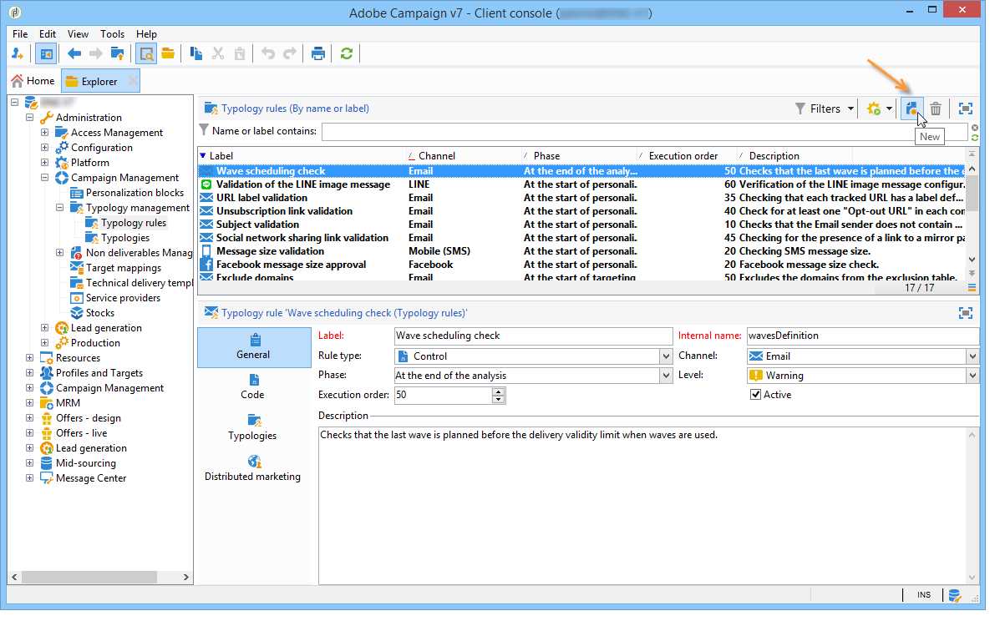

# 壓力規則{#pressure-rules}

## 關於行銷疲勞 {#about-marketing-fatigue}

實施銷售壓力管理可讓您避免過多地招攬資料庫中的人口，也稱為行銷疲勞。 若要這麼做，您可以定義每個收件者的訊息數量上限。 此外，它還可讓您在促銷活動之間實作仲裁規則，以便傳送最佳訊息給目標對象。

**壓力規則** 、管理行銷疲勞，例如將要傳送給一群用戶的信件數限制為2、選擇最符合一群用戶利益的通訊、避免傳送簡訊給不滿意的客戶等。

促銷活動會根據定義的臨界值和訊息權重來選取。

* 臨界值是指定期間內授權給特定接收者的最高遞送數。 可以是設定或變數。 在排版規則設定中設定或計算。 請參 [閱「最大消息數」](#maximum-number-of-messages)。
* 交付權重可讓您在壓力管理框架內識別最優先的交付。 具有最大權重的消息具有優先順序。 請參閱「 [消息重量](#message-weight)」。

仲裁包括確保重量大於進行中促銷活動的已排程促銷活動不會導致過多描述檔請求：如果是這樣，則會從傳送中排除描述檔。

仲裁標準（消息權重和／或閾值）可能因兩種資訊類型而異：

* 收件者偏好設定，即宣告資訊：電子報訂閱，收件者狀態（客戶或潛在客戶）,
* 收件者行為：購買、瀏覽的連結等。

用於定義合格消息的仲裁規則在分析階段期間應用。 對於每位收件者和相關期間，如果下列公式成立，則會傳送訊息： **（已發送的消息數）+（權重較大的消息數）&lt;閾值**。

否則，收件者將會是 **[!UICONTROL Excluded by arbitration]**。 如需詳細資訊，請參閱仲 [裁後排除](#exclusion-after-arbitration)。

## 建立壓力規則 {#creating-a-pressure-rule}

若要使用Adobe Campaign在促銷活動之間設定仲裁，請先建立促銷活動類型並定義連結的類型規則(**壓力規則** )。

若要建立和設定排 **[!UICONTROL Pressure]** 版規則，請套用下列步驟：

1. 在促銷活動類型規則清單中，按一下清 **[!UICONTROL New]** 單上方的圖示。

   

1. 在新規 **[!UICONTROL General]** 則的頁籤中，選擇「壓力 **類型** 」規則並輸入其名稱和說明。

   

1. 視需要變更執行順序。 當套用多個排版規則為一組 **[!UICONTROL Typology]** 時，會先套用順序較低的規則。 For more on this, refer to [Execution order](../../campaign/using/applying-rules.md#execution-order).
1. 在區 **[!UICONTROL Calculation parameters]** 段中，如果您想要儲存定位超過下次每日重新仲裁執行的時間，請定義頻率。 有關詳細資訊，請參閱調 [整計算頻率](../../campaign/using/applying-rules.md#adjusting-calculation-frequency)。
1. 按一下 **[!UICONTROL Pressure]** 標籤，然後選擇套用分類規則的日曆期間。

   

   該規則將應用於將聯繫日期納入有關期間的交貨。

   >[!NOTE]
   >
   >只有在選取選項時，才會考慮排 **[!UICONTROL Take the deliveries into account in the provisional calendar]** 程的傳送。 有關詳細資訊，請參閱 [設定句點](#setting-the-period)。

1. 定義計算最大消息數的方法。

   該閾值表示在相關期間可發送給接收者的消息的最大數量。

   依預設，臨界值為常數，您必須指出規則授權的訊息數目上限。

   

   若要定義變數臨界值，請在欄 **[!UICONTROL Depends on the recipient]** 位中選取 **[!UICONTROL Type of threshold]** 值，然後使用右側的圖示開啟運算式編輯器。

   

   有關詳細資訊，請參 [閱最大消息數](#maximum-number-of-messages)。

1. 指定計算傳送重量的方法。

   每個傳送都有權重，即表示其優先順序的值：這可讓促銷活動之間進行仲裁。 權重是使用在類型學規則和／或其屬性中定義的公式計算的。 For more on this, refer to [Message weight](#message-weight).

1. 預設情況下，所有消息都將考慮到閾值計算。 此標 **[!UICONTROL Restriction]** 簽可讓您篩選與排版規則相關的訊息：

   * 此標籤的上方區段可讓您限制相關收件者。
   * 此標籤的下方區段可讓您篩選要計算的訊息。

      在下列範例中，只會考慮儲存在 **NewContacts資料夾中的收件者** ，而且會考慮從 **** NewNewsletter開始的傳送。
   

1. 此標 **[!UICONTROL Typologies]** 簽可讓您檢視套用此規則或將規則連結至一或多個現有類型的促銷活動類型。 For more on this, refer to [Applying typologies](../../campaign/using/about-campaign-typologies.md#applying-typologies).

## 定義閾值和權重 {#defining-thresholds-and-weights}

### 最大消息數 {#maximum-number-of-messages}

每個壓力規則定義一個閾值，即在給定時間段內可以發送給一個接收者的消息的最大數量。 一旦達到此臨界值，在考慮到該期間結束之前，將不再進行交貨。 此程式可讓您在訊息超過設定的臨界值時，自動將收件者排除在傳送範圍之外，以避免過度招攬。

臨界值可以是常數，也可以是由含變數的公式計算。 這表示在指定期間，臨界值可能會因收件者而異，甚至因相同的收件者而異。

>[!CAUTION]
>
>輸入 **0** 作為閾值可防止在考慮的期間內向目標人口傳送所有交貨。

**例如：**

您可以根據收件者所屬的區段，為已授權訊息的數目建立索引。 這表示屬於網頁區段的收件者接收的訊息可能比其他收件者多。 類型 **[!UICONTROL Iif (@origin='Web', 5, 3)]** 公式可授權傳送5個訊息給收件者，其他區段則授權傳送3個訊息。 配置如下：

若要定義臨界值，您可以使用連結至定位維度的維度：例如，要包含傳送給訪客表格中儲存的收件者描述檔的訊息(如需訪客表格的詳細資訊，請參閱本節 )，或避免每週傳送多則訊息給同一家庭（可能指數個電子郵件地址），此訊息是在連結至收件者的維度中識別的。

若要這麼做，請選取 **[!UICONTROL Count messages on a linked dimension]** 選項，然後選取訪客或連絡人表格。

### 消息權重 {#message-weight}

每個傳送都有權重，代表其優先順序。 預設情況下，交貨的重量設定為5。 壓力規則可讓您定義要套用的傳送重量。

權重可以透過公式設定或計算，以符合收件者。 例如，您可以根據收件者興趣來定義交貨的權重。

>[!CAUTION]
>
>在類型學規則中定義的權重可以在標籤中針對每個傳送分別過 **[!UICONTROL Properties]** 載。 按一下 **[!UICONTROL Typology]** 標籤以選取促銷活動類型，並指定要套用的權重。\
>但是，A類型規則中宣告的權重不會用於計算B類型規則：此重量僅涉及使用A規則的交貨。

**例如：**

在下列範例中，我們想將電子報對音樂的權重與收件者的傾向分數連結。 操作步驟：

1. 建立新欄位以儲存收件者傾向分數。 在本例中， **該欄位@Music** 將豐富調查和線上投票、收集的追蹤資料等的答案。
1. 建立類型規則，以根據此欄位計算訊息權重。

   

1. 將此規則應用於具有以下主題的消息：電子報、特別優惠等。 這些遞送的權重，以及其優先順序，將取決於每個收件者的傾向分數。

## 設定期間 {#setting-the-period}

壓力規則在 **n**-day滾動期間定義。

該句點是在規則的標 **[!UICONTROL Pressure]** 簽中設定的。 您可以指定天數，並視需要選取要套用的群組類型（日、周、月、季等）。

分組類型可讓您將該 **[!UICONTROL Period considered]** 期間日期的欄位延伸至整日、日曆周、日曆月或日曆年。

例如，壓力規則定義每週2則訊息的臨界值（每個日曆月分組），將防止在同一週內傳送超過2則訊息，而在同一日曆月內傳送超過2則訊息。 警告，如果期間與兩個月重疊，計算臨界值將考慮這兩個日曆月的交貨，因此可能會阻止第二個月內的所有新交貨。

>[!NOTE]
>
>依預設，計算臨界值時只會考慮已傳送的傳送。 如果 **[!UICONTROL Take the deliveries into account in the provisional calendar]** 您也想要考慮在相關期間計畫的交貨，請選中此選項。 在這種情況下，考慮的期間加倍，以便將未來交貨和以前交貨結合起來。\
>要將考慮的交貨限制在2週期間，您可以執行以下任一操作：
>
>* 在 **欄位中** ，輸入 **[!UICONTROL Concerned period]** 15d:在運算中，將考慮到在套用規則的交貨日期前兩週前發送的交貨，
>
>  
或
>
>* 在 **欄位中輸入** 7d **[!UICONTROL Period considered]** ，並檢查 **[!UICONTROL Take the deliveries into account in the provisional calendar]**\
   >選項：在計算時，會考慮到在交貨日期前7天以及在交貨日期之後計畫的交貨，而交貨則最多在交貨日期之後7天。
>
>
期間開始日期取決於資料庫的配置方式。

例如，如果您套用15天壓力規則，而未將其分組至日期為12/11的交貨，則11/27至12/12之間的交貨將納入考量。 如果壓力規則考慮臨時日曆中的交貨，則將考慮11/27至12/27之間計畫的所有交貨。 最後，如果您在規則中設定每個日曆月的分組，則在計算臨界值時（從11/1到12/31）會考慮11月和12月的所有交貨。

>[!CAUTION]
>
>**常見案例**
>若要確保未考慮目前日曆周的傳送，以及不會冒險考慮計算臨界值的前一週的傳送，請指定 **[!UICONTROL Period considered]** at &#39;0&#39;，並選取「依日曆周分組」 **[!UICONTROL Period type]**。
> 
>當期間高於0（例如1）時，計算臨界值可能會考慮前一天的傳送。 因此，如果前一天與上一個日曆周對應，而選取的期間類型是「依每個日曆周分組」，則計算臨界值將會計入所有上一週。

**例如：**

我們想要建立壓力規則，限制每2週期間招標3則訊息，並將群組設為日曆月份。

讓我們舉辦6份同樣重量的電子報，排定05/30、06/3、06/8、06/12、06/22和06/30。

預定於6月12日和30日交貨的貨物將不寄送：06/12傳送量將超過每2週期間3則訊息的臨界值，而第30次傳送量將超過每個日曆月授權通訊量的臨界值。

在分析階段，這些交貨的所有接收者都會被仲裁排除：

對於相同規則，如果您將每季的交貨分組，則也會排除第 **5號電子報的收件者** ，而且不會傳送。

最後，如果未選取任何群組，則只 **會傳送第4號電子報** ，因為它排定在與前三個電子報相同的2週期間。

>[!NOTE]
>
>當您更改分類規則的定義時，可以建立模擬來控制它對應用的交貨的影響，並監控交貨對彼此的影響。 **** For more on this, refer to [Campaign simulations](../../campaign/using/campaign-simulations.md).

## 仲裁後排除 {#exclusion-after-arbitration}

每晚都會透過技術工作流程和工作流程 **[!UICONTROL Forecasting]** 重新進行仲裁 **[!UICONTROL Campaign jobs]** 程式。

工 **[!UICONTROL Forecasting]** 作流程會預先計算進行中期間（從開始日期到目前日期）的資料，以便在分析期間套用排版規則。 它還會重新計算每晚仲裁的排除計數器。

因此，Adobe Campaign會針對每位收件者檢查要傳送的訊息數量是否超過臨界值，並考慮到相關期間已傳送的訊息數量。 此資訊是指 **示器**，因為所有計算都會在傳送時更新。

如果此數字超過臨界值，則會套用促銷活動類型學中定義的仲裁規則，並將收件者排除在權重較低的促銷活動之外。

>[!NOTE]
>
>如果數個傳送的分數相等，則會傳送排程在最早日期的促銷活動。

## 壓力規則的使用案例 {#use-cases-on-pressure-rules}

### 基於准則的閾值調整 {#adapting-the-threshold-based-on-criterion}

我們想要建立分類規則，以防止每週向客戶傳送超過4封訊息，並防止每週向潛在客戶傳送2封訊息。

若要識別客戶和潛在客戶，請使 **[!UICONTROL Status]** 用此欄位，其中包含0代表潛在客戶，1代表客戶。

若要建立規則，請套用下列步驟：

1. 建立新的 **壓力** 類型排版規則。
1. 編輯標 **[!UICONTROL Pressure]** 簽：在該 **[!UICONTROL Maximum number of messages]** 節中，我們要建立公式以根據每個收件人計算閾值。 在欄位 **[!UICONTROL Depends on the recipient]** 中選取值 **[!UICONTROL Threshold type]** ，然後按一 **[!UICONTROL Edit expression]** 下欄位右側的 **[!UICONTROL Formula]** 值。

   按一下按 **[!UICONTROL Advanced parameters]** 鈕可定義計算公式。

   

1. 選取選 **[!UICONTROL Edit the formula using an expression]** 項並按一下 **[!UICONTROL Next]**。

   

1. 在函式清單中，按兩下節點中 **的Iif****[!UICONTROL Others]** 函式。

   然後在區段中選 **擇收件** 者的 **[!UICONTROL Available fields]** 狀態。

   

   輸入以下公式： **If(@status=0,2,4)**

   

   此公式可讓您在狀態為0時指派值2，而所有其他狀態的值4。

   按一 **[!UICONTROL Finish]** 下以核准公式。

1. 指出套用規則的期間：在此情況下為7天，以計算每週的訊息數。

   

1. 儲存規則以核准建立。

現在將您剛建立的規則連結至分類，以便套用至傳送。 操作步驟：

1. 建立促銷活動類型學。
1. 前往標 **[!UICONTROL Rules]** 簽，按一下按 **[!UICONTROL Add]** 鈕並選取您剛建立的規則。

   

1. 儲存類型學：是否已新增至現有的類型清單。

若要在傳送中使用此類型，請在傳送屬性中選取它，在標籤中 **[!UICONTROL Typology]** 如下所示：

>[!NOTE]
>
>可在傳送範本中定義類型，以便自動套用至使用此範本建立的所有傳送。

在傳送分析期間，傳送收件者會視已傳送給他們的傳送數量而排除在傳送之外（如果適用）。 若要檢視此資訊，您可以：

* 查看分析結果：

   

* 編輯傳送，然後按一 **[!UICONTROL Delivery]** 下標籤和 **[!UICONTROL Exclusions]** 子標籤：

   

* 按一 **[!UICONTROL Audit]** 下標籤，然 **[!UICONTROL Causes of exclusions]** 後是子標籤以顯示排除次數和套用的排版規則：

   

### 根據行為計算交貨重量 {#calculating-the-delivery-weight-based-on-behavior}

您可以根據收件者行為定義壓力規則：因此，遞送的重量可以適應不同於不同接受者的標準。 例如，您可以根據收件者是否瀏覽您的網際網路網站、點選上次電子報的特定區段、訂閱資訊服務，或甚至根據調查的回答、線上遊戲等，決定傳送訊息。

在下列範例中，我們要建立重量為5的傳送。 此權重會根據收件者行為來豐富傾向分數：已從此網站訂購的客戶將獲得5分，而從未線上訂購的客戶將獲得4分。

要執行此類配置，您需要使用公式來定義消息權重。 資料模型中必須能存取傾向分數和調查答案的資訊。 在我們的範例中，已 **新增** 「傾向」欄位。

套用下列設定步驟：

1. 建立新的 **壓力** 類型排版規則。
1. 編輯標 **[!UICONTROL Pressure]** 簽。 我們想要建立以每個個別收件者為基礎的臨界值公式：按一 **[!UICONTROL Edit expression]** 下欄位右側的圖 **[!UICONTROL Weight formula]** 示。

   

1. 預設情況下， **值** 5顯示在表達式編輯器的上部部分。 我們想要將每個收件者的傾向分數加到此權重：將游標置於5的右側，輸入+ **字元** ，然後選擇 **** 傾向欄位。

   

1. 然後，為已購買的收件者新增更高的值。 對他們來說，送貨的重量必須增加5倍，而對其他人來說，則只增加4倍。

   

1. 按一 **[!UICONTROL Finish]** 下以儲存此規則。
1. 將規則連結至促銷活動類型學，並在傳送中參照此類型學以核准它。

### 僅發送加權最高的消息 {#sending-only-the-highest-weighted-messages}

您想在同一週內傳送不超過2封訊息，每天最多2封訊息給每個收件者，而且您只想要傳送具有較高權重的訊息。

為此，您需要為相同收件者排程多個具有不同權重的傳送，並套用壓力規則以排除具有較低權重的傳送。

首先，設定壓力規則。

1. 建立壓力規則。 有關詳細資訊，請參閱 [建立壓力規則](#creating-a-pressure-rule)。
1. 在標籤 **[!UICONTROL General]** 中，選擇選 **[!UICONTROL Re-apply the rule at the start of personalization]** 項。

   

   此選項會覆寫欄位中定義的值， **[!UICONTROL Frequency]** 並在個人化階段期間自動套用規則。 有關詳細資訊，請參閱調 [整計算頻率](../../campaign/using/applying-rules.md#adjusting-calculation-frequency)。

1. 在標 **[!UICONTROL Pressure]** 簽中，選 **[!UICONTROL 7d]** 擇 **[!UICONTROL Period considered]** 作為和 **[!UICONTROL Grouping per day]** 作為 **[!UICONTROL Period type]**。
1. 選取選 **[!UICONTROL Take the deliveries into account in the provisional calendar]** 項以包含已排程的傳送。

   

   在計算時，會考慮到在交貨日期前7天以及預定在交貨日期後7天的交貨。 有關詳細資訊，請參閱 [設定句點](#setting-the-period)。

1. 在索引標 **[!UICONTROL Typologies]** 簽中，將規則連結至促銷活動類型。
1. 儲存您的變更。

現在，針對您要套用壓力規則的每個傳送建立並設定工作流程。

1. 建立促銷活動。 如需詳細資訊，請參閱[本小節](../../campaign/using/setting-up-marketing-campaigns.md#creating-a-campaign)。
1. 在促銷 **[!UICONTROL Targeting and workflows]** 活動的標籤中，新增「查 **詢** 」活動至工作流程。 For more on using this activity, refer to [this section](../../workflow/using/query.md).
1. 新增活 **[!UICONTROL Email delivery]** 動至工作流程並開啟它。 For more on using this activity, refer to [this section](../../workflow/using/delivery.md).
1. 轉到的標 **[!UICONTROL Approvals]** 簽並禁 **[!UICONTROL Delivery properties]** 用所有批准。

   

1. 在的標 **[!UICONTROL Typology]** 簽中，參 **[!UICONTROL Delivery properties]**&#x200B;考促銷活動類型學以套用規則。 定義交貨的重量。

   

1. 在傳送中，按一下並 **[!UICONTROL Scheduling]** 選取 **[!UICONTROL Schedule delivery (automatic execution when the scheduled date is reached)]**。 在此示例中，選擇選 **[!UICONTROL Use a calculation formula]** 項。
1. 將提取日期設定為10分鐘（當前日期+ 10分鐘）。
1. 將連絡人日期設定為第二天（目前日期+ 1天）。

   

   若要成功實施壓力規則排除，請務必在聯絡日期和時間之前，以及在每夜重新套用仲裁之前設定提取日期和時間。 如需詳細資訊，請參閱仲 [裁後排除](#exclusion-after-arbitration)。

1. 取消選 **[!UICONTROL Confirm the delivery before sending]** 取選項並儲存變更。
1. 對於您要傳送的每個傳送，請以類似方式繼續。 請確定您為每個傳送設定所需的重量。
1. 執行相關工作流程以準備和傳送傳送。

當套用夜間仲裁時，將排除相同接收者重量較低的傳送。 只有重量最高的交貨才會被考慮傳送。 For more on this, refer to [Message weight](#message-weight).

考慮到本週早些時候已傳送電子郵件給相關收件者，下表顯示可套用至另外兩個傳送之組態的範例。

<table> 
 <thead> 
  <tr> 
   <th> 傳送  </th> 
   <th> 核准  </th> 
   <th> 重量  </th> 
   <th> 提取日期／時間  </th> 
   <th> 聯絡日期  </th> 
   <th> 傳送開始日期／時間  </th> 
   <th> 仲裁工作流程執行日期／時間  </th> 
   <th> 傳送狀態  </th> 
   <th> 傳送（日期／時間）  </th> 
  </tr> 
 </thead> 
 <tbody> 
  <tr> 
   <td> Delivery 1  </td> 
   <td> 已禁用  </td> 
   <td> 5  </td> 
   <td> 3pm  </td> 
   <td> 上午8點（第二天）  </td> 
   <td> 2pm  </td> 
   <td> 每晚  </td> 
   <td> 已排除  </td> 
   <td> 已排除  </td> 
  </tr> 
  <tr> 
   <td> Delivery 2  </td> 
   <td> 已禁用  </td> 
   <td> 10  </td> 
   <td> 4pm  </td> 
   <td> 上午9點（第二天）  </td> 
   <td> 2pm  </td> 
   <td> 每晚  </td> 
   <td> 已傳送  </td> 
   <td> 上午9點（第二天）  </td> 
  </tr> 
 </tbody> 
</table>

在兩個傳送的提取日期過後，在兩個傳送的聯絡日期之前重新套用夜間仲裁。 這可讓您尋找所有已傳送的傳送（已處理傳送的收件者、透過廣泛記錄記錄傳送的收件者）或計畫傳送的傳送（符合接收傳送資格的收件者，透過預測記錄記錄）。

在壓力規則中定義的時段內，所有已傳送且可能已列出傳送內容後，Adobe Campaign會依權重排序，加權最高優先。 當達到壓力規則中設定的臨界值時（此處在同一週內不超過2封電子郵件），收件者會被排除在傳送範圍之外。
