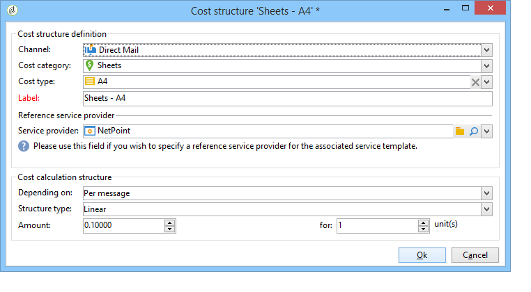

# 供應商、庫存和預算{#providers-stocks-and-budgets}

Adobe Campaign可讓您定義將參與促銷活動中所執行工作的服務供應商。 有關服務提供者和相關費用結構的資訊由Adobe Campaign管理員從主要角度定義。 服務提供商從交付中引用，其成本結構允許計算與此交付相關的成本以及管理相關庫存。

## 建立服務提供商及其成本結構{#creating-service-providers-and-their-cost-structures}

每個服務提供商都保存在包含聯繫詳細資訊、服務模板和相關作業的檔案中。

服務提供者配置在樹的&#x200B;**[!UICONTROL Administration > Campaign management]**&#x200B;節點中。

在交付期間執行的任務由服務提供商執行，特別是直接郵件和移動通道。 例如，這些服務提供商可以參與打印或分發消息。 這些作業涉及每個服務提供商專屬的配置和成本。 服務提供商的配置包括四個階段：

1. 在Adobe Campaign建立服務提供商

   請參閱[添加服務提供商](#adding-a-service-provider)。

1. 定義相關服務模板的成本類別和結構

   請參閱[定義成本類別](#defining-cost-categories)和[定義成本結構](#defining-the-cost-structure)。

1. 流程配置

   請參閱[配置與服務相關的進程](#configuring-processes-associated-with-a-service)。

1. 在促銷活動層級參考服務提供者

   請參閱[將服務與促銷活動關聯](#associating-a-service-with-a-campaign)。

### 建立服務提供商及其成本類別{#creating-a-service-provider-and-its-cost-categories}

#### 添加服務提供商{#adding-a-service-provider}

您可以視需要為傳送建立任意數量的服務供應商。 添加服務提供方的過程如下：

1. 按一下右鍵服務提供商清單並選擇&#x200B;**[!UICONTROL New]** ，或按一下服務提供商清單上方的&#x200B;**[!UICONTROL New]**&#x200B;按鈕。
1. 在窗口的下半部分，指定服務提供商的名稱和聯繫詳細資訊。

   

1. 按一下&#x200B;**[!UICONTROL Save]**&#x200B;按鈕將服務提供程式添加到清單中。

#### 定義成本類別{#defining-cost-categories}

您必須將服務模板與每個服務提供商關聯。 在這些模板中，您必須首先確定成本類別和相關庫存（如果需要）。 然後，您必須通過成本結構為每個類別建立成本計算規則。

>[!NOTE]
>
>有關詳細資訊，請參閱[定義成本結構](#defining-the-cost-structure)。

成本類別是指包含一組符合遞送類型（電子郵件、直效郵件等）資格的成本的實體。 或是任務。 成本類別被分組到與服務提供商相關的服務模板中。 每個服務提供商都可以參考一個或多個服務模板。

要建立服務模板並定義其內容，請應用以下步驟：

1. 在服務提供商的&#x200B;**[!UICONTROL Services]**&#x200B;頁籤中，按一下&#x200B;**[!UICONTROL Add]**&#x200B;按鈕並命名服務模板。

   

1. 為每種流程類型（通過直接郵件／電子郵件等發送）建立成本類別。 或工作)。 要執行此操作，請按一下&#x200B;**[!UICONTROL Cost categories]**&#x200B;頁籤，然後按一下&#x200B;**[!UICONTROL Add]**&#x200B;按鈕，然後輸入每個成本類別的參數。

   

   * 輸入此成本類別的標籤，然後選擇相關的流程類型：由&#x200B;**[!UICONTROL Direct mail]**、**[!UICONTROL E-mail]**、**[!UICONTROL Mobile]**、**[!UICONTROL Telephone]**&#x200B;或&#x200B;**[!UICONTROL Task]**&#x200B;傳送。
   * 按一下&#x200B;**[!UICONTROL Add]**&#x200B;按鈕可定義與此類別關聯的成本類型。
   * 如有必要，請將庫存行與每種成本類型關聯，以便使用的數量將自動與現有庫存關聯。

      >[!NOTE]
      >
      >庫存行在&#x200B;**[!UICONTROL Stock management]**&#x200B;節點中定義。\
      >有關詳情，請參閱[ Stock and order management](#stock-and-order-management)。

1. 您可以預先為此成本類別選擇一個值，該值將預設在服務提供商成本類別中提供（而不是空白）。 要執行此操作，請在&#x200B;**[!UICONTROL Selected]**&#x200B;列中為相關類別類型選擇選項：

   

   在傳送層級，預設會選取值：

   

### 定義成本結構{#defining-the-cost-structure}

對於每種成本類型，成本結構指定要應用的計算規則。

按一下&#x200B;**[!UICONTROL Cost structure]**&#x200B;頁籤，為每個成本類別和類型配置成本計算。 按一下&#x200B;**[!UICONTROL Add]**&#x200B;並輸入成本結構。

* 要建立成本結構，請從下拉清單中選擇消息類型和相關的成本類別，以及將應用計算規則的成本類型。 這些下拉式清單的內容來自透過&#x200B;**[!UICONTROL Cost categories]**&#x200B;標籤輸入的資訊。

   您必須為成本結構指定標籤。 依預設，它具有下列傳送大綱：**成本類別——成本類型**。

   不過，您可以重新命名它：直接在&#x200B;**[!UICONTROL Label]**&#x200B;欄位中輸入所需的值。

* 成本計算公式定義在窗口的下部。

   此公式可以是固定的（對於任意數目的消息）或根據消息數計算。

   當其取決於消息數時，成本計算結構可以是&#x200B;**[!UICONTROL Linear]**、**[!UICONTROL Linear by threshold]**&#x200B;或&#x200B;**[!UICONTROL Constant by threshold]**。

#### 線性結構{#linear-structure}

如果消息（或消息批）的金額始終相同，而不考慮消息總數，請選擇&#x200B;**[!UICONTROL Linear]**&#x200B;並輸入每條消息的成本。

如果此金額適用於一批消息，請在&#x200B;**[!UICONTROL for]**&#x200B;欄位中指定相關消息的數量。

#### 線性結構，依臨界值{#linear-structure-by-threshold}

如果金額按每條消息的閾值應用，則必須定義&#x200B;**[!UICONTROL Linear by threshold]**&#x200B;計算結構。 在這種成本結構中，每條消息的成本為0.13，例如，如果消息總數介於1到100之間，則成本為0.12，從100到1000條消息，或從1000條消息到1000條消息，成本為0.11。

配置如下：

若要新增臨界值，請按一下清單右側的&#x200B;**[!UICONTROL Add]**&#x200B;按鈕。

#### 按閾值{#constant-structure-by-threshold}設定的常數結構

最後，您可以根據消息總數配置成本計算。 要執行此操作，請選擇&#x200B;**[!UICONTROL Constant by threshold]**&#x200B;計算結構。 例如，將1到100條訊息的成本設為固定金額12.00，傳送101到1000條訊息的成本設為100.00，傳送1000條以上訊息的成本設為500.00，不論傳送總數為何。

### 配置與服務{#configuring-processes-associated-with-a-service}關聯的進程

您可以通過&#x200B;**[!UICONTROL Processes]**&#x200B;頁籤關聯與服務相關的進程資訊。

要執行此操作，請按一下&#x200B;**[!UICONTROL Processes]**&#x200B;頁籤以配置向路由器發送資訊。

* **[!UICONTROL File extraction]**&#x200B;區段會指出選取此服務時用於傳送的匯出範本。 您可以在&#x200B;**[!UICONTROL Extraction file]**&#x200B;欄位中指定輸出檔案的名稱。 欄位右側的按鈕可讓您插入變數。

   

* **[!UICONTROL Notification e-mail]**&#x200B;區段可讓您指定範本，以在傳送檔案後通知服務提供者。 選擇用於建立警報消息的模板和接收者組。

   預設情況下，通知消息的傳送模板保存在&#x200B;**[!UICONTROL Administration > Campaign management > Technical delivery templates]**&#x200B;節點中，該節點可從常規視圖訪問。

* **[!UICONTROL Post-processing]**&#x200B;區段可讓您選取傳送核准後要啟動的工作流程。 如果輸入了工作流模板，工作流實例將自動建立，然後在批准生效後立即啟動。 例如，此工作流程可將擷取檔案傳送至外部服務提供者以進行處理。

### 將服務與促銷活動{#associating-a-service-with-a-campaign}關聯

服務會透過傳送或工作與促銷活動關聯。 服務供應商會連結至傳送範本，以在透過此範本建立的傳送中提供其服務。

當選擇服務時，與傳送類型（直接郵件、電子郵件等）對應的成本類別 會自動在中央表格中指示，以及已定義的處理選項。

>[!NOTE]
>
>如果在選擇服務時未顯示任何成本類別，則表示未為此類流程定義任何成本類別。 例如，對於電子郵件傳送，如果未定義&#x200B;**[!UICONTROL E-mail]**&#x200B;類型成本類別，則不會顯示任何類別，而且選擇服務將無效。

* 對於直接郵件發送，您可以從配置窗口中選擇服務。

   

* 對於在行動頻道或電話上傳送，則採用相同的選擇模式。
* 對於電子郵件傳送，會從傳送屬性的&#x200B;**[!UICONTROL Advanced]**&#x200B;標籤中選取服務，如下列範例所示：

   

**[!UICONTROL Amount to surcharge]**&#x200B;欄可讓您在傳送或相關任務的上下文中新增此類別的成本。

您可以在定義交貨的成本類別期間強制選擇成本類型。 要執行此操作，請選擇&#x200B;**[!UICONTROL A cost type must be selected]**。

## 庫存和訂單管理{#stock-and-order-management}

成本類型可與庫存行關聯，以處理警報、跟蹤供應和啟動訂單。

在Adobe Campaign設立庫存和訂單管理，並在交貨供應不足時通知運營商的程式如下：

1. 相關服務提供商的庫存建立和引用

   請參閱[建立庫存](#creating-a-stock)。

1. 添加庫存行

   請參閱[添加庫存線](#adding-stock-lines)。

1. 在發生警報時通知營運商

   請參見[ Alerting operators](#alerting-operators)。

1. 訂單和供應。

   請參閱[訂單](#orders)。

### 股票管理{#stock-management}

Adobe Campaign可以在庫存不足或達到最低閾值時提醒一組操作員。 庫存水準可透過導覽區域的&#x200B;**[!UICONTROL Other choices]**&#x200B;連結透過&#x200B;**[!UICONTROL Campaigns]**&#x200B;標籤的&#x200B;**[!UICONTROL Stocks]**&#x200B;連結存取。

#### 建立股票{#creating-a-stock}

應用以下步驟建立新庫：

1. 按一下股票清單上方的&#x200B;**[!UICONTROL Create]**&#x200B;按鈕。
1. 輸入Stock的標籤，然後從下拉清單中選擇與其關聯的服務提供商。

   

   >[!NOTE]
   >
   >有關詳細資訊，請參閱[建立服務提供商及其成本結構](#creating-service-providers-and-their-cost-structures)。

#### 添加庫存行{#adding-stock-lines}

一種坯料包括各種坯料線。 庫存行包含交貨將消耗的初始資源數量。 每個庫存行都指明衝減的數量、庫存數量和訂購數量。

建立庫存時，按一下&#x200B;**[!UICONTROL Stock lines]**&#x200B;頁籤以添加新行。

建立庫存後，按一下它可進行編輯，並使用其儀表板建立和查看庫存行。

按一下&#x200B;**[!UICONTROL Create]**&#x200B;按鈕以定義庫存參數。

* 在&#x200B;**[!UICONTROL Initial stock]**&#x200B;欄位中指定初始庫存數量。 **[!UICONTROL Consumed]**&#x200B;和&#x200B;**[!UICONTROL In stock]**&#x200B;欄位會自動計算，並隨促銷活動進度更新。

   

* 在&#x200B;**[!UICONTROL Alert level]**&#x200B;欄位中，指出應從哪個臨界值提醒運算子訂購庫存。 到達警報級別時，使用此庫存的交貨的審批窗口中將顯示警告消息。

#### 將庫存與成本類別{#associating-a-stock-with-cost-categories}關聯

對於給定服務提供商，在服務中，庫存行可以由成本類別之一引用，如下所示：

### 股票追蹤{#stock-tracking}

#### 警報運算子{#alerting-operators}

當傳送中參考的庫存不足時，會顯示警報。 例如，當抽取檔案獲得核準時，將會顯示下列警報：

#### 訂單{#orders}

**[!UICONTROL Orders]**&#x200B;子標籤可讓您檢視目前的訂單並儲存新訂單。

要保存訂單，請編輯目標庫存行，按一下&#x200B;**[!UICONTROL Add]**&#x200B;按鈕並指定交貨日期和訂購數量。

>[!NOTE]
>
>一旦到達交貨日期，訂購的庫存行就會自動消失，而在&#x200B;**[!UICONTROL Volume on order]**&#x200B;欄位中輸入的數量將添加到&#x200B;**[!UICONTROL Tracking]**&#x200B;標籤中。 此數量會自動添加到庫存量中。

**[!UICONTROL Consumptions]**&#x200B;標籤包含每個促銷活動所耗用的量。 系統將根據執行的交貨自動輸入此標籤中的資訊。 按一下&#x200B;**[!UICONTROL Edit]**&#x200B;按鈕以開啟相關的促銷活動。

## 計算預算{#calculating-budgets}

### 原則{#principle}

系統會管理傳送和促銷活動的成本。 根據進度，該等成本會分配至預算。

促銷活動的傳送成本會在促銷活動層級進行整合，而方案的所有促銷活動的成本會傳送至與其關聯的方案。 專屬報表可讓您追蹤整個平台或每個計畫及每個方案的預算。

### 實施{#implementation}

在促銷活動中，當您選擇預算時，必須輸入初始金額。 計算成本將根據所輸入金額（支出、預計、保留、承諾）的承付水準自動更新。 請參閱[計算金額](../../campaign/using/controlling-costs.md#calculating-amounts)。

>[!NOTE]
>
>建立預算的過程在[建立預算中介紹。](../../campaign/using/controlling-costs.md#creating-a-budget)

