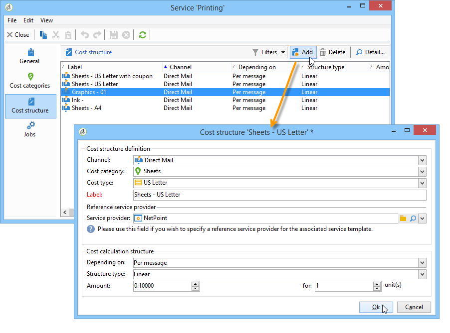

# 供應商、庫存和預算{#providers-stocks-and-budgets}

Adobe Campaign可讓您定義服務提供者，讓他們參與促銷活動內所執行的工作。 有關服務提供者與相關成本結構的資訊，由Adobe Campaign管理員從主檢視中定義。 服務提供者會從交貨中參考，其成本結構可讓您計算與此交貨相關的成本以及相關的存貨管理。

## 建立服務提供者及其成本結構 {#creating-service-providers-and-their-cost-structures}

每個服務提供者都會儲存在檔案中，內含連絡人詳細資料、服務範本及相關工作。

服務提供者設定於 **[!UICONTROL Administration > Campaign management]** 樹狀結構的節點。

傳遞期間執行的工作由服務提供商執行，尤其是直接郵件和行動頻道。 例如，這些服務提供者可參與列印或分發訊息。 這些工作涉及每個服務提供者特有的設定和成本。 服務提供者的設定涉及四個階段：

1. 在Adobe Campaign中建立服務提供者

   另請參閱 [新增服務提供者](#adding-a-service-provider).

1. 定義關聯服務樣版的成本分類與結構

   另請參閱 [定義成本類別](#defining-cost-categories) 和 [定義成本結構](#defining-the-cost-structure).

1. 流程的設定

   另請參閱 [設定與服務相關聯的程式](#configuring-processes-associated-with-a-service).

1. 在行銷活動層級參考服務提供者

   另請參閱 [將服務與行銷活動建立關聯](#associating-a-service-with-a-campaign).

### 建立服務提供者及其成本類別 {#creating-a-service-provider-and-its-cost-categories}

#### 新增服務提供者 {#adding-a-service-provider}

您可以視需要為傳遞建立儘可能多的服務提供者。 新增服務提供者的程式如下：

1. 以滑鼠右鍵按一下服務提供者清單，然後選取 **[!UICONTROL New]**，或按一下 **[!UICONTROL New]** 服務供應商清單上方的按鈕。
1. 在視窗的下半部分，指定服務提供者的名稱和聯絡詳細資訊。

   

1. 按一下 **[!UICONTROL Save]** 按鈕以將服務提供者新增至清單。

#### 定義成本類別 {#defining-cost-categories}

您必須將服務範本與每個服務提供者建立關聯。 在這些範本中，您必須先識別成本類別，並視需要識別相關的存貨。 然後，您必須透過成本結構，為每個分類建立成本計算規則。

>[!NOTE]
>
>有關詳細資訊，請參閱 [定義成本結構](#defining-the-cost-structure).

成本類別是包含一組成本的實體，符合傳送型別（電子郵件、直接郵件等） 或針對任務。 成本類別會分組在與服務提供者相關的服務範本中。 每個服務提供者都可以參考一或多個服務範本。

若要建立服務範本並定義其內容，請套用下列步驟：

1. 在 **[!UICONTROL Services]** 索引標籤，按一下 **[!UICONTROL Add]** 按鈕並命名服務範本。

   

1. 針對每種處理型別（透過直接郵件/電子郵件/等傳遞），建立成本類別。 或任務)。 若要這麼做，請按一下 **[!UICONTROL Cost categories]** 標籤然後按一下 **[!UICONTROL Add]** 按鈕，然後輸入每個成本分類的引數。

   

   * 輸入此成本分類的標籤，並選取相關處理的型態：交貨者 **[!UICONTROL Direct mail]**， **[!UICONTROL Email]**， **[!UICONTROL Mobile]**， **[!UICONTROL Telephone]** 或 **[!UICONTROL Task]**.
   * 按一下 **[!UICONTROL Add]** 按鈕，以定義與此分類相關的成本型態。
   * 必要時，將存貨明細行與每種成本型態相關聯，以便使用的數量會自動與現有存貨相關聯。

     >[!NOTE]
     >
     >坯件線定義於 **[!UICONTROL Stock management]** 節點。\
     >有關詳細資訊，請參閱 [庫存與訂單管理](#stock-and-order-management).

1. 您可以預先選取此成本類別的值，預設會在服務提供者成本類別中提供該值（而非空白）。 若要這麼做，請選取 **[!UICONTROL Selected]** 相關類別型別的欄：

   

   在傳遞層級，預設會選取值：

   

### 定義成本結構 {#defining-the-cost-structure}

對於每種成本型別，成本結構會指定要套用的計算規則。

按一下 **[!UICONTROL Cost structure]** 頁標，以設定每個成本分類與型態的成本計算。 按一下 **[!UICONTROL Add]** 並輸入成本結構。

* 若要建立成本結構，請從下拉式清單中選取訊息型別與相關的成本分類，以及計算規則將套用的成本型別。 這些下拉式清單的內容來自透過 **[!UICONTROL Cost categories]** 標籤。

  您必須為成本結構指定標籤。 依預設，它具有下列傳遞大網： **成本類別 — 成本型別**.

  不過，您可以重新命名：直接在 **[!UICONTROL Label]** 欄位。

* 成本計算公式定義於視窗的下半部。

  此公式可固定（適用於任何數量的訊息）或根據訊息數量計算。

  如果取決於訊息數量，成本計算結構可以是 **[!UICONTROL Linear]**， **[!UICONTROL Linear by threshold]**，或 **[!UICONTROL Constant by threshold]**.

#### 線性結構 {#linear-structure}

如果無論訊息總數為何，訊息（或訊息批次）的金額一律相同，請選取 **[!UICONTROL Linear]** 並輸入每則訊息的成本。

如果此金額適用於一批訊息，請在 **[!UICONTROL for]** 欄位。

#### 線性結構（依臨界值） {#linear-structure-by-threshold}

如果金額依臨界值套用至每則訊息，您必須定義 **[!UICONTROL Linear by threshold]** 計算結構。 在此型別的成本結構中，舉例來說，如果訊息總數介於1到100之間，則每則訊息的費用為0.13，而從100到1000則訊息的費用為0.12，或在1000則訊息之後為0.11。

設定如下：

若要新增臨界值，請按一下 **[!UICONTROL Add]** 按鈕以顯示在清單的右側。

#### 依據臨界值的常數結構 {#constant-structure-by-threshold}

最後，您可以根據訊息總數來設定成本計算。 若要這麼做，請選取 **[!UICONTROL Constant by threshold]** 計算結構。 例如，1到100則訊息的成本將設定為固定數量12.00,101到1000則訊息的成本將設定為100.00，超過1000則訊息的任何傳送的成本將設定為500.00，無論總數為何。

### 設定與服務相關聯的程式 {#configuring-processes-associated-with-a-service}

您可以透過以下方式與服務相關聯的程式資訊建立關聯： **[!UICONTROL Processes]** 標籤。

若要這麼做，請按一下 **[!UICONTROL Processes]** 標籤來設定傳送資訊給路由器的方式。

* 此 **[!UICONTROL File extraction]** 區段會指出選取此服務時用於傳送的匯出範本。 您可以在下列位置指出輸出檔案的名稱： **[!UICONTROL Extraction file]** 欄位。 欄位右側的按鈕可讓您插入變數。

  

* 此 **[!UICONTROL Notification email]** 區段可讓您指定在傳送檔案後通知服務提供者的範本。 選取用來建立警示訊息和收件者群組的範本。

  依預設，通知訊息的傳遞範本會儲存在 **[!UICONTROL Administration > Campaign management > Technical delivery templates]** 節點，可從一般檢視存取。

* 此 **[!UICONTROL Post-processing]** 區段可讓您選取在核准傳遞後啟動的工作流程。 如果輸入工作流程範本，則會自動建立工作流程例項，並在核准生效後立即啟動。 例如，此工作流程可將擷取檔案傳送至外部服務提供者進行處理。

### 將服務與行銷活動建立關聯 {#associating-a-service-with-a-campaign}

服務透過傳遞或任務與行銷活動相關聯。 服務提供者會連結至傳遞範本，以在透過此範本建立的傳遞中提供其服務。

選取服務時，與傳送型別（直接郵件、電子郵件等）相對應的成本類別 會連同已定義的處理選項自動在中央表格中標示。

>[!NOTE]
>
>如果選取服務時未顯示成本分類，則表示未針對此型態的處理定義成本分類。 例如，針對電子郵件傳送，如果否 **[!UICONTROL Email]** 型態成本類別已定義，不會顯示任何類別，選取服務不會有任何效果。

* 如果是直接郵件傳送，您可以從設定視窗中選取服務。

  

* 針對行動裝置頻道或電話上的傳遞，會套用相同的選取模式。
* 對於電子郵件傳遞，服務是從 **[!UICONTROL Advanced]** 標籤進行標籤，如下列範例所示：

  

此 **[!UICONTROL Amount to surcharge]** 欄可讓您在有關傳遞或任務的內容中，為此類別新增成本。

您可以在定義交貨的成本類別時，強制選擇成本型別。 要執行此操作，請選取 **[!UICONTROL A cost type must be selected]**.

## 庫存與訂單管理 {#stock-and-order-management}

成本型態可與存貨明細行相關聯，以處理警示、追蹤供給及啟動訂單。

在Adobe Campaign中設定存貨與訂單管理，以及在要執行交貨的供給不足時提醒操作員的程式如下：

1. 建立庫存及參考相關服務提供者

   另請參閱 [建立坯件](#creating-a-stock).

1. 新增坯件線

   另請參閱 [新增坯件線](#adding-stock-lines).

1. 在警示事件中通知運運算元

   另請參閱 [警示運運算元](#alerting-operators).

1. 訂單與供給。

   請參閱 [訂購](#orders).

### 庫存管理 {#stock-management}

如果庫存耗盡或達到最小臨界值，Adobe Campaign可以提醒一組操作員。 庫存水準可透過 **[!UICONTROL Stocks]** 的連結 **[!UICONTROL Campaigns]** 索引標籤，透過 **[!UICONTROL Other choices]** 導覽區域的連結。

#### 建立坯件 {#creating-a-stock}

套用下列步驟來建立新庫存：

1. 按一下 **[!UICONTROL Create]** 庫存清單上方的按鈕。
1. 輸入庫存的標籤，並從下拉式清單中選取與其關聯的服務提供者。

   

   >[!NOTE]
   >
   >有關詳細資訊，請參閱 [建立服務提供者及其成本結構](#creating-service-providers-and-their-cost-structures).

#### 新增坯件線 {#adding-stock-lines}

坯件包含各種坯件線。 庫存明細行包含交貨要消耗之資源的初始數量。 每個存貨明細行會指出已沖銷數量、存貨數量及訂購數量。

建立坯件時，按一下 **[!UICONTROL Stock lines]** 標籤以新增行。

建立坯件後，按一下它以進行編輯，並使用其圖示板來建立和檢視坯件線。

按一下 **[!UICONTROL Create]** 按鈕以定義坯件引數。

* 表示最初庫存的數量 **[!UICONTROL Initial stock]** 欄位。 此 **[!UICONTROL Consumed]** 和 **[!UICONTROL In stock]** 欄位會自動計算，並隨著行銷活動進行更新。

  

* 指出應在哪個臨界值向運運算元發出警報，以便在下列專案內訂購庫存： **[!UICONTROL Alert level]** 欄位。 達到警示等級時，使用此存貨的交貨之核准視窗中會顯示警告訊息。

#### 將存貨與成本類別產生關聯 {#associating-a-stock-with-cost-categories}

對於指定的服務提供者，在服務中，存貨明細行可由其中一個成本類別參考，如下所示：

### 庫存追蹤 {#stock-tracking}

#### 警示運運算元 {#alerting-operators}

當傳遞中參考的庫存不足時，會顯示警報。 例如，在核准摘取檔案時，會顯示下列警報：

#### 訂單 {#orders}

此 **[!UICONTROL Orders]** 子頁簽可讓您檢視目前訂單並儲存新訂單。

若要儲存訂單，請編輯目標庫存行，然後按一下 **[!UICONTROL Add]** 按鈕，並指定交貨日期與訂購數量。

>[!NOTE]
>
>一旦到達交貨日期，訂購的存貨明細行就會自動消失，而且在 **[!UICONTROL Volume on order]** 欄位已新增至 **[!UICONTROL Tracking]** 標籤。 此數量會自動新增到庫存體積中。

此 **[!UICONTROL Consumptions]** 索引標籤包含每個行銷活動使用的數量。 此索引標籤的資訊會根據執行的傳遞自動輸入。 按一下 **[!UICONTROL Edit]** 按鈕以開啟相關行銷活動。

## 正在計算預算 {#calculating-budgets}

### 原則 {#principle}

針對傳遞和行銷活動管理成本。 根據進度，這些成本會分配至預算。

行銷活動的傳遞成本會在行銷活動層級合併，而方案的所有行銷活動的成本都會傳遞至與其關聯的方案。 專用報告可讓您追蹤整個平台或每個計畫與每個方案的預算。

### 實施 {#implementation}

在行銷活動中，當您選取預算時，必須輸入初始金額。 已計算的成本將根據所輸入金額的履約承諾層次（費用、預期、預留、已承諾）自動更新。 另請參閱 [計算金額](../../mrm/using/controlling-costs.md#calculating-amounts).

>[!NOTE]
>
>建立預算的程式在中顯示 [建立預算](../../mrm/using/controlling-costs.md#creating-a-budget).
