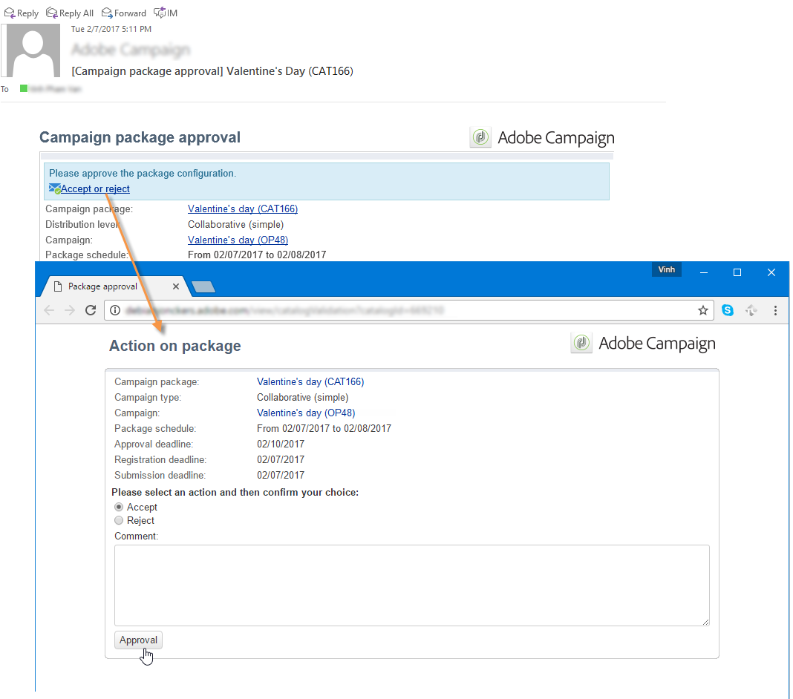

# 發佈行銷活動套件{#publishing-the-campaign-package}

中央實體運算子會將其要提供的促銷活動發佈至&#x200B;**[!UICONTROL list of campaign packages]**&#x200B;中的本機實體。

促銷活動套件必須先由中央實體核准，才能在促銷活動套件清單中發佈。 要執行此操作，您可以透過促銷活動套件中的&#x200B;**[!UICONTROL Approval parameters]**&#x200B;連結指定審核者或審核者群組。

## 指派審核者{#assigning-a-reviewer}

若要選取審核者，請按一下促銷活動套件中的&#x200B;**[!UICONTROL Approval parameters]**&#x200B;連結，然後從下拉式清單中選擇相關的審核者。

然後，您可以按一下&#x200B;**[!UICONTROL Submit for approval]**&#x200B;開始核准程式。

然後會傳送通知訊息給審核者，以確認此促銷活動套件的可用性。 該消息包含通過Web訪問接受或拒絕批准的連結。

>[!NOTE]
>
>在組織實體級別，您也可以指定審核者以批准訂單。 有關詳細資訊，請參閱[組織實體](../../campaign/using/about-distributed-marketing.md#organizational-entities)。

## 添加其他審核者{#adding-other-reviewers}

您可以從&#x200B;**[!UICONTROL Edit...]**&#x200B;連結中新增其他審核者，該連結位於促銷活動套件的&#x200B;**[!UICONTROL Approval parameters...]**&#x200B;標籤中。

## 批准期{#approval-periods}

預設情況下，審核者從提交日期起3天即可處理批准。

在「編輯審核者」視窗中，您也可以設定提醒，以便在未核准促銷活動套件時傳送一或多則訊息。 要執行此操作，請按一下&#x200B;**[!UICONTROL Add reminder]**&#x200B;連結，然後按一下&#x200B;**[!UICONTROL Add]**&#x200B;按鈕。

提醒可在指定日期和/或提交日期後的&#x200B;**x**&#x200B;天發出。 提醒類型可在提醒表的第一列中配置。 在以下示例中，審核者將在29/01/2014上收到提醒消息，即在&#x200B;**[!UICONTROL Date]**&#x200B;列中選擇的日期之前兩天，在批准期結束前一天（即提交批准日期後兩天）收到第二個提醒。

定義程式包並提交以進行批准後，執行計畫將顯示在&#x200B;**[!UICONTROL Audit]**&#x200B;頁簽中。 它會顯示根據先前設定計算的處理期限，以及所有已設定提醒的日期。

## 透過Adobe Campaign主控台{#approving-via-the-adobe-campaign-console}核准

如果未指定審核者，或如果通知的運算子均未批准該包，則&#x200B;**[!UICONTROL Approve the package]**&#x200B;按鈕可讓您直接從促銷活動包&#x200B;**[!UICONTROL Dashboard]**&#x200B;或包概覽中進行批准。

核准後，促銷活動會發佈、新增至清單，一旦達到可用日期，當地實體便可使用。 如果在建立促銷活動時指定了本機實體，則會傳送訊息給通知群組中的運算子，讓他們知道促銷活動可用。 如果事先未指定實體，則預設情況下，所有本機實體都可使用促銷活動。 有關詳細資訊，請參閱[組織實體](../../campaign/using/about-distributed-marketing.md#organizational-entities)。
