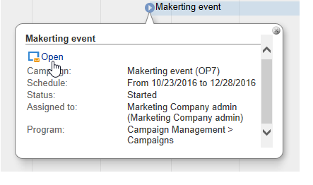
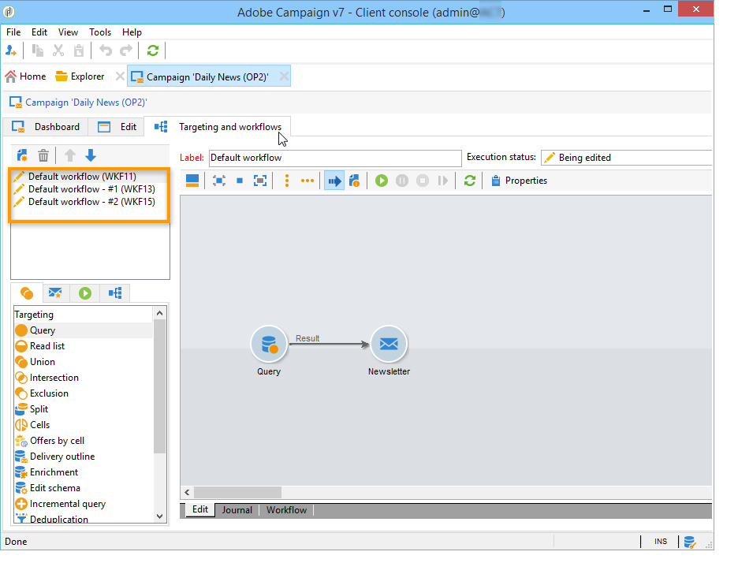
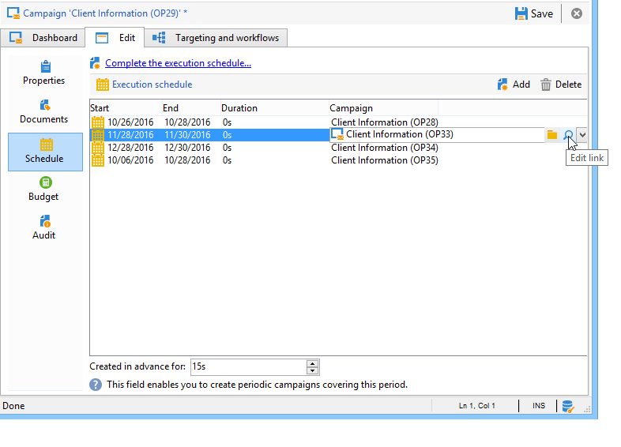

# 開始使用行銷活動{#setting-up-marketing-campaigns}

行銷活動包括動作 (傳送) 和流程 (匯入或擷取檔案)，以及資源 (行銷文件、傳遞大綱)。 它們會用於行銷活動。 行銷活動是方案的一部分，而方案則包含在行銷活動計畫中。

在影片中探索如何建立行銷計畫、方案和行銷活動

若要建立行銷活動：

1. 建立行銷活動：探索行銷活動及其特性：標籤、型別、開始和結束日期、預算、相關資源、管理員和參與者。 [了解更多](#creating-a-campaign)。

1. 定義目標母體：使用目標查詢建立工作流程。 [了解更多](../../campaign/using/marketing-campaign-deliveries.md#selecting-the-target-population)。

1. 建立傳送：選取管道並定義要傳送的內容。 [了解更多](../../campaign/using/marketing-campaign-deliveries.md#creating-deliveries)。

1. 核准傳遞。 [了解更多](../../campaign/using/marketing-campaign-approval.md)。

1. 監視傳遞。 [了解更多](../../campaign/using/marketing-campaign-monitoring.md)。

1. 計畫行銷活動和相關成本。 [了解更多](../../campaign/using/providers-stocks-and-budgets.md#creating-service-providers-and-their-cost-structures)。

完成這些步驟後，您可以開始傳遞（請參閱[本區段](../../campaign/using/marketing-campaign-deliveries.md#starting-a-delivery)）、檢查與傳遞相關的資料、流程和資訊，並在必要時管理相關檔案（請參閱[本區段](../../campaign/using/marketing-campaign-deliveries.md#managing-associated-documents)）。 您也可以追蹤行銷活動和傳遞的處理階段執行情況（請參閱[本區段](../../campaign/using/marketing-campaign-monitoring.md)）。

## 建立計畫和方案階層 {#creating-plan-and-program-hierarchy}

若要設定行銷計畫和方案的資料夾階層：

1. 按一下首頁上的&#x200B;**總管**&#x200B;圖示。
1. 在您要建立計畫的資料夾上按一下滑鼠右鍵。
1. 選取&#x200B;**新增資料夾>行銷活動管理>計畫**。

   

1. 重新命名計畫。
1. 在新建立的計畫上按一下滑鼠右鍵，然後選取&#x200B;**屬性……**。

   

1. 在&#x200B;**一般**&#x200B;索引標籤中，修改&#x200B;**內部名稱**&#x200B;以避免在套件匯出期間重複。
1. 按一下「**儲存**」。
1. 在新建立的計畫上按一下滑鼠右鍵，然後選取&#x200B;**建立新的「方案」資料夾**。
1. 重複上述步驟，重新命名新的程式資料夾及其內部名稱。

## 建立行銷活動 {#creating-a-campaign}

### 新增行銷活動 {#adding-a-campaign}

您可以透過行銷活動清單建立行銷活動。 若要顯示此檢視，請在&#x200B;**[!UICONTROL Campaigns]**&#x200B;儀表板中選取&#x200B;**[!UICONTROL Campaigns]**&#x200B;功能表。

**[!UICONTROL Program]**&#x200B;欄位可讓您選取要附加行銷活動的方案。 此資訊是強制性的。

行銷活動也可以透過方案建立。 若要這麼做，請按一下相關程式&#x200B;**[!UICONTROL Schedule]**&#x200B;索引標籤中的&#x200B;**[!UICONTROL Add]**&#x200B;按鈕。

當您透過方案的&#x200B;**[!UICONTROL Schedule]**&#x200B;索引標籤建立行銷活動時，該行銷活動會自動連結到相關方案。 在這種情況下，**[!UICONTROL Program]**&#x200B;欄位是隱藏的。

在行銷活動建立視窗中，選取行銷活動範本並新增行銷活動的名稱和說明。 您也可以指定行銷活動的開始和結束日期。

按一下&#x200B;**[!UICONTROL OK]**&#x200B;以建立行銷活動。 它會新增到方案排程中。

>[!NOTE]
>
>若要篩選要顯示的行銷活動，請按一下&#x200B;**[!UICONTROL Filter]**&#x200B;連結，並選取要顯示的行銷活動狀態。

### 編輯及設定行銷活動 {#editing-and-configuring-a-campaign}

然後，您可以編輯剛建立的行銷活動並定義其引數。

若要開啟並設定行銷活動，請從排程中選取行銷活動，然後按一下&#x200B;**[!UICONTROL Open]**。

這會將您導向行銷活動控制面板。

## 循環和定期行銷活動 {#recurring-and-periodic-campaigns}

循環行銷活動是基於特定範本的行銷活動，其工作流程已設定為根據關聯的排程執行。 因此，工作流程將在行銷活動中重複出現。 目標定位會在每次執行時重複，並追蹤各種流程和目標母體。 您也可以在自動建立工作流程期間，透過涵蓋期間預先執行未來目標，以啟動目標預估的模擬。

定期行銷活動是根據其範本的執行排程自動建立的行銷活動。

### 建立週期性行銷活動 {#creating-a-recurring-campaign}

循環行銷活動是從定義要執行的工作流程範本和執行排程的特定範本建立。

#### 建立週期性行銷活動的範本 {#creating-the-campaign-template}

1. 建立&#x200B;**[!UICONTROL Recurring]**&#x200B;行銷活動範本。

   >[!NOTE]
   >
   >建議您複製預設範本，而非建立空白範本。

   

1. 輸入範本名稱和行銷活動的持續時間。

   

1. 針對此型別的行銷活動，已新增&#x200B;**[!UICONTROL Schedule]**&#x200B;索引標籤以建立範本執行排程。

在此索引標籤中，根據此範本指定行銷活動的計畫執行日期。

執行排程的設定模式與工作流程的&#x200B;**[!UICONTROL Scheduler]**&#x200B;物件一致。 如需詳細資訊，請參閱[本章節](../../workflow/using/architecture.md)。

>[!IMPORTANT]
>
>必須小心執行執行排程設定，以避免資料庫超載。 週期性行銷活動會根據指定的排程複製其範本的工作流程。 執行過於頻繁的工作流程建立可能會阻礙資料庫的操作。

1. 在&#x200B;**[!UICONTROL Create in advance for]**&#x200B;欄位中指定一個值，以便在指定的期間內建立對應的工作流程。
1. 使用目標引數以及一或多個一般傳送，根據此範本建立要用於行銷活動的工作流程範本。

   >[!NOTE]
   >
   >此工作流程必須儲存為週期性工作流程範本。 若要這麼做，請編輯工作流程屬性，並在&#x200B;**[!UICONTROL Execution]**&#x200B;索引標籤中選取&#x200B;**[!UICONTROL Recurring workflow template]**&#x200B;選項。

   

#### 建立週期性行銷活動 {#create-the-recurring-campaign}

若要建立週期性行銷活動，並根據範本中定義的排程執行其工作流程，請套用下列程式：

1. 根據週期性行銷活動範本建立新的行銷活動。
1. 填寫工作流程執行排程。

   

1. 行銷活動排程可讓您輸入每行的自動工作流程建立或執行開始日期。

   您可以為每行新增下列其他選項：

   * **[!UICONTROL To be approved]** ：讓您在工作流程中強制傳遞核准請求。
   * **[!UICONTROL To be started]** ：可讓您在到達開始日期時開始工作流程。

   **[!UICONTROL Create in advance for]**&#x200B;欄位可讓您建立涵蓋輸入期間的所有工作流程。

   在執行&#x200B;**[!UICONTROL Jobs on campaigns]**&#x200B;工作流程時，會根據行銷活動排程中定義的發生次數來建立專用工作流程。 因此，會為每個執行日期建立工作流程。

1. 循環工作流程是從行銷活動中存在的工作流程範本自動建立。 可從行銷活動的&#x200B;**[!UICONTROL Targeting and workflows]**&#x200B;索引標籤中看到。

   

   循環工作流程例項的標籤由其範本標籤和工作流程編號組成，其中的#字元介於。

   從排程建立的工作流程會自動與&#x200B;**[!UICONTROL Schedule]**&#x200B;索引標籤的&#x200B;**[!UICONTROL Workflow]**&#x200B;欄相關聯。

   

   每個工作流程都可以從此索引標籤進行編輯。

   

   >[!NOTE]
   >
   >與工作流程相關之排程明細行的開始日期可從工作流程的變數取得，其語法如下：\
   >`$date(instance/vars/@startPlanningDate)`

### 建立定期行銷活動 {#creating-a-periodic-campaign}

定期行銷活動是根據特定範本的行銷活動，可讓您根據執行排程建立行銷活動執行個體。 系統會根據週期性行銷活動範本，根據範本排程中定義的頻率，自動建立行銷活動例項。

#### 建立行銷活動範本 {#creating-the-campaign-template-1}

1. 建立&#x200B;**[!UICONTROL Periodic]**&#x200B;行銷活動範本，最好是複製現有的行銷活動範本。

   

1. 輸入範本的屬性。

   >[!NOTE]
   >
   >指派範本的操作者需要具備在選定方案中建立行銷活動的適當許可權。

1. 建立與此範本關聯的工作流程。 範本建立的每個定期行銷活動都會複製該資料。

   

   >[!NOTE]
   >
   >此工作流程是工作流程範本。 無法從行銷活動範本執行此動作。

1. 完成其定期行銷活動範本的執行排程：按一下&#x200B;**[!UICONTROL Add]**&#x200B;按鈕並定義開始和結束日期，或透過連結填寫執行排程。

   

   >[!IMPORTANT]
   >
   >定期行銷活動範本會根據上述定義的排程建立新的行銷活動。 因此，必須小心完成，以避免Adobe Campaign資料庫超載。

1. 一旦達到執行開始日期，就會自動建立相符的行銷活動。 它會使用其範本的所有特性。

   每個行銷活動都可透過範本排程進行編輯。

   

每個定期行銷活動都包含相同的元素。 建立後，即作為標準行銷活動進行管理。

## 教學課程影片 {#video}

本影片說明如何建立行銷計畫、方案和行銷活動。

>[!VIDEO](https://video.tv.adobe.com/v/35132?quality=12)

[此處](https://experienceleague.adobe.com/docs/campaign-classic-learn/tutorials/overview.html?lang=zh-Hant)提供其他Campaign操作說明影片。
