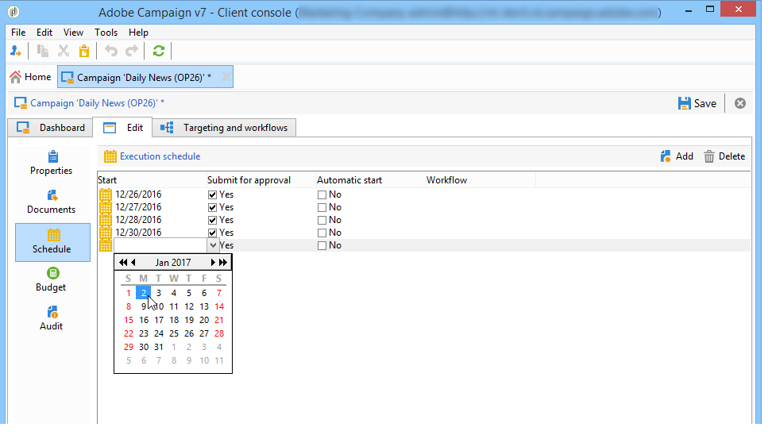
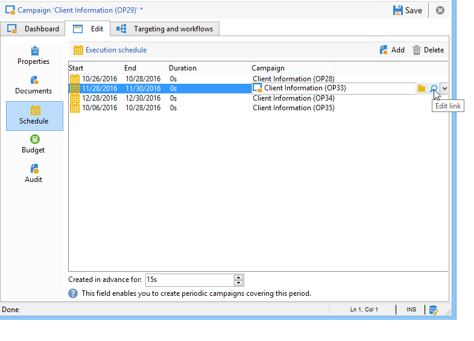

# 開始使用行銷活動{#setting-up-marketing-campaigns}

行銷活動包括動作 (傳送) 和流程 (匯入或擷取檔案)，以及資源 (行銷文件、傳遞大綱)。 它們會用於行銷活動。 行銷活動是方案的一部分，而方案則包含在行銷活動計畫中。

 瞭解如何建立營銷計畫、計畫和市場活動 [視頻](#video)

要建立市場營銷市場活動，請執行以下操作：

1. 建立市場活動：發現活動及其特點：標籤、類型、起始日期和終止日期、預算、關聯資源、經理和參與者。 [了解更多資訊](#creating-a-campaign)。

1. 定義目標人口：建立具有目標查詢的工作流。 [了解更多資訊](../../campaign/using/marketing-campaign-deliveries.md#selecting-the-target-population)。

1. 建立交貨：選擇頻道並定義要發送的內容。 [了解更多資訊](../../campaign/using/marketing-campaign-deliveries.md#creating-deliveries)。

1. 審核交貨。 [了解更多資訊](../../campaign/using/marketing-campaign-approval.md)。

1. 監視交貨。 [了解更多資訊](../../campaign/using/marketing-campaign-monitoring.md)。

1. 計畫市場活動和關聯成本。 [了解更多資訊](../../campaign/using/providers--stocks-and-budgets.md#creating-service-providers-and-their-cost-structures)。

完成這些步驟後，您可以開始交貨(請參閱 [此部分](../../campaign/using/marketing-campaign-deliveries.md#starting-a-delivery))，檢查與交貨相關的資料、流程和資訊，並在必要時管理相關文檔(請參閱 [此部分](../../campaign/using/marketing-campaign-deliveries.md#managing-associated-documents))。 您還可以跟蹤市場活動和交貨處理階段的執行情況(請參閱： [此部分](../../campaign/using/marketing-campaign-monitoring.md))。

## 建立計畫和方案層次結構 {#creating-plan-and-program-hierarchy}

要為市場營銷計畫和計畫配置資料夾層次結構，請執行以下操作：

1. 按一下 **瀏覽器** 表徵圖
1. 按一下右鍵要在其中建立計畫的資料夾。
1. 選擇 **添加新資料夾>Campaign Management>計畫**。

   

1. 更名計畫。
1. 按一下右鍵新建立的計畫並選擇 **屬性……**。

   

1. 在 **常規** 頁籤 **內部名稱** 在包導出過程中避免重複。
1. 按一下 **保存**。
1. 按一下右鍵新建立的計畫並選擇 **新建「Program」資料夾**。
1. 重複上述步驟以更名新程式資料夾及其內部名稱。

## 建立促銷活動 {#creating-a-campaign}

### 添加市場活動 {#adding-a-campaign}

您可以通過市場活動清單建立市場活動。 要顯示此視圖，請選擇 **[!UICONTROL Campaigns]** 的 **[!UICONTROL Campaigns]** 控制項欄。

的 **[!UICONTROL Program]** 欄位中，您可以選擇市場活動將附加到的方案。 此資訊是強制性的。

還可以通過計畫建立市場活動。 要執行此操作，請按一下 **[!UICONTROL Add]** 按鈕 **[!UICONTROL Schedule]** 頁籤。

當通過 **[!UICONTROL Schedule]** 頁籤，市場活動將自動連結到相關的計畫。 的 **[!UICONTROL Program]** 的下界。

在市場活動建立窗口中，選擇市場活動模板並添加市場活動的名稱和說明。 您還可以指定市場活動起始日期和終止日期。

按一下 **[!UICONTROL OK]** 建立市場活動。 它被添加到程式計畫中。

>[!NOTE]
>
>要篩選要顯示的市場活動，請按一下 **[!UICONTROL Filter]** 連結並選擇要顯示的市場活動狀態。

### 編輯和配置市場活動 {#editing-and-configuring-a-campaign}

然後，您可以編輯剛剛建立的市場活動並定義其參數。

要開啟和配置市場活動，請從計畫中選擇市場活動，然後按一下 **[!UICONTROL Open]**。

這會將您帶到市場活動控制板。

## 定期市場活動 {#recurring-and-periodic-campaigns}

循環市場活動是基於特定模板的市場活動，其工作流被配置為根據關聯的計畫執行。 因此，工作流將在市場活動中循環。 在每個執行上複製目標，並跟蹤各種進程和目標群體。 在自動工作流建立期間，還可以通過覆蓋期提前執行未來目標，以便利用目標估計啟動模擬。

定期市場活動是根據其模板的執行計畫自動建立的市場活動。

### 建立定期市場活動 {#creating-a-recurring-campaign}

根據定義要執行的工作流模板和執行計畫的特定模板建立週期性市場活動。

#### 為定期市場活動建立模板 {#creating-the-campaign-template}

1. 建立 **[!UICONTROL Recurring]** 市場活動模板。

   >[!NOTE]
   >
   >建議複製預設模板，而不是建立空模板。

   

1. 輸入模板名稱和市場活動持續時間。

   

1. 對於此類活動， **[!UICONTROL Schedule]** 的子菜單。

在此標籤中，指定基於此模板的市場活動的計畫執行日期。

執行計畫的配置模式與 **[!UICONTROL Scheduler]** 工作流的對象。 如需詳細資訊，請參閱[本章節](../../workflow/using/architecture.md)。

>[!IMPORTANT]
>
>必須小心執行執行計畫配置，以避免使資料庫過載。 定期市場活動複製其模板的工作流，具體取決於指定的計畫。 過頻繁的工作流建立的實現會阻礙資料庫的運行。

1. 在 **[!UICONTROL Create in advance for]** 欄位，以建立所指示期間的相應工作流。
1. 根據此模板建立要在市場活動中使用的工作流模板，其中包含目標參數和一個或多個常規交貨。

   >[!NOTE]
   >
   >此工作流必須另存為循環工作流模板。 為此，請編輯工作流屬性並選擇 **[!UICONTROL Recurring workflow template]** 的上界 **[!UICONTROL Execution]** 頁籤。

   

#### 建立定期市場活動 {#create-the-recurring-campaign}

要根據模板中定義的計畫建立定期市場活動並執行其工作流，請應用以下過程：

1. 根據定期市場活動模板建立新市場活動。
1. 填寫工作流執行計畫。

   

1. 市場活動計畫允許您為每個行輸入自動工作流建立或執行起始日期。

   對於每個行，您可以添加以下附加選項：

   * **[!UICONTROL To be approved]** :允許您在工作流中強制提交批准請求。
   * **[!UICONTROL To be started]** :允許您在達到開始日期後啟動工作流。

   的 **[!UICONTROL Create in advance for]** 欄位中，您可以建立包含輸入期間的所有工作流。

   於執行 **[!UICONTROL Jobs on campaigns]** 工作流，專用工作流是根據市場活動計畫中定義的事件建立的。 因此為每個執行日期建立工作流。

1. 定期工作流是從市場活動中存在的工作流模板自動建立的。 從 **[!UICONTROL Targeting and workflows]** 頁籤

   

   循環工作流實例的標籤由其模板標籤和工作流編號組成，其中的#字元。

   根據計畫建立的工作流將自動與 **[!UICONTROL Workflow]** 列 **[!UICONTROL Schedule]** 頁籤。

   

   每個工作流都可以通過此頁籤進行編輯。

   

   >[!NOTE]
   >
   >與工作流關聯的計畫行的起始日期可通過工作流的變數使用以下語法獲得：\
   >`$date(instance/vars/@startPlanningDate)`

### 建立定期市場活動 {#creating-a-periodic-campaign}

定期市場活動是基於特定模板的市場活動，您可以根據執行計畫建立市場活動實例。 根據模板計畫中定義的頻率，根據定期市場活動模板自動建立市場活動實例。

#### 建立市場活動模板 {#creating-the-campaign-template-1}

1. 建立 **[!UICONTROL Periodic]** 市場活動模板，最好通過複製現有市場活動模板。

   

1. 輸入模板的屬性。

   >[!NOTE]
   >
   >分配模板的操作員需要具有在所選方案中建立市場活動的適當權限。

1. 建立與此模板關聯的工作流。 將在模板建立的每個定期市場活動中複製它。

   

   >[!NOTE]
   >
   >此工作流是工作流模板。 無法從市場活動模板執行。

1. 完成其執行計畫以作為定期市場活動模板：按一下 **[!UICONTROL Add]** 按鈕並定義起始日期和終止日期，或通過連結填寫執行計畫。

   

   >[!IMPORTANT]
   >
   >定期市場活動模板根據上述定義的計畫建立新市場活動。 因此，必須仔細完成，以避免Adobe Campaign資料庫超載。

1. 一旦達到執行開始日期，將自動建立匹配市場活動。 它承擔了模板的所有特徵。

   每個市場活動都可以通過模板計畫進行編輯。

   

每個定期市場活動都包含相同的元素。 建立後，將作為標準市場活動進行管理。

## 教程視頻 {#video}

此視頻顯示如何建立營銷計畫、計畫和市場活動。

>[!VIDEO](https://video.tv.adobe.com/v/35132?quality=12)

還提供了其他市場活動操作視頻 [這裡](https://experienceleague.adobe.com/docs/campaign-classic-learn/tutorials/overview.html?lang=zh-Hant)。
