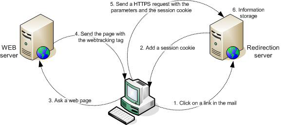

# 關於網路追蹤{#about-web-tracking}

除了顯示網際網路用戶點擊電子郵件中連結的行為的標準跟蹤外，Adobe Campaign平台還允許您收集網際網路用戶瀏覽網站的方式的資訊。 該資料收集由Web跟蹤模組執行。

當網際網路用戶按一下來自給定傳遞的電子郵件中的跟蹤連結時，重定向伺服器聯繫到保存包含廣播標識符(broadlogId)和傳遞標識符(deliveryId)的會話cookie。

然後，當用戶每次訪問包含Web跟蹤標籤的頁面時，Web客戶端將此Cookie發送到伺服器。 在整個會話中，即直到Web客戶端關閉。

重定向伺服器以這種方式收集以下資料：

* 通過作為參數發送的標識符查看的頁面的URL,
* 通過會話cookie訪問網頁的傳遞，
* 通過會話cookie按一下的Internet用戶的標識符，
* 其他資訊，如生成的業務量。

下圖顯示了客戶端和各種伺服器之間對話的各個階段。

