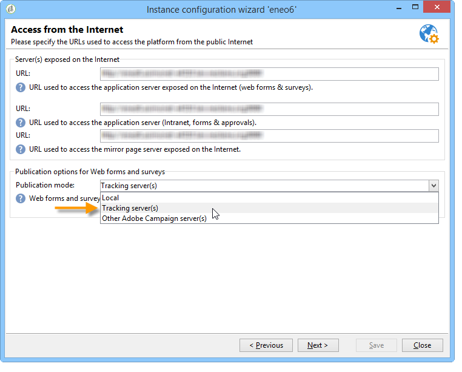

# 匿名追蹤{#anonymous-tracking}

Adobe Campaign允許您在收集的Web跟蹤資訊匿名瀏覽您的網站時將其連結到收件人。 當用戶瀏覽您網站的標籤頁面時，會收集此瀏覽資訊，這樣，一旦用戶按一下Adobe Campaign發送的電子郵件，就會識別這些用戶並自動將資訊連結到他們。

>[!IMPORTANT]
>
>在網站上設定匿名跟蹤可以觸發大量跟蹤日誌的收集，從而影響資料庫操作。 小心配置。\
>跟蹤日誌將保存在資料庫中，直到跟蹤資料被清除。 使用部署嚮導配置清除頻率。 如需詳細資訊，請參閱[本章節](../../installation/using/deploying-an-instance.md#purging-data)。

要在實例上啟用匿名Web跟蹤，必須配置以下元素：

* 的 **跟蹤Web訪問者** 參數 **重定向** 元素 **serverConf.xml** 跟蹤伺服器的檔案必須設定為「**真**&#39;，放置永久cookie(**UUID230**)的瀏覽器。
* 的 **匿名Web跟蹤** 必須在部署嚮導的跟蹤配置螢幕中選擇模式。

   

* 必須在跟蹤伺服器上發佈和執行Web表單。 必須在部署嚮導中選擇匹配選項。

   
