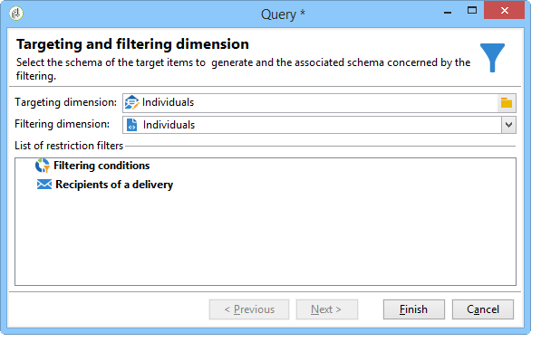

# 使用工作流建立設定檔清單{#creating-a-profile-list-with-a-workflow}

若要根據新 **[!UICONTROL List]** 的收件者表格建立類型清單，您必須建立定位工作流程，以產生清單。

如需促銷活動清單的詳細資訊，請參閱 [本節](../../platform/using/creating-and-managing-lists.md#about-lists-in-adobe-campaign)。

 [在影片中探索此功能](../../platform/using/creating-and-managing-lists.md#create-list-in-a-wf-video)

若要建立定位工作流程並在自訂收件者表格中更新收件者，請遵循下列步驟：

1. 轉至瀏 **[!UICONTROL Profiles and Targets > Jobs > Targeting workflows]** 覽器的節點。
1. 建立新的定位工作流程。
1. 放置查詢 **活動** ，後面接著 **清單更新活動** 。

   

1. 連按兩下「 **查詢** 」活動，然後按一下 **[!UICONTROL Edit the query]** ，以根據新收件者表格的架構選擇定位維度(在我們的範例中： **個人**)。 Click **[!UICONTROL Finish]** to confirm.

   

1. 連按兩下「清 **單更新** 」活動，然後選取 **[!UICONTROL Create the list if necessary (Computed name)]** 選項按鈕。

   

1. 選擇新清單的建立資料夾。
1. 執行工作流以建立清單。
1. 在活動期間選定的樹節點中查看結 **[!UICONTROL List update]** 果。

   控制面板指定清單所基於的方案，如下所示：

   

