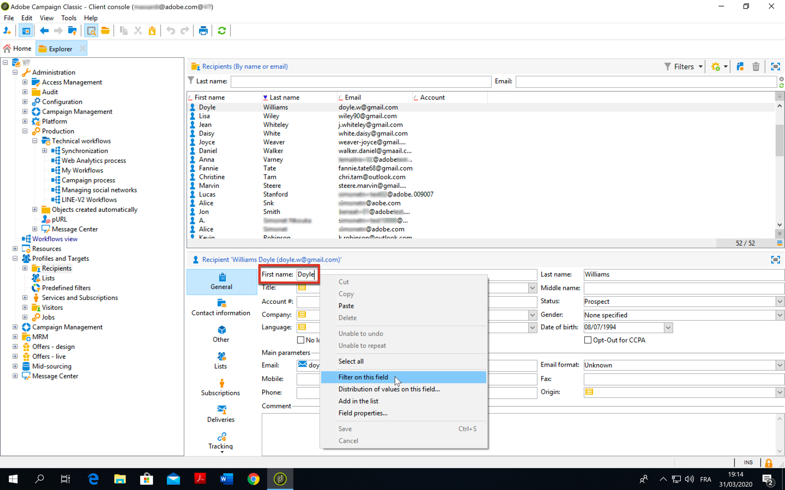
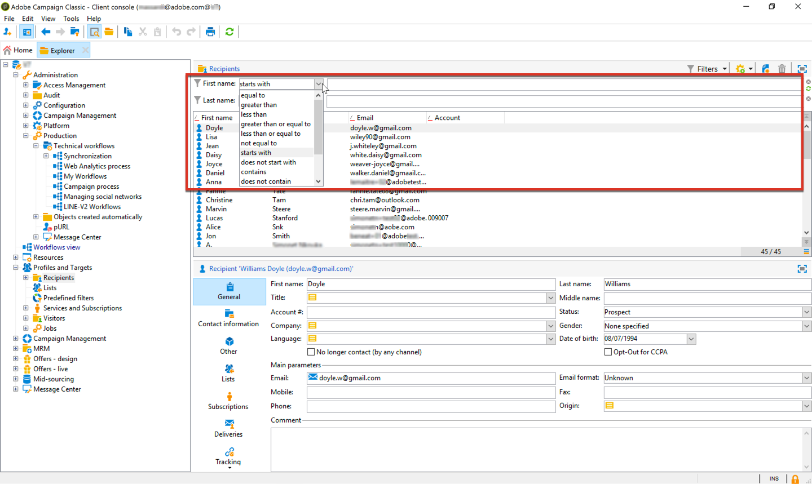

# 資料模型最佳實務{#data-model-best-practices}

本檔案概述設計Adobe Campaign資料模型時的主要建議。

如需深入瞭解Campaign內建表格及其互動，請參閱[本節](../../configuration/using/about-data-model.md)部分。

閱讀[此檔案](../../configuration/using/about-schema-reference.md)以開始使用Campaign綱要。 在[本檔案](../../configuration/using/about-schema-edition.md)中瞭解如何設定延伸結構描述，以延伸Adobe Campaign資料庫的概念資料模型。

## 概覽 {#overview}

Adobe Campaign系統極為靈活，可延伸至初始實施以外的範圍。 不過，雖然可能性是無限的，但做出明智的決策並奠定堅實的基礎以開始設計您的資料模型是至關重要的。

本檔案提供常見使用案例和最佳實務，以瞭解如何正確架構您的Adobe Campaign工具。

## 資料模型架構 {#data-model-architecture}

Adobe Campaign是功能強大的跨頻道行銷活動管理系統，可以協助您協調線上和離線策略，以建立個人化的客戶體驗。

### 以客戶為中心的方法 {#customer-centric-approach}

雖然大多數電子郵件服務提供者都是透過以清單為中心的方法與客戶通訊，但Adobe Campaign仰賴關聯式資料庫，以利用更廣大的客戶檢視及其屬性。

此以客戶為中心的方法如下圖所示。 灰色的&#x200B;**Recipient**&#x200B;表格代表要建置所有內容的主要客戶表格：

若要存取每個資料表的描述，請移至&#x200B;**[!UICONTROL Admin > Configuration > Data schemas]**，從清單中選取資源，然後按一下&#x200B;**[!UICONTROL Documentation]**&#x200B;索引標籤。

[此檔案](../../configuration/using/data-model-description.md)中顯示Adobe Campaign預設資料模型。

>[!NOTE]
>
>Adobe Campaign Classic可建置自訂客戶表格。 但是，在大多數情況下，建議使用已預先建立其他表格和功能的標準[收件者表格](../../configuration/using/about-data-model.md#default-recipient-table)。

### 適用於Adobe Campaign的資料 {#data-for-campaign}

哪些資料應該傳送至Adobe Campaign？ 決定行銷活動所需的資料至關重要。

>[!NOTE]
>
>Adobe Campaign既不是Data Warehouse也不是報表工具。 因此，請勿嘗試將所有可能的客戶及其相關資訊匯入Adobe Campaign，或匯入僅用於建置報表的資料。

若要在Adobe Campaign中決定是否需要屬性，請詢問您自己該屬性是否會屬於以下類別之一：

* 用於&#x200B;**分段**&#x200B;的屬性
* 用於&#x200B;**資料管理程式**&#x200B;的屬性（例如彙總計算）
* 用於&#x200B;**個人化**&#x200B;的屬性

如果沒有上述任何專案，您很可能不需要在Adobe Campaign中使用此屬性。

### 資料型別選擇 {#data-types}

為確保您的系統有良好的架構和效能，請遵循以下最佳實務，在Adobe Campaign中設定資料。

* 大型表格通常應該有數值欄位，並包含參照表格的連結（使用值清單時）。
* **expr**&#x200B;屬性允許將結構描述屬性定義為計算欄位，而不是表格中的實體集合值。 如此可讓您以不同格式（例如年齡和出生日期）存取資訊，而不需要儲存這兩個值。 這是避免重複欄位的好方法。 例如，收件者表格會使用網域的運算式，該運算式已存在於電子郵件欄位中。
* 但是，當運算式計算複雜時，不建議使用&#x200B;**expr**&#x200B;屬性，因為即時計算可能會影響查詢的效能。
* **XML**&#x200B;型別是避免建立太多欄位的好方法。 但它也會佔用磁碟空間，因為它使用資料庫中的CLOB欄。 這也會導致複雜的SQL查詢，並可能影響效能。
* **字串**&#x200B;欄位的長度應該一律以欄定義。 依預設，Adobe Campaign中的長度上限為255，但Adobe建議，如果您已知道大小不會超過較短的長度，請縮短欄位。
* 如果您確定來源系統中的大小被高估而無法達到，在Adobe Campaign中的欄位會比在來源系統中的欄位短，這是可以接受的。 這可能表示Adobe Campaign中的字串長度較短或整數較小。

### 欄位選擇 {#choice-of-fields}

如果欄位具有目標定位或個人化目的，則需要將其儲存在表格中。 換言之，如果欄位未用於傳送個人化電子郵件或作為查詢中的條件，則會佔用磁碟空間，而實際上毫無用處。

對於混合式和內部部署例項，FDA （同盟資料存取，可存取外部資料的選用功能）涵蓋在行銷活動過程中「即時」新增欄位的需求。 如果您有FDA，則不需要匯入所有內容。 如需詳細資訊，請參閱[關於同盟資料存取](../../installation/using/about-fda.md)。

### 按鍵選擇 {#choice-of-keys}

除了大多數資料表中預設定義的&#x200B;**autopk**&#x200B;之外，您應該考慮新增一些邏輯或商業金鑰（帳號、使用者端號碼等）。 稍後可用於匯入/調解或資料套件。 如需詳細資訊，請參閱[識別碼](#identifiers)。

高效率金鑰對效能至關重要。 數值資料型別應一律作為表格的索引鍵首選。

對於SQLServer資料庫，如果需要效能，您可以考慮使用「叢集索引」。 由於Adobe不會處理這個問題，因此您需要在SQL中建立它。

### 專用表格空間 {#dedicated-tablespaces}

綱要中的表格空間屬性可讓您指定表格的專用表格空間。

安裝輔助程式可讓您依型別（資料、暫存和索引）儲存物件。

專屬的表格空間更適合分割、安全性規則，並可進行流暢且彈性的管理、更佳的最佳化及效能。

## 識別碼 {#identifiers}

Adobe Campaign資源有三個識別碼，您可以新增另一個識別碼。

下表說明這些識別碼及其用途。

| 識別碼 | 說明 | 最佳實務 |
|--- |--- |--- |
| ID | <ul><li>ID是Adobe Campaign表格的實體主索引鍵。 對於現成可用的表格，這是從序列產生的32位元數字</li><li>此識別碼通常是特定Adobe Campaign執行個體的唯一識別碼。 </li><li>可在結構描述定義中看到自動產生的ID。 搜尋&#x200B;*autopk=&quot;true&quot;*&#x200B;屬性。</li></ul> | <ul><li>自動產生的識別碼不應在工作流程或封裝定義中作為參考使用。</li><li>不應假設ID一律為遞增數字。</li><li>現成可用表格中的ID是32位元數字，且不應變更此型別。 此數字取自區段中所涵蓋的同名「序列」。</li></ul> |
| 名稱（或內部名稱） | <ul><li>此資訊是表格中記錄的唯一識別碼。 此值可以手動更新，通常使用產生的名稱。</li><li>此識別碼在Adobe Campaign的不同執行個體中部署時保留其值，且不應空白。</li></ul> | <ul><li>如果物件要從某個環境部署至另一個環境，請重新命名Adobe Campaign產生的記錄名稱。</li><li>當物件具有名稱空間屬性（例如&#x200B;*結構描述*）時，將會在建立的所有自訂物件中運用這個通用名稱空間。 部分保留的名稱空間不應使用： *nms*、*xtk*、*nl*、*ncl*、*crm*、*xxl*。</li><li>當物件沒有任何名稱空間（例如&#x200B;*工作流程*&#x200B;或&#x200B;*傳遞*）時，此名稱空間概念將會新增為內部名稱物件的前置詞： *namespaceMyObjectName*。</li><li>請勿使用空格「 」、分號「： 」或連字型大小「 — 」等特殊字元。 所有這些字元都會取代為底線「_」（允許的字元）。 例如，「abc-def」和「abc：def」會儲存為「abc_def」並互相覆寫。</li></ul> |
| 標籤 | <ul><li>標籤是Adobe Campaign中物件或記錄的商業識別碼。</li><li>此物件允許使用空格和特殊字元。</li><li>它無法保證記錄的唯一性。</li></ul> | <ul><li>建議您決定物件標籤的結構。</li><li>這是為Adobe Campaign使用者識別記錄或物件的最好用的解決方案。</li></ul> |

## 自訂內部索引鍵 {#custom-internal-keys}

在Adobe Campaign中建立的每個表格都需要主索引鍵。

大多陣列織正在從外部系統匯入記錄。 雖然收件者表格的實體索引鍵是&quot;id&quot;屬性，但您還是可以另外判斷自訂索引鍵。

此自訂金鑰是外部系統中饋送Adobe Campaign的實際記錄主金鑰。

當現成可用的表格同時具有autopk和內部索引鍵時，內部索引鍵將會設定為實體資料庫表格中的唯一索引。

建立自訂表格時，您有兩個選項：
* 自動產生索引鍵(id)和內部索引鍵（自訂）的組合。 如果您的系統金鑰是複合金鑰或非整數，此選項會很有趣。 整數在大表格中及與其他表格結合時，可提供更高的效能。
* 使用主鍵作為外部系統主鍵。 此解決方案通常較偏好使用，因為它會簡化匯入和匯出資料的方法，並在不同系統間使用一致的金鑰。 如果索引鍵名為「id」，且必須填入外部值（而非自動產生），則應停用Autopk。

>[!IMPORTANT]
>
>Autopk不應作為工作流程的參考使用。

## 序列 {#sequences}

Adobe Campaign主索引鍵是所有現成可用表格自動產生的id，且對自訂表格而言可相同。 如需詳細資訊，請參閱[本節](#identifiers)。

此值取自稱為&#x200B;**序列**&#x200B;的物件，這是用來產生編號序列的資料庫物件。

序列有兩種型別：
* **已共用**：有多個資料表會從相同的順序挑選其ID。 這表示如果一個資料表使用ID &#39;X&#39;，則其他共用相同順序的資料表都不會有該ID &#39;X&#39;的記錄。 **XtkNewId**&#x200B;是Adobe Campaign中可用的預設共用序列。
* **專用**：只有一個資料表正在從序列中挑選其ID。 序列名稱通常包含表格名稱。

>[!IMPORTANT]
>
>此序列是32位元的整數，可用值的數量上限為21.4億。 達到最大值後，為了回收ID，順序將回到0。
>
>如果舊資料尚未清除，則結果將會導致唯一索引鍵違規，進而成為平台健全狀態和使用狀況的阻斷因素。 Adobe Campaign將無法傳送通訊（當其影響傳送記錄表時），且效能會受到嚴重影響。

因此，客戶每年傳送60億封電子郵件，其記錄的保留期為180天，4個月內就會用完id。 為避免此類挑戰，請確保根據您的磁碟區有清除設定。 如需詳細資訊，請參閱[本節](#data-retention)。

在Adobe Campaign中以主索引鍵作為autoPK建立自訂表格時，自訂專用序列應該系統地與該表格相關聯。

依預設，自訂序列的值介於+1,000到+2.1BB之間。 技術上，啟用負值ID可以取得完整的4BB範圍。 這應謹慎使用，從負數到正數時將會遺失一個ID：在產生的SQL查詢中，Adobe Campaign通常會忽略記錄0。

如需序列耗竭的詳細資訊，請觀看[此影片](https://helpx.adobe.com/customer-care-office-hours/campaign/sequences-exhaustion-campaign-classic.html)。

## 索引 {#indexes}

索引是效能的關鍵。 當您在架構中宣告索引鍵時，Adobe會自動在索引鍵的欄位上建立索引。 您也可以為未使用索引鍵的查詢宣告更多索引。

Adobe建議定義其他索引，因為這可以改善效能。

不過，請牢記以下事項：

* 索引使用方式已繫結至您的存取模式。 最佳化索引通常是資料庫設計中的一個關鍵部分，必須由專家處理。 新增索引通常是附加到資料庫維護的迭代工作流程。 這項工作會隨著時間推移逐步執行，以解決發生時的效能問題。
* 索引會增加整體資料表大小（以儲存索引本身）。
* 在資料行上新增索引可以改善資料讀取存取(SELECT)的效能，但可能會降低資料寫入存取(UPDATE)的效能。
* 由於這會影響資料插入期間的效能，因此索引的大小和數量應該受到限制。
* 不需要時不要新增索引。 確定此為必要專案，並提升查詢的整體效能（測試與學習）。
* 一般而言，如果您知道查詢帶回的記錄不會超過10%，索引會很有效率。
* 請仔細選取需要定義的索引。
* 請勿從現成可用的資料表中移除原生索引。

<!--When you are performing an initial import with very high volumes of data insert in Adobe Campaign database, it is recommended to run that import without custom indexes at first. It will allow to accelerate the insertion process. Once you’ve completed this important import, it is possible to enable the index(es).-->

### 範例

管理索引可能會變得非常複雜，因此瞭解其運作方式非常重要。 為了說明此複雜性，我們以一個基本範例為例，例如透過篩選名字和姓氏來搜尋收件者。 操作步驟：
1. 移至列出資料庫中所有收件者的資料夾。 如需詳細資訊，請參閱[管理設定檔](../../platform/using/managing-profiles.md)。
1. 在&#x200B;**[!UICONTROL First name]**&#x200B;欄位上按一下滑鼠右鍵。
1. 選取 **[!UICONTROL Filter on this field]**。

   

1. 對&#x200B;**[!UICONTROL Last name]**&#x200B;欄位重複此作業。

兩個對應的篩選器會新增至畫面頂端。

您現在可以根據各種篩選條件，在&#x200B;**[!UICONTROL First name]**&#x200B;和&#x200B;**[!UICONTROL Last name]**&#x200B;欄位上執行搜尋篩選。

現在，若要加速對這些篩選器的搜尋，您可以新增索引。 但是應該使用哪些索引？

>[!NOTE]
>
>此範例適用於使用PostgreSQL資料庫的託管客戶。

下表顯示了在哪些情況下使用或不使用下述三個索引，這取決於第一欄中顯示的存取模式。

| 搜尋條件 | 索引1 （名字+姓氏） | 索引2 （僅限名字） | 索引3 （僅限姓氏） | 評論 |
|--- |--- |--- |--- |--- |
| 名字等於「Johnny」 | 已使用 | 已使用 | 未使用 | 由於名字在索引1上的第一個位置，所以無論如何都會使用：不需要在姓氏上新增條件。 |
| 名字等於「Johnny」而姓氏等於「Smith」 | 已使用 | 未使用 | 未使用 | 由於兩個屬性都在相同的查詢中搜尋，因此只會使用結合兩個屬性的索引。 |
| 姓氏等於「Smith」 | 未使用 | 未使用 | 已使用 | 索引中的屬性順序會納入考量。 如果您不符合此順序，則可能無法使用索引。 |
| 名字以「Joh」開頭 | 已使用 | 已使用 | 未使用 | 「左側搜尋」將會啟用索引。 |
| 名字結尾是&quot;ny&quot; | 未使用 | 未使用 | 未使用 | 「正確搜尋」會停用索引，且會執行完整掃描。 某些特定索引型別可以處理此使用案例，但預設無法在Adobe Campaign中使用。 |
| 名字包含「John」 | 未使用 | 未使用 | 未使用 | 這是「左」和「右」搜尋的組合。 因為後者，它將會停用索引，並且將會執行完整掃描。 |
| 名字等於「john」 | 未使用 | 未使用 | 未使用 | 索引區分大小寫。 若要使其不區分大小寫，您應該建立包含SQL函式(如&quot;upper(firstname)&quot;)的特定索引。 您應針對其他資料轉換採取相同的做法，例如「unaccent(firstname)」。 |

## 連結和基數 {#links-and-cardinality}

### 連結 {#links}

請注意大型資料表的「自有」完整性。 刪除具有「擁有」完整性之寬表格的記錄可以停止執行個體。 表格已鎖定，且會逐一進行刪除。 因此，最好在有大磁碟區的子資料表上使用「中性」完整性。

將連結宣告為外部連線對效能不利。 零ID記錄會模擬外部聯結功能。 如果連結使用autopk，則不需要宣告外部聯結。

雖然可以在工作流程中聯結任何表格，但Adobe建議直接在資料結構定義中定義資源之間的通用連結。

連結的定義應與表格中的實際資料一致。 錯誤的定義可能會影響透過連結擷取的資料，例如意外地重複記錄。

與表格名稱命名一致的連結：連結名稱應有助於瞭解遠端表格內容。

請勿將含有「id」的連結命名為尾碼。 例如，將其命名為「transaction」而非「transactionId」。

依預設，Adobe Campaign會使用外部表格的主索引鍵建立連結。 為清楚起見，最好在連結定義中明確定義聯結。

索引將新增至連結中所使用的屬性。

此   許多表格中都有「建立者」和「上次修改者」連結。 如果企業未使用此資訊，可以使用連結上的屬性noDbIndex來停用索引。

### 基數 {#cardinality}

當您設計連結時，請確保在宣告1-1關係時目標籤錄為唯一。 否則，當預期只有一個時，連線可能會傳回多個記錄。 當「查詢傳回的列多於預期」時，這會在傳送準備期間導致錯誤。 將連結名稱設為與目標結構描述相同的名稱。

定義與(1)側架構中基數(1-N)的連結。 例如，應在交易結構描述中定義關係收件者(1) - (N)交易。

請注意，依照預設，連結的反向基數是(N)。 您可以透過將屬性revCardinality=&#39;single&#39;新增至連結定義來定義連結(1-1)。

如果使用者看不到反向連結，您可以使用連結定義revLink=&#39;_NONE_&#39;來隱藏它。 好的使用案例是定義從收件者到最後完成交易的連結，例如。 您只需要檢視從收件者到上次交易的連結，交易表格中不需要顯示反向連結。

執行外部聯結(1-0..1)的連結應謹慎使用，因為它會影響系統效能。

## 資料保留 — 清理和清除 {#data-retention}

Adobe Campaign既不是Data Warehouse也不是報表工具。 因此，為了確保Adobe Campaign解決方案提供良好的效能，資料庫的成長應受到控制。 若要達成此目的，遵循以下最佳實務可能會有所幫助。

依預設，Adobe Campaign傳送和追蹤記錄的保留期間為180天。 清除程式會執行以移除任何超過該時間的記錄。

* 如果您想要保留更長的記錄，應根據資料庫大小和傳送的訊息數量仔細做出此決定。 提醒您，Adobe Campaign序列是32位元整數。
* 這些表格中建議一次不要超過10億筆記錄（大約50%的21.4億id可用），以限制消費所有可用id的風險。 部分客戶需要將保留期間降低至180天以下。

在[Campaign隱私權與安全性方針](../../platform/using/privacy-and-recommendations.md)中進一步瞭解資料保留。

在本節[&#128279;](../../production/using/database-cleanup-workflow.md)中進一步瞭解Campaign資料庫清理工作流程。

>[!IMPORTANT]
>
>自訂表格不會使用標準清理程式清除。 雖然這可能在第一天就不需要了，但別忘了為自訂表格建立清除程式，因為這可能會對效能造成挑戰。

有幾個解決方案可將Adobe Campaign中的記錄需求降到最低：
* 將資料匯出至Adobe Campaign外部的資料倉儲中。
* 產生彙總值，這些值會使用較少的空間，同時為您的行銷實務提供足夠的空間。 例如，您不需要Adobe Campaign中的完整客戶交易紀錄來追蹤上次購買。

您可以在結構描述中宣告「deleteStatus」屬性。 將記錄標籤為已刪除，然後在清理任務中延遲刪除會更有效率。

## 績效 {#performance}

為了確保隨時提供更優異的效能，請遵循下列最佳實務。

### 一般性建議 {#general-recommendations}

* 避免在查詢中使用「CONTAINS」等操作。 如果您知道預期結果並想要篩選，請套用包含「等於」或其他特定篩選運運算元的相同條件。
* 在工作流程中建置資料時，請避免加入非索引欄位。
* 請嘗試並確保匯入和匯出等程式在工作時間進行。
* 請確定所有日常活動都有排程，並遵守排程。
* 如果有一或數個每日處理作業失敗，且必須在同一天執行，請確定啟動手動處理作業時沒有衝突處理作業在執行，因為這會影響系統效能。
* 確保在匯入程式期間或執行任何手動程式時，不會執行任何每日行銷活動。
* 使用一或多個參考表格，而不是在每一列複製欄位。 使用索引鍵/值配對時，最好選擇數字索引鍵。
* 簡短的字串仍可接受。 如果外部系統中已有參考表格，重複使用相同表格將促進與Adobe Campaign的資料整合。

### 一對多關係 {#one-to-many-relationships}

* 資料設計會影響可用性和功能。 如果您在設計資料模型時有許多一對多關係，這會讓使用者更難以在應用程式中建構有意義的邏輯。 非技術行銷人員可能很難正確建構和瞭解一對多篩選器邏輯。
* 將所有重要欄位放在一個表格中很好，因為這樣使用者更容易建立查詢。 有時候，如果可以避免聯結，跨表格複製某些欄位對效能也有好處。
* 某些內建功能無法參考一對多關係，例如「優惠加權」公式和「傳送」。

## 大型表格 {#large-tables}

Adobe Campaign仰賴協力廠商資料庫引擎。 視提供者而定，為大型表格最佳化效能可能需要特定設計。

以下是使用大型表格和複雜聯結設計資料模型時應遵循的一些常見最佳實務。

* 使用其他自訂收件者表格時，請確定您對每個傳遞對應都有專屬的記錄表格。
* 減少欄數，特別是識別未使用的欄。
* 藉由避免複雜的聯結（例如多個條件和/或數個欄上的聯結）來最佳化資料模型關係。
* 若是聯結鍵，請一律使用數值資料，而非字元字串。
* 儘可能減少記錄保留的深度。 如果您需要更深入的記錄，您可以彙總計算和/或處理自訂記錄表，以儲存更大的記錄。

### 表格的大小 {#size-of-tables}

表格大小是記錄數和每筆記錄欄數的組合。 兩者都會影響查詢的效能。

* **小型**&#x200B;資料表與傳遞資料表類似。
* **中等大小**&#x200B;資料表與收件者資料表的大小相同。 每個客戶有一筆記錄。
* **大型**&#x200B;資料表類似於Broad記錄資料表。 每個客戶有許多記錄。
例如，如果您的資料庫包含1千萬位收件者，則廣泛記錄表格會包含約1億到2億則訊息，而傳遞表格則會包含數千筆記錄。

在PostgreSQL上，資料列不應超過8KB，以避免[TOAST](https://wiki.postgresql.org/wiki/TOAST)機制。 因此，請儘量減少欄數及每列的大小，以保留系統的最佳效能（記憶體和CPU）。

列數也會影響效能。 Adobe Campaign資料庫的設計目的，並非儲存主動未用於目標定位或個人化用途的歷史資料，而是儲存運作資料庫。

若要避免出現任何與大量資料列相關的效能問題，只需將必要的記錄保留在資料庫中。 任何其他記錄應匯出至協力廠商資料倉儲，並從Adobe Campaign作業資料庫中移除。

以下是有關表格大小的一些最佳實務：

* 設計欄位較少且數值資料較多的大型表格。
* 請勿使用大數字型別的欄（例如：Int64）來儲存小數字，如布林值。
* 從表格定義中移除未使用的欄。
* 請勿在Adobe Campaign資料庫中保留歷史資料或非作用中資料（匯出和清理）。

範例如下：

在此範例中：
* *交易*&#x200B;和&#x200B;*交易專案*&#x200B;資料表很大：超過1000萬。
* *Product*&#x200B;與&#x200B;*Store*&#x200B;資料表較小：小於10,000。
* 產品標籤和參考已經放在&#x200B;*Product*&#x200B;資料表中。
* *交易專案*&#x200B;資料表只有指向&#x200B;*Product*&#x200B;資料表的連結，這是數值資料。
