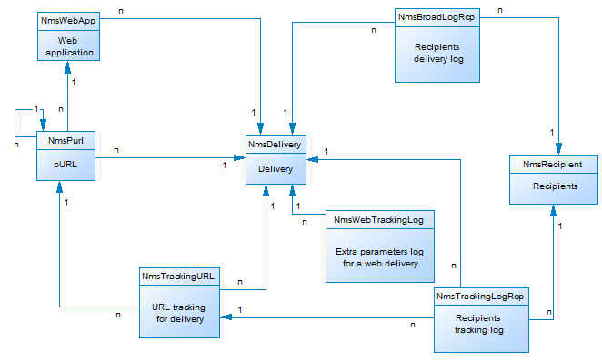

# Campaign資料模型說明{#data-model-description}

Adobe Campaign 附有預定義的資料模型。本節提供Adobe Campaign資料模型的內建表格及其互動的部分詳細資訊。

若要存取每個表格的說明，請前往 **[!UICONTROL Admin > Configuration > Data schemas]**，從清單中選取資源，然後按一下 **[!UICONTROL Documentation]** 標籤。

>[!NOTE]
>
>並以 XML 描述了應用程式中資料的實體和邏輯結構。並且遵循 Adobe Campaign 專屬的語法，稱為綱要 (schema)。如需Adobe Campaign結構描述的詳細資訊，請閱讀 [本節](../../configuration/using/about-schema-reference.md).

## 主要表格的說明 {#description-main-tables}

Adobe Campaign仰賴包含連結在一起之表格的關聯式資料庫。

下圖顯示Adobe Campaign資料模型的主要業務表格與每個表格的主要欄位之間的連結。

<!---->

預先定義的Adobe Campaign資料模型包含下列主要表格。

### NmsRecipient {#NmsRecipient}

此表格符合 **nms：recipient** 結構描述。

這是預設表格用於 **傳遞的收件者**. 因此，它包含透過各種管道傳送所需的資訊：

* sEmail：電子郵件地址。
* iEmailFormat：偏好使用的電子郵件格式(1代表文字，2代表HTML，0代表未定義)。
* sAddress1、sAddress2、sAddress3、sAddress4、sZipCode、sCity是用來建立郵寄地址（符合1997年5月起的XPZ 10-011 AFNOR標準）。
* sPhone、sMobilePhone和sFax分別包含電話、行動電話和傳真號碼。
* iBlackList是用於設定檔的預設選擇退出旗標（1表示「已取消訂閱」，否則為0）。

iFolderId欄位是將收件者連結至其執行資料夾的外部索引鍵。 如需詳細資訊，請參閱 [XtkFolder](#XtkFolder).

sCountryCode欄位是與收件者相關聯之國家/地區的3166-1 Alpha 2 ISO代碼（2個字元）。 此欄位實際上是國家/地區參考表格(NmsCountry)上的外部索引鍵，其中包含國家/地區標籤和其他國家/地區代碼資料。 如果未填入國家/地區，則會儲存「XX」值（並使用它來取代零ID記錄）。

有關「收件者」表格的詳細資訊，請參閱 [本節](../../configuration/using/about-data-model.md#default-recipient-table).

### NmsGroup {#NmsGroup}

此表格符合 **nms：group** 結構描述。

它可讓您建立 **靜態收件者群組**. 收件者和群組之間存在多對多關係。 例如，一個收件者可屬於數個群組，而一個群組可包含數個收件者。 群組可以手動建立、透過匯入或透過傳遞目標定位。 群組通常用作傳遞目標。 代表sName群組內部名稱的欄位上有唯一索引。 群組已連結至資料夾（索引鍵為iFolderId）。 如需詳細資訊，請參閱 [XtkFolder](#XtkFolder))。

### NmsRcpGrpRel {#NmsRcpGrpRel}

NmsRcpGrpRel關係表格僅包含與iRecipientId和iGroupId連結表格識別碼相對應的兩個欄位。

### NmsService {#NmsService}

此表格符合 **nms：service** 結構描述。

在Adobe Campaign中，您可以建立和管理資訊服務（主題）的訂閱。 NmsService表格儲存您提供給收件者訂閱的資訊服務（主題） （例如電子報）的定義。

服務是類似於群組（靜態收件者群組）的實體，但它們會傳達更多資訊，並可透過表單輕鬆管理訂閱和取消訂閱。

代表sName服務內部名稱的欄位上有唯一索引。 此服務已連結至資料夾（索引鍵為iFolderId）。 如需詳細資訊，請參閱 [XtkFolder](#XtkFolder))。 最後，iType欄位會指定此服務的傳送通道（0代表電子郵件、1代表簡訊、2代表電話、3代表直接郵件，4代表傳真）。

### NmsSubscription {#NmsSubscription}

此表格符合 **nms：subscription** 結構描述。

它可讓您管理資訊服務的收件者訂閱。

### NmsSubHisto {#NmsSubHisto}

此表格符合 **nms：subHisto** 結構描述。

如果使用網路表單或應用程式的介面來管理訂閱，則所有訂閱和取消訂閱都會記錄在NmsSubHisto表格中。 iAction欄位會指定在儲存在tsDate欄位中的日期執行的動作（0代表取消訂閱，1代表訂閱）。

### NmsDelivery {#NmsDelivery}

此表格符合 **nms：delivery** 結構描述。

此表格中的每一筆記錄代表 **傳遞動作** 或 **傳遞範本**. 它包含執行傳遞所需的所有引數（目標、內容等）。 傳遞（廣播）記錄(NmsBroadLog)和相關聯的追蹤URL (NmsTrackingUrl)會在分析階段期間建立（請參閱下方以瞭解這兩個表格的詳細資訊）。

欄位上有唯一索引，代表sInternalName傳遞或案例的內部名稱。 傳遞連結至執行資料夾（外部索引鍵為iFolderProcessId）。 如需詳細資訊，請參閱 [XtkFolder](#XtkFolder))。

### XtkFolder {#XtkFolder}

它包含 **樹狀結構中的所有資料夾** 顯示於 **導覽** 索引標籤來識別。

已輸入資料夾： sModel欄位的值指定了資料夾中可以包含的資料型別。 此欄位也可讓使用者端主控台以對應的表單正確顯示資料。 此欄位的可能值是在navTree中定義。

樹狀結構由iParentId和iChildCount欄位管理。 sFullName欄位提供樹狀結構中資料夾的完整路徑。 最後，欄位上有一個唯一索引，代表sName資料夾的內部名稱。

## 傳遞與追蹤 {#delivery-and-tracking}

這組表格連結至 **傳遞** 模組，可監視傳送訊息時所遇到的傳遞和最終問題。 如需詳細資訊，請參閱 [監視傳遞](../../delivery/using/about-delivery-monitoring.md). 如需追蹤的詳細資訊，請參閱 [追蹤訊息](../../delivery/using/about-message-tracking.md).

**NmsBroadLogMsg**：此表格比對 **nms：broadLogMsg** 結構描述。 這是傳遞記錄表格的擴充功能。

## 行銷活動管理 {#campaign-management}

這組表格連結至 **行銷活動** 此模組可定義、最佳化、執行和分析通訊與行銷活動。 如需詳細資訊，請參閱 [關於行銷活動](../../campaign/using/designing-marketing-campaigns.md).

* **NmsOperation**：此表格比對 **nms：operation** 結構描述。 它包含行銷活動的資料。
* **NmsDeliveryOutline**：此表格比對 **nms：deliveryOutline** 結構描述。 它包含傳遞的延伸屬性（傳遞大網）。
* **NmsDlvOutlineItem**：此表格比對 **nms：dlvOutlineItem** 結構描述。 它包含傳遞大網中的文章。
* **NmsDeliveryCustomization**：此表格比對 **nms：deliveryCustomization** 結構描述。 它包含傳遞的個人化欄位。
* **NmsBudget**：此表格比對 **nms：budget** 結構描述。 它包含行銷活動、計畫、方案、任務和/或傳遞的預算資料。
* **NmsDocument**：此表格比對 **nms：document** 結構描述。 其中包含檔案形式的行銷活動檔案（影像、Excel或Word檔案等）
* **XtkWorkflow**：此表格比對 **xtk：workflow** 結構描述。 它包含行銷活動目標定位。
* **NmsTask**：此表格比對 **nms：task** 結構描述。 它包含行銷任務的定義。
* **NmsAsset**：此表格比對 **nms：asset** 結構描述。 它包含行銷資源的定義。

## 通訊一致性 {#communication-consistency}

這組表格連結至 **行銷活動最佳化** 模組，可控制、篩選及監控傳遞的傳送。 如需詳細資訊，請參閱 [關於行銷活動態樣](../../campaign-opt/using/about-campaign-typologies.md).

* **NmsTypologyRule**：此表格比對 **nms：typologyRule** 結構描述。 它包含根據型別適用於傳送的規則。
* **NmsTypology**：此表格比對 **nms：型別** 結構描述。 它包含套用至符合型別的傳遞的規則集。
* **NmsTypologyRuleRel**：此表格比對 **nms：typologyRuleRel** 結構描述。 它包含型別與其規則之間的關係。
* **NmsVolumeLine**：此表格比對 **nms：volumeLine** 結構描述。 它包含容量規則的一組可用性明細行。
* **NmsVolumeConsumed**：此表格比對 **nms：volumeConsumed** 結構描述。 它包含產能規則的所有沖銷明細行。

## 回應管理 {#response-management}

這組表格連結至 **回應管理員** 模組，可測量行銷活動的成功和盈利能力，或為所有通訊管道提供建議。 如需詳細資訊，請參閱 [關於回應管理員](../../response/using/about-response-manager.md).

### NmsRemaHypothesis {#NmsRemaHypothesis}

此表與 **nms：remaHypothesis** 結構描述。 其中包含測量假設的定義。

此表格包含儲存在XML中的重要資訊，包括：

**執行內容（以XML儲存的資訊）**

執行內容會填入要考慮用於測量計算的表格和欄位，即：
* nms：remaMatchRcp反應記錄儲存結構。
* 交易表格結構（例如購買）。
* 查詢結構描述，可讓您定義假設條件的起始表。
* 連結至個人，可讓您根據查詢結構描述識別個人。
* 交易日期。 此欄位並非必要欄位，但建議您使用此欄位來限制計算周長。
* 交易金額：這是用於自動計算收入指標的選擇性欄位。

**假設周長（以XML儲存的資訊）**

假設周界包括根據查詢結構描述的表格篩選假設。

**假設多載指令碼（儲存在XML中的資訊）**

假設多載指令碼是JavaScript程式碼，可讓您在執行期間多載假設的內容。

**測量指標**

在假設執行期間，以下指標會自動更新：

* 回應數： **iTransaction**. 反應記錄表格中的行數。
* 連絡人數： **iContactReacted**. 假設中目標聯絡人的不同數量。
* 控制組計數： **iProofRespected**. 假設中目標控制組聯絡人的不同數量。
* 連絡的回應率： **dContactReactedRate**. 假設中目標聯絡人的回應率。
* 控制組的回應率： **dProofReactedRate**. 假設控制組的回應率。
* 已聯絡人口的總收入： **dContactReactedTotalAmount**. 假設中目標聯絡人的總收入。
* 控制組的平均收入： **dContactReactedAvgAmount**. 假設中目標控制組聯絡人的平均收入。
* 控制組的總收入： **dProofReactedTotalAmount**. 假設控制組的總收入.
* 控制組的平均收入： **dProofReactedAvgAmount**. 假設控制組的平均收入。
* 每個連絡人的總利潤： **dContactReactedTotalMargin**. 假設中鎖定的每個聯絡人的總利潤.
* 每次聯絡的平均利潤： **dContactReactedAvgMargin**. 假設中鎖定的每個聯絡人的平均利潤。
* 控制組的總利潤： **dProofReactedTotalMargin**. 假設中鎖定的控制組的總利潤。
* 控制組的平均利潤： **dProofReactedAvgMargin**. 假設中鎖定的控制組的平均利潤。
* 其他收入： **Additionalamount**. （聯絡的平均收入 — 控制組的平均收入） *聯絡的數量。
* 額外利潤： **Additionalmargin**. （聯絡的平均利潤 — 控制組的平均利潤） /聯絡的數量。
* 每次聯絡的平均成本（SQL運算式）。 計算的傳遞成本/聯絡次數。
* ROI （SQL運算式）。 計算的交貨成本/聯絡的總利潤。
* 有效ROI （SQL運算式）。 計算的交貨成本/額外利潤。
* 重要性： **重要** （SQL運算式）。 根據行銷活動的重要性，包含0到3的值。

### NmsRemaMatchRcp {#NmsRemaMatchRcp}

此表格符合 **nms：remaMatchRcp** 結構描述。

它包含代表個人對給定假設的反應的記錄。 這些記錄是在假設執行期間建立的。

## 模擬和傳遞 {#simulation-and-delivery}

這組表格連結至 **模擬** 模組，可讓您在將您的主張傳送給收件者之前，測試屬於類別或環境的選件分佈。 如需詳細資訊，請參閱 [關於優惠方案模擬](../../interaction/using/about-offers-simulation.md).

* **NmsSimulation**：此表格比對 **nms：simulation** 結構描述。 它代表對指定母體的一組傳遞或優惠方案的模擬。
* **NmsDlvSimulationRel**：此表格比對 **nms：dlvSimulationRel** 結構描述。 其中包含模擬中考慮的傳遞清單。 模擬的範圍會儲存在XML中。
* **NmsOfferSimulationRel**：此表格比對 **nms：offerSimulationRel** 結構描述。 它可讓您連結模擬與優惠方案。

## 互動模組 {#interaction-module}

這組表格連結至 **互動** 模組，可在與指定聯絡人互動期間即時回應，方法是提供單一或數個已調整的優惠方案。 如需詳細資訊，請參閱 [互動與優惠方案管理](../../interaction/using/interaction-and-offer-management.md).

* **NmsOffer**：此表格比對 **nms：offer** 結構描述。 它包含每個行銷優惠方案的定義。
* **NmsPropositionRcp**：此表格比對 **nms：propositionRcp** 結構描述。 它包含傳送給每個人的行銷主張的跨管道記錄。 記錄是在已準備好主張或有效地向個人提出主張時建立的。
* **NmsOfferSpace**：此表格比對 **nms：offerSpace** 結構描述。 它包含建立主張之位置的定義。
* **NmsOfferContext**：此表格比對 **nms：offerContext** 結構描述。 它包含主張適用性的額外條件，以及權重計算公式的定義。
* **NmsOfferView**：此表格比對 **nms：offerView**. 它包含優惠方案宣告。
* **NmsOfferCategory**：此表格比對 **nms：offerCategory**. 它包含優惠方案類別。
* **NmsOfferEnv**：此表格比對 **nms：offerEnv**. 它包含優惠方案環境。

## 訊息中心模組 {#message-center-module}

下清單格集已連結至 **異動訊息傳送** （訊息中心）模組，可管理傳送給使用者的個人和獨特通訊，以及從資訊系統觸發的事件產生。 如需詳細資訊，請參閱 [關於交易式訊息傳送](../../message-center/using/about-transactional-messaging.md).

### NmsRtEvent {#NmsRtEvent}

此表格符合 **nms：rtEvent** 結構描述。 其中包含即時事件的定義。

### NmsBatchEvent {#NmsBatchEvent}

此表格符合 **nms：batchEvent** 結構描述。 其中包含批次事件的定義。

<!--## Microsites Module {#microsites-module}

This set of tables is linked to the **Web applications** functionality, which allows to create and publish dynamic and interactive web applications with data from the database and content adapted to the rights of the connected user. For more on this, see [About web applications](../../web/using/about-web-applications.md).

* **NmsTrackingUrl**: This table matches the **nms:trackingUrl** schema.

* **NmsPurl**: This table matches the **nms:purl** schema.-->

## nmac模組 {#nmac-module}

這組表格連結至 **行動應用程式頻道**，可透過應用程式將個人化通知傳送至iOS和Android終端。 如需詳細資訊，請參閱 [關於行動應用程式頻道](../../delivery/using/about-mobile-app-channel.md).

* **NmsMobileApp**：此表格比對 **nms：mobileApp** 結構描述。 它包含Adobe Campaign中定義的行動應用程式。
* **NmsAppSubscription**：此表格比對 **nms：appSubscription** 結構描述。 它包含一或多個應用程式的訂閱者資訊。
* **NmsAppSubscriptionRcp**：此表格比對 **nms：appSubscriptionRcp** 結構描述。 它可讓您連結訂閱應用程式的訪客與收件者表格。
* **NmsExcludeLogAppSubRcp**：此表格比對 **nms：excludeLogAppSubRcp** 結構描述。
* **NmsTrackingLogAppSubRcp**：此表格比對 **nms：trackingLogAppSubRcp** 結構描述。
* **NmsBroadLogAppSubRcp**：此表格比對 **nms：broadLogAppSubRcp** 結構描述。

## 社交行銷模組 {#social-marketing-module}

這組表格連結至 **管理社交網路** 模組，可透過Facebook和Twitter與客戶和潛在客戶互動。 如需詳細資訊，請參閱 [關於社交行銷](../../social/using/about-social-marketing.md).

* **NmsVisitor**：此表格比對 **nms：visitor** 結構描述。 它包含訪客的相關資訊。
* **NmsVisitorSub**：此表格比對 **nms：visitorSub** 結構描述。 它可讓您將訪客連結至他們已訂閱的服務(Twitter或Facebook)。
* **NmsFriendShipRel**：此表格比對 **nms：friendshipRel** 結構描述。 它可讓您在Facebook服務的內容中，將訪客與其朋友連結。
* **NmsVisitorInterestRel**：此表格比對 **nms：visitorInterestRel** 結構描述。 它可讓您連結訪客及其興趣。
* **NmsInterest**：此表格比對 **nms：interest** 結構描述。 它包含每位訪客的興趣清單。
