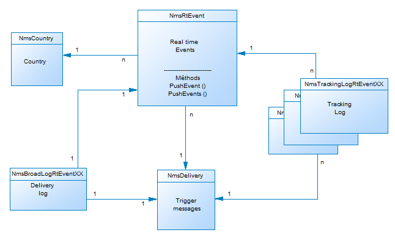

# Campaign資料模型說明{#data-model-description}

Adobe Campaign 附有預定義的資料模型。本節提供Adobe Campaign資料模型的內建表格及其互動的一些詳細資料。

若要存取每個表格的說明，請前往 **[!UICONTROL Admin > Configuration > Data schemas]**，從清單中選取資源，然後按一下 **[!UICONTROL Documentation]** 標籤。

>[!NOTE]
>
>並以 XML 描述了應用程式中資料的實體和邏輯結構。並且遵循 Adobe Campaign 專屬的語法，稱為綱要 (schema)。如需Adobe Campaign結構的詳細資訊，請閱讀 [本節](../../configuration/using/about-schema-reference.md).

## 主表的說明 {#description-main-tables}

Adobe Campaign依賴包含連結在一起之表的關係資料庫。

下圖顯示Adobe Campaign資料模型的主要業務表與每個資料模型的主要欄位之間的聯接。

<!---->

預先定義的Adobe Campaign資料模型包含下列主要表格。

### NmsRecipient {#NmsRecipient}

此表格符合 **nms:recipient** 綱要。

此為用於 **傳遞的收件者**. 因此，其中包含透過各種管道傳送所需的資訊：

* sEmail:電子郵件地址。
* iEmailFormat:電子郵件的偏好格式(1代表文字，2代表HTML,0（若未定義）)。
* sAddress1、sAddress2、sAddress3、sAddress4、sZipCode、sCity用於建立郵遞區號（與1997年5月起的XPZ 10-011 AFNOR標準一致）。
* sPhone、sMobilePhone、sFax分別包含電話、行動電話和傳真號碼。
* iBlackList是用於設定檔的預設選擇退出標幟（1表示「已取消訂閱」，否則則為0）。

iFolderId欄位是將收件者連結至其執行資料夾的外鍵。 有關詳細資訊，請參閱 [XtkFolder](#XtkFolder).

sCountryCode欄位是與收件者相關聯的國家/地區的3166-1 Alpha 2 ISO代碼（2個字元）。 此欄位實際上是國家/地區參考表(NmsCountry)上的外鍵，它包含國家/地區標籤和其他國家/地區代碼資料。 如果未填入國家/地區，則會儲存值&#39;XX&#39;（並用來取代零ID記錄）。

如需「收件者」表格的詳細資訊，請參閱 [本節](../../configuration/using/about-data-model.md#default-recipient-table).

### NmsGroup {#NmsGroup}

此表格符合 **nms:group** 綱要。

它可讓您建立 **收件者的靜態群組**. 收件者和群組之間有多對多關係。 例如，一個收件者可以屬於數個群組，而一個群組可以包含數個收件者。 群組可以透過匯入或傳遞定位手動建立。 群組通常用作傳送目標。 欄位上有一個唯一索引，代表sName群組的內部名稱。 該組連結到一個資料夾(鍵為iFolderId。 有關詳細資訊，請參閱 [XtkFolder](#XtkFolder))。

### NmsRcpGrpRel {#NmsRcpGrpRel}

NmsRcpGrpRel關係表僅包含與iRecipientId和iGroupId連結表的標識符對應的兩個欄位。

### NmsService {#NmsService}

此表格符合 **nms:service** 綱要。

在Adobe Campaign中，您可以建立和管理資訊服務的訂閱（主題）。 NmsService表儲存您為收件者提供的訂閱資訊服務（主題）的定義（例如電子報）。

服務是與群組（靜態收件者群組）類似的實體，但可循環提供更多資訊，並透過表單輕鬆管理訂閱和取消訂閱。

欄位上有一個唯一索引，代表sName服務的內部名稱。 服務連結至資料夾（金鑰為iFolderId）。 有關詳細資訊，請參閱 [XtkFolder](#XtkFolder))。 最後， iType欄位指定此服務的傳送通道（電子郵件為0，簡訊為1，電話為2，直接郵件為3，傳真為4）。

### NmsSubscription {#NmsSubscription}

此表格符合 **nms:subscription** 綱要。

它使您能夠管理資訊服務的收件者訂閱。

### NmsSubHisto {#NmsSubHisto}

此表格符合 **nms:subHisto** 綱要。

如果使用Web表單或應用程式的介面管理訂閱，則所有訂閱和取消訂閱都將在NmsSubHisto表中進行歷史記錄。 iAction欄位指定在儲存在tsDate欄位中的日期上執行的操作（取消訂閱為0，訂閱為1）。

### NmsDelivery {#NmsDelivery}

此表格符合 **nms:delivery** 綱要。

此表中的每個記錄表示 **傳遞動作** 或 **傳遞範本**. 它包含執行傳送所需的所有必要參數（目標、內容等）。 在分析階段期間會建立傳送（廣播）日誌(NmsBroadLog)和相關的追蹤URL(NmsTrackingUrl)（請參閱下方，以取得這兩個表格的詳細資訊）。

欄位上有一個唯一索引，代表sInternalName傳送或藍本的內部名稱。 傳遞連結至執行資料夾(外鍵為iFolderProcessId。 有關詳細資訊，請參閱 [XtkFolder](#XtkFolder))。

### XtkFolder {#XtkFolder}

它包含 **樹中的所有資料夾** 顯示於 **導覽** 的下一頁。

資料夾已輸入：sModel欄位的值指定資料夾中可包含的資料類型。 此欄位也可讓用戶端主控台使用對應的表單正確顯示資料。 此欄位的可能值在navTree中定義。

該樹由iParentId和iChildCount欄位管理。 sFullName欄位提供樹中資料夾的完整路徑。 最後，欄位上有一個唯一索引，代表sName資料夾的內部名稱。

## 傳遞與追蹤 {#delivery-and-tracking}

此組表已連結至 **傳送** 模組，可監控傳送及傳送訊息時遇到的最終問題。 有關詳細資訊，請參閱 [監控傳送](../../delivery/using/about-delivery-monitoring.md). 如需追蹤的詳細資訊，請參閱 [追蹤訊息](../../delivery/using/about-message-tracking.md).

**NmsBroadLogMsg**:此表格符合 **nms:broadLogMsg** 綱要。 此為傳送記錄表的擴充功能。

## 行銷活動管理 {#campaign-management}

此組表已連結至 **行銷活動** 模組，可定義、最佳化、執行和分析通訊和行銷活動。 有關詳細資訊，請參閱 [關於行銷活動](../../campaign/using/designing-marketing-campaigns.md).

* **NmsOperation**:此表格符合 **nms:operation** 綱要。 它包含行銷活動的資料。
* **NmsDeliveryOutline**:此表格符合 **nms:deliveryOutline** 綱要。 它包含傳送（傳送大綱）的延伸屬性。
* **NmsDlvOutlineItem**:此表格符合 **nms:dlvOutlineItem** 綱要。 它包含傳遞大綱的文章。
* **NmsDeliveryCustomization**:此表格符合 **nms:deliveryCustomization** 綱要。 它包含傳遞的個人化欄位。
* **NmsBudget**:此表格符合 **nms:budget** 綱要。 它包含促銷活動、計畫、方案、任務和/或傳送的預算資料。
* **NmsDocument**:此表格符合 **nms:document** 綱要。 它以檔案（影像、excel或word檔案等）的形式包含促銷活動的行銷檔案
* **XtkWorkflow**:此表格符合 **xtk:workflow** 綱要。 它包含促銷活動目標定位。
* **NmsTask**:此表格符合 **nms:task** 綱要。 它包含行銷任務的定義。
* **NmsAsset**:此表格符合 **nms:asset** 綱要。 它包含行銷資源的定義。

## 通信一致性 {#communication-consistency}

此組表已連結至 **促銷活動最佳化** 模組，可控制、篩選及監控傳送的傳送。 有關詳細資訊，請參閱 [關於行銷活動類型](../../campaign-opt/using/about-campaign-typologies.md).

* **Nms類型規則**:此表格符合 **nms:typologyRule** 綱要。 其中包含根據類型套用至傳送的規則。
* **Nms類型**:此表格符合 **nms：類型** 綱要。 其中包含要套用至符合類型之傳送的規則集。
* **NmsTypologyRuleRel**:此表格符合 **nms:typologyRuleRel** 綱要。 它包含類型與其規則之間的關係。
* **NmsVolumeLine**:此表格符合 **nms:volumeLine** 綱要。 它包含容量規則的一組可用行。
* **NmsVolumeUnced**:此表格符合 **nms:volumeUnced** 綱要。 它包含容量規則的所有衝減行。

## 回應管理 {#response-management}

此組表已連結至 **回應管理員** 模組，可衡量行銷活動的成功和盈利能力，或為所有通訊渠道提供建議。 有關詳細資訊，請參閱 [關於回應管理器](../../response/using/about-response-manager.md).

### NmsRema假設 {#NmsRemaHypothesis}

此表與 **nms:remaHoseption** 綱要。 它包含測量假設的定義。

此表包含儲存在XML中的重要資訊，包括：

**執行上下文（儲存在XML中的資訊）**

執行內容會填入要納入測量計算的表格和欄位，即：
* nms:remaMatchRcp反應日誌儲存方案。
* 交易表結構（例如購買）。
* 查詢結構，可讓您定義假設條件的開始表。
* 個人的連結，可讓您根據查詢結構來識別個人。
* 交易日期。 此欄位並非必填欄位，但建議您使用此欄位來限制計算周長。
* 交易記錄金額：這是自動計算收入指標的選用欄位。

**假設周長（儲存在XML中的資訊）**

假設周長包括根據查詢架構的表來篩選假設。

**假設過載指令碼（儲存在XML中的資訊）**

假設過載指令碼是JavaScript程式碼，可讓您在執行期間過載假設的內容。

**測量指標**

假設執行期間會自動更新下列指標：

* 反應次數： **iTransaction**. 反應日誌表中的行數。
* 已聯繫的數量： **iContactRenaced**. 假設中目標聯繫的不重複數量。
* 控制組計數： **iProofRenacted**. 假設中目標控制組接觸的不重複數量。
* 聯繫的響應率： **dContactRenacedRate**. 假設中目標接觸的回應率。
* 控制組的響應率： **dProofRenactedRate**. 假設控制組的響應率。
* 聯繫的總人口收入： **dContactRenacedTotalAmount**. 假設中目標聯繫人的總收入。
* 控制組的平均收入： **dContactRenactedAvgAmount**. 假設中目標控制組聯繫人的平均收入。
* 控制組的總收入： **dProofRenactedTotalAmount**. 假設控制組的總收入.
* 控制組的平均收入： **dProofRenactedAvgAmount**. 假設控制組的平均收入。
* 每個聯繫人的總利潤： **dContactRenactedTotalMargin**. 假設中鎖定的每個聯絡人的總利潤.
* 每個聯繫人的平均利潤： **dContactRenactedAvgMargin**. 假設中定位的每個連絡的平均邊界。
* 控制組的總利潤： **dProofRenactedTotalMargin**. 在假設中定位的控制組的總餘量。
* 控制組的平均利潤： **dProofRenactedAvgMargin**. 在假設中定位的控制組的平均餘額。
* 額外收入： **dAdditionalAmount**. （已聯繫的平均收入 — 控制組的平均收入）*已聯繫的數量。
* 附加利潤： **dAdditionalMargin**. （已聯繫的平均裕度 — 控制組的平均裕度）/已聯繫的數量。
* 每個聯繫人的平均成本（SQL表達式）。 傳送的計算成本/已聯繫的數量。
* ROI（SQL表達式）。 交貨的計算成本/聯繫的總利潤。
* 有效ROI（SQL表達式）。 交貨的計算成本/附加利潤。
* 重要性： **重要性** （SQL表達式）。 根據促銷活動的重要性，包含0到3的值。

### NmsRemaMatchRcp {#NmsRemaMatchRcp}

此表格符合 **nms:remaMatchRcp** 綱要。

它包含代表個人對特定假設的反應的記錄。 這些記錄是在假設執行期間建立。

## 模擬與傳送 {#simulation-and-delivery}

此組表已連結至 **模擬** 模組，可在將您的主張傳送給收件者之前，測試屬於類別或環境之選件的分佈。 有關詳細資訊，請參閱 [關於優惠方案模擬](../../interaction/using/about-offers-simulation.md).

* **NmsSimulation**:此表格符合 **nms：模擬** 綱要。 它代表指定母體上一組傳送或選件的模擬。
* **NmsDlvSimulationRel**:此表格符合 **nms:dlvSimulationRel** 綱要。 其中包含模擬中已考慮的傳送清單。 模擬的範圍以XML儲存。
* **NmsOfferSimulationRel**:此表格符合 **nms:offerSimulationRel** 綱要。 它可讓您將模擬與選件連結。

## 互動模組 {#interaction-module}

此組表已連結至 **互動** 模組，可讓特定聯絡人成為單一或數個已調整的選件，在與指定聯絡人互動期間即時回應。 有關詳細資訊，請參閱 [互動與優惠方案管理](../../interaction/using/interaction-and-offer-management.md).

* **NmsOffer**:此表格符合 **nms:offer** 綱要。 其中包含每個行銷優惠方案的定義。
* **NmsPostitionRcp**:此表格符合 **nms:positionRcp** 綱要。 它包含傳送給每個人的行銷主張的跨頻道記錄。 記錄是在準備或有效地向個人提出建議時建立的。
* **NmsOfferSpace**:此表格符合 **nms:offerSpace** 綱要。 它包含了提出建議的位置的定義。
* **NmsOfferContext**:此表格符合 **nms:offerContext** 綱要。 它包含關於命題適用性的附加標準以及權重計算公式的定義。
* **NmsOfferView**:此表格符合 **nms:offerView**. 其中包含選件表示法。
* **NmsOfferCategory**:此表格符合 **nms:offerCategory**. 它包含選件類別。
* **NmsOfferEnv**:此表格符合 **nms:offerEnv**. 其中包含選件環境。

## 訊息中心模組 {#message-center-module}

以下一組表格已連結至 **交易式訊息傳送** （消息中心）模組，它允許管理發送給用戶的、從資訊系統觸發的事件中生成的單個和唯一通信。 有關詳細資訊，請參閱 [關於交易式訊息傳送](../../message-center/using/about-transactional-messaging.md).

### NmsRtEvent {#NmsRtEvent}

此表格符合 **nms:rtEvent** 綱要。 其中包含即時事件的定義。

### NmsBatchEvent {#NmsBatchEvent}

此表格符合 **nms:batchEvent** 綱要。 它包含依批次的事件定義。

<!--## Microsites Module {#microsites-module}

This set of tables is linked to the **Web applications** functionality, which allows to create and publish dynamic and interactive web applications with data from the database and content adapted to the rights of the connected user. For more on this, see [About web applications](../../web/using/about-web-applications.md).

* **NmsTrackingUrl**: This table matches the **nms:trackingUrl** schema.

* **NmsPurl**: This table matches the **nms:purl** schema.-->

## NMAC模組 {#nmac-module}

此組表已連結至 **行動應用程式頻道**，可透過應用程式將個人化通知傳送至iOS和Android終端機。 有關詳細資訊，請參閱 [關於行動應用程式頻道](../../delivery/using/about-mobile-app-channel.md).

* **NmsMobileApp**:此表格符合 **nms:mobileApp** 綱要。 其中包含Adobe Campaign中定義的行動應用程式。
* **NmsAppSubscription**:此表格符合 **nms:appSubscription** 綱要。 它包含有關一個或多個應用程式的訂閱者資訊。
* **NmsAppSubscriptionRcp**:此表格符合 **nms:appSubscriptionRcp** 綱要。 它可讓您將訂閱應用程式的訪客連結至收件者表格。
* **NmsExcludeLogAppSubRcp**:此表格符合 **nms:excludeLogAppSubRcp** 綱要。
* **NmsTrackingLogAppSubRcp**:此表格符合 **nms:trackingLogAppSubRcp** 綱要。
* **NmsBroadLogAppSubRcp**:此表格符合 **nms:broadLogAppSubRcp** 綱要。

## 社交行銷模組 {#social-marketing-module}

此組表已連結至 **管理社交網路** 模組，可透過Facebook和Twitter與客戶和潛在客戶互動。 有關詳細資訊，請參閱 [關於社交行銷](../../social/using/about-social-marketing.md).

* **NmsVisitor**:此表格符合 **nms:visitor** 綱要。 它包含訪客的相關資訊。
* **NmsVisitorSub**:此表格符合 **nms:visitorSub** 綱要。 它可讓您將訪客連結至他們訂閱的服務(Twitter或Facebook)。
* **NmsFriendShipRel**:此表格符合 **nms:friendshipRel** 綱要。 它可讓您在Facebook服務的內容中連結訪客與其朋友。
* **NmsVisitorInterestRel**:此表格符合 **nms:visitorInterestRel** 綱要。 它可讓您連結訪客及其興趣。
* **NmsInterest**:此表格符合 **nms:interest** 綱要。 它包含每個訪客的興趣清單。
