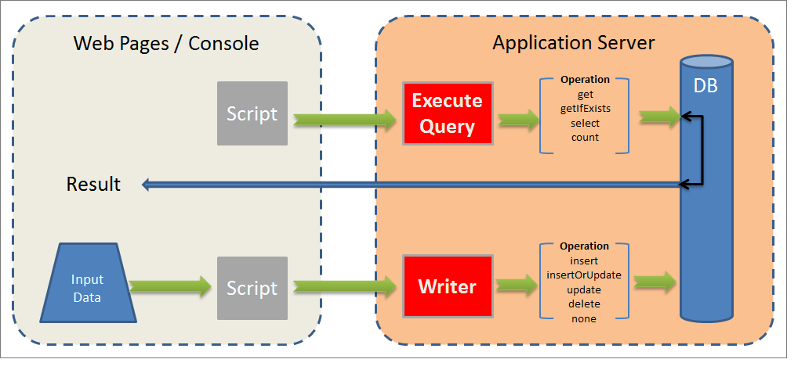

# 資料導向API{#data-oriented-apis}

資料導向API可讓您處理整個資料模型。

## 資料模型概觀 {#overview-of-the-datamodel}

Adobe Campaign並未針對每個實體提供專用的讀取API（沒有getRecipient或getDelivery函式等）。 使用QUERY &amp; WRITER資料讀取和修改方法訪問模型資料。

Adobe Campaign可讓您管理系列：查詢使您能夠恢復整個資料庫中收集的一組資訊。 與在SQL模式中存取不同，Adobe Campaign API會傳回XML樹狀結構，而非資料欄。 因此，Adobe Campaign會建立包含所有收集資料的複合檔案。

此操作模式不提供XML文檔的屬性和元素以及資料庫中表的列之間的一對一映射。

XML文檔儲存在資料庫的MEMO類型欄位中。

## 模型說明 {#description-of-the-model}

您必須熟悉Adobe Campaign資料模型，才能處理指令碼中資料庫的欄位。

如需資料模型的簡報，請參閱 [Adobe Campaign資料模型說明](https://docs.campaign.adobe.com/doc/AC/en/technicalResources/_Datamodel_Description_of_the_main_tables.html)。

為了生成其結構，請參閱本文：如 [何產生資料模型或資料字典](https://helpx.adobe.com/campaign/kb/generate-data-model.html)。

## 查詢和寫入器 {#query-and-writer}

以下簡介架構詳細說明資料庫與客戶（網頁或Adobe Campaign用戶端主控台）之間的低階讀取(ExecuteQuery)和寫入(Writer)交換。



### ExecuteQuery {#executequery}

對於列和條件，可以使用查詢。

這可讓您隔離基礎SQL。 查詢語言不依賴於基礎引擎：某些函式將重新映射，這可能會生成多個SELECT SQL命令。

有關詳細資訊，請參 [閱方案&#39;xtk:queryDef&#39;的&#39;ExecuteQuery&#39;方法的示例](../../configuration/using/web-service-calls.md#example-on-the--executequery--method-of-schema--xtk-querydef-)。

ExecuteQuery **方法會顯** 示在ExecuteQuery(xtk:queryDef)中 [](#executequery--xtk-querydef-)。

### 寫 {#write}

Write命令可讓您編寫簡單或複雜的文檔，並在一個或多個基本表中輸入條目。

交易API可讓您透過updateOrInsert命令管 **理調節** :一個命令可讓您建立或更新資料。 您也可以設定修改合併(**合併**):此作業模式可讓您授權部分更新。

XML結構提供了資料的邏輯視圖，並使您能夠避開SQL表的物理結構。

Write方法顯示在 [Write / writeCollection(xtk:session)中](#write---writecollection--xtk-session-)。

## ExecuteQuery(xtk:queryDef) {#executequery--xtk-querydef-}

此方法可讓您從與結構關聯的資料執行查詢。 它會使用驗證字串（必須登入）和XML檔案，將查詢描述為參數。 return參數是XML文檔，包含查詢結果的格式為查詢引用的模式。

&quot;xtk:queryDef&quot;架構中&quot;ExecuteQuery&quot;方法的定義：

```
<method name="ExecuteQuery" const="true">
  <parameters>
    <param desc="Output XML document" name="output" type="DOMDocument" inout="out"/>
  </parameters>
</method>
```

>[!NOTE]
>
>這是一種&quot;const&quot;方法。 輸入參數以&quot;xtk:queryDef&quot;模式的格式包含在XML文檔中。

### 輸入查詢的XML文檔格式 {#format-of-the-xml-document-of-the-input-query}

查詢的XML文檔結構在&quot;xtk:queryDef &quot;模式中描述。 本文檔描述SQL查詢的子句：「select」、「where」、「order by」、「group by」、「having」。

```
<queryDef schema="schema_key" operation="operation_type">
  <select>
    <node expr="expression1">
    <node expr="expression2">
    ...
  </select>
  <where> 
    <condition expr="expression1"/> 
    <condition expr="expression2"/>
    ... 
  </where>
  <orderBy>
    <node expr="expression1">
    <node expr="expression2">
    ...
  </orderBy>
  <groupBy>
    <node expr="expression1">
    <node expr="expression2">
    ...
  </groupBy>
  <having>
    <condition expr="expression1"/> 
    <condition expr="expression2"/>
    ...
  </having>
</queryDef>
```

子查詢( `<subquery>` )可在元素中定 `<condition> ` 義。 元素的語 `<subquery> ` 法以語法為基礎 `<querydef>`。

範例 `<subquery>  : </subquery>`

```
<condition setOperator="NOT IN" expr="@id" enabledIf="$(/ignored/@ownerType)=1">
  <subQuery schema="xtk:operatorGroup">
     <select>
       <node expr="[@operator-id]" />
     </select>
     <where>
       <condition expr="[@group-id]=$long(../@owner-id)"/>
     </where>
   </subQuery>
</condition>  
  
```

查詢必須從架構屬性中引用啟動 **架構** 。

所需的操作類型在操作屬性中 **輸入** ，並包含以下值之一：

* **get**:從表中檢索記錄並返回錯誤（如果資料不存在）,
* **getIfExists**:從表中檢索記錄並返回空文檔（如果資料不存在）,
* **選擇**:建立游標以返回多個記錄，如果沒有資料，則返回空文檔，
* **計數**:傳回資料計數。

使 **用XPath語法** ，根據輸入模式來定位資料。 有關XPaths的詳細資訊，請參閱 [資料結構](../../configuration/using/data-schemas.md)。

#### 使用&#39;get&#39;操作的示例 {#example-with-the--get--operation}

在電子郵件上檢索具有過濾器的收件者（「nms:recipient」架構）的姓氏和名字。

```
<queryDef schema="nms:recipient" operation="get">
  <!-- fields to retrieve -->
  <select>
    <node expr="@firstName"/>
    <node expr="@lastName"/>
  </select> 

  <!-- condition on email -->
  <where>  
    <condition expr="@email= 'john.doe@aol.com'"/>
  </where>
</queryDef>
```

#### 具有&#39;select&#39;操作的示例 {#example-with-the--select--operation}

傳回在資料夾和電子郵件網域上篩選的收件者清單，並在出生日期以遞減順序排序。

```
<queryDef schema="nms:recipient" operation="select">
  <select>
    <node expr="@email"/>
    <!-- builds a string with the concatenation of the last name and first name separated by a dash -->      
    <node expr="@lastName+'-'+@firstName"/>
    <!-- get year of birth date -->
    <node expr="Year(@birthDate)"/>
  </select> 

  <where>  
     <condition expr="[@folder-id] = 1234 and @domain like 'Adobe%'"/>
  </where>

  <!-- order by birth date -->
  <orderBy>
    <node expr="@birthDate" sortDesc="true"/> <!-- by default sortDesc="false" -->
  </orderBy>
</queryDef>
```

運算式可以是簡單欄位或複雜的運算式，例如算術運算或串連。

要限制要返回的記錄數，請將 **lineCount** 屬性添加到 `<querydef>` 元素。

要將查詢返回的記錄數限制為100，請執行以下操作：

```
<queryDef schema="nms:recipient" operation="select" lineCount="100">
...
```

要檢索下一個100條記錄，請再次運行同一查詢，並添加 **startLine** 屬性。

```
<queryDef schema="nms:recipient" operation="select" lineCount="100" startLine="100">
...
```

#### 具有「count」操作的示例 {#example-with-the--count--operation}

要計算查詢上的記錄數，請執行以下操作：

```
<queryDef schema="nms:recipient" operation="count"">
  <!-- condition on the folder and domain of the e-mail -->
  <where>  
    <condition expr="[@folder-id] = 1234" and @domain like 'Adobe%'"/>
  </where>
</queryDef>
```

>[!NOTE]
>
>我們再次使用上例中的條件。 不 `<select>` 使用和子句。 </select>`

#### 資料分組 {#data-grouping}

要檢索引用多次的電子郵件地址，請執行以下操作：

```
<queryDef schema="nms:recipient" operation="select">
  <select>
    <node expr="@email"/>
    <node expr="count(@email)"/>
  </select>

  <!-- e-mail grouping clause -->
  <groupby>
    <node expr="@email"/>
  </groupby>

  <!-- grouping condition -->
  <having>
    <condition expr="count(@email) > 1"/>
  </having>

</queryDef>
```

通過將groupBy屬性直接添加 **到要分組的欄位中** ，可以簡化查詢：

```
<select>
  <node expr="@email" groupBy="true"/>
</select>
```

>[!NOTE]
>
>不再需要填入元 `<groupby>` 素。

#### 條件中的括弧 {#bracketing-in-conditions}

以下是兩個在相同條件下加括弧的例子。

* 單一運算式中的簡單版本：

   ```
   <where>
     <condition expr="(@age > 15 or @age <= 45) and  (@city = 'Newton' or @city = 'Culver City') "/>
   </where>
   ```

* 包含元素的結構化 `<condition>` 版本：

   ```
   <where>
     <condition bool-operator="AND">
       <condition expr="@age > 15" bool-operator="OR"/>
       <condition expr="@age <= 45"/>
     </condition>
     <condition>
       <condition expr="@city = 'Newton'" bool-operator="OR"/>
       <condition expr="@city = 'Culver City'"/>
     </condition>
   </where>
   ```

當數個條件套用至相同欄位時，可將「OR」運算子取代為「IN」運算：

```
<where>
  <condition>
    <condition expr="@age IN (15, 45)"/>
    <condition expr="@city IN ('Newton', 'Culver City')"/>
  </condition>
</where>
```

此語法可簡化條件中使用超過兩個資料時的查詢。

#### 連結範例 {#examples-on-links}

* 連結1-1或N1:當表具有外鍵（連結從表開始）時，可以直接過濾或檢索連結表的欄位。

   資料夾標籤上的篩選範例：

   ```
   <where>
     <condition expr="[folder/@label] like 'Segment%'"/>
   </where>
   ```

   要從「nms:recipient」架構中檢索資料夾的欄位，請執行以下操作：

   ```
   <select>
     <!-- label of recipient folder -->
     <node expr="[folder/@label]"/>
     <!-- displays the string count of the folder -->
     <node expr="partition"/>
   </select>
   ```

* 系列連結(1N):必須通過EXISTS或 **NOT** **EXISTS運算子對收集表的欄位執行篩選** 。

   要篩選已訂閱「電子報」資訊服務的收件者，請執行以下操作：

   ```
   <where>
     <condition expr="subscription" setOperator="EXISTS">
       <condition expr="@name = 'Newsletter'"/>
     </condition>
   </where>
   ```

   不建議從子句直接檢索系列連結 `<select>` 的欄位，因為查詢返回主產品。 只有在連結的表格只包含一個記錄（範例）時，才會使 `<node expr="">`用它。

   「訂閱」系列連結的範例：

   ```
   <select>
     <node expr="subscription/@label"/>
   </select>
   ```

   可以檢索子清單，該子清單包含子句中的集合連結的 `<select>` 元素。 參考欄位的XPaths是來自系列元素的內容相關式。

   篩選( `<orderby>` )和限制( `<where>` )元素可以新增至系列元素。

   在此示例中，對於每個收件人，查詢將返回收件人所訂閱的電子郵件和資訊服務清單：

   ```
   <queryDef schema="nms:recipient" operation="select">
     <select>
       <node expr="@email"/>
   
       <!-- collection table (unbound type) -->
       <node expr="subscription">  
         <node expr="[service/@label]"/>    
         <!-- sub-condition on the collection table -->
         <where>  
           <condition expr="@expirationDate >= GetDate()"/>
         </where>
         <orderBy>
           <node expr="@expirationDate"/> 
         </orderBy>
       </node>
     </select> 
   </queryDef>
   ```

#### 綁定&#39;where&#39;和&#39;select&#39;子句的參數 {#binding-the-parameters-of-the--where--and--select--clause}

參數的綁定可讓引擎設定查詢中使用的參數的值。 這非常有用，因為引擎負責值的逸出，而且快取對於要擷取的參數還有額外的好處。

當建立查詢時，「系結」值會由字元(?)取代 在ODBC中， `#[index]#` 在SQL查詢主體的postgres...中。

```
<select>
  <!--the value will be bound by the engine -->
  <node expr="@startDate = #2002/02/01#"/>                   
  <!-- the value will not be bound by the engine but visible directly in the query -->
  <node expr="@startDate = #2002/02/01#" noSqlBind="true"/> 
</select>
```

要避免綁定參數，必須用值&#39;true&#39;填充&quot;noSqlBind&quot;屬性。

>[!IMPORTANT]
>
>如果查詢包含&quot;order-by&quot;或&quot;group-by&quot;指示，資料庫引擎將無法&quot;bind&quot;值。 您必須將@noSqlBind=&quot;true&quot;屬性放置在查詢的&quot;select&quot;和／或&quot;where&quot;說明上。

#### 查詢建立提示： {#query-building-tip-}

若要協助處理查詢的語法，您可以使用Adobe Campaign用戶端主控台（功能表）中的一般查詢編輯器來編寫 **[!UICONTROL Tools/ Generic query editor...]** 查詢。 操作步驟：

1. 選擇要檢索的資料：

   

1. 定義篩選條件：

   

1. 執行查詢並按CTRL+F4以查看查詢原始碼。

   

### 輸出檔案格式 {#output-document-format}

返回參數是與查詢相關聯的模式格式的XML文檔。

從&quot;get&quot;操作的&quot;nms:recipient&quot;模式返回的示例：

```
<recipient email="john.doe@adobe.com" lastName"Doe" firstName="John"/>
```

在「選擇」操作中，返回的文檔是元素的列舉：

```
<!-- the name of the first element does not matter -->
<recipient-collection>   
  <recipient email="john.doe@adobe.com" lastName"Doe" firstName="John"/>
  <recipient email="peter.martinez@adobe.com" lastName"Martinez" firstName="Peter"/>
  <recipient...
</recipient-collection>  
```

為「計數」類型操作返回的文檔示例：

```
<recipient count="3"/>
```

#### 別名 {#alias}

別名可讓您修改輸出檔案中資料的位置。 別名 **屬性** 必須在對應欄位上指定XPath。

```
<queryDef schema="nms:recipient" operation="get">
  <select>
    <node expr="@firstName" alias="@firstName"/>
    <node expr="@lastName"/>
    <node expr="[folder/@label]" alias="@My_folder"/>
  </select> 
</queryDef>
```

退貨：

```
<recipient My_folder="Recipients" First name ="John" lastName="Doe"/>
```

而不是：

```
<recipient firstName="John" lastName="Doe">
  <folder label="Recipients"/>
</recipient>
```

### SOAP消息示例 {#example-of-soap-messages}

* 查詢:

   ```
   <?xml version='1.0' encoding='ISO-8859-1'?>
   <SOAP-ENV:Envelope xmlns:xsd='http://www.w3.org/2001/XMLSchema' xmlns:xsi='http://www.w3.org/2001/XMLSchema-instance' xmlns:ns='http://xml.apache.org/xml-soap' xmlns:SOAP-ENV='http://schemas.xmlsoap.org/soap/envelope/'>
     <SOAP-ENV:Body>
       <ExecuteQuery xmlns='urn:xtk:queryDef' SOAP-ENV:encodingStyle='http://schemas.xmlsoap.org/soap/encoding/'>
         <__sessiontoken xsi:type='xsd:string'/>
         <entity xsi:type='ns:Element' SOAP-ENV:encodingStyle='http://xml.apache.org/xml-soap/literalxml'>
           <queryDef operation="get" schema="nms:recipient" xtkschema="xtk:queryDef">
             <select>
               <node expr="@email"/>
               <node expr="@lastName"/>
               <node expr="@firstName"/>
             </select>
             <where>
               <condition expr="@id = 3599"/>
             </where>
           </queryDef>
         </entity>
       </ExecuteQuery>
     </SOAP-ENV:Body>
   </SOAP-ENV:Envelope>
   ```

* 回應：

   ```
   <?xml version='1.0' encoding='ISO-8859-1'?>
   <SOAP-ENV:Envelope xmlns:xsd='http://www.w3.org/2001/XMLSchema' xmlns:xsi='http://www.w3.org/2001/XMLSchema-instance' xmlns:ns='http://xml.apache.org/xml-soap' xmlns:SOAP-ENV='http://schemas.xmlsoap.org/soap/envelope/'>
     <SOAP-ENV:Body>
       <ExecuteQueryResponse xmlns='urn:xtk:queryDef' SOAP-ENV:encodingStyle='http://schemas.xmlsoap.org/soap/encoding/'>
         <pdomOutput xsi:type='ns:Element' SOAP-ENV:encodingStyle='http://xml.apache.org/xml-soap/literalxml'>
           <recipient email="john.doe@adobe.com" lastName"Doe" firstName="John"/>
         </pdomOutput>
       </ExecuteQueryResponse>
     </SOAP-ENV:Body>
   </SOAP-ENV:Envelope>
   ```

## Write / writeCollection(xtk:session) {#write---writecollection--xtk-session-}

這些服務用於插入、更新或刪除實體（「寫入」方法）或實體集合（「寫入收集」方法）。

要更新的實體與資料模式相關聯。 輸入參數是驗證字串（必須登入）和包含要更新資料的XML檔案。

本檔案還附有設定寫入程式的指示。

呼叫不會傳回任何資料，但錯誤除外。

&quot;xtk:session&quot;架構中&quot;Write&quot;和&quot;WriteCollection&quot;方法的定義：

```
<method name="Write" static="true">
  <parameters>
    <param name="doc" type="DOMDocument" desc="Difference document"/>
  </parameters>
</method>
<method name="WriteCollection" static="true">
  <parameters>
    <param name="doc" type="DOMDocument" desc="Difference collection document"/>
  </parameters>
</method>
```

>[!NOTE]
>
>這是「靜態」方法。 輸入參數以要更新的模式格式包括在XML文檔中。

### 概觀 {#overview}

資料協調基於在關聯方案中輸入的密鑰的定義而運行。 寫入過程根據在輸入文檔中輸入的資料查找第一個合格密鑰。 根據實體在資料庫中的存在，插入或更新實體。

要更新的實體的模式的鍵基於 **xtkschema屬性完成** 。

因此，可以使用 **_key屬性強制協調密鑰** ，該屬性包含構成密鑰的XPaths清單（以逗號分隔）。

通過用以下值填充 **_operation** 屬性，可以強制操作類型：

* **插入**:強制插入記錄（不使用協調密鑰）,
* **insertOrUpdate**:根據協調鍵（預設模式）更新或插入記錄，
* **更新**:更新記錄；如果資料不存在，則不執行任何操作，
* **刪除**:刪除記錄，
* **無**:僅用於連結協調，不需要更新或插入。

### 使用&#39;Write&#39;方法的示例 {#example-with-the--write--method}

使用電子郵件地址、出生日期和城鎮更新或插入收件人（隱含的「insertOrUpdate」操作）:

```
<recipient xtkschema="nms:recipient" email="john.doe@adobe.com" birthDate="1956/05/04" folder-id=1203 _key="@email, [@folder-id]">
  <location city="Newton"/>
</recipient>
```

刪除收件者：

```
<recipient xtkschema="nms:recipient" _operation="delete" email="rene.dupont@adobe.com" folder-id=1203 _key="@email, [@folder-id]"/>
```

>[!NOTE]
>
>對於刪除操作，輸入文檔只能包含構成協調鍵的欄位。

### 使用&#39;WriteCollection&#39;方法的範例 {#example-with-the--writecollection--method}

更新或插入數個收件者：

```
<recipient-collection xtkschema="nms:recipient">    
  <recipient email="john.doe@adobe.com" firstName="John" lastName="Doe" _key="@email"/>
  <recipient email="peter.martinez@adobe.com" firstName="Peter" lastName="Martinez" _key="@email"/>
  <recipient ...
</recipient-collection>
```

### 連結範例 {#example-on-links}

#### Example 1 {#example-1}

根據資料夾的內部名稱(@name)，將資料夾與收件者建立關聯。

```
<recipient _key="[folder/@name], @email" email="john.doe@adobe.net" lastName="Doe" firstName="John" xtkschema="nms:recipient">
  <folder name="Folder2" _operation="none"/>
</recipient>
```

可在連結的元素上輸入&quot;_key&quot;和&quot;_operation&quot;屬性。 此元素上的行為與輸入架構的主要元素上的行為相同。

主實體(「nms:recipient」)的鍵的定義由連結表（元素模式「xtk:folder」）和電子郵件中的欄位 `<folder>` 組成。

>[!NOTE]
>
>在資料夾元素上輸入的操作「無」定義了不更新或插入的資料夾的協調。

#### Example 2 {#example-2}

從收件者更新公司（「cus:company」架構中的連結表格）:

```
<recipient _key="[folder/@name], @email" email="john.doe@adobe.net" lastName="Doe" firstName="John" xtkschema="nms:recipient">
  <company name="adobe" code="ERT12T" _key="@name" _operation="update"/>
</recipient>
```

#### Example 3 {#example-3}

將收件者添加到具有組關係表(「nms:rcpGrpRel」)的組：

```
<recipient _key="@email" email="martin.ledger@adobe.net" xtkschema="nms:recipient">
  <rcpGrpRel _key="[rcpGroup/@name]">
    <rcpGroup name="GRP1"/>
  </rcpGrpRel>
</recipient>
```

>[!NOTE]
>
>密鑰的定義不在元素中輸入， `<rcpgroup>` 因為基於組名的隱式密鑰在「nms:group」模式中定義。

### XML收集元素 {#xml-collection-elements}

依預設，必須填入所有系列元素，才能更新XML系列元素。 來自資料庫的資料將替換為來自輸入文檔的資料。 如果文檔只包含要更新的元素，則必須在要更新的所有收集元素上填充「_operation」屬性，以強制與資料庫的XML資料合併。

### SOAP消息示例 {#example-of-soap-messages-1}

* 查詢:

   ```
   <?xml version='1.0' encoding='ISO-8859-1'?>
   <SOAP-ENV:Envelope xmlns:xsd='http://www.w3.org/2001/XMLSchema' xmlns:xsi='http://www.w3.org/2001/XMLSchema-instance' xmlns:ns='http://xml.apache.org/xml-soap' xmlns:SOAP-ENV='http://schemas.xmlsoap.org/soap/envelope/'>
     <SOAP-ENV:Body>
       <Write xmlns='urn:xtk:persist' SOAP-ENV:encodingStyle='http://schemas.xmlsoap.org/soap/encoding/'>
         <__sessiontoken xsi:type='xsd:string'/>
         <domDoc xsi:type='ns:Element' SOAP-ENV:encodingStyle='http://xml.apache.org/xml-soap/literalxml'>
           <recipient xtkschema="nms:recipient" email="rene.dupont@adobe.com" firstName="René" lastName="Dupont" _key="@email">
         </domDoc>
       </Write>
     </SOAP-ENV:Body>
   </SOAP-ENV:Envelope>
   ```

* 回應：

   ```
   <?xml version='1.0' encoding='ISO-8859-1'?>
   <SOAP-ENV:Envelope xmlns:xsd='http://www.w3.org/2001/XMLSchema' xmlns:xsi='http://www.w3.org/2001/XMLSchema-instance' xmlns:ns='http://xml.apache.org/xml-soap' xmlns:SOAP-ENV='http://schemas.xmlsoap.org/soap/envelope/'>
     <SOAP-ENV:Body>
       <WriteResponse xmlns='urn:' SOAP-ENV:encodingStyle='http://schemas.xmlsoap.org/soap/encoding/'>
       </WriteResponse>
     </SOAP-ENV:Body>
   </SOAP-ENV:Envelope>
   ```

   返回時出現錯誤：

   ```
   <?xml version='1.0'?>
   <SOAP-ENV:Envelope xmlns:xsd="http://www.w3.org/2001/XMLSchema" xmlns:xsi="http://www.w3.org/2001/XMLSchema-instance" xmlns:SOAP-ENV='http://schemas.xmlsoap.org/soap/envelope/'>
     <SOAP-ENV:Body>
       <SOAP-ENV:Fault>
         <faultcode>SOAP-ENV:Server</faultcode>
         <faultstring xsi:type="xsd:string">Error while executing the method 'Write' of service 'xtk:persist'.</faultstring>
         <detail xsi:type="xsd:string">PostgreSQL error: ERROR:  duplicate key violates unique constraint &quot;nmsrecipient_id&quot;Impossible to save document of type 'Recipients (nms:recipient)'</detail>
       </SOAP-ENV:Fault>
     </SOAP-ENV:Body>
   </SOAP-ENV:Envelope>
   ```

