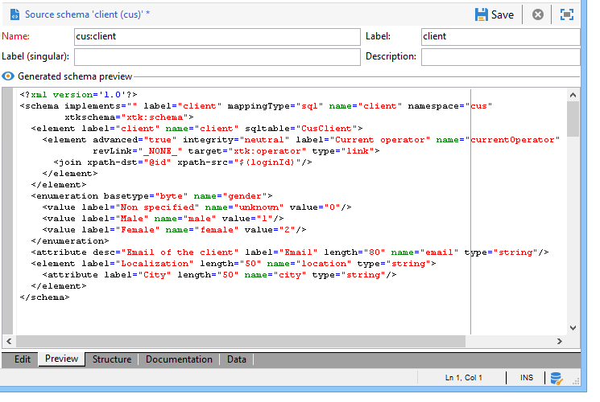

# 資料方案{#data-schemas}

## 原則 {#principles}

若要編輯、建立及設定方案，請按一下 **[!UICONTROL Administration > Configuration > Data schemas]** Adobe Campaign使用者端主控台的節點。

>[!NOTE]
>
>內建資料結構描述只能由Adobe Campaign Classic主控台的管理員刪除。


編輯欄位會顯示來源結構描述的XML內容：


>[!NOTE]
>
>「名稱」編輯控制項可讓您輸入由名稱和名稱空間組成的結構描述金鑰。 結構描述根元素的「名稱」和「名稱空間」屬性會在結構描述的XML編輯區域中自動更新。

預覽會自動產生擴充型綱要：



>[!NOTE]
>
>儲存來源結構描述時，就會自動啟動產生延伸結構描述。

如果您需要檢查架構的完整結構，可以使用預覽索引標籤。 如果結構描述已擴充，您就能將其所有擴充功能視覺化。 作為補充，[檔案]索引標籤會顯示所有綱要屬性和元素及其特性（SQL欄位、型別/長度、標籤、說明）。 檔案索引標籤僅適用於產生的結構描述。 有關詳細資訊，請參閱 [重新產生方案](../../configuration/using/regenerating-schemas.md) 區段。

## 範例：建立合約表格 {#example--creating-a-contract-table}

在下列範例中，我們要為 **合約** 在Adobe Campaign資料庫的資料庫模型中。 此表格可讓您儲存每個合約的持有者和共同持有者的名字和姓氏，以及電子郵件地址。

要執行此操作，您需要建立表格的綱要，並更新資料庫結構以產生對應的表格。 套用下列階段：

1. 編輯 **[!UICONTROL Administration > Configuration > Data schemas]** Adobe Campaign樹的節點，然後按一下 **[!UICONTROL New]** .
1. 選擇 **[!UICONTROL Create a new table in the data model]** 選項並按一下 **[!UICONTROL Next]** .

   

1. 指定資料表的名稱和名稱空間。

   

   >[!NOTE]
   >
   >依預設，使用者建立的方案會儲存在「cus」名稱空間。 有關詳細資訊，請參閱 [結構描述的識別](../../configuration/using/about-schema-reference.md#identification-of-a-schema).

1. 建立表格內容。 建議您使用輸入精靈來確認沒有遺失任何設定。 若要這麼做，請按一下 **[!UICONTROL Insert]** 按鈕，並選擇要新增的設定型別。

   

1. 定義合約表格的設定：

   ```
   <srcSchema desc="Active contracts" img="ncm:channels.png" label="Contracts" labelSingular="Contract" mappingType="sql" name="Contracts" namespace="cus" xtkschema="xtk:srcSchema">
     <element desc="Active contracts" img="ncm:channels.png" label="Contracts" labelSingular="Contract"
              name="Contracts" autopk="true">
              <attribute name="holderName" label="Holder last name" type="string"/>
              <attribute name="holderFirstName" label="Holder first name" type="string"/>
              <attribute name="holderEmail" label="Holder email" type="string"/>
              <attribute name="co-holderName" label="Co-holder last name" type="string"/>           
              <attribute name="co-holderFirstName" label="Co-holder first name" type="string"/>           
              <attribute name="co-holderEmail" label="Co-holder email" type="string"/>    
              <attribute name="date" label="Subscription date" type="date"/>     
              <attribute name="noContract" label="Contract number" type="long"/>  
     </element>
   </srcSchema>
   ```

   新增合約型別，並將索引置於合約編號上。

   ```
   <srcSchema _cs="Contracts (cus)" desc="Active contracts" entitySchema="xtk:srcSchema" img="ncm:channels.png"
              label="Contracts" labelSingular="Contract" name="Contracts" namespace="cus" xtkschema="xtk:srcSchema">
     <enumeration basetype="byte" name="typeContract">
       <value label="Home" name="home" value="0"/>
       <value label="Car" name="car" value="1"/>
       <value label="Health" name="health" value="2"/>
       <value label="Pension fund" name="pension fund" value="2"/>
     </enumeration>
     <element autopk="true" desc="Active contracts" img="ncm:channels.png" label="Contracts"
              labelSingular="Contract" name="Contracts">
       <attribute label="Holder last name" name="holderName" type="string"/>
       <attribute label="Holder first name" name="holderFirstName" type="string"/>
       <attribute label="Holder email" name="holderEmail" type="string"/>
       <attribute label="Co-holder last name" name="co-holderName" type="string"/>
       <attribute label="Co-holder first name" name="co-holderFirstName" type="string"/>
       <attribute label="Co-holder email" name="co-holderEmail" type="string"/>
       <attribute label="Subscription date" name="date" type="date"/>
      <attribute desc="Type of contract" enum="cus:Contracts:typeContract" label="Type of contract"
                  name="type" type="byte"/>
       <attribute label="Contract number" name="noContract" type="long"/>
       <dbindex name="noContract" unique="true">
         <keyfield xpath="@noContract"/>
       </dbindex>
     </element>
   </srcSchema>
   ```

1. 儲存結構描述以產生結構：

   

1. 更新資料庫結構以建立將連結綱要的表格。 有關詳細資訊，請參閱 [更新資料庫結構](../../configuration/using/updating-the-database-structure.md).
