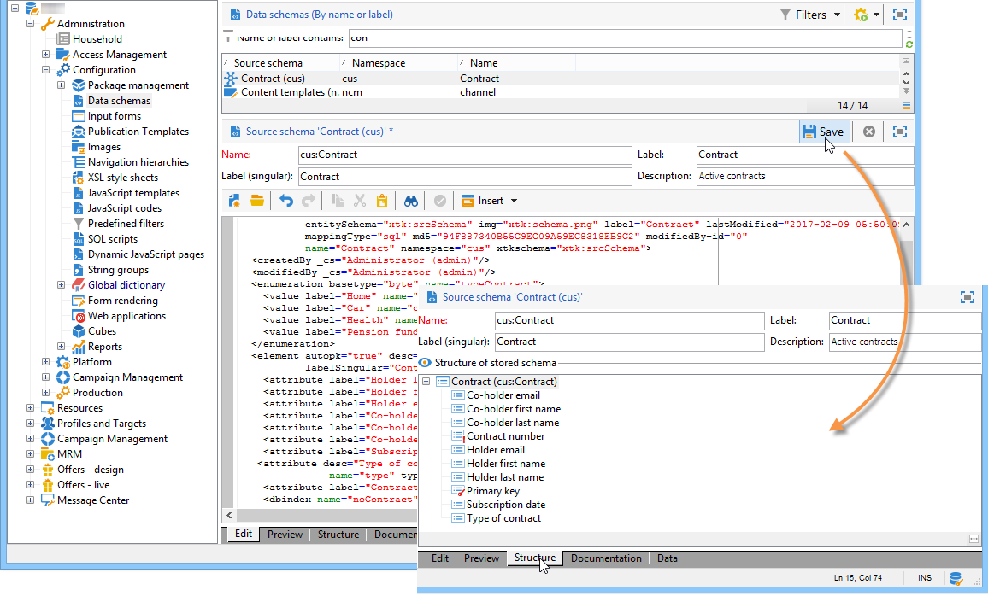

# 資料結構{#data-schemas}

## 原則 {#principles}

若要編輯、建立及設定結構，請按一下Adobe Campaign用 **[!UICONTROL Administration > Configuration > Data schemas]** 戶端主控台的節點。

>[!NOTE]
>
>您的Adobe Campaign Classic主控台管理員只能刪除現成可用的資料結構。


編輯欄位顯示源架構的XML內容：


>[!NOTE]
>
>「名稱」編輯控制項可讓您輸入由名稱和名稱空間組成的架構索引鍵。 架構的根元素的&quot;name&quot;和&quot;namespace&quot;屬性會在架構的XML編輯區域中自動更新。

預覽會自動產生擴充的架構：


>[!NOTE]
>
>保存源模式時，將自動啟動擴展模式的生成。

如果需要檢查方案的完整結構，可以使用預覽頁籤。 如果架構已擴充，則您將能夠直觀顯示其所有擴展。 作為補充，「文檔」頁籤顯示所有方案屬性和元素及其屬性（SQL欄位、類型／長度、標籤、說明）。 「文檔」頁籤僅適用於生成的方案。 有關詳細資訊，請參閱「重新生 [成方案](../../configuration/using/regenerating-schemas.md) 」部分。

## 範例：建立合同表 {#example--creating-a-contract-table}

在下列範例中，我們想在Adobe Campaign資料庫的資料庫 **模型** 中為合約建立新表格。 此表格可讓您儲存每個合約持有人和共同持有人的名字和姓氏以及電子郵件地址。

為此，需要建立表的模式並更新資料庫結構以生成相應表。 套用下列階段：

1. 編輯Adobe **[!UICONTROL Administration > Configuration > Data schemas]** Campaign樹狀結構的節點，然後按一下 **[!UICONTROL New]** 。
1. 選擇選 **[!UICONTROL Create a new table in the data model]** 項，然後按一下 **[!UICONTROL Next]** 。

   

1. 指定表的名稱和命名空間。

   

   >[!NOTE]
   >
   >依預設，由使用者建立的結構描述會儲存在&#39;cus&#39;命名空間中。 有關詳細資訊，請參 [閱模式標識](../../configuration/using/about-schema-reference.md#identification-of-a-schema)。

1. 建立表的內容。 我們建議使用登入精靈，以確保沒有遺失設定。 若要這麼做，請按一 **[!UICONTROL Insert]** 下按鈕，然後選擇要新增的設定類型。

   

1. 定義合同表的設定：

   ```
   <srcSchema desc="Active contracts" img="ncm:channels.png" label="Contracts" labelSingular="Contract" mappingType="sql" name="Contracts" namespace="cus" xtkschema="xtk:srcSchema">
     <element desc="Active contracts" img="ncm:channels.png" label="Contracts" labelSingular="Contract"
              name="Contracts" autopk="true">
              <attribute name="holderName" label="Holder last name" type="string"/>
              <attribute name="holderFirstName" label="Holder first name" type="string"/>
              <attribute name="holderEmail" label="Holder email" type="string"/>
              <attribute name="co-holderName" label="Co-holder last name" type="string"/>           
              <attribute name="co-holderFirstName" label="Co-holder first name" type="string"/>           
              <attribute name="co-holderEmail" label="Co-holder email" type="string"/>    
              <attribute name="date" label="Subscription date" type="date"/>     
              <attribute name="noContract" label="Contract number" type="long"/>  
     </element>
   </srcSchema>
   ```

   添加合同類型，並在合同編號上放置索引。

   ```
   <srcSchema _cs="Contracts (cus)" desc="Active contracts" entitySchema="xtk:srcSchema" img="ncm:channels.png"
              label="Contracts" labelSingular="Contract" name="Contracts" namespace="cus" xtkschema="xtk:srcSchema">
     <enumeration basetype="byte" name="typeContract">
       <value label="Home" name="home" value="0"/>
       <value label="Car" name="car" value="1"/>
       <value label="Health" name="health" value="2"/>
       <value label="Pension fund" name="pension fund" value="2"/>
     </enumeration>
     <element autopk="true" desc="Active contracts" img="ncm:channels.png" label="Contracts"
              labelSingular="Contract" name="Contracts">
       <attribute label="Holder last name" name="holderName" type="string"/>
       <attribute label="Holder first name" name="holderFirstName" type="string"/>
       <attribute label="Holder email" name="holderEmail" type="string"/>
       <attribute label="Co-holder last name" name="co-holderName" type="string"/>
       <attribute label="Co-holder first name" name="co-holderFirstName" type="string"/>
       <attribute label="Co-holder email" name="co-holderEmail" type="string"/>
       <attribute label="Subscription date" name="date" type="date"/>
      <attribute desc="Type of contract" enum="cus:Contracts:typeContract" label="Type of contract"
                  name="type" type="byte"/>
       <attribute label="Contract number" name="noContract" type="long"/>
       <dbindex name="noContract" unique="true">
         <keyfield xpath="@noContract"/>
       </dbindex>
     </element>
   </srcSchema>
   ```

1. 保存模式以生成結構：

   

1. 更新資料庫結構以建立將連結模式的表。 有關詳細資訊，請參閱 [更新資料庫結構](../../configuration/using/updating-the-database-structure.md)。

