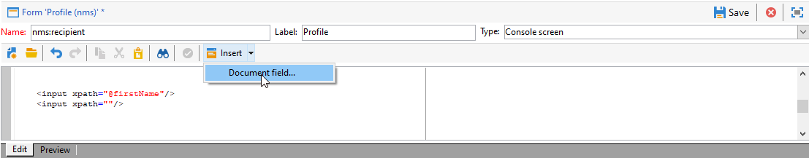

# 編輯表單{#editing-forms}


## 概覽

營銷商和操作員使用輸入表單建立、修改和預覽記錄。 Forms展示了資訊的視覺表現。

您可以建立和修改輸入表單：

* 您可以修改預設提供的工廠輸入表單。 工廠輸入表單基於工廠資料模式。
* 您可以基於您定義的資料架構建立自定義輸入表單。

Forms是 `xtk:form` 的雙曲餘切值。 可在 `xtk:form` 架構。 要查看此架構，請選擇 **[!UICONTROL Administration]** > **[!UICONTROL Configuration]** > **[!UICONTROL Data schemas]** 的子菜單。 閱讀有關 [形式結構](form-structure.md)。

要訪問輸入表單，請選擇 **[!UICONTROL Administration]> [!UICONTROL Configuration] >[!UICONTROL Input forms]** 的下界：


要設計表單，請在XML編輯器中編輯XML內容：


[顯示全文](form-structure.md#formatting)。

要預覽表單，請按一下 **[!UICONTROL Preview]** 頁籤：


## 窗體類型

您可以建立不同類型的輸入表單。 表單類型確定用戶如何瀏覽表單：

* 控制台螢幕

   這是預設的窗體類型。 該表單包括單頁。

   

* 內容管理

   將此表單類型用於內容管理。 查看 [用例](../../delivery/using/use-case--creating-content-management.md)。

   

* 嚮導

   該表單包括多個按特定順序排列的浮動螢幕。 用戶從一個螢幕導航到下一個螢幕。 [顯示全文](form-structure.md#wizards)。

* 表徵圖框

   此表單包含多頁。 要導航表單，用戶選擇表單左側的表徵圖。

   

* 筆記本

   此表單包含多頁。 要導航表單，用戶選擇表單頂部的頁籤。

   

* 垂直窗格

   此窗體顯示導航樹。

* 水準窗格

   此窗體顯示項目清單。

## 容器

在表單中，您可以將容器用於各種用途：

* 在表單中組織內容
* 定義對輸入欄位的訪問
* 在其他窗體中嵌套窗體

[顯示全文](form-structure.md#containers)。

### 組織內容

使用容器在表單中組織內容：

* 可將欄位分組為部分。
* 您可以將頁面添加到多頁表單。

要插入容器，請使用 `<container>` 的子菜單。 [顯示全文](form-structure.md#containers)。

#### 組欄位

使用容器將輸入欄位分組為有組織的部分。

要將節插入表單，請使用以下元素： `<container type="frame">`。 （可選）要添加節標題，請使用 `label` 屬性。

語法： `<container type="frame" label="`*節標題*`"> […] </container>`

在此示例中，容器定義 **建立** 部分，包括 **[!UICONTROL Created by]** 和 **[!UICONTROL Name]** 輸入欄位：

```xml
<form _cs="Coupons (nms)" entitySchema="xtk:form" img="xtk:form.png" label="Coupons"
      name="coupon" namespace="nms" type="default" xtkschema="xtk:form">
  <input xpath="@code"/>
  <input xpath="@type"/>
  <container label="Creation" type="frame">
    <input xpath="createdBy"/>
    <input xpath="createdBy/@name"/>
  </container>
</form>
```


#### 將頁面添加到多頁表單

對於多頁表單，使用容器建立表單頁。

此示例顯示 **常規** 和 **詳細資訊** 頁：

```xml
<container img="ncm:book.png" label="General">
[…]
</container>
<container img="ncm:detail.png" label="Details">
[…]
</container>
```

### 定義對欄位的訪問

使用容器定義可見內容並定義對欄位的訪問權限。 可以開啟或關閉欄位組。

### 嵌套窗體

使用容器將表單嵌套在其它表單中。 [顯示全文](#add-pages-to-multipage-forms)。

## 對影像的引用

要查找影像，請選擇 **[!UICONTROL Administration]** > **[!UICONTROL Configuration]** > **[!UICONTROL Images]** 的子菜單。

要將影像與表單中的元素（例如表徵圖）關聯，可以添加對影像的引用。 使用 `img` 屬性，例如，在 `<container>` 的子菜單。

語法: `img="`*`namespace`*`:`*`filename`*`.`*`extension`*`"`

此示例顯示對 `book.png` 和 `detail.png` 影像 `ncm` 命名空間：

```xml
<container img="ncm:book.png" label="General">
[…]
</container>
<container img="ncm:detail.png" label="Details">
[…]
</container>
```

這些影像用於用戶按一下以導航多頁表單的表徵圖：


## 建立簡單窗體 {#create-simple-form}

要建立表單，請執行以下步驟：

1. 從菜單中選擇 **[!UICONTROL Administration]** > **[!UICONTROL Configuration]** > **[!UICONTROL Input forms]**。
1. 按一下 **[!UICONTROL New]** 按鈕

   

1. 指定表單屬性：

   * 指定表單名稱和命名空間。

      表單名稱和命名空間可以與相關資料架構匹配。  此示例顯示 `cus:order` 資料架構：

      ```xml
      <form entitySchema="xtk:form" img="xtk:form.png" label="Order" name="order" namespace="cus" type="iconbox" xtkschema="xtk:form">
        […]
      </form>
      ```

      或者，可以在 `entity-schema` 屬性。

      ```xml
      <form entity-schema="cus:stockLine" entitySchema="xtk:form" img="xtk:form.png" label="Stock order" name="stockOrder" namespace="cus" xtkschema="xtk:form">
        […]
      </form>
      ```

   * 指定要在窗體上顯示的標籤。
   * （可選）指定表單類型。 如果未指定表單類型，則預設使用控制台螢幕類型。

      

      如果要設計多頁表單，則可以忽略 `<form>` 元素，並指定容器中的類型。

1. 按一下&#x200B;**[!UICONTROL Save]**。

1. 插入表單元素。

   例如，要插入輸入欄位，請使用 `<input>` 的子菜單。 設定 `xpath` 屬性作為XPath表達式。 [顯示全文](schema-structure.md#referencing-with-xpath)。

   此示例顯示基於 `nms:recipient` 架構。

   ```xml
   <input xpath="@firstName"/>
   <input xpath="@lastName"/>
   ```

1. 如果表單基於特定架構類型，則可以查找此架構的欄位：

   1. 按一下 **[!UICONTROL Insert]** > **[!UICONTROL Document fields]**.

      

   1. 選擇該欄位並按一下 **[!UICONTROL OK]**。

      

1. （可選）指定欄位編輯器。

   預設欄位編輯器與每個資料類型相關聯：
   * 對於日期類型欄位，表單將顯示輸入日曆。
   * 對於枚舉類型欄位，表單將顯示選擇清單。

   可以使用以下欄位編輯器類型：

   | 欄位編輯器 | 表單屬性 |
   | --- | --- |
   | 單選按鈕 | `type="radiobutton"` |
   | 複選框 | `type="checkbox"` |
   | 編輯樹 | `type="tree"` |

   閱讀有關 [記憶體清單控制](form-structure.md#memory-list-controls)。

1. （可選）定義對欄位的訪問：

   | 元素 | 屬性 | 說明 |
   | --- | --- | --- |
   | `<input>` | `read-only:"true"` | 提供對欄位的只讀訪問 |
   | `<container>` | `type="visibleGroup" visibleIf="`*編輯 — expr*`"` | 有條件地顯示一組欄位 |
   | `<container>` | `type="enabledGroup" enabledIf="`*編輯 — expr*`"` | 有條件地啟用一組欄位 |

   範例:

   ```xml
   <container type="enabledGroup" enabledIf="@gender=1">
     […]
   </container>
   <container type="enabledGroup" enabledIf="@gender=2">
     […]
   </container>
   ```

1. （可選）使用容器將欄位分組為部分。

   ```xml
   <container type="frame" label="Name">
      <input xpath="@firstName"/>
      <input xpath="@lastName"/>
   </container>
   <container type="frame" label="Contact details">
      <input xpath="@email"/>
      <input xpath="@phone"/>
   </container>
   ```

   

## 建立多頁表單 {#create-multipage-form}

您可以建立多頁表單。 您也可以在其它窗體中嵌套窗體。

### 建立 `iconbox` 表格

使用 `iconbox` 表單類型，用於在表單左側顯示表徵圖，這些表徵圖將用戶帶到表單中的不同頁面。


將現有窗體的類型更改為 `iconbox`，請執行以下步驟：

1. 更改 `type` 屬性 `<form>` 元素 `iconbox`:

   ```xml
   <form […] type="iconbox">
   ```

1. 為每個表單頁設定容器：

   1. 添加 `<container>` 元素作為子項 `<form>` 的子菜單。
   1. 要為表徵圖定義標籤和影像，請使用 `label` 和 `img` 屬性。

      ```xml
      <form entitySchema="xtk:form" name="Service provider" namespace="nms" type="iconbox" xtkschema="xtk:form">
          <container img="xtk:properties.png" label="General">
              <input xpath="@label"/>
              <input xpath="@name"/>
              […]
          </container>
          <container img="nms:msgfolder.png" label="Details">
              <input xpath="@address"/>
              […]
          </container>
          <container img="nms:supplier.png" label="Services">
              […]
          </container>
      </form>
      ```
   或者，刪除 `type="frame"` 屬性 `<container>` 元素。

### 建立筆記本窗體

使用 `notebook` 表單類型，用於在表單頂部顯示頁籤，這些頁籤將用戶帶到不同的頁面。


將現有窗體的類型更改為 `notebook`，請執行以下步驟：

1. 更改 `type` 屬性 `<form>` 元素 `notebook`:

   ```xml
   <form […] type="notebook">
   ```

1. 為每個表單頁添加容器：

   1. 添加 `<container>` 元素作為子項 `<form>` 的子菜單。
   1. 要定義表徵圖的標籤和影像，請使用 `label` 和 `img` 屬性。

   ```xml
     <form entitySchema="xtk:form" name="Service provider" namespace="nms" type="notebook" xtkschema="xtk:form">
         <container label="General">
             <input xpath="@label"/>
             <input xpath="@name"/>
             […]
         </container>
         <container label="Details">
             <input xpath="@address"/>
             […]
         </container>
         <container label="Services">
             […]
         </container>
     </form>
   ```

   或者，刪除 `type="frame"` 屬性 `<container>` 元素。

### 嵌套窗體

可以在其它窗體中嵌套窗體。 例如，可以在表徵圖框窗體中嵌套筆記本窗體。

嵌套級別控制導航。 用戶可以細化到子表單。

要將表單嵌套在另一個表單中，請插入 `<container>` 元素並設定 `type` 屬性。 對於頂層窗體，可以在外部容器或 `<form>` 的子菜單。

### 範例

此示例顯示一個複雜的窗體：

* 頂級窗體是表徵圖框窗體。 該表格包括兩個標有 **常規** 和 **詳細資訊**。

   因此，外形顯示 **常規** 和 **詳細資訊** 頁面。 要訪問這些頁面，用戶按一下表單左側的表徵圖。

* 子窗體是嵌套在 **常規** 容器。 該子模包括兩個標有標籤的容器 **名稱** 和 **聯繫人**。

```xml
<form _cs="Profile (nms)" entitySchema="xtk:form" img="xtk:form.png" label="Profile" name="profile" namespace="nms" xtkschema="xtk:form">
  <container type="iconbox">
    <container img="ncm:general.png" label="General">
      <container type="notebook">
        <container label="Name">
          <input xpath="@firstName"/>
          <input xpath="@lastName"/>
        </container>
        <container label="Contact">
          <input xpath="@email"/>
        </container>
      </container>
    </container>
    <container img="ncm:detail.png" label="Details">
      <input xpath="@birthDate"/>
    </container>
  </container>
</form>
```

因此， **常規** 頁面顯示 **名稱** 和 **聯繫人** 頁籤。


要將表單嵌套在另一個表單中，請插入 `<container>` 元素並設定 `type` 屬性。 對於頂層窗體，可以在外部容器或 `<form>` 的子菜單。

### 範例

此示例顯示一個複雜的窗體：

* 頂級窗體是表徵圖框窗體。 該表格包括兩個標有 **常規** 和 **詳細資訊**。

   因此，外形顯示 **常規** 和 **詳細資訊** 頁面。 要訪問這些頁面，用戶按一下表單左側的表徵圖。

* 子窗體是嵌套在 **常規** 容器。 該子模包括兩個標有標籤的容器 **名稱** 和 **聯繫人**。

```xml
<form _cs="Profile (nms)" entitySchema="xtk:form" img="xtk:form.png" label="Profile" name="profile" namespace="nms" xtkschema="xtk:form">
  <container type="iconbox">
    <container img="ncm:general.png" label="General">
      <container type="notebook">
        <container label="Name">
          <input xpath="@firstName"/>
          <input xpath="@lastName"/>
        </container>
        <container label="Contact">
          <input xpath="@email"/>
        </container>
      </container>
    </container>
    <container img="ncm:detail.png" label="Details">
      <input xpath="@birthDate"/>
    </container>
  </container>
</form>
```

因此， **常規** 頁面顯示 **名稱** 和 **聯繫人** 頁籤。


## 修改工廠輸入表單 {#modify-factory-form}

要修改工廠表單，請執行以下步驟：

1. 修改工廠輸入表單：

   1. 從菜單中選擇 **[!UICONTROL Administration]** > **[!UICONTROL Configuration]** > **[!UICONTROL Input forms]**。
   1. 選擇輸入表單並修改它。

   您可以擴展工廠資料架構，但不能擴展工廠輸入表單。 我們建議您直接修改工廠輸入表單，而不重新建立它們。 在軟體升級期間，您在工廠輸入表單中的修改將與升級合併。 如果自動合併失敗，則可以解決衝突。 [顯示全文](../../production/using/upgrading.md#resolving-conflicts)。

   例如，如果擴展了具有附加欄位的工廠架構，則可以將此欄位添加到相關的工廠窗體。

## 驗證表單 {#validate-forms}

您可以在表單中包括驗證控制項。

### 授予對欄位的只讀訪問權限

要授予對欄位的只讀訪問權限，請使用 `readOnly="true"` 屬性。 例如，您可能希望顯示記錄的主鍵，但具有只讀訪問權限。 [顯示全文](form-structure.md#non-editable-fields)。

在本示例中，主鍵(`iRecipientId`) `nms:recipient` 模式顯示在只讀訪問中：

```xml
<value xpath="@iRecipientId" readOnly="true"/>
```

### 檢查必填欄位

您可以檢查必備資訊：

* 使用 `required="true"` 屬性。
* 使用 `<leave>` 節點，以檢查這些欄位並顯示錯誤消息。

在本示例中，電子郵件地址是必需的，如果用戶未提供以下資訊，則會顯示錯誤消息：

```xml
<input xpath="@email" required="true"/>
<leave>
  <check expr="@email!=''">
    <error>The email address is required.</error>
  </check>
</leave>
```

閱讀有關 [表達式欄位](form-structure.md#expression-field) 和 [表單上下文](form-structure.md#context-of-forms)。

### 驗證值

可以使用JavaScript SOAP調用從控制台驗證表單資料。 使用這些調用進行複雜驗證，例如，根據授權值清單檢查值。 [顯示全文](form-structure.md#soap-methods)。

1. 在JS檔案中建立驗證函式。

   範例:

   ```js
   function nms_recipient_checkValue(value)
   {
     logInfo("checking value " + value)
     if (…)
     {
       logError("Value " + value + " is not valid")
     }
     return 1
   }
   ```

   在本示例中，函式名為 `checkValue`。 此函式用於檢查 `recipient` 資料類型 `nms` 命名空間。 正在檢查的值將被記錄。 如果該值無效，則會記錄錯誤消息。 如果值有效，則返回值1。

   可以使用返回的值修改表單。

1. 在窗體中，添加 `<soapCall>` 元素 `<leave>` 的子菜單。

   在此示例中，使用SOAP調用驗證 `@valueToCheck` 字串：

   ```xml
   <form name="recipient" (…)>
   (…)
     <leave>
       <soapCall name="checkValue" service="nms:recipient">
         <param exprIn="@valueToCheck" type="string"/>
       </soapCall>
     </leave>
   </form>
   ```

   在此示例中， `checkValue` 方法和 `nms:recipient` 服務：

   * 服務是命名空間和資料類型。
   * 方法是函式名。 名稱區分大小寫。

   該呼叫被同步執行。

   將顯示所有例外。 如果使用 `<leave>` 元素，則用戶在驗證輸入的資訊之前無法保存表單。

此示例說明如何從表單內進行服務調用：

```xml
<enter>
  <soapCall name="client" service="c4:ybClient">
    <param exprIn="@id" type="string"/>
    <param type="boolean" xpathOut="/tmp/@count"/>
  </soapCall>
</enter>
```

在此示例中，輸入是ID，它是主鍵。 當用戶填寫此ID的表單時，將使用此ID作為輸入參數進行SOAP調用。 輸出是寫入此欄位的布爾值： `/tmp/@count`。 您可以在表單內使用此布爾值。 閱讀有關 [表單上下文](form-structure.md#context-of-forms)。
