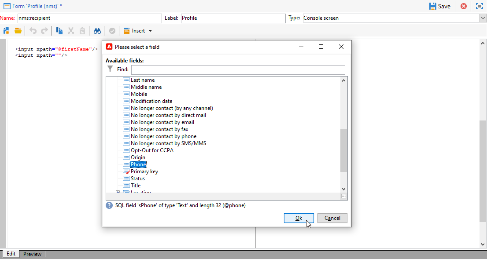

# 編輯表單{#editing-forms}

## 概覽

行銷人員和操作員使用輸入表單來建立、修改和預覽記錄。 Forms會顯示資訊的視覺化表示法。

您可以建立和修改輸入表單：

* 您可以修改預設提供的工廠輸入表單。 工廠輸入表單是以工廠資料結構描述為基礎。
* 您可以根據您定義的資料結構描述建立自訂輸入表單。

Forms是`xtk:form`型別的實體。 您可以在`xtk:form`結構描述中檢視輸入表單結構。 若要檢視此結構描述，請從功能表中選擇&#x200B;**[!UICONTROL Administration]** > **[!UICONTROL Configuration]** > **[!UICONTROL Data schemas]**。 深入瞭解[表單結構](form-structure.md)。

若要存取輸入表單，請從功能表選擇&#x200B;**[!UICONTROL Administration]> [!UICONTROL Configuration] >[!UICONTROL Input forms]**：


若要設計表單，請在XML編輯器中編輯XML內容：


[閱讀全文](form-structure.md#formatting)。

若要預覽表單，請按一下&#x200B;**[!UICONTROL Preview]**&#x200B;標籤：


## 表單型別

您可以建立不同型別的輸入表單。 表單型別會決定使用者如何導覽表單：

* 主控台畫面

  這是預設表單型別。 此表單包含一個頁面。

  

* 內容管理

  使用此表單型別進行內容管理。 檢視此[使用案例](../../delivery/using/use-case-creating-content-management.md)。

  

* 精靈

  此表單包含多個以特定順序排序的浮動熒幕。 使用者從一個畫面瀏覽至下一個畫面。 [閱讀全文](form-structure.md#wizards)。

* 圖示方塊

  此表單包含多個頁面。 若要導覽表單，使用者可在表單左側選取圖示。

  

* Notebook

  此表單包含多個頁面。 若要導覽表單，使用者可在表單頂端選取索引標籤。

  

* 垂直窗格

  此表單會顯示導覽樹狀結構。

* 水平窗格

  此表單會顯示專案清單。

## 容器

在表單中，您可以將容器用於各種用途：

* 在表單中整理內容
* 定義輸入欄位的存取權
* 在其他表單中巢狀內嵌表單

[閱讀全文](form-structure.md#containers)。

### 組織內容

使用容器來組織表單中的內容：

* 您可以將欄位分組為區段。
* 您可以將頁面新增至多頁表單。

若要插入容器，請使用`<container>`元素。 [閱讀全文](form-structure.md#containers)。

#### 群組欄位

使用容器將輸入欄位分組為有組織的區段。

若要將區段插入表單中，請使用此專案： `<container type="frame">`。 若要新增章節標題，可選擇使用`label`屬性。

語法： `<container type="frame" label="`*section_title*`"> […] </container>`

在此範例中，容器定義&#x200B;**建立**&#x200B;區段，包含&#x200B;**[!UICONTROL Created by]**&#x200B;和&#x200B;**[!UICONTROL Name]**&#x200B;輸入欄位：

```xml
<form _cs="Coupons (nms)" entitySchema="xtk:form" img="xtk:form.png" label="Coupons"
      name="coupon" namespace="nms" type="default" xtkschema="xtk:form">
  <input xpath="@code"/>
  <input xpath="@type"/>
  <container label="Creation" type="frame">
    <input xpath="createdBy"/>
    <input xpath="createdBy/@name"/>
  </container>
</form>
```


#### 將頁面新增至多頁表單

若為多頁表單，請使用容器建立表單頁面。

此範例顯示表單之&#x200B;**一般**&#x200B;和&#x200B;**詳細資料**&#x200B;頁面的容器：

```xml
<container img="ncm:book.png" label="General">
[…]
</container>
<container img="ncm:detail.png" label="Details">
[…]
</container>
```

### 定義欄位存取權

使用容器來定義可見專案並定義欄位的存取權。 您可以開啟或關閉欄位群組。

### 巢狀內嵌表單

使用容器在其他表單中巢狀內嵌表單。 [閱讀全文](#add-pages-to-multipage-forms)。

## 影像參考

若要尋找影像，請從功能表中選擇&#x200B;**[!UICONTROL Administration]** > **[!UICONTROL Configuration]** > **[!UICONTROL Images]**。

若要將影像與表單中的元素（例如圖示）相關聯，您可以新增影像的參照。 例如，在`<container>`元素中使用`img`屬性。

語法： `img="`*`namespace`*`:`*`filename`*`.`*`extension`*`"`

此範例顯示從`ncm`名稱空間參考`book.png`和`detail.png`影像：

```xml
<container img="ncm:book.png" label="General">
[…]
</container>
<container img="ncm:detail.png" label="Details">
[…]
</container>
```

這些影像用於使用者按一下以導覽多頁表單的圖示：


## 建立簡單表單 {#create-simple-form}

若要建立表單，請遵循下列步驟：

1. 從功能表中選擇&#x200B;**[!UICONTROL Administration]** > **[!UICONTROL Configuration]** > **[!UICONTROL Input forms]**。
1. 按一下清單右上角的&#x200B;**[!UICONTROL New]**&#x200B;按鈕。

   

1. 指定表單屬性：

   * 指定表單名稱和名稱空間。

     表單名稱和名稱空間可比對相關的資料結構。  此範例顯示`cus:order`資料結構描述的表單：

     ```xml
     <form entitySchema="xtk:form" img="xtk:form.png" label="Order" name="order" namespace="cus" type="iconbox" xtkschema="xtk:form">
       […]
     </form>
     ```

     或者，您可以在`entity-schema`屬性中明確指定資料結構描述。

     ```xml
     <form entity-schema="cus:stockLine" entitySchema="xtk:form" img="xtk:form.png" label="Stock order" name="stockOrder" namespace="cus" xtkschema="xtk:form">
       […]
     </form>
     ```

   * 指定要顯示在表單上的標籤。
   * 選擇性地指定表單型別。 如果您未指定表單型別，預設會使用主控台畫面型別。

     

     如果您設計的是多頁表單，則可以省略`<form>`元素中的表單型別，並在容器中指定型別。

1. 按一下&#x200B;**[!UICONTROL Save]**。

1. 插入表單元素。

   例如，若要插入輸入欄位，請使用`<input>`元素。 將`xpath`屬性設定為欄位參考為XPath運算式。 [閱讀全文](schema-structure.md#referencing-with-xpath)。

   此範例顯示以`nms:recipient`結構描述為基礎的輸入欄位。

   ```xml
   <input xpath="@firstName"/>
   <input xpath="@lastName"/>
   ```

1. 如果表單是根據特定結構描述型別，您可以查詢此結構描述的欄位：

   1. 按一下&#x200B;**[!UICONTROL Insert]** > **[!UICONTROL Document fields]**。

      

   1. 選取欄位並按一下&#x200B;**[!UICONTROL OK]**。

      

1. 選擇性地指定欄位編輯器。

   預設欄位編輯器與每個資料型別相關聯：
   * 對於日期型別欄位，表單會顯示輸入行事曆。
   * 對於列舉型別的欄位，表單會顯示選取專案清單。

   您可以使用這些欄位編輯器型別：

   | 欄位編輯器 | 表單屬性 |
   | --- | --- |
   | 選項按鈕 | `type="radiobutton"` |
   | 核取方塊 | `type="checkbox"` |
   | 編輯樹狀 | `type="tree"` |

   深入瞭解[記憶體清單控制項](form-structure.md#memory-list-controls)。

1. 選擇性地定義欄位的存取權：

   | 元素 | 屬性 | 說明 |
   | --- | --- | --- |
   | `<input>` | `read-only="true"` | 提供欄位的唯讀存取權 |
   | `<container>` | `type="visibleGroup" visibleIf="`*edit-expr*`"` | 有條件地顯示一組欄位 |
   | `<container>` | `type="enabledGroup" enabledIf="`*edit-expr*`"` | 有條件地啟用一組欄位 |

   例如：

   ```xml
   <container type="enabledGroup" enabledIf="@gender=1">
     […]
   </container>
   <container type="enabledGroup" enabledIf="@gender=2">
     […]
   </container>
   ```

1. 或者，使用容器將欄位分組為區段。

   ```xml
   <container type="frame" label="Name">
      <input xpath="@firstName"/>
      <input xpath="@lastName"/>
   </container>
   <container type="frame" label="Contact details">
      <input xpath="@email"/>
      <input xpath="@phone"/>
   </container>
   ```

   

## 建立多頁表單 {#create-multipage-form}

您可以建立多頁表單。 您也可以在其他表單中巢狀內嵌表單。

### 建立`iconbox`表單

使用`iconbox`表單型別在表單左側顯示圖示，將使用者帶往表單的不同頁面。


若要將現有表單的型別變更為`iconbox`，請遵循下列步驟：

1. 將`<form>`專案的`type`屬性變更為`iconbox`：

   ```xml
   <form […] type="iconbox">
   ```

1. 為每個表單頁面設定容器：

   1. 新增`<container>`專案做為`<form>`專案的子項。
   1. 若要定義圖示的標籤和影像，請使用`label`和`img`屬性。

      ```xml
      <form entitySchema="xtk:form" name="Service provider" namespace="nms" type="iconbox" xtkschema="xtk:form">
          <container img="xtk:properties.png" label="General">
              <input xpath="@label"/>
              <input xpath="@name"/>
              […]
          </container>
          <container img="nms:msgfolder.png" label="Details">
              <input xpath="@address"/>
              […]
          </container>
          <container img="nms:supplier.png" label="Services">
              […]
          </container>
      </form>
      ```

   或者，從現有`<container>`元素移除`type="frame"`屬性。

### 建立Notebook表單

使用`notebook`表單型別在表單頂端顯示索引標籤，將使用者帶往不同的頁面。


若要將現有表單的型別變更為`notebook`，請遵循下列步驟：

1. 將`<form>`專案的`type`屬性變更為`notebook`：

   ```xml
   <form […] type="notebook">
   ```

1. 為每個表單頁面新增容器：

   1. 新增`<container>`專案做為`<form>`專案的子項。
   1. 若要定義圖示的標籤和影像，請使用`label`和`img`屬性。

   ```xml
     <form entitySchema="xtk:form" name="Service provider" namespace="nms" type="notebook" xtkschema="xtk:form">
         <container label="General">
             <input xpath="@label"/>
             <input xpath="@name"/>
             […]
         </container>
         <container label="Details">
             <input xpath="@address"/>
             […]
         </container>
         <container label="Services">
             […]
         </container>
     </form>
   ```

   或者，從現有`<container>`元素移除`type="frame"`屬性。

### 巢狀內嵌表單

您可以將表單巢狀內嵌在其他表單中。 例如，您可以在iconbox表單中巢狀內嵌記事本表單。

巢狀層級會控制導覽。 使用者可向下展開至子表單。

若要在其他表單中巢狀內嵌表單，請插入`<container>`元素並將`type`屬性設定為表單型別。 對於最上層表單，您可以在外部容器或`<form>`元素中設定表單型別。

### 範例

此範例顯示一個複雜的形式：

* 最上層表單是圖示方塊表單。 此表單包含兩個標示為&#x200B;**一般**&#x200B;和&#x200B;**詳細資料**&#x200B;的容器。

  因此，外部表單會在最上層顯示&#x200B;**一般**&#x200B;和&#x200B;**詳細資料**&#x200B;頁面。 若要存取這些頁面，使用者請按一下表單左側的圖示。

* 子表單是巢狀在&#x200B;**一般**&#x200B;容器中的筆記本表單。 子表單包含兩個標示為&#x200B;**名稱**&#x200B;和&#x200B;**連絡人**&#x200B;的容器。

```xml
<form _cs="Profile (nms)" entitySchema="xtk:form" img="xtk:form.png" label="Profile" name="profile" namespace="nms" xtkschema="xtk:form">
  <container type="iconbox">
    <container img="ncm:general.png" label="General">
      <container type="notebook">
        <container label="Name">
          <input xpath="@firstName"/>
          <input xpath="@lastName"/>
        </container>
        <container label="Contact">
          <input xpath="@email"/>
        </container>
      </container>
    </container>
    <container img="ncm:detail.png" label="Details">
      <input xpath="@birthDate"/>
    </container>
  </container>
</form>
```

因此，外部表單的&#x200B;**一般**&#x200B;頁面會顯示&#x200B;**名稱**&#x200B;和&#x200B;**連絡人**&#x200B;標籤。


若要在其他表單中巢狀內嵌表單，請插入`<container>`元素並將`type`屬性設定為表單型別。 對於最上層表單，您可以在外部容器或`<form>`元素中設定表單型別。

### 範例

此範例顯示一個複雜的形式：

* 最上層表單是圖示方塊表單。 此表單包含兩個標示為&#x200B;**一般**&#x200B;和&#x200B;**詳細資料**&#x200B;的容器。

  因此，外部表單會在最上層顯示&#x200B;**一般**&#x200B;和&#x200B;**詳細資料**&#x200B;頁面。 若要存取這些頁面，使用者請按一下表單左側的圖示。

* 子表單是巢狀在&#x200B;**一般**&#x200B;容器中的筆記本表單。 子表單包含兩個標示為&#x200B;**名稱**&#x200B;和&#x200B;**連絡人**&#x200B;的容器。

```xml
<form _cs="Profile (nms)" entitySchema="xtk:form" img="xtk:form.png" label="Profile" name="profile" namespace="nms" xtkschema="xtk:form">
  <container type="iconbox">
    <container img="ncm:general.png" label="General">
      <container type="notebook">
        <container label="Name">
          <input xpath="@firstName"/>
          <input xpath="@lastName"/>
        </container>
        <container label="Contact">
          <input xpath="@email"/>
        </container>
      </container>
    </container>
    <container img="ncm:detail.png" label="Details">
      <input xpath="@birthDate"/>
    </container>
  </container>
</form>
```

因此，外部表單的&#x200B;**一般**&#x200B;頁面會顯示&#x200B;**名稱**&#x200B;和&#x200B;**連絡人**&#x200B;標籤。


## 修改工廠輸入表單 {#modify-factory-form}

若要修改工廠表單，請遵循下列步驟：

1. 修改工廠輸入表單：

   1. 從功能表中選擇&#x200B;**[!UICONTROL Administration]** > **[!UICONTROL Configuration]** > **[!UICONTROL Input forms]**。
   1. 選取輸入表單並加以修改。

   您可以擴充工廠資料結構，但無法擴充工廠輸入表單。 建議您直接修改工廠輸入表單，而不重新建立它們。 在軟體升級期間，您在工廠輸入表單中的修改會與升級合併。 如果自動合併失敗，您可以解決衝突。 [閱讀全文](../../production/using/upgrading.md#resolving-conflicts)。

   例如，如果您使用其他欄位擴充工廠綱要，則可將此欄位新增到相關的Factory表單。

## 驗證表單 {#validate-forms}

您可以在表單中包含驗證控制項。

### 授予欄位唯讀存取權

若要授與欄位的唯讀存取權，請使用`readOnly="true"`屬性。 例如，您可能想要顯示記錄的主索引鍵，但具有唯讀存取權。 [閱讀全文](form-structure.md#non-editable-fields)。

在此範例中，`nms:recipient`結構描述的主索引鍵(`iRecipientId`)以唯讀存取方式顯示：

```xml
<value xpath="@iRecipientId" readOnly="true"/>
```

### 檢查必填欄位

您可以檢查必要資訊：

* 將`required="true"`屬性用於必要欄位。
* 使用`<leave>`節點檢查這些欄位並顯示錯誤訊息。

在此範例中，需要電子郵件地址，如果使用者未提供此資訊，則會顯示錯誤訊息：

```xml
<input xpath="@email" required="true"/>
<leave>
  <check expr="@email!=''">
    <error>The email address is required.</error>
  </check>
</leave>
```

深入瞭解[運算式欄位](form-structure.md#expression-field)和[表單內容](form-structure.md#context-of-forms)。

### 驗證值

您可以使用JavaScript SOAP呼叫，從主控台驗證表單資料。 使用這些呼叫進行複雜驗證，例如，根據授權值清單檢查值。 [閱讀全文](form-structure.md#soap-methods)。

1. 在JS檔案中建立驗證函式。

   例如：

   ```js
   function nms_recipient_checkValue(value)
   {
     logInfo("checking value " + value)
     if (…)
     {
       logError("Value " + value + " is not valid")
     }
     return 1
   }
   ```

   在此範例中，函式名為`checkValue`。 此函式用於檢查`nms`名稱空間中的`recipient`資料型別。 正在檢查的值會記錄下來。 如果值無效，則會記錄錯誤訊息。 如果值有效，則會傳回值1。

   您可以使用傳回的值來修改表單。

1. 在表單中，將`<soapCall>`元素新增至`<leave>`元素。

   在此範例中，SOAP呼叫是用來驗證`@valueToCheck`字串：

   ```xml
   <form name="recipient" (…)>
   (…)
     <leave>
       <soapCall name="checkValue" service="nms:recipient">
         <param exprIn="@valueToCheck" type="string"/>
       </soapCall>
     </leave>
   </form>
   ```

   在此範例中，使用`checkValue`方法和`nms:recipient`服務：

   * 服務是名稱空間和資料型別。
   * 方法是函式名稱。 名稱會區分大小寫。

   呼叫會同步執行。

   會顯示所有例外。 如果您使用`<leave>`元素，則使用者無法儲存表單，直到輸入的資訊通過驗證為止。

此範例顯示如何在表單內進行服務呼叫：

```xml
<enter>
  <soapCall name="client" service="c4:ybClient">
    <param exprIn="@id" type="string"/>
    <param type="boolean" xpathOut="/tmp/@count"/>
  </soapCall>
</enter>
```

在此範例中，輸入為ID，為主索引鍵。 當使用者填寫此ID的表單時，會使用此ID作為輸入引數進行SOAP呼叫。 輸出是寫入此欄位的布林值： `/tmp/@count`。 您可以在表單內使用此布林值。 深入瞭解[表單內容](form-structure.md#context-of-forms)。
