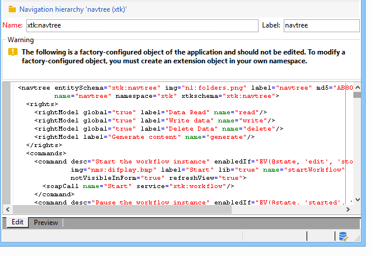
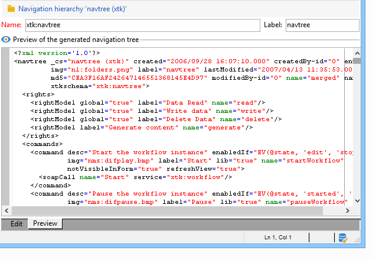

# 編輯Campaign Explorer導覽樹狀結構{#edition}

可透過&#x200B;**[!UICONTROL Administration > Configuration > Navigation hierarchies]**&#x200B;節點存取用來建立和設定導覽階層組態檔案的畫面：

導覽階層組態會分為數個XML檔案。 其運作原理與架構延伸類似：所有檔案會合併以產生包含整個設定的單一檔案。 此檔案無法編輯，並會透過「預覽」索引標籤顯示。

編輯欄位提供XML檔案的內容：

>[!NOTE]
>
>「名稱」編輯控制項可讓您輸入由名稱和名稱空間組成的檔案金鑰。 **`<navtree>`**&#x200B;專案的「名稱」和「名稱空間」屬性會在結構描述的XML編輯欄位中自動更新。

預覽會自動產生包含完整組態的合併檔案：

