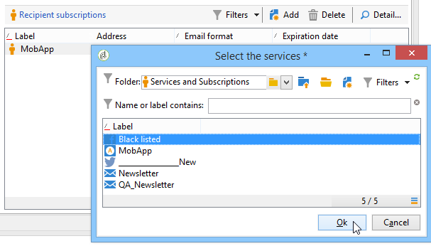

# 表單結構{#form-structure}

表單的描述是一種結構化XML文檔，它觀察表單模式 **xtk:form的語法**。

輸入表單的XML檔案必須包含 `<form>` 根元素，其中 **包含** namespace **屬** 性和namespace屬性，以填入表單名稱和namespace。

```
<form name="form_name" namespace="name_space">
...
</form>
```

預設情況下，表單與具有相同名稱和命名空間的資料架構相關聯。 要將表單與其他名稱關聯，請將 **元素的entity-schema**`<form>` 屬性設定為架構鍵的名稱。 要說明輸入表單的結構，讓我們使用&quot;cus:recipient&quot;示例模式來說明介面：

```
<srcSchema name="recipient" namespace="cus">
  <enumeration name="gender" basetype="byte">    
    <value name="unknown" label="Not specified" value="0"/>    
    <value name="male" label="Male" value="1"/>   
    <value name="female" label="Female" value="2"/>   
  </enumeration>

  <element name="recipient">
    <attribute name="email" type="string" length="80" label="Email" desc="E-mail address of recipient"/>
    <attribute name="birthDate" type="datetime" label="Date"/>
    <attribute name="gender" type="byte" label="Gender" enum="gender"/>
  </element>
</srcSchema>
```

基於示例方案的輸入表單：


```
<form name="recipient" namespace="cus">
  <input xpath="@gender"/>
  <input xpath="@birthDate"/>
  <input xpath="@email"/>
</form>
```

編輯控制項的說明從根元素開 `<form>` 始。 在元素中輸入編輯控 **`<input>`** 制項，其中 **xpath** 屬性包含其架構中欄位的路徑。

編輯控制項自動適應相應的資料類型並使用模式中定義的標籤。

>[!NOTE]
>
>通過將標籤屬性添加到元素中，可以使在其資料方案中定 **義的標籤** 過載 `<input>` :\
>`<input label="E-mail address" xpath="@name" />`

依預設，每個欄位會顯示在單一行上，並根據資料類型佔用所有可用空間。

## 格式 {#formatting}

控制項的版面配置類似於HTML表格中使用的版面配置，可將控制項分割為多欄、交錯元素或指定可用空間的佔用。 不過，請記住，格式設定只能讓您依比例將區域分割；不能為對象指定固定尺寸。

要在兩列中顯示上述示例的控制項：


```
<form name="recipient" namespace="cus">
  <container colcount="2">
    <input xpath="@gender"/>
    <input xpath="@birthDate"/>
    <input xpath="@email"/>
  </container>
</form>
```

具有 **`<container>`** colcount屬性的元 **素** ，可讓您將子控制項的顯示強制在兩欄上。

控制 **項上的** colspan屬性將控制項擴展為在其值中輸入的列數：


```
<form name="recipient" namespace="cus">
  <container colcount="2">
    <input xpath="@gender"/>
    <input xpath="@birthDate"/>
    <input xpath="@email" colspan="2"/>
  </container>
</form> 
```

透過填入 **type=&quot;frame&quot;屬性** ，容器會在子控制項周圍新增一個畫格，其中標籤包含在標籤屬 **性中** :


```
<form name="recipient" namespace="cus">
  <container colcount="2" type="frame" label="General">
    <input xpath="@gender"/>
    <input xpath="@birthDate"/>
    <input xpath="@email" colspan="2"/>
  </container>
</form>
```

元 **`<static>`** 素可用於格式化輸入表單：


```
<form name="recipient" namespace="cus">
  <static type="separator" colspan="2" label="General"/>
  <input xpath="@gender"/>
  <input xpath="@birthDate"/>
  <input xpath="@email" colspan="2"/>
  <static type="help" label="General information about recipient with date of birth, gender, and e-mail address." colspan="2"/>
</form>
```

具有 **`<static>`** 分隔符 **號類型的標籤** ，可讓您新增分隔符號列，其中標籤包含在標籤 **屬性中** 。

使用含說明類型的標籤 `<static>` 新增說明文字。 文本的內容在標籤屬性中 **輸入** 。

## 容器 {#containers}

容器可讓您將一組控制項分組。 它們由元素表 **`<container>`** 示。 上文使用它們來設定數欄的控制項格式。

在 **上的xpath** 屬性可 `<container>` 以簡化子控制項的引用。 然後，控制項的參照會相對於父 `<container>` 項。

不含&quot;xpath&quot;的容器範例：

```
<container colcount="2">
  <input xpath="location/@zipCode"/>
  <input xpath="location/@city"/>
</container>
```

在名為&quot;location&quot;的元素中加入&quot;xpath&quot;的範例：

```
<container colcount="2" xpath="location">
  <input xpath="@zipCode"/>
  <input xpath="@city"/>
</container>
```

### 容器類型 {#types-of-container}

容器是使用頁面格式的一組欄位來建構複雜的控制項。

#### 標籤容器 {#tab-container}

標籤容器會在可從標籤存取的頁面中格式化資料。


```
<container type="notebook">
  <container colcount="2" label="General">
    <input xpath="@gender"/>
    <input xpath="@birthDate"/>
    <input xpath="@email" colspan="2"/>
  </container>
  <container colcount="2" label="Location">
    ...
  </container>
</container>
```

主容器由type=&quot; **notebook&quot;屬性定義** 。 標籤會在子容器中宣告，標籤的標籤會從標籤屬性 **填入** 。

>[!NOTE]
>
>A **style=&quot;down|up**（預設情況下）**&quot;** feature強制將制表符標籤垂直定位在控制項下或上方。 此功能為選擇性。
>
>`<container style="down" type="notebook">  ... </container>`

#### 表徵圖清單 {#icon-list}

此容器會顯示垂直圖示列，讓您選取要顯示的頁面。


```
<container type="iconbox">
  <container colcount="2" label="General" img="xtk:properties.png">
    <input xpath="@gender"/>
    <input xpath="@birthDate"/>
    <input xpath="@email" colspan="2"/>
  </container>
  <container colcount="2" label="Location" img="nms:msgfolder.png">
    ...
  </container>
</container>
```

主容器由type=&quot; **iconbox&quot;屬性定義** 。 與圖示關聯的頁面會在子容器中宣告。 表徵圖的標籤將從標籤屬性中 **填入** 。

頁面的圖示會從屬性填入 `img="<image>"` ，其中 `<image>` 是與其索引鍵對應的影像名稱，由名稱和命名空間組成（例如&quot;xtk:properties.png&quot;）。

可從節點獲得 **[!UICONTROL Administration > Configuration > Images]** 映像。

#### 可見度容器 {#visibility-container}

您可以透過動態條件遮色一組控制項。

此示例說明對&quot;Geder&quot;欄位值的控制的可見性：

```
<container type="visibleGroup" visibleIf="@gender=1">
  ...
</container>
<container type="visibleGroup" visibleIf="@gender=2">
  ...
</container>
```

可見性容器由屬性 **type=&quot;visibleGroup&quot;定義**。 visibleIf **屬性** 包含可見性條件。

條件語法範例：

* **visibleIf=&quot;@email=&#39;peter.martinezATneeolane.net&#39;&quot;**:測試字串類型資料上的等同性。 比較值必須以引號括住。
* **visibleIf=&quot;@geder >= 1和@geder != 2&quot;**:條件。
* **visibleIf=&quot;@boolean1==true或@boolean2==false&quot;**:測試布林欄位。

#### 啟用容器 {#enabling-container}

此容器可讓您啟用或停用動態條件中的一組資料。 停用控制項可防止其被編輯。 以下範例說明如何從「性別」欄位的值啟用控制：

```
<container type="enabledGroup" enabledIf="@gender=1">
  ...
</container>
<container type="enabledGroup" enabledIf="@gender=2">
  ...
</container>
```

啟用容器由type=&quot;enabledGroup&quot; **屬性定義** 。 enabledIf **屬性** 包含啟動條件。

## 編輯連結 {#editing-a-link}

請記住，在資料結構中宣告連結如下：

```
<element label="Company" name="company" target="cus:company" type="link"/>
```

在其輸入表單中對連結的編輯控制如下：


```
<input xpath="company"/>
```

您可透過編輯欄位存取目標選擇。 輸入由預先輸入輔助，以便從輸入的前幾個字元中輕鬆找到目標元素。 然後，搜索將基於在目標模 **式中定義的** 「計算」字串。 如果模式在控制項中驗證後不存在，則顯示即時建立目標的確認訊息。 確認會在目標表格中建立新記錄，並將其與連結關聯。

下拉式清單可用來從已建立的記錄清單中選取目標元素。

(資 **[!UICONTROL Modify the link]** 料夾)圖示會啟動選取表單，其中包含目標元素清單和篩選區：


(放 **[!UICONTROL Edit link]** 大鏡)圖示會啟動連結元素的編輯表單。 預設情況下，所使用的形式是對目標模式的鍵進行推導。 表 **單屬性** 可讓您強制編輯表單的名稱(例如&quot;cus:company2&quot;)。

您可以在輸入表單中從連結定義中新增元素， **`<sysfilter>`** 以限制目標元素的選擇：

```
<input xpath="company">
  <sysFilter>
    <condition expr="[location/@city] =  'Newton"/>
  </sysFilter>
</input>
```

您也可以使用元素來排序清 **`<orderby>`** 單：

```
<input xpath="company">
  <orderBy>
    <node expr="[location/@zipCode]"/>
  </orderBy>
</input>
```

### 控制屬性 {#control-properties}

* **noAutoComplete**:停用Type-ahead（值為&quot;true&quot;）
* **createMode**:如果連結不存在，則即時建立該連結。 可能的值包括：

   * **無**:停用建立。 如果連結不存在，則會顯示錯誤訊息
   * **內嵌**:在編輯欄位中建立內容的連結
   * **版本**:顯示連結上的編輯表單。 驗證表單時，會儲存資料（預設模式）

* **noZoom**:連結上沒有編輯表單（值為&quot;true&quot;）
* **表格**:過載目標元素的編輯表單

## 連結清單 {#list-of-links}

在資料結構中輸入的連結（未系結=&quot;true&quot;）必須瀏覽清單，才能檢視與其關聯的所有元素。

其原則是顯示具有最佳化資料載入的連結元素清單（依資料批次下載，只有在清單可見時才執行）。

架構中的系列連結範例：

```
<element label="Events" name="rcpEvent" target="cus:event" type="link" unbound="true">
...
</element>
```

其輸入形式的清單：


```
 <input xpath="rcpEvent" type="linklist">
  <input xpath="@label"/>
  <input xpath="@date"/>
</input>
```

清單控制項由 **type=&quot;linklist&quot;屬性定義** 。 清單路徑必須參照系列連結。

這些列通過清單 **`<input>`** 的元素聲明。 xpath **屬性** 是指目標模式中欄位的路徑。

具有標籤（在架構中的連結上定義）的工具欄會自動放在清單的上方。

您可透過按鈕篩選清單， **[!UICONTROL Filters]** 並設定清單以新增和排序欄。

這些 **[!UICONTROL Add]** 和 **[!UICONTROL Delete]** 按鈕可讓您新增和刪除連結上的系列元素。 預設情況下，添加元素會啟動目標方案的編輯表單。

當 **[!UICONTROL Detail]** 清單標籤上的 **zoom=&quot;true&quot;屬性完成時，會自動新****`<input>`** 增按鈕：它可讓您啟動所選行的編輯表單。

載入清單時，可套用篩選和排序：

```
 <input xpath="rcpEvent" type="linklist">
  <input xpath="@label"/>
  <input xpath="@date"/>
  <sysFilter>
    <condition expr="@type = 1"/>
  </sysFilter>
  <orderBy>
    <node expr="@date" sortDesc="true"/>
  </orderBy>
</input>
```

### 關係表 {#relationship-table}

關係表可以使用N-N基數連結兩個表。 關係表只包含指向兩個表的連結。

因此，將元素添加到清單中應允許您從關係表中的兩個連結之一完成清單。

架構中的關係表示例：

```
<srcSchema name="subscription" namespace="cus">
  <element name="recipient" type="link" target="cus:recipient" label="Recipient"/>
  <element name="service" type="link" target="cus:service" label="Subscription service"/>
</srcSchema>
```

在我們的範例中，我們從&quot;cus:recipient&quot;架構的輸入表單開始。 該清單必須顯示與服務預訂的關聯，並且必須允許您通過選擇現有服務來添加預訂。



```
<input type="linklist" xpath="subscription" xpathChoiceTarget="service" xpathEditTarget="service" zoom="true">
  <input xpath="recipient"/>
  <input xpath="service"/>
</input>
```

xpathChoiceTarget **** 屬性可讓您從輸入的連結啟動選擇表單。 建立關係表記錄將自動更新指向當前收件人和所選服務的連結。

>[!NOTE]
>
>xpathEditTarget **** 屬性可讓您在輸入的連結上強制編輯選取的行。

### 清單屬性 {#list-properties}

* **noToolbar**:隱藏工具列（值為&quot;true&quot;）
* **工具列標題**:過載工具欄標籤
* **工具欄對齊**:修改工具列的垂直或水準幾何(可能的值：&quot;vertical&quot;|&quot;horizontal&quot;)
* **img**:顯示與清單關聯的影像
* **表格**:過載目標元素的編輯表單
* **縮放**:新增按 **[!UICONTROL Zoom]** 鈕以編輯目標元素
* **xpathEditTarget**:對輸入的連結進行編輯
* **xpathChoiceTarget**:另外，在輸入的連結上啟動選擇表單

## 記憶體清單控制項 {#memory-list-controls}

記憶體清單可讓您使用清單資料預先載入來編輯收集元素。 無法篩選或設定此清單。

這些清單會用於XML映射的系列元素或低容量連結。

### 列清單 {#column-list}

此控制項會顯示可編輯的欄清單，其工具列包含「新增」和「刪除」按鈕。


```
<input xpath="rcpEvent" type="list">
  <input xpath="@label"/>
  <input xpath="@date"/>
</input>
```

清單控制項必須填入 **type=&quot;list&quot;屬性** ，清單的路徑必須參照系列元素。

列在清單的子標 **`<input>`** 記中聲明。 欄標籤和大小可以強制使用 **label** 和 **colSize屬** 性。

>[!NOTE]
>
>將ordered=&quot;true&quot;屬性新增至資料結構中 **的收集元素時，會自動新增排序順序箭頭** 。

工具列按鈕可以水準對齊：


```
<input nolabel="true" toolbarCaption="List of events" type="list" xpath="rcpEvent" zoom="true">
  <input xpath="@label"/>
  <input xpath="@date"/>
</input>
```

ToolbarCaption **** 屬性強制工具列的水準對齊方式，並在清單上方輸入標題。

#### 放大清單 {#zoom-in-a-list}

可以在單獨的編輯表單中輸入清單中資料的插入和編輯。


```
<input nolabel="true" toolbarCaption="List of events" type="list" xpath="rcpEvent" zoom="true" zoomOnAdd="true">
  <input xpath="@label"/>
  <input xpath="@date"/>

  <form colcount="2" label="Event">
    <input xpath="@label"/>
    <input xpath="@date"/>
  </form>
</input>
```

從清單定義下的元素中 `<form>` 完成編輯表單。 其結構與輸入形式相同。 當 **[!UICONTROL Detail]** 清單標籤上的 **zoom=&quot;true&quot;屬性完成時，會自動****`<input>`** 新增按鈕。 此屬性可讓您啟動所選行的編輯表單。

>[!NOTE]
>
>新增 **zoomOnAdd=&quot;true&quot;屬性** ，會強制在插入清單元素時呼叫編輯表單。

### 清單屬性 {#list-properties-1}

* **noToolbar**:隱藏工具列（值為&quot;true&quot;）
* **工具列標題**:過載工具欄標籤
* **工具欄對齊**:修改工具列的位置(可能的值：&quot;vertical&quot;|&quot;horizontal&quot;)
* **img**:顯示與清單關聯的影像
* **表格**:過載目標元素的編輯表單
* **縮放**:新增按 **[!UICONTROL Zoom]** 鈕以編輯目標元素
* **zoomOnAdd**:在新增的
* **xpathChoiceTarget**:另外，在輸入的連結上啟動選擇表單

## 不可編輯的欄位 {#non-editable-fields}

若要顯示欄位並防止其被編輯，請使 **`<value>`** 用標籤或在標 **記上填寫readOnly=&quot;true** &quot;屬 **`<input>`** 性。

「性別」欄位範例：


```
<value value="@gender"/>
<input xpath="@gender" readOnly="true"/>
```

## 選項按鈕 {#radio-button}

選項按鈕可讓您從數個選項中選擇。 標 **`<input>`** 記用於列出可能的選項，且checkedValue屬 **** 性指定與選項關聯的值。

「性別」欄位範例：

```
<input type="RadioButton" xpath="@gender" checkedValue="0" label="Choice 1"/>
<input type="RadioButton" xpath="@gender" checkedValue="1" label="Choice 2"/>
<input type="RadioButton" xpath="@gender" checkedValue="2" label="Choice 3"/>
```


## 核取方塊 {#checkbox}

核取方塊會反映布林狀態（選取與否）。 依預設，此控制項會由「布林」(true/false)欄位使用。 預設值為0或1的變數可與此按鈕關聯。 此值可透過checkValue屬性 **過載** 。

```
<input xpath="@boolean1"/>
<input xpath="@field1" type="checkbox" checkedValue="Y"/>
```


## 導覽階層編輯 {#navigation-hierarchy-edit}

此控制項會在一組要編輯的欄位上建立樹狀結構。

要編輯的控制項會分組在樹狀 **`<container>`** 控制項標 **`<input>`** 記下輸入的項中：

```
<input nolabel="true" type="treeEdit">
  <container label="Text fields">
    <input xpath="@text1"/>
    <input xpath="@text2"/>
  </container>
  <container label="Boolean fields">
    <input xpath="@boolean1"/>
    <input xpath="@boolean2"/>
  </container>
</input>
```


## 運算式欄位 {#expression-field}

運算式欄位會從運算式動態更新欄位；標 **`<input>`** 記與 **xpath屬性一起使用，以輸入要更新的欄位的路徑和包含更新表達式** 的 **** expr屬性。

```
<!-- Example: updating the boolean1 field from the value contained in the field with path /tmp/@flag -->
<input expr="Iif([/tmp/@flag]=='On', true, false)" type="expr" xpath="@boolean1"/>
<input expr="[/ignored/@action] == 'FCP'" type="expr" xpath="@launchFCP"/>
```

## 表單內容 {#context-of-forms}

輸入表單的執行初始化包含正在編輯的實體的資料的XML文檔。 本檔案代表表單的內容，可當成工作區使用。

### 更新上下文 {#updating-the-context}

若要修改表單的上下文，請使用標 **`<set expr="<value>" xpath="<field>"/>`** 記，其中 **`<field>`** 是目標欄位， **`<value>`** 且是更新運算式或值。

標籤的使用范 **`<set>`** 例：

* **`<set expr="'Test'" xpath="/tmp/@test" />`**:將&#39;Test&#39;值定位在臨時位置/tmp/@test1
* **`<set expr="'Test'" xpath="@lastName" />`**:以&#39;Test&#39;值更新&quot;lastName&quot;屬性上的實體
* **`<set expr="true" xpath="@boolean1" />`**:將&quot;boolean1&quot;欄位的值設定為&quot;true&quot;
* **`<set expr="@lastName" xpath="/tmp/@test" />`**:更新為&quot;lastName&quot;屬性的內容

在透過和標籤初始化和關閉表單時，可更新表單的上 **`<enter>`** 下文 **`<leave>`** 。

```
<form name="recipient" namespace="cus">
  <enter>
    <set...
  </enter>
  ...
  <leave>
    <set...
  </leave>
</form>
```

>[!NOTE]
>
>頁 `<enter>` 面( `<leave>` 「筆記型」和「iconbox」類型) `<container>` 上可使用和標籤。

### 表達式語言 {#expression-language-}

在表單定義中使用巨集語言，以執行條件式測試。

如果 **`<if expr="<expression>" />`** 已驗證表達式，則標籤將執行標籤下指定的指令：

```
<if expr="([/tmp/@test] == 'Test' or @lastName != 'Doe') and @boolean2 == true">
  <set xpath="@boolean1" expr="true"/>
</if>
```

與標 **`<check expr="<condition>" />`** 簽結合的標 **`<error>`** 簽會防止驗證表單，並在條件不符合時顯示錯誤訊息：

```
<leave>
  <check expr="/tmp/@test != ''">
    <error>You must populate the 'Test' field!</error> 
  </check>
</leave>
```

## 精靈 {#wizards}

精靈會引導您完成頁面格式的資料輸入步驟集。 當您驗證表單時，輸入的資料會儲存。

嚮導具有以下結構：

```
<form type="wizard" name="example" namespace="cus" img="nms:rcpgroup32.png" label="Wizard example" entity-schema="nms:recipient">
  <container title="Title of page 1" desc="Long description of page 1">
    <input xpath="@lastName"/>
    <input xpath="comment"/>
  </container>
  <container title="Title of page 2" desc="Long description of page 2">
    ...
  </container>
  ...
</form>
```


元素上 **存在type=&quot;wizard&quot;** 屬性 `<form>` 可讓您在表單建構中定義精靈模式。 頁面是從元素 `<container>` 的子項中完 `<form>` 成。 頁 `<container>` 面的元素會填入標題的標題屬性，並設計以在頁面標題下顯示說明。 系統會 **[!UICONTROL Previous]** 自動 **[!UICONTROL Next]** 新增這些和按鈕，以允許在頁面之間瀏覽。

按 **[!UICONTROL Finish]** 鈕會儲存輸入的資料並關閉表單。

### SOAP方法 {#soap-methods}

SOAP方法可從頁面結尾的填 **`<leave>`** 入標籤啟動執行。

標 **`<soapcall>`** 記包含對方法的調用，其中包含以下輸入參數：

```
<soapCall name="<name>" service="<schema>">
  <param type="<type>" exprIn="<xpath>"/>  
  ...
</soapCall>
```

服務的名稱及其實現方案是通過標籤的 **名稱****和服務屬****`<soapcall>`** 性輸入的。

在標籤下的元素上 **`<param>`** 說明輸入參 **`<soapcall>`** 數。

必須通過type屬性指定參數 **類型** 。 可能的類型如下：

* **字串**:字串
* **布林值**:布林值
* **位元組**:8位整數
* **簡短**:16位整數
* **long**:32位元整數
* **簡短**:16位整數
* **雙重**:雙精度浮點數
* **DOMElement**:元素型節點

exprIn **** 屬性包含要作為參數傳遞的資料的位置。

**範例**:

```
<leave>
  <soapCall name="RegisterGroup" service="nms:recipient">         
    <param type="DOMElement" exprIn="/tmp/entityList"/>         
    <param type="DOMElement" exprIn="/tmp/choiceList"/>         
    <param type="boolean"    exprIn="true"/>       
  </soapCall>
</leave>
```

