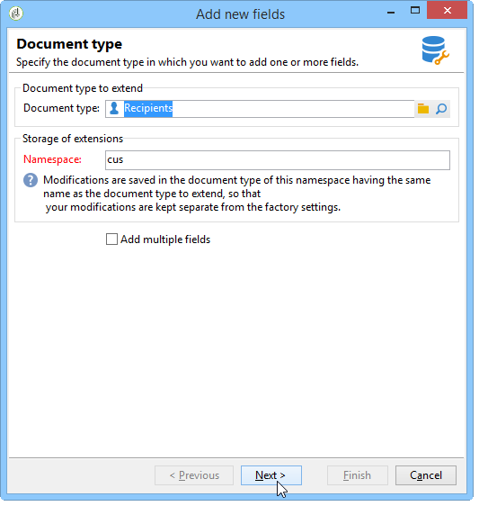

# 新增欄位精靈{#new-field-wizard}

可通過訪問的 **[!UICONTROL Tools > Advanced > Add new fields]** 嚮導允許您向資料庫中的表添加一個或多個欄位。

驗證嚮導將更新要擴展的表的擴展模式，並啟動SQL指令碼以修改資料庫的物理結構。

該輔助具有無需知道資料模式結構即可快速添加欄位的優點。

主要缺點是資料和屬性的限制。

精靈畫麵包含下列步驟：

1. 第一頁可讓您輸入要擴展的架構的名稱，以及要保存修改的擴展架構的名稱空間：

   

1. 下一頁可讓您輸入要新增欄位的屬性。

   

1. 若要確認變更，請按一下 **[!UICONTROL Finish]** 按鈕。

在我們的示例中，名為&quot;cus:recipient&quot;的擴展檔案將自動建立並執行相應的SQL指令碼：

```
<srcSchema extendedSchema="nms:recipient" label="Recipients" name="recipient"  namespace="cus">  
  <element name="recipient">    
    <attribute belongsTo="cus:recipient" dataPolicy="email" label="Email" length="80" name="email1" sqlname="sEmail1" type="string" user="true"/>  
  </element>
</srcSchema>
```

>[!NOTE]
>
>依預設，新增的欄位會以屬性 **user** （值為&quot;true&quot;）宣告。 這可讓您使用「treeEdit」類型的控制項（請參閱「輸入表單」），在擴充架構的輸入表單中顯示和編輯欄位。

