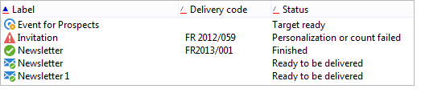

# 方案特性{#schema-characteristics}


參照現有表格的綱要特性如下：

* Adobe Campaign不得修改相對於現有表格的SQL物件。
* 必須明確指定資料表和資料行的名稱，
* 必須宣告索引。

>[!IMPORTANT]
>
>請勿刪除內建收件者表格中的欄位，即使這些欄位沒有用處。 這可能會導致Adobe Campaign資料庫發生行為錯誤。

## 檢視屬性 {#the-view-attribute}

來源結構描述接受 **檢視** 屬性 **srcSchema** 根元素。 在自訂表格中操作Adobe Campaign時，必須使用它。 此 **view=&quot;true&quot;** attribute會告訴資料庫結構更新精靈忽略此綱要。 因此，禁止應用程式將表格、其欄及其索引與對應的綱要同步。

當此屬性設定為 **true**，此結構描述只會用來產生SQL查詢，以存取此資料表的資料。

## 表格和欄的名稱 {#names-of-tables-and-columns}

當表格是由表格更新精靈建立時，表格和欄的名稱會根據個別綱要和屬性的名稱自動產生。 不過，可以輸入下列屬性來強制使用SQL名稱：

* **sqltable** 在結構描述的主要元素中，若要指定表格，
* **sqlname** 在每個屬性內，指定欄。

**範例**：

```
<element label="Individual" name="individual" sqltable="individual">
    <key internal="true" name="id">
      <keyfield xpath="@id"/>
    </key> 
    <attribute name="id" type="long" length="32" />
    <attribute name="lastName" type="string" length="100" sqlname="Last_Name"/>
    <attribute name="firstName" type="string" length="100" sqlname="First_Name"/>
    <attribute name="email" type="string" length="100"/>
    <attribute name="mobile" type="string" length="100"/>
</element>
```

在此範例中，如果未明確指定資料表和資料行的名稱，應用程式會使用 **CusIndividual** 針對表格， **姓氏** 和 **名字** （針對欄）。

在結構描述中，可能只填入現有表格的一部分欄。 使用者無法存取未填入的欄。

## 索引欄位 {#indexed-fields}

從使用者端主控台排序清單的記錄時，依索引欄位排序可獲得較佳的效能。 在結構描述中宣告索引，讓主控台在欄標籤左側的排序順序箭頭下顯示帶有紅線的索引欄位，如下所示：



在結構描述中，索引的定義如下：

```
<dbindex name="name_of_index" unique="true/false"
  <keyfield xpath="xpath_1st_field"/
  <keyfield xpath="xpath_2nd_field"/
  ...
</dbindex
```

因此，在相符的結構描述中宣告自訂表格的現有索引很重要。

會針對來源結構描述的每個索引鍵和連結宣告以隱含方式宣告索引。 可藉由指定 **noDbIndex=&quot;true&quot;** 屬性：

**範例**：

```
<key internal="true" name="customer" noDbIndex="true">
  <keyfield xpath="@customerId"/>
</key>
```
