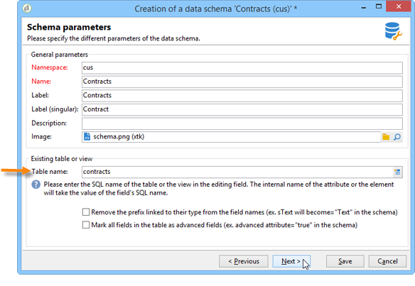
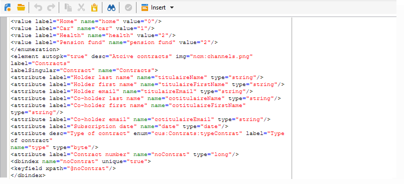

# 現有表格結構描述{#schema-of-an-existing-table}

## 概觀 {#overview}

當應用程式需要存取現有表格、SQL檢視或遠端資料庫的資料時，請使用下列資料在Adobe Campaign中建立其綱要：

* 表格名稱：輸入具有「sqltable」屬性的表格名稱（使用dblink時具有別名）。
* 方案索引鍵：參考調解欄位，
* 索引：用於產生查詢，
* 這些欄位及其在XML結構中的位置：僅填寫應用程式中使用的欄位，
* 連結：如果與基底的其他表格有聯結。

## 實作 {#implementation}

若要建立對應的綱要，請套用下列階段：

1. 編輯Adobe Campaign樹狀結構的&#x200B;**[!UICONTROL Administration>Configuration>Data schemas]**&#x200B;節點，然後按一下&#x200B;**[!UICONTROL New]** 。
1. 選取&#x200B;**[!UICONTROL Access data from an existing table or an SQL view]**&#x200B;選項，然後按一下&#x200B;**[!UICONTROL Next]** 。

   

1. 選擇表格或現有檢視：

   

1. 調整結構描述內容以符合您的需求。

   

   結構描述必須以`<srcSchema>`根專案上的view=&quot;true&quot;屬性填入，才能不產生資料表建立SQL指令碼。

**範例** ：

```
<srcSchema name="recipient" namespace="cus" view="true">
  <element name="recipient" sqltable="dbsrv.recipient">
    <key name="email">
      <keyfield xpath="@email"/>
    </key>   
    <attribute name="email" type="string" length="80" sqlname="email"/>
  </element>
</srcSchema>
```

## 存取外部資料庫 {#accessing-an-external-database}

**同盟資料存取 — FDA**&#x200B;選項可讓您存取儲存在外部資料庫中的資料。

[此頁面](../../installation/using/creating-data-schema.md)中詳細說明了要執行於結構描述以存取外部資料庫中的資料的組態。
