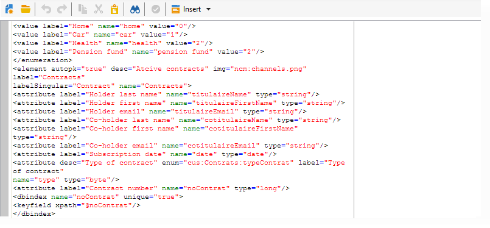

# 現有資料表的綱要{#schema-of-an-existing-table}

## 概觀 {#overview}

當應用程式需要存取現有表格、SQL檢視或遠端資料庫資料時，請使用下列資料在Adobe Campaign中建立其架構：

* 表名：在&quot;sqltable&quot;屬性中輸入表的名稱（使用dblink時使用其別名）,
* 方案鍵：引用協調欄位，
* 索引：用於生成查詢，
* XML結構中的欄位及其位置：只填寫應用程式中使用的欄位，
* 連結：是否與基的其他表存在連接。

## 實作 {#implementation}

要建立相應的方案，請應用以下階段：

1. 編輯Adobe **[!UICONTROL Administration>Configuration>Data schemas]** Campaign樹狀結構的節點，然後按一下 **[!UICONTROL New]** 。
1. Select the **[!UICONTROL Access data from an existing table or an SQL view]** option and click **[!UICONTROL Next]** .

   

1. 選擇表或現有視圖：

   

1. 調整架構內容以符合您的需求。

   

   必須在根元素上以view=&quot;true&quot;屬性填充模 `<srcSchema>` 式，才不能生成表建立SQL指令碼。

**範例** :

```
<srcSchema name="recipient" namespace="cus" view="true">
  <element name="recipient" sqltable="dbsrv.recipient">
    <key name="email">
      <keyfield xpath="@email"/>
    </key>   
    <attribute name="email" type="string" length="80" sqlname="email"/>
  </element>
</srcSchema>
```

## 存取外部資料庫 {#accessing-an-external-database}

Federated Data Access - FDA **(同盟資料存取- FDA** )選項允許您訪問儲存在外部資料庫中的資料。

本頁詳細說明了訪問外部資料庫中資料的方案上 [的配置](../../platform/using/creating-data-schema.md)。
