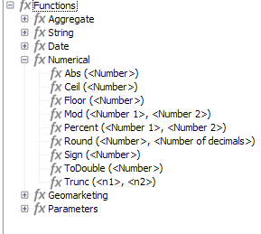

# 架構結構{#schema-structure}

一種基本結 `<srcschema>` 構如下：

```
<srcSchema>
    <enumeration>
        ...          //definition of enumerations
    </enumeration>
   
    <element>         //definition of the root <element>    (mandatory)

        <compute-string/>  //definition of a compute-string
        <dbindex>
            ...        //definition of indexes
        </dbindex>
        <key>
            ...        //definition of keys
        </key>
        <sysFilter>
            ...           //definition of filters
        </sysFilter>
        <attribute>
            ...             //definition of fields
        </attribute>
    
            <element>           //definition of sub-<element> 
                  <attribute>           //(collection, links or XML)
                  ...                         //and additional fields
                  </attribute>
                ...
            </element>
      
    </element> 

        <methods>                 //definition of SOAP methods
            <method>
                ...
            </method>
            ...
    </methods>  
          
</srcSchema>
```

資料結構的XML檔案必須包含 **`<srcschema>`** 根元素，其中 **包含** namespace **** 屬性，以填入結構名稱及其命名空間。

```
<srcSchema name="schema_name" namespace="namespace">
...
</srcSchema>
```

讓我們使用下列XML內容來說明資料架構的結構：

```
<recipient email="John.doe@aol.com" created="2009/03/12" gender="1"> 
  <location city="London"/>
</recipient>
```

使用其對應的資料模式：

```
<srcSchema name="recipient" namespace="cus">
  <element name="recipient">
    <attribute name="email"/>
    <attribute name="created"/>
    <attribute name="gender"/>
    <element name="location">
      <attribute name="city"/>
   </element>
  </element>
</srcSchema>
```

## 說明 {#description}

方案的入口點是其主要元素。 很容易識別，因為它與結構相同，而且應是根元素的子項。 內容的說明以此元素開始。

在我們的示例中，主要元素由以下行表示：

```
<element name="recipient">
```

主要元 **`<attribute>`** 素 **`<element>`** 後面的元素和元素可讓您定義XML結構中資料項目的位置和名稱。

在我們的範例架構中，以下是：

```
<attribute name="email"/>
<attribute name="created"/>
<attribute name="gender"/>
<element name="location">
  <attribute name="city"/>
</element>
```

必須遵守下列規定：

* 每個 **`<element>`** 和 **`<attribute>`** 都必須透過name屬性以名 **稱識別** 。

   >[!IMPORTANT]
   >
   >元素的名稱應簡明扼要，最好是英文，並且只包含符合XML命名規則的授權字元。

* 只有 **`<element>`** 元素可以包含 **`<attribute>`** XML **`<element>`** 結構中的元素和元素。
* 元 **`<attribute>`** 素在中必須有唯一名稱 **`<element>`**。
* 建議在多行資料字串中使用**`<elements>`**。

## 資料類型 {#data-types}

資料類型是透過和元素 **中的** type屬性 **`<attribute>`** 輸入 **`<element>`** 的。

元素和元素的說明中提供了詳 [`<attribute>` 細列](../../configuration/using/elements-and-attributes.md#attribute--element)[`<element>` 表](../../configuration/using/elements-and-attributes.md#element--element)。

如果未填入此屬性，則 **字串是預設資料類型** ，除非元素包含子元素。 如果有，則僅用於分層結構元素(在本例&#x200B;**`<location>`** 中為元素)。

架構支援下列資料類型：

* **字串**:字元字串。 範例：名字，鎮子，等等。

   可以通過length屬性來指 **定大小** （可選，預設值&quot;255&quot;）。

* **布林值**:布林欄位。 可能值的範例：true/false、0/1、yes/no等。
* **byte**, **short**, **long**:整數（1位元組、2位元組、4位元組）。 範例：年齡、帳號、點數等。
* **雙重**:雙精度浮點數。 範例：價格、費率等。
* **date**, **datetime**:日期和日期+時間。 範例：出生日期、購買日期等。
* **datetimenotz**:日期+時間，不含時區資料。
* **時間平移**:持續時間。 範例：資歷。
* **備忘**:長文字欄位（多行）。 範例：說明、注釋等。
* **uuid**:「uniqueidentifier」欄位，以支援GUID（僅限Microsoft SQL Server支援）。

   >[!NOTE]
   >
   >要在Microsoft SQL Server **以外的引擎中包含** uuid欄位，必須添加&quot;newuuid()&quot;函式並用其預設值完成。

以下是我們輸入類型的範例架構：

```
<srcSchema name="recipient" namespace="cus">
  <element name="recipient">
    <attribute name="email" type="string" length="80"/>
    <attribute name="created" type="datetime"/>
    <attribute name="gender" type="byte"/>
    <element name="location">
      <attribute name="city" type="string" length="50"/>
   </element>
  </element>
</srcSchema>
```

### 對應Adobe Campaign/DBMS資料類型 {#mapping-the-types-of-adobe-campaign-dbms-data}

下表列出Adobe Campaign為不同資料庫管理系統產生的資料類型對應。

<table> 
 <tbody> 
  <tr> 
   <td> <strong>Adobe Campaign</strong><br /> </td> 
   <td> <strong>PosgreSQL</strong><br /> </td> 
   <td> <strong>Oracle</strong><br /> </td> 
   <td> <strong>Teradata</strong><br /> </td> 
   <td> <strong>DB2</strong><br /> </td> 
   <td> <strong>MS SQL</strong><br /> </td> 
  </tr> 
  <tr> 
   <td> 字串<br /> </td> 
   <td> VARCHAR(255)<br /> </td> 
   <td> VARCHAR2（NVARCHAR2，如果unicode）<br /> </td> 
   <td> VARCHAR（如果為Unicode，則為VARCHAR字元集UNICODE）<br /> </td> 
   <td> VARCHAR<br /> </td> 
   <td> VARCHAR(NVARCHAR if unicode)<br /> </td> 
  </tr> 
  <tr> 
   <td> 布林值<br /> </td> 
   <td> SMALLINT<br /> </td> 
   <td> 數字(3)<br /> </td> 
   <td> 數值(3)<br /> </td> 
   <td> SMALLINT<br /> </td> 
   <td> TINYINT<br /> </td> 
  </tr> 
  <tr> 
   <td> 位元組<br /> </td> 
   <td> SMALLINT<br /> </td> 
   <td> 數字(3)<br /> </td> 
   <td> 數值(3)<br /> </td> 
   <td> SMALLINT<br /> </td> 
   <td> TINYINT<br /> </td> 
  </tr> 
  <tr> 
   <td> 簡短<br /> </td> 
   <td> SMALLINT<br /> </td> 
   <td> 數字(5)<br /> </td> 
   <td> SMALLINT<br /> </td> 
   <td> SMALLINT<br /> </td> 
   <td> SMALLINT<br /> </td> 
  </tr> 
  <tr> 
   <td> Double<br /> </td> 
   <td> 雙精度<br /> </td> 
   <td> 浮點<br /> </td> 
   <td> 浮點<br /> </td> 
   <td> DOUBLE<br /> </td> 
   <td> 浮點<br /> </td> 
  </tr> 
  <tr> 
   <td> 長<br /> </td> 
   <td> 整數<br /> </td> 
   <td> NUMBER(10)<br /> </td> 
   <td> 整數<br /> </td> 
   <td> 整數<br /> </td> 
   <td> INT<br /> </td> 
  </tr> 
  <tr> 
   <td> Int64<br /> </td> 
   <td> BIGINT<br /> </td> 
   <td> NUMBER(20)<br /> </td> 
   <td> NUMERIC(20)<br /> </td> 
   <td> BIGINT<br /> </td> 
   <td> BIGINT<br /> </td> 
  </tr> 
  <tr> 
   <td> 日期<br /> </td> 
   <td> DATE<br /> </td> 
   <td> DATE<br /> </td> 
   <td> 時間戳記<br /> </td> 
   <td> DATE<br /> </td> 
   <td> DATETIME<br /> </td> 
  </tr> 
  <tr> 
   <td> 時間<br /> </td> 
   <td> 時間<br /> </td> 
   <td> 浮點<br /> </td> 
   <td> 時間<br /> </td> 
   <td> 時間<br /> </td> 
   <td> 浮點<br /> </td> 
  </tr> 
  <tr> 
   <td> 日期時間<br /> </td> 
   <td> 時間戳記<br /> </td> 
   <td> DATE<br /> </td> 
   <td> 時間戳記<br /> </td> 
   <td> 時間戳記<br /> </td> 
   <td> MS SQL &lt; 2008:DATETIME<br /> MS SQL &gt;= 2012:DATETIMEOFFSET<br /> </td> 
  </tr> 
  <tr> 
   <td> Datetimenotz<br /> </td> 
   <td> 時間戳記<br /> </td> 
   <td> DATE<br /> </td> 
   <td> 時間戳記<br /> </td> 
   <td> 時間戳記<br /> </td> 
   <td> MS SQL &lt; 2008:DATETIME<br /> MS SQL &gt;= 2012:DATETIME2<br /> </td> 
  </tr> 
  <tr> 
   <td> 時間平移<br /> </td> 
   <td> 雙精度<br /> </td> 
   <td> 浮點<br /> </td> 
   <td> 浮點<br /> </td> 
   <td> DOUBLE<br /> </td> 
   <td> 浮點<br /> </td> 
  </tr> 
  <tr> 
   <td> 備忘錄<br /> </td> 
   <td> 文字<br /> </td> 
   <td> CLOB（如果是Unicode，則為NCLOB）<br /> </td> 
   <td> CLOB（如果為Unicode，則為CLOB字元集UNICODE）<br /> </td> 
   <td> CLOB(6M)<br /> </td> 
   <td> TEXT（若為Unicode，則為NTEXT）<br /> </td> 
  </tr> 
  <tr> 
   <td> Blob<br /> </td> 
   <td> BLOB<br /> </td> 
   <td> BLOB<br /> </td> 
   <td> BLOB<br /> </td> 
   <td> BLOB(4M)<br /> </td> 
   <td> IMAGE<br /> </td> 
  </tr> 
 </tbody> 
</table>

## 屬性 {#properties}

資料 **`<elements>`** 模式 **`<attributes>`** 的元素和元素可以用各種屬性來豐富。 您可以填入標籤，以說明目前的元素。

### 標籤和說明 {#labels-and-descriptions}

* 標籤 **屬性** ，可讓您輸入簡短說明。

   >[!NOTE]
   >
   >標籤與實例的當前語言相關聯。

   **範例**:

   ```
   <attribute name="email" type="string" length="80" label="Email"/>
   ```

   您可從Adobe Campaign用戶端主控台輸入表單中查看標籤：

   

* desc屬 **性** ，可讓您輸入詳細說明。

   說明可從Adobe Campaign用戶端主控台主視窗的狀態列的輸入表單中檢視。

   >[!NOTE]
   >
   >說明與實例的當前語言相關聯。

   **範例**:

   ```
   <attribute name="email" type="string" length="80" label="Email" desc="Email of recipient"/>
   ```

### 預設值 {#default-values}

預設 **屬性** ，可讓您定義在內容建立時傳回預設值的運算式。

值必須是與XPath語言相容的運算式。 有關詳細資訊，請參 [閱Referencing with XPath](../../configuration/using/schema-structure.md#referencing-with-xpath)。

**範例**:

* 目前日期： **default=&quot;GetDate()&quot;**
* 計數器： **default=&quot;&#39;FRM&#39;+CounterValue(&#39;myCounter&#39;)&quot;**

   在此範例中，預設值是使用字串的串連來建構，並使用免費的計數器名稱呼叫 **CounterValue** 函式。 每次插入時傳回的數字會增加一。

   >[!NOTE]
   >
   >在Adobe Campaign用戶端主控台中， **[!UICONTROL Administration>Counters]** 節點用來管理計數器。

若要將預設值連結至欄位，您可以使用 `<default>  or  <sqldefault>   field.  </sqldefault> </default>`

`<default>` :允許您在建立圖元時用預設值預填充欄位。 該值將不是預設的SQL值。

`<sqldefault>` :可讓您在建立欄位時增加值。 此值以SQL結果顯示。 在模式更新期間，只有新記錄會受到此值的影響。

### 枚舉 {#enumerations}

#### 免費列舉 {#free-enumeration}

userEnum **** 屬性可讓您定義免費列舉，以記憶和顯示透過此欄位輸入的值。 語法如下：

**userEnum=&quot;枚舉的名稱&quot;**

可自由選擇列舉的名稱，並與其他欄位共用。

這些值顯示在輸入表單的下拉式清單中：


>[!NOTE]
>
>在Adobe Campaign用戶端主控台中， **[!UICONTROL Administration > Enumerations]** 節點用來管理枚舉。

#### 集枚舉 {#set-enumeration}

enum屬 **性** ，可讓您定義在預先知道可能值清單時使用的固定列舉。

enum屬 **性** ，是指在主要元素外的架構中填入的列舉類的定義。

枚舉允許用戶從下拉清單中選擇一個值，而不是在常規輸入欄位中輸入值：


資料模式中枚舉聲明的示例：

```
<enumeration name="gender" basetype="byte" default="0">    
  <value name="unknown" label="Not specified" value="0"/>    
  <value name="male" label="male" value="1"/>   
  <value name="female" label="female" value="2"/>   
</enumeration>
```

會透過元素在主要元素外部宣告列舉 **`<enumeration>`** 。

枚舉屬性如下：

* **baseType**:與值、
* **標籤**:列舉的說明，
* **名稱**:枚舉的名稱，
* **預設**:枚舉的預設值。

枚舉值在元素中聲明， **`<value>`** 具有以下屬性：

* **名稱**:內部儲存的值的名稱，
* **標籤**:標籤。

#### dbenum枚舉 {#dbenum-enumeration}

* dbenum **屬性** 可讓您定義屬性與enum屬性相似的 **枚舉** 。

   但是， **name** 屬性不會在內部儲存值，它會儲存程式碼，讓您在不修改其架構的情況下擴充相關表格。

   這些值是通過節點定 **[!UICONTROL Administration>Enumerations]** 義的。

   例如，此列舉用於指定促銷活動的性質。

   

### Example {#example}

以下是我們的範例架構，其中填入了屬性：

```
<srcSchema name="recipient" namespace="cus">
  <enumeration name="gender" basetype="byte">    
    <value name="unknown" label="Not specified" value="0"/>    
    <value name="male" label="male" value="1"/>   
    <value name="female" label="female" value="2"/>   
  </enumeration>

  <element name="recipient">
    <attribute name="email" type="string" length="80" label="Email" desc="Email of recipient"/>
    <attribute name="created" type="datetime" label="Date of creation" default="GetDate()"/>
    <attribute name="gender" type="byte" label="gender" enum="gender"/>
    <element name="location" label="Location">
      <attribute name="city" type="string" length="50" label="City" userEnum="city"/>
   </element>
  </element>
</srcSchema>
```

## 系列 {#collections}

系列是具有相同名稱和相同階層層級的元素清單。

未 **系結的** 「true」屬性可讓您填入系列元素。

**範例**:架構中 **`<group>`** 的集合元素定義。

```
<element name="group" unbound="true" label="List of groups">
  <attribute name="label" type="string" label="Label"/>
</element>
```

運用XML內容的投影：

```
<group label="Group1"/>
<group label="Group2"/>
```

## 使用XPath參考 {#referencing-with-xpath}

Adobe Campaign使用XPath語言來參考屬於資料結構的元素或屬性。

XPath是一種語法，可讓您在XML文檔的樹狀結構中找到節點。

元素由其名稱指定，屬性由名稱前面帶有字元&quot;@&quot;指定。

**範例**:

* **@email**:選擇電子郵件，
* **location/@city**:在元素下選擇「city」屬 **`<location>`** 性
* **../@email**:從當前元素的父元素中選擇電子郵件地址
* **群組`[1]/@label`**:選擇作為第一個收集元素子項的「標籤」**`<group>`**屬性
* **群組`[@label='test1']`**:選擇元素的子項「label」屬性，**`<group>`**並包含值「test1」

>[!NOTE]
>
>當路徑與子元素交叉時，將添加附加約束。 在這種情況下，下列運算式必須置於方括弧之間：
>
>* **location/@city** is not valid;please use **`[location/@city]`**
>* **`[@email]`** 和 **@email** is equivalent
>


您也可以定義複雜的運算式，例如下列算術運算：

* **@geder+1**:在性別屬性的內容中加 **入** 1,
* **@email + &#39;(&#39;+@created+&#39;)**:在括弧之間取用新增至建立日期的電子郵件地址值來建構字串（對於字串類型，請將常數置於引號中）。

為了豐富該語言的潛力，在表達式中增加了高級函式。

您可以透過Adobe Campaign用戶端主控台中的任何運算式編輯器，存取可用函式清單：



**範例**:

* **GetDate()**:傳回目前日期
* **Year(@created)**:傳回「已建立」屬性中所含日期的年份。
* **GetEmailDomain(@email)**:返回電子郵件地址的域。

## 透過計算字串建立字串 {#building-a-string-via-the-compute-string}

計 **算字串** 是XPath表達式，用於構造一個字串，該字串表示與模式相關聯的表中的記錄。 **計算字串** ，主要用於圖形介面中顯示選定記錄的標籤。

Compute **字串** ，是透過資料 **`<compute-string>`** 架構主要元素下的元素來定義。 expr屬 **性包含** XPath運算式，以計算顯示。

**範例**:收件者表格的計算字串。

```
<srcSchema name="recipient" namespace="nms">  
  <element name="recipient">
    <compute-string expr="@lastName + ' ' + @firstName +' (' + @email + ')' "/>
    ...
  </element>
</srcSchema>
```

收件者的計算字串結果：Doe **John(john.doe@aol.com)**

>[!NOTE]
>
>如果方案不包含計算字串，則預設情況下，計算字串將填充方案的主鍵值。

